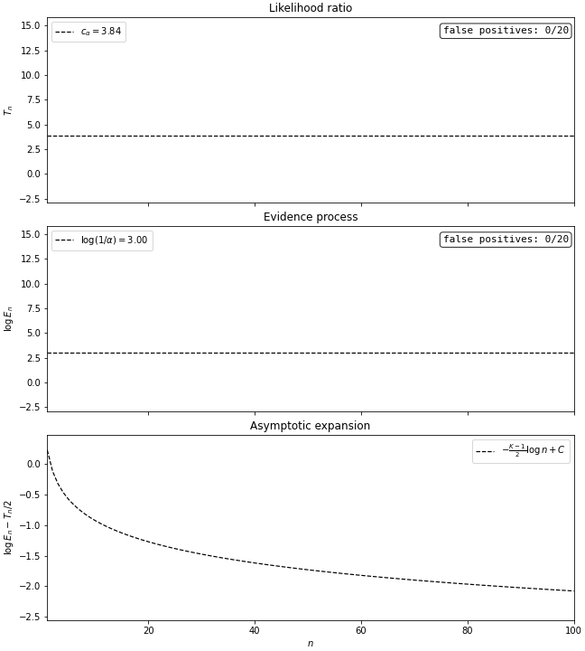
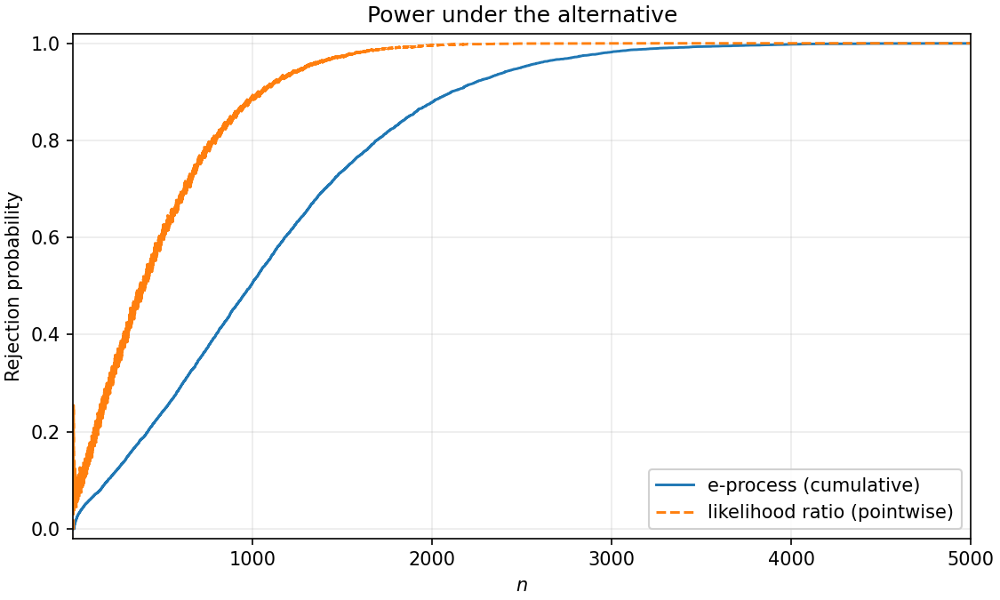

This note discusses tests for detecting departures from a target treatment assignment distribution in online experiments.
We show that the standard fixed-horizon likelihood-ratio (LR) test is not well-calibrated for repeated monitoring: even under correct randomization, it will eventually trigger with probability one.
We construct an always-valid alternative based on an evidence process and compare its power to the fixed-horizon LR benchmark.

# Fixed-horizon tests

Suppose experimental units arrive sequentially, indexed by $i = 1, 2, \ldots$.
Each unit is assigned to one of $K \geq 2$ treatment groups, where $D_i \in \{1, \ldots, K\}$ denotes the group assigned to unit $i$.

Let $\boldsymbol{\pi}_0 = (\pi_{0,1}, \ldots, \pi_{0,K})$ be a known probability vector satisfying $\pi_{0,k} > 0$ and $\sum_{k=1}^K \pi_{0,k} = 1$.
Our null hypothesis is that assignments are iid categorical with probability vector $\boldsymbol{\pi}_0$:

$$
H_0: \mathbb{P}(D_i = k \mid D_1, \ldots, D_{i-1}) = \pi_{0,k}
\quad
\text{for all } i \geq 1 \text{ and } k \in \{1, \ldots, K\}.
$$ {#eq-null-assignment}

We want to test this null against the alternative that the conditional assignment distribution departs from $\boldsymbol{\pi}_0$ at some point:

$$
H_1: \mathbb{P}(D_i = k \mid D_1, \ldots, D_{i-1}) \neq \pi_{0,k}
\quad
\text{for some } i \geq 1 \text{ and } k \in \{1, \ldots, K\}.
$$

Let $\{\phi_{n,\alpha}\}_{n \geq 1}$ denote a sequence of tests at nominal level $\alpha$, where $\phi_{n,\alpha} = \phi_{n,\alpha}(D_1, \ldots, D_n)$ is based on the first $n$ assignments and takes value $1$ for rejection of the null and $0$ otherwise.
The sequence of tests is **pointwise valid** at level $\alpha$ if, at each fixed horizon, its Type I error probability under the null in [([-@eq-null-assignment])](#eq-null-assignment) is at most $\alpha$:

$$
\mathbb{P}_{0}(\phi_{n,\alpha} = 1) \leq \alpha \quad \text{ for all } n \geq 1.
$$ {#eq-fixed-horizon-p}

Because the sample space is finite, one can in principle compute the exact Type I error probability in [([-@eq-fixed-horizon-p])](#eq-fixed-horizon-p).
However, this computation quickly becomes impractical as $n$ grows.
A common way to avoid exact finite-sample calculations is to use asymptotic approximations.
We say the sequence of tests is **asymptotically valid** at level $\alpha$ if

$$ \limsup_{n \to \infty}
\mathbb{P}_{0}(\phi_{n,\alpha} = 1)
\leq \alpha.
$$ {#eq-asymptotic-p}

[([-@eq-asymptotic-p])](#eq-asymptotic-p) implies that, for any $\epsilon > 0$, the Type I error is at most $\alpha + \epsilon$ for $n$ sufficiently large.

## The likelihood-ratio (LR) test

Let

$$
N_{n,k} = \sum_{i=1}^n \mathbb 1\{D_i = k\}
$$ {#eq-counts}

denote the number of units assigned to group $k$ among the first $n$ units.
The LR statistic is

$$
\begin{aligned}
T_n
&=
2
\sum_{i=1}^n
\log\,
\frac{N_{n,D_i}/n}{\pi_{0,D_i}} \\
&=
2
\sum_{k=1}^K
N_{n,k}
\log\,
\frac{N_{n,k}}{n\pi_{0,k}}.
\end{aligned}
$$ {#eq-lr-statistic}

where we adopt the convention that the summand is zero when $N_{n,k}=0$.
At a fixed horizon, the usual asymptotic [LR test](https://en.wikipedia.org/wiki/G-test) rejects when $T_n \geq c_\alpha$, where $c_\alpha$ is the $(1-\alpha)$-quantile of the $\chi^2_{K-1}$ distribution:

$$
\phi_{n,\alpha}^{LR}
=
\mathbb 1\{T_n \geq c_\alpha\}.
$$

Under $H_0$, $T_n$ converges in distribution to a $\chi^2_{K-1}$ random variable by [Wilks' theorem](https://en.wikipedia.org/wiki/Wilks%27_theorem).
Therefore
$$
\begin{aligned}
\lim_{n \to \infty}
\mathbb{P}_{0}(\phi_{n,\alpha}^{LR} = 1)
&=
\lim_{n \to \infty}
\mathbb{P}_{0}(T_n \geq c_\alpha) \\
&=
1 -
\lim_{n \to \infty}
\mathbb{P}_{0}(T_n < c_\alpha) \\
&=
1 - (1 - \alpha) \\
&=
\alpha,
\end{aligned}
$$ {#eq-lr-pointwise-p-value}

which implies that the LR test is asymptotically valid at level $\alpha$.

# Always-valid tests

In online experimentation, tests are evaluated repeatedly rather than once at a pre-specified sample size.
Since rejection typically triggers an alert, we want to control the probability of *ever* rejecting when the null is true.
For a sequence of tests $\{\phi_{n,\alpha}\}_{n \geq 1}$, define the first rejection time as

$$
\tau_\alpha
=
\inf\left\{
n \geq 1 : \phi_{n,\alpha} = 1
\right\},
$$

with $\tau_\alpha = \infty$ if the null is never rejected.
We say the sequence is **always valid** if, for every $\alpha \in (0, 1)$,

$$
\mathbb{P}_0(\tau_\alpha < \infty) \leq \alpha.
$$ {#eq-always-valid}

## The LR test is not always valid

Consider the LR test introduced in the previous section.
Let $p = \pi_{0,1}$, $\widehat p_n = N_{n,1}/n$, and $S_n = N_{n,1} - np$.
Under the null, $S_n$ is a mean-zero random walk with variance $np(1-p)$.
By the [law of the iterated logarithm](https://en.wikipedia.org/wiki/Law_of_the_iterated_logarithm),

$$
\limsup_{n \to \infty}
\frac{|S_n|}
{\sqrt{2np(1-p)\log\log\, n}}
= 1
\quad \mathbb{P}_0\text{-almost surely}.
$$ {#eq-lil}

Now by aggregating all other groups and applying the [log-sum inequality](https://en.wikipedia.org/wiki/Log_sum_inequality), we obtain

$$
T_n
\geq
2n
\left[
\widehat p_n\log\frac{\widehat p_n}{p}
+
(1-\widehat p_n)
\log\frac{1-\widehat p_n}{1-p}
\right].
$$

By [Pinsker's inequality](https://en.wikipedia.org/wiki/Pinsker%27s_inequality), the bracketed term is at least $2(\widehat p_n-p)^2$.
Therefore

$$
T_n
\geq
4n(\widehat p_n-p)^2
=
\frac{4S_n^2}{n}.
$$ {#eq-T-pinsker}

Since $\log \, \log\, n \to \infty$, [([-@eq-lil])](#eq-lil) implies $\sup_{n \geq 1} S_n^2/n = \infty$ almost surely; combined with [([-@eq-T-pinsker])](#eq-T-pinsker), this yields $\sup_{n \geq 1} T_n = \infty$ almost surely.
Let
$$
\tau_\alpha^{LR}
=
\inf\{n \geq 1 : T_n \geq c_\alpha\}
$$
denote the first time the LR test rejects.
Then

$$
\begin{aligned}
\mathbb{P}_0(\tau_\alpha^{LR} < \infty)
&=
\mathbb{P}_0\left(\sup_{n \geq 1} T_n \geq c_\alpha\right) \\
&= 1.
\end{aligned}
$$ {#eq-lr-not-always-valid}

Therefore the LR test is not always valid.
Indeed, [([-@eq-lr-not-always-valid])](#eq-lr-not-always-valid) implies that an alert configured to repeatedly evaluate the LR test will eventually fire with probability one under the null.

## The evidence-process (e-process) test

The LR test evaluates each observation using the observed assignment frequencies.
This makes the test sensitive to fluctuations in the empirical assignment proportions, causing spurious triggering under repeated monitoring.

The issue can be avoided by instead scoring each assignment using an adaptive prediction.
Choose positive constants $a_1, \ldots, a_K > 0$, and let $A = \sum_{k=1}^K a_k$.
Given the first $n-1$ assignments, define

$$
\widehat \pi_{n-1,k}
=
\frac{a_k + N_{n-1,k}}{A + n - 1}.
$$

Before any data are observed, $\widehat{\boldsymbol{\pi}}_0$ assigns group $k$ probability $a_k/A$; as more data arrive, the prediction moves toward the previously observed frequencies.
The constants $a_1, \ldots, a_K$ can therefore be interpreted as pseudo-counts of a prior distribution.
A natural default is to center the initial prediction at the null:

$$
a_k = \overline{A}\pi_{0,k},
$$

where the scalar $\overline{A} > 0$ controls how quickly the prediction adapts to the data.
Larger values of $\overline{A}$ make the prediction adapt more slowly, while smaller values make it react more quickly.

Now define the one-step multiplier

$$
M_n
=
\frac{\widehat \pi_{n-1,D_n}}{\pi_{0,D_n}}.
$$ {#eq-multiplier}

The e-process is defined by setting $E_0 = 1$ and, for $n \geq 1$,

$$
E_n
= E_{n-1}M_n.
$$ {#eq-e-process-update}

Recursively substituting [([-@eq-e-process-update])](#eq-e-process-update) and [([-@eq-multiplier])](#eq-multiplier) and taking logs, we obtain

$$
\log\, E_n
=
\sum_{i=1}^n
\log\,
\frac{\widehat{\pi}_{i-1,D_i}}{\pi_{0,D_i}}.
$$ {#eq-log-e-process}

Comparing with the first line of [([-@eq-lr-statistic])](#eq-lr-statistic), we see that the e-process substitutes the adaptive prediction $\widehat{\pi}_{i-1,D_i}$ for the observed assignment frequency $N_{n,D_i}/n$ in the LR statistic.
In the [Appendix](#appendix), we show

$$
\log\, E_n
=
\frac{T_n}{2} -
\frac{K - 1}{2}\log\, n
+
C
+
o_p(1).
$$ {#eq-e-vs-lr}

$E_n$ can therefore be interpreted as a sequentially-calibrated version of the LR evidence.
It tracks the same signal as $T_n$, but subtracts the logarithmic cost of learning the $K-1$ free alternative probabilities online.

We are now in a position to construct an always-valid test.
The key calibration property is that $M_n$ has conditional mean one under the null:
$$
\begin{aligned}
\mathbb{E}_0(M_n \mid D_1, \ldots, D_{n-1})
&=
\sum_{k=1}^K
\pi_{0,k}
\frac{\widehat \pi_{n-1,k}}{\pi_{0,k}} \\
&=
\sum_{k=1}^K \widehat \pi_{n-1,k} \\
&= 1.
\end{aligned}
$$ {#eq-mean-one-multiplier}

By [([-@eq-mean-one-multiplier])](#eq-mean-one-multiplier), the expected next value of $E_n$ equals its current value:

$$
\mathbb{E}_0(E_n \mid D_1, \ldots, D_{n-1}) = E_{n-1}.
$$ {#eq-e-process-mean-one}

Thus $\{E_n\}_{n \geq 0}$ is a nonnegative martingale under the null.
[Ville's inequality](https://en.wikipedia.org/wiki/Ville%27s_inequality) implies that, for every $\alpha \in (0,1)$,

$$
\mathbb{P}_0\left(\sup_{n \geq 1} E_n \geq \frac{1}{\alpha}\right)
\leq \alpha.
$$ {#eq-anytime-crossing-bound}

We therefore define

$$
\phi_{n,\alpha}
=
\mathbb 1\left\{
\max_{1 \leq m \leq n} E_m \geq \frac{1}{\alpha}
\right\}.
$$

The corresponding first rejection time is

$$
\tau_\alpha
=
\inf\left\{n \geq 1 : \phi_{n,\alpha} = 1\right\}.
$$

This test sequence ever rejects if and only if the e-process ever crosses the boundary $1/\alpha$:

$$
\{\tau_\alpha < \infty\}
=
\left\{\sup_{n \geq 1} E_n \geq \frac{1}{\alpha}\right\}.
$$

Combining this equivalence with [([-@eq-anytime-crossing-bound])](#eq-anytime-crossing-bound) gives

$$
\mathbb{P}_0(\tau_\alpha < \infty) \leq \alpha,
$$

which is the always-valid property in [([-@eq-always-valid])](#eq-always-valid).

## Illustration

The animation below contrasts the LR and e-process tests on $20$ sequences of length $n = 100$.
Each sequence was simulated from the null distribution $\boldsymbol{\pi}_0 = (0.5, 0.5)$.
The test level was set to $\alpha = 0.05$.

The top panel shows the LR statistics $T_n$ against the fixed-horizon threshold $c_\alpha = \chi^2_{1,0.95} \approx 3.84$.
The middle panel shows $\log\, E_n$ along with the always-valid threshold $\log(1/\alpha) = 3.00$.
The pseudo-counts were set to $a_k = K\pi_{0,k}$.
The bottom panel shows the gap $\log\, E_n - T_n/2$ for each sequence against the asymptotic expansion $-(K-1)/2 \cdot \log\, n + C$ from [([-@eq-e-vs-lr])](#eq-e-vs-lr).
Stars mark the first threshold crossing for each sequence.

{#fig-always-valid width=75% fig-align="center"}

The top panel illustrates the problem of repeatedly monitoring the LR test: many paths cross the fixed-horizon threshold at least once, even though only approximately $5\%$ are above the threshold at any particular sample size.
By contrast, the always-valid threshold in the middle panel is calibrated to control the event of *ever* crossing.
As a result, the cumulative number of crossings remains small.
The bottom panel shows that the gap $\log\, E_n - T_n/2$ converges to the deterministic curve $-(K-1)/2 \cdot \log\, n + C$ as $n \to \infty$.

# Power

In this section, we study the ability of the LR and e-process tests to detect departures from the null.
We consider alternative iid assignment distributions $\boldsymbol{\pi}_1 = (\pi_{1,1}, \ldots, \pi_{1,K})$, where $\pi_{1,k} > 0$, $\sum_{k=1}^K \pi_{1,k}=1$, and $\boldsymbol{\pi}_1 \neq \boldsymbol{\pi}_0$.
Let $\mathbb{P}_1$ denote probability under such an alternative.

For a fixed-horizon test, the natural performance metric is the **pointwise power** at horizon $n$:

$$
\omega_{n,\alpha}(\boldsymbol{\pi}_1)
=
\mathbb{P}_1(\phi_{n,\alpha} = 1).
$$

This quantity represents the probability of detecting a deviation using the test at horizon $n$.
For a repeatedly-monitored test, the corresponding metric is the **cumulative power** at horizon $n$:

$$
\omega^c_{n,\alpha}(\boldsymbol{\pi}_1)
= \mathbb{P}_1\left(\max_{1 \leq m \leq n} \phi_{m,\alpha} = 1\right)
= \mathbb{P}_1(\tau_\alpha \leq n) .
$$

@fig-power-curves compares the pointwise power of the LR test to the cumulative power of the e-process test when $\boldsymbol{\pi}_0 = (0.50, 0.50)$, $\boldsymbol{\pi}_1 = (0.45, 0.55)$, $\alpha = 0.05$, and $a_1 = a_2 = 1$.
Both curves are estimated by simulating $10{,}000$ sequences of length $n = 5{,}000$.

{#fig-power-curves width=75% fig-align="center"}

The LR test has higher rejection probability than the e-process test at each displayed horizon.
The gap reflects the learning penalty in [([-@eq-e-vs-lr])](#eq-e-vs-lr), which is the price of the stricter always-valid guarantee.
Both curves approach $1$ as $n \to \infty$.

## Minimum detectable effects

For a fixed null distribution $\boldsymbol{\pi}_0$ and group $k \in \{1, \ldots, K\}$, consider the one-dimensional family of iid alternatives

$$
\pi_{1,j}(\delta)
=
\begin{cases}
\pi_{0,k} + \delta,
& j = k, \\[1ex]
\pi_{0,j}
\left(
1 - \dfrac{\delta}{1-\pi_{0,k}}
\right),
& j \neq k.
\end{cases}
$$

$\boldsymbol{\pi}_1(\delta)$ shifts probability mass toward group $k$ by $\delta$, reducing the remaining probabilities proportionally.

For a target power level $\omega \in (0,1)$, define the **pointwise minimum detectable effect** as

$$
\operatorname{MDE}_{k,n,\alpha}(\omega)
:=
\inf\left\{
\delta \in (0, 1 - \pi_{0,k}) :
\omega_{n,\alpha}(\boldsymbol{\pi}_1(\delta)) \geq \omega
\right\}.
$$

$\operatorname{MDE}_{k,n,\alpha}(\omega)$ represents the smallest increase in the assignment probability of group $k$ for which the LR test rejects with probability at least $\omega$.
The corresponding **cumulative minimum detectable effect** is defined as

$$
\operatorname{MDE}^c_{k,n,\alpha}(\omega)
:=
\inf\left\{
\delta \in (0, 1 - \pi_{0,k}) :
\omega^c_{n,\alpha}(\boldsymbol{\pi}_1(\delta)) \geq \omega
\right\}.
$$

@tbl-mde-balanced and @tbl-mde-imbalanced report $\operatorname{MDE}^c_{1,n,\alpha}(0.80)$ for the e-process test alongside $\operatorname{MDE}_{1,n,\alpha}(0.80)$ for the fixed-horizon LR test.
The first table uses the balanced null $\boldsymbol{\pi}_0 = (0.5, 0.5)$, while the second uses the unbalanced null $\boldsymbol{\pi}_0 = (0.01, 0.99)$.

The values in the tables were computed via numeric simulation.
For each $\delta$ on a log-spaced grid, we simulate $B$ sequences of length $n$ under $\boldsymbol{\pi}_1(\delta)$.
We then estimate power using the empirical frequency of rejecting the null.
Linear interpolation along the grid yields the smallest $\delta$ at which the empirical rejection rate reaches $0.80$.
We use $B = 5000, 3000, 2000, 1000,$ and $300$ sequences at $n = 10^3, 10^4, 10^5, 10^6,$ and $10^7$, respectively.

| $n$ | $\alpha = 0.05$ | $\alpha = 0.01$ | $\alpha = 0.001$ |
|---|---|---|---|
| $10^{3}$ | 0.064 (13%) 0.045 (8.9%) | 0.073 (15%) 0.055 (11%) | 0.081 (16%) 0.065 (13%) |
| $10^{4}$ | 0.022 (4.4%) 0.014 (2.8%) | 0.025 (5.0%) 0.017 (3.5%) | 0.027 (5.4%) 0.021 (4.2%) |
| $10^{5}$ | 0.0076 (1.5%) 0.0045 (0.90%) | 0.0083 (1.7%) 0.0054 (1.1%) | 0.0089 (1.8%) 0.0067 (1.3%) |
| $10^{6}$ | 0.0026 (0.52%) 0.0014 (0.29%) | 0.0027 (0.55%) 0.0017 (0.34%) | 0.0029 (0.59%) 0.0021 (0.42%) |
| $10^{7}$ | 0.00086 (0.17%) 0.00044 (0.088%) | 0.00091 (0.18%) 0.00053 (0.11%) | 0.0010 (0.20%) 0.00066 (0.13%) |

: Minimum detectable effect at $80\%$ power under $\boldsymbol{\pi}_0 = (0.5, 0.5)$ and $\overline{A} = K$. Each cell shows the e-process cumulative MDE on top, the LR pointwise MDE on the bottom, and each MDE divided by $\pi_{0,1}$ in parentheses. {#tbl-mde-balanced}

| $n$ | $\alpha = 0.05$ | $\alpha = 0.01$ | $\alpha = 0.001$ |
|---|---|---|---|
| $10^{3}$ | 0.019 (190%) 0.011 (110%) | 0.020 (200%) 0.014 (140%) | 0.023 (230%) 0.016 (160%) |
| $10^{4}$ | 0.0053 (53%) 0.0031 (31%) | 0.0057 (57%) 0.0037 (37%) | 0.0064 (64%) 0.0045 (45%) |
| $10^{5}$ | 0.0017 (17%) 0.00092 (9.2%) | 0.0018 (18%) 0.0011 (11%) | 0.0019 (19%) 0.0014 (14%) |
| $10^{6}$ | 0.00055 (5.5%) 0.00029 (2.9%) | 0.00058 (5.8%) 0.00034 (3.4%) | 0.00062 (6.2%) 0.00043 (4.3%) |
| $10^{7}$ | 0.00018 (1.8%) 0.000088 (0.88%) | 0.00019 (1.9%) 0.00011 (1.1%) | 0.00020 (2.0%) 0.00013 (1.3%) |

: Minimum detectable effect at $80\%$ power under $\boldsymbol{\pi}_0 = (0.01, 0.99)$, $k = 1$, and $\overline{A} = K$. Each cell shows the e-process cumulative MDE on top, the LR pointwise MDE on the bottom, and each MDE divided by $\pi_{0,1}$ in parentheses. {#tbl-mde-imbalanced}

These tables show us the scale of the deviations we can reliably detect in practice using both tests.
The e-process cumulative MDEs are about $1.25$ to $2.1$ times as large as the corresponding fixed-horizon LR MDEs.
Four additional patterns in the tables are worth noting:

1. **$n^{-1/2}$ scaling.**
   The MDEs shrink by roughly a factor of $\sqrt{10} \approx 3.2$ for every ten-fold increase in $n$.
2. **The sequential cost grows with $n$.**
   The e-process MDE shrinks slightly more slowly because of the learning penalty in [([-@eq-e-vs-lr])](#eq-e-vs-lr).
   As a consequence, the ratio of the e-process MDE to the fixed-horizon LR MDE rises from about $1.3$ at $n = 10^3$ to roughly $2$ at $n = 10^7$.
3. **Relative differences are harder to detect for imbalanced nulls.**
   Moving from $\boldsymbol{\pi}_0 = (0.5, 0.5)$ to $\boldsymbol{\pi}_0 = (0.01, 0.99)$ increases the relative MDE by a factor of about $10$.
4. **Test level has a small impact on detectable effects.**
   Changing the test level from 0.05 to 0.001 has a small impact on the minimal detectable effects, especially in larger samples.
   As a consequence, we can choose a conservative test level without sacrificing much statistical power.

# $p$-values

$p$-values provide a useful summary of the test evidence beyond a simple null rejection indicator.
Define the **pointwise p-value** at horizon $n$ as

$$
p_n
=
\inf
\left\{\alpha \in [0, 1] : \phi_{n,\alpha} = 1\right\}.
$$ {#eq-pointwise-p-value}

$p_n$ is the smallest significance level at which the test rejects the null at horizon $n$.

For the fixed-horizon LR test, we have

$$
\{\phi_{n,\alpha}^{LR}=1\}
=
\{T_n \geq c_\alpha\},
$$

where $c_\alpha$ is the $(1-\alpha)$-quantile of the $\chi^2_{K-1}$ distribution.
For the LR test, [([-@eq-pointwise-p-value])](#eq-pointwise-p-value) becomes
$$
\begin{aligned}
p^{LR}_n &= \inf\{\alpha \in [0,1] : T_n \geq c_\alpha\} \\[2ex]
&=
\inf\{\alpha \in [0,1] : F_{\chi^2_{K-1}}(T_n) \geq F_{\chi^2_{K-1}}(c_\alpha)\} \\[2ex]
&=
\inf\{\alpha \in [0,1] : F_{\chi^2_{K-1}}(T_n) \geq 1-\alpha\} \\[2ex]
&=
\inf\{\alpha \in [0,1] : \alpha \geq 1-F_{\chi^2_{K-1}}(T_n)\} \\[2ex]
&=
1-F_{\chi^2_{K-1}}(T_n).
\end{aligned}
$$

where $F_{\chi^2_{K-1}}$ denotes the cumulative distribution function of the $\chi^2_{K-1}$ distribution.

We can similarly define the **cumulative p-value** as

$$
p_n^c
=
\inf
\left\{\alpha \in [0, 1] : \tau_\alpha \leq n\right\}
$$

$p_n^c$ equals the smallest level at which the null is rejected at or before horizon $n$.

For the e-process test,
$$\{\tau_\alpha \leq n\} = \left\{\max_{0 \leq m \leq n} E_m \geq \frac{1}{\alpha}\right\}$$

for $\alpha \in (0,1]$.
Therefore,

$$
\begin{aligned}
p_n^c
&=
\inf
\left\{\alpha \in (0,1] :
\max_{0 \leq m \leq n} E_m  \geq \frac{1}{\alpha}
\right\} \\[2ex]
&=
\inf
\left\{\alpha \in (0,1] :
\alpha \geq \frac{1}{\max_{0 \leq m \leq n} E_m }
\right\}
 \\[2ex]
&=
\frac{1}{\max_{0 \leq m \leq n} E_m}.
\end{aligned}
$$

# Appendix

## Proof of [([-@eq-e-vs-lr])](#eq-e-vs-lr)

Unrolling [([-@eq-e-process-update])](#eq-e-process-update) and substituting [([-@eq-multiplier])](#eq-multiplier) gives

$$
E_n
=
\prod_{i=1}^n
\frac{a_{D_i}+N_{i-1,D_i}}{(A+i-1)\pi_{0,D_i}}.
$$

The denominator can be factored as

$$
\prod_{i=1}^n (A+i-1)
\prod_{i=1}^n \pi_{0,D_i}
=
\frac{\Gamma(A+n)}{\Gamma(A)}
\prod_{k=1}^K \pi_{0,k}^{N_{n,k}}.
$$

The numerator can be grouped by treatment group:

$$
\prod_{i:D_i=k}
(a_k+N_{i-1,k})
=
\prod_{r=0}^{N_{n,k}-1}(a_k+r)
=
\frac{\Gamma(a_k+N_{n,k})}{\Gamma(a_k)}.
$$

Putting these pieces together, we have

$$
E_n
=
\frac{\Gamma(A)}{\Gamma(A+n)}
\prod_{k=1}^K
\frac{\Gamma(a_k+N_{n,k})}{\Gamma(a_k)}
\pi_{0,k}^{-N_{n,k}}.
$$

Taking logs gives the exact identity

$$
\begin{aligned}
\log\, E_n
&=
\left[
\sum_{k=1}^K
\log\, \Gamma(a_k+N_{n,k})
-
\log\, \Gamma(A+n)
\right]
-
\sum_{k=1}^K
N_{n,k}\log\, \pi_{0,k}
+
C_a,
\end{aligned}
$$

where

$$
C_a
=
\log\, \Gamma(A)
-
\sum_{k=1}^K \log\, \Gamma(a_k).
$$

By [Stirling's approximation](https://en.wikipedia.org/wiki/Stirling%27s_approximation), for fixed $a>0$ and $x \to \infty$,

$$
\log\, \Gamma(x+a)
=
x\log\, x
-
x
+
\left(a-\frac{1}{2}\right)\log\, x
+
\frac{1}{2}\log(2\pi)
+
o(1).
$$

Applying this expansion to the gamma terms in the bracket gives

$$
\begin{aligned}
&
\sum_{k=1}^K
\log\, \Gamma(a_k+N_{n,k})
-
\log\, \Gamma(A+n) \\
&\quad =
\left[
\sum_{k=1}^K
N_{n,k}\log\, N_{n,k}
-
n\log\, n
\right] \\
&\qquad
+
\left[
\sum_{k=1}^K
\left(a_k-\frac{1}{2}\right)\log\, N_{n,k}
-
\left(A-\frac{1}{2}\right)\log\, n
\right]
+
\frac{K-1}{2}\log(2\pi)
+
o(1).
\end{aligned}
$$
Therefore,

$$
\begin{aligned}
\log\, E_n
&=
\left[
\sum_{k=1}^K
N_{n,k}\log\, N_{n,k}
-
n\log\, n
\right]
-
\sum_{k=1}^K
N_{n,k}\log\, \pi_{0,k} \\
&\quad
+
\left[
\sum_{k=1}^K
\left(a_k-\frac{1}{2}\right)\log\, N_{n,k}
-
\left(A-\frac{1}{2}\right)\log\, n
\right] \\
&\quad
+
C_a
+
\frac{K-1}{2}\log(2\pi)
+
o(1).
\end{aligned}
$$

The likelihood-ratio statistic has the decomposition

$$
\begin{aligned}
\frac{T_n}{2}
&=
\sum_{k=1}^K
N_{n,k}
\log\,
\frac{N_{n,k}/n}{\pi_{0,k}} \\
&=
\left[
\sum_{k=1}^K
N_{n,k}\log\, N_{n,k}
-
n\log\, n
\right]
-
\sum_{k=1}^K
N_{n,k}\log\, \pi_{0,k}.
\end{aligned}
$$

Combining the previous two displays,

$$
\begin{aligned}
\log\, E_n
&=
\frac{T_n}{2}
+
\left[
\sum_{k=1}^K
\left(a_k-\frac{1}{2}\right)\log\, N_{n,k}
-
\left(A-\frac{1}{2}\right)\log\, n
\right] \\
&\quad
+
C_a
+
\frac{K-1}{2}\log(2\pi)
+
o(1).
\end{aligned}
$$

Writing $p_{n,k} = N_{n,k}/n$, the bracketed correction simplifies to

$$
\begin{aligned}
&
\sum_{k=1}^K
\left(a_k-\frac{1}{2}\right)\log\, N_{n,k}
-
\left(A-\frac{1}{2}\right)\log\, n \\
&\quad =
-\frac{K-1}{2}\log\, n
+
\sum_{k=1}^K
\left(a_k-\frac{1}{2}\right)\log\, p_{n,k}
\end{aligned}
$$

so that

$$
\sum_{k=1}^K
\left(a_k-\frac{1}{2}\right)\log\, p_{n,k}
=
\sum_{k=1}^K
\left(a_k-\frac{1}{2}\right)\log\, p_k
+
o_p(1).
$$

Therefore

$$
\log\, E_n
=
\frac{T_n}{2}
-
\frac{K-1}{2}\log\, n
+
C
+
o_p(1),
$$

where

$$
C
=
C_a
+
\frac{K-1}{2}\log(2\pi)
+
\sum_{k=1}^K
\left(a_k-\frac{1}{2}\right)\log\, p_k.
$$
