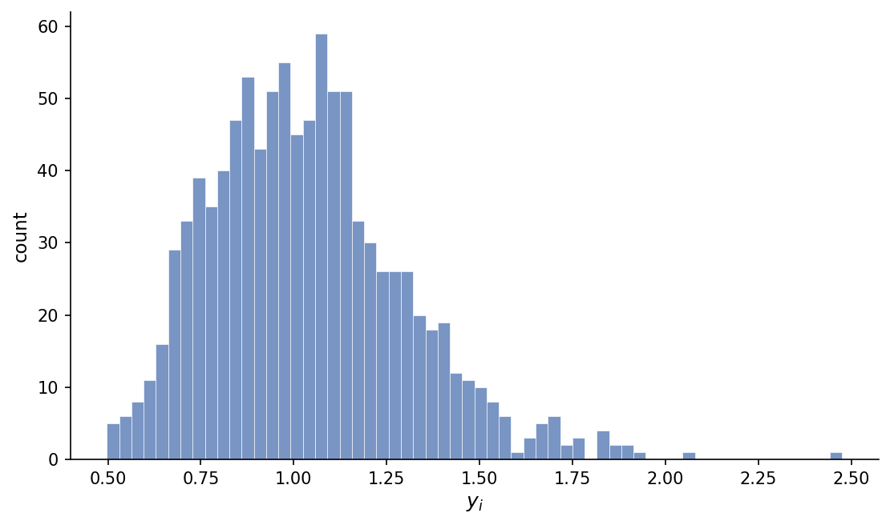
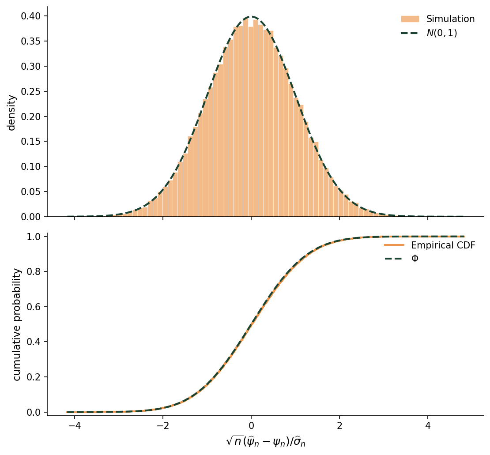
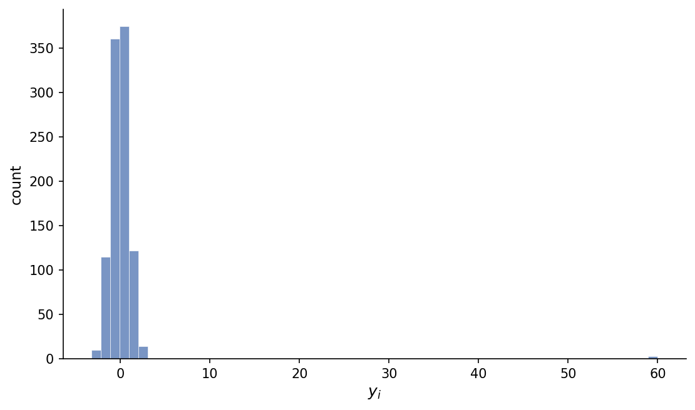
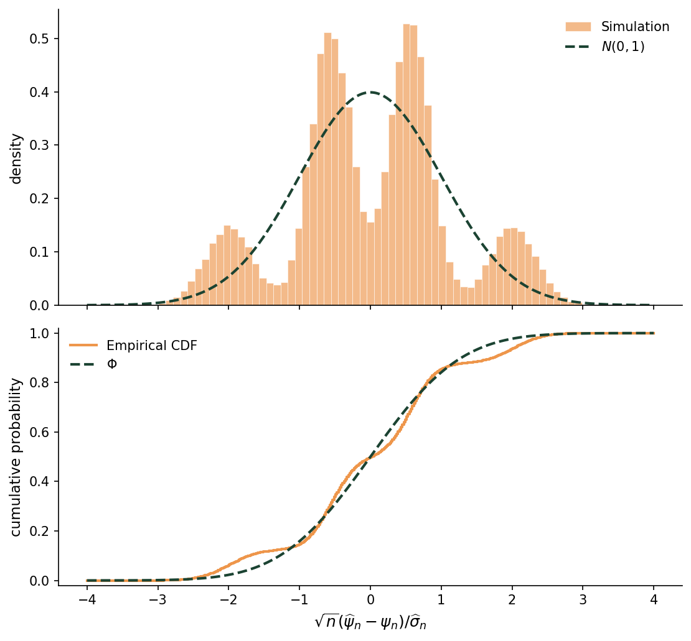

In our note on [treatment group means](../treatment-group-means/), we constructed confidence intervals that are uniformly valid under a set of regularity conditions.
Here, we develop a finite-sample diagnostic for assessing whether those conditions are plausible.

# Variance-share diagnostic

We use the notation from the treatment group means note.
For $d\in\{0,1\}$, define
$$
\kappa_{d,n}
=
\frac{1}{n} \frac{\max_{1\leq i\leq n}u_{i,d,n}^2}{\,S_{d,n}^2}.
$$

Since $S_{d,n}^2=n^{-1}\sum_{i=1}^n u_{i,d,n}^2$, we can equivalently write

$$
\kappa_{d,n}
=
\frac{\max_{1\leq i\leq n}u_{i,d,n}^2}{\sum_{i=1}^n u_{i,d,n}^2}.
$$

Thus, $\kappa_{d,n}$ is the largest share of variation in the sequence of potential outcomes under treatment $d$ attributable to any single unit.
Let
$$
\kappa_n = \max\{\kappa_{0,n},\kappa_{1,n}\}.
$$
[Assumption 3(i)](../treatment-group-means/#asm-nondegenerate) is equivalent to requiring

$$
\lim_{n\to\infty}\sup_{\theta \in \Theta}\kappa_{n} =0.
$$

In the [appendix to the treatment group means note](../treatment-group-means/#sec-treatment-group-mean-regularity), we show that Assumption 3(i) implies Assumption 3(ii) for a treatment-group mean.
We also establish the same implication provided that the correlation between the two potential-outcome sequences remains uniformly bounded away from $-1$.
Thus, if $\kappa_n$ is large in a finite sample, the asymptotic approximations that rely on Assumption 3 may be unreliable.

Because only one potential outcome is observed for each unit, $\kappa_n$ cannot be computed directly.
A feasible sample analogue replaces the unobserved potential-outcome deviations with observed within-arm residuals.
For $d\in\{0,1\}$, let
$$
n_d=n\overline{D}_{d,n},
$$
denote the number of units assigned to treatment $d$. Define
$$
\widehat\kappa_{d,n}
=
\frac{1}{n_d}\frac{\max_{1\leq i\leq n}
|Y_i-\widehat{y}_{d,n}|^2 D_{i,d}}{\widehat{S}_{d,n}^2},
$$ {#eq-dominant-unit-diagnostic}
and let
$$
\widehat\kappa_n
=
\max\{\widehat\kappa_{0,n},\widehat\kappa_{1,n}\}.
$$
This statistic is easy to compute and retains the intuitive variance-share interpretation of $\kappa_n$.
A diagnostic warning can be triggered when $\widehat\kappa_n$ exceeds a maximum tolerance $\overline\kappa$.

To motivate a choice of $\overline\kappa$, suppose the strong null holds:

$$
y_{i,1}=y_{i,0}=y_i
\qquad
	\text{for every } i.
$$ {#eq-strong-null}

This is also the sharp null used to construct exact $p$-values in Fisher randomization inference (see [Imbens and Rubin, 2015, Chapter 5](https://www.cambridge.org/core/books/causal-inference-for-statistics-social-and-biomedical-sciences/fishers-exact-pvalues-for-completely-randomized-experiments/23AF990D2EF9C90D0A424D555FACE578)).
Define unit $i$'s share of the total outcome variation as

$$
q_{i,n}
=
\frac{(y_i-\overline y)^2}
{\sum_{j=1}^n(y_j-\overline y)^2},
\qquad
\overline y=\frac{1}{n}\sum_{i=1}^n y_i.
$$

Under the strong null, the quantity controlled by Assumption 3(ii) for the ATE is

$$
\begin{aligned}
\lambda_n
&=
\frac{1}{n^{3/2}}
\frac{\sum_{i=1}^n|y_i-\overline y|^3}{S_n^3} \\
&=
\sum_{i=1}^n q_{i,n}^{3/2},
\end{aligned}
$$

where $S_n^2=n^{-1}\sum_{i=1}^n(y_i-\overline y)^2$.
Because $\max_i q_{i,n}=\kappa_n$, $\sum_i q_{i,n}=1$, and $q_{i,n}\leq\kappa_n$ for every unit, we have

$$
\kappa_n^{3/2}
\leq
\lambda_n
\leq
\sqrt{\kappa_n}\sum_{i=1}^n q_{i,n}
=
\sqrt{\kappa_n}.
$$ {#eq-lambda-kappa-bound}

The [Berry--Esseen bound](../treatment-group-means/#eq-dim-clt) derived in the treatment group means note bounds the Kolmogorov distance between the standardized linearized ATE estimator and $N(0,1)$ by

$$
C
\frac{p^2+(1-p)^2}{\sqrt{p(1-p)}}
\lambda_n
\leq
C
\frac{p^2+(1-p)^2}{\sqrt{p(1-p)}}
\sqrt{\kappa_n},
$$ {#eq-kappa-be-bound}
where $C$ is a universal constant.
Therefore, to ensure that this bound is no greater than $\overline\delta$ whenever $\kappa_n\leq\overline\kappa$, it suffices to set

$$
\overline\kappa
=
\left(
\frac{\overline\delta}{C}
\frac{\sqrt{p(1-p)}}{p^2+(1-p)^2}
\right)^2.
$$ {#eq-kappa-tolerance}

# Simulation

To illustrate the diagnostic in finite samples, we examine the ATE estimator under two finite populations of potential outcomes.
In both cases, the strong null holds, $n=1{,}000$, and $p=0.5$.
Using $\overline\delta=0.10$ and the upper bound $C\leq0.5583$ from [Shevtsova (2013)](https://www.mathnet.ru/eng/ia252), (-@eq-kappa-tolerance) gives the calibrated tolerance

$$
\overline\kappa
=
\left(\frac{0.10}{0.5583}\right)^2
\approx 0.032.
$$ {#eq-calibrated-kappa-tolerance}

## Well-behaved potential outcomes {#well-behaved-outcomes}

We generate the first population as $1{,}000$ draws from a log-normal distribution with $\sigma=0.25$.
@fig-log-normal-population shows a histogram of the potential outcomes:

{#fig-log-normal-population}

@fig-log-normal-sampling-distribution shows the density (upper panel) and CDF (lower panel) of $\sqrt{n}(\widehat\psi_n-\psi_n)/\widehat\sigma_n$. Both closely match their standard-normal counterparts, even though the potential outcomes are right-skewed. For this population, $\kappa_n=0.030$, which is below the calibrated tolerance in (-@eq-calibrated-kappa-tolerance).

{#fig-log-normal-sampling-distribution}

## Potential outcomes with outliers {#outlier-outcomes}

We form the second population from $997$ standard-normal draws and $3$ extreme outliers at $y=60$.
@fig-outlier-population shows a histogram of the potential outcomes:

{#fig-outlier-population}

For this population, $\kappa_n=0.307$, which is nearly an order of magnitude above the calibrated tolerance in (-@eq-calibrated-kappa-tolerance).
@fig-outlier-sampling-distribution shows the density (upper panel) and CDF (lower panel) of $\sqrt{n}(\widehat\psi_n-\psi_n)/\widehat\sigma_n$.
The density is multimodal, while the empirical CDF departs visibly from $\Phi$.
The modes reflect the number of outliers assigned to treatment.
Thus, the standard normal is a poor approximation in this case.

{#fig-outlier-sampling-distribution}

