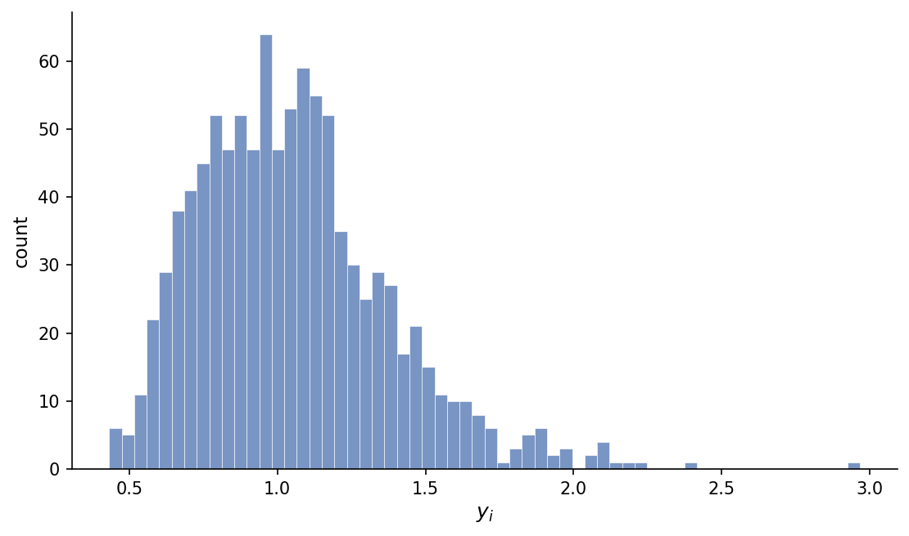
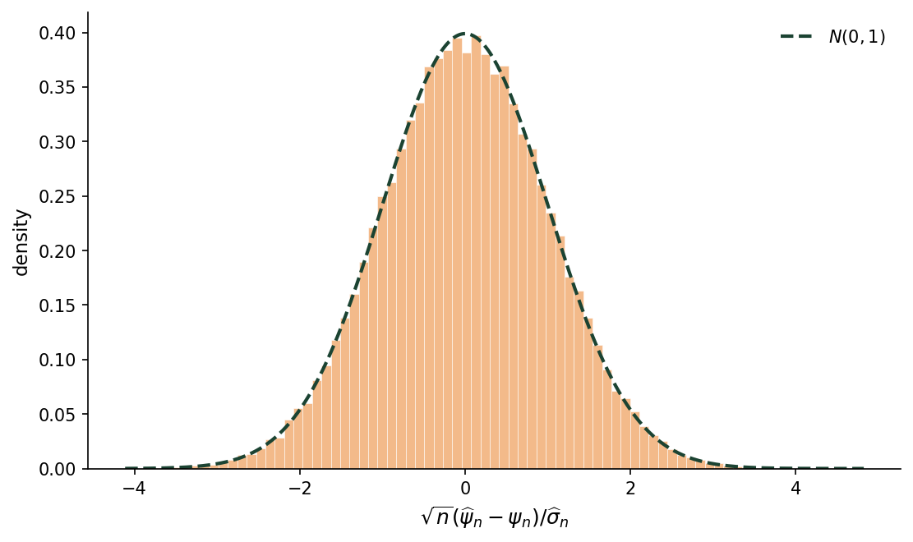
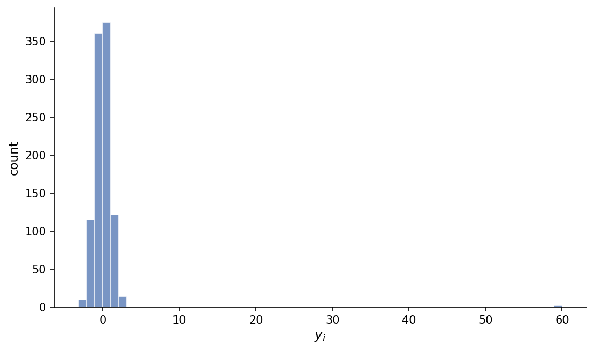
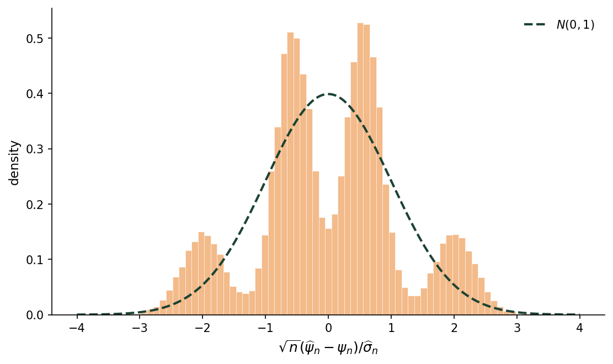

In our note on [treatment group means](../treatment-group-means/), we constructed confidence intervals that are uniformly valid under a regularity condition that rules out dominant units.
Here, we develop a finite-sample diagnostic for assessing whether that condition is plausible.

# Variance-share diagnostic

We use the notation from the treatment group means note.
For $d\in\{0,1\}$, define
$$
\kappa_{d,n}
=
\frac{1}{n} \frac{\max_{1\leq i\leq n}u_{i,d,n}^2}{\,s_{dd,n}^2}.
$$

Since $s_{dd,n}^2=n^{-1}\sum_{i=1}^n u_{i,d,n}^2$, we can equivalently write

$$
\kappa_{d,n}
=
\frac{\max_{1\leq i\leq n}u_{i,d,n}^2}{\sum_{i=1}^n u_{i,d,n}^2}.
$$

Thus, $\kappa_{d,n}$ is the largest share of variation in the sequence of potential outcomes under treatment $d$ attributable to any single unit.
Let
$$
\kappa_n = \max\{\kappa_{0,n},\kappa_{1,n}\}.
$$
The negligibility condition in [Assumption 3](../treatment-group-means/#asm-nondegenerate) is equivalent to requiring

$$
\lim_{n\to\infty}\sup_{\theta \in \Theta}\kappa_{n} =0.
$$

Thus, if $\kappa_n$ is large in a finite sample, the asymptotic approximations that rely on Assumption 3 may be unreliable.

Because only one potential outcome is observed for each unit, $\kappa_n$ cannot be computed directly.
A feasible sample analogue uses observed within-arm residuals in place of the unobserved potential-outcome deviations.
For $d\in\{0,1\}$, let
$$
n_d=n\overline{D}_{d,n}
$$
denote the number of units assigned to treatment $d$. Define
$$
\widehat\kappa_{d,n}
=
\frac{1}{n_d}\frac{\max_{1\leq i\leq n}
|Y_i-\widehat{y}_{d,n}|^2 D_{i,d}}{\widehat{s}_{dd,n}^2},
$$ {#eq-dominant-unit-diagnostic}
and let
$$
\widehat\kappa_n
=
\max\{\widehat\kappa_{0,n},\widehat\kappa_{1,n}\}.
$$
This statistic is easy to compute and has the same intuitive variance-share interpretation as $\kappa_n$.
A warning can be triggered when $\widehat\kappa_n$ exceeds a maximum tolerance $\overline\kappa$.

# Choosing the maximum tolerance

To motivate a choice of $\overline\kappa$, suppose the strong null holds:

$$
y_{i,1}=y_{i,0}=y_i
\qquad
\mathrm{for\ every}\ i.
$$ {#eq-strong-null}

Define unit $i$'s share of the total outcome variation as

$$
q_{i,n}
=
\frac{(y_i-\overline y)^2}
{\sum_{j=1}^n(y_j-\overline y)^2},
\qquad
\overline y=\frac{1}{n}\sum_{i=1}^n y_i.
$$

Also define the ratio

$$
\begin{aligned}
\lambda_n
&=
\frac{1}{n^{3/2}}
\frac{\sum_{i=1}^n|y_i-\overline y|^3}{s_n^3} \\
&=
\sum_{i=1}^n q_{i,n}^{3/2},
\end{aligned}
$$

where $s_n^2=n^{-1}\sum_{i=1}^n(y_i-\overline y)^2$.
Because $\max_i q_{i,n}=\kappa_n$, $\sum_i q_{i,n}=1$, and $q_{i,n}\leq\kappa_n$ for every unit, we have

$$
\kappa_n^{3/2}
\leq
\lambda_n
\leq
\sqrt{\kappa_n}\sum_{i=1}^n q_{i,n}
=
\sqrt{\kappa_n}.
$$ {#eq-lambda-kappa-bound}

Now let $\Phi$ denote the standard normal distribution function.
Define the ATE, its estimator, and its conservative standard-error scale by

$$
\psi_n^\mathrm{ATE}
=
\overline y_{1,n}-\overline y_{0,n},
\qquad
\widehat\psi_n^\mathrm{ATE}
=
\widehat y_{1,n}-\widehat y_{0,n},
\qquad
\widetilde\sigma_n^\mathrm{ATE}
=
\frac{s_n}{\sqrt{p(1-p)}}.
$$

Also define the linearization

$$
T_n
=
\frac{
\sum_{i=1}^n(D_i-p)(y_i-\overline y)
}{
\sqrt{n p(1-p)}\,s_n
}.
$$

Under the strong null, we can show

$$
\sqrt n\frac{\widehat\psi_n^\mathrm{ATE}-\psi_n^\mathrm{ATE}}{\widetilde\sigma_n^\mathrm{ATE}}
=
T_n+o_{\mathcal P}(1).
$$

The Berry--Esseen theorem gives

$$
\begin{aligned}
\sup_{t\in\mathbb R}
\left|
\mathbb P_\theta(T_n\leq t)
-\Phi(t)
\right|
&\leq
C
\frac{p^2+(1-p)^2}{\sqrt{p(1-p)}}
\lambda_n \\
&\leq
C
\frac{p^2+(1-p)^2}{\sqrt{p(1-p)}}
\sqrt{\kappa_n},
\end{aligned}
$$ {#eq-kappa-be-bound}
where $C$ is a universal constant.
Thus, as a heuristic for assessing the normal approximation to the standardized ATE estimator under the strong null, we can choose $\overline\kappa$ so that the Berry--Esseen bound in (-@eq-kappa-be-bound) is no greater than a desired tolerance $\overline\delta$ whenever $\kappa_n\leq\overline\kappa$.
It suffices to set

$$
\overline\kappa
=
\left(
\frac{\overline\delta}{C}
\frac{\sqrt{p(1-p)}}{p^2+(1-p)^2}
\right)^2.
$$ {#eq-kappa-tolerance}

# Simulation

To illustrate the diagnostic's finite-sample behavior, we simulate the sampling distribution of the ATE estimator under two different populations of potential outcomes.
In both cases, the strong null holds, $n=1{,}000$, and $p=0.5$.
Using $\overline\delta=0.10$ and the upper bound $C\leq0.5583$ from [Shevtsova (2013)](https://www.mathnet.ru/eng/ia252), (-@eq-kappa-tolerance) gives the calibrated tolerance

$$
\overline\kappa
=
\left(\frac{0.10}{0.5583}\right)^2
\approx 0.032.
$$ {#eq-calibrated-kappa-tolerance}

## Well-behaved potential outcomes {#well-behaved-outcomes}

We generate the first population by taking $1{,}000$ draws from a log-normal distribution with $\sigma=0.25$.
@fig-log-normal-population shows a histogram of the potential outcomes:

{#fig-log-normal-population}

@fig-log-normal-sampling-distribution shows the density (upper panel) and CDF (lower panel) of $\sqrt{n}(\widehat\psi_n-\psi_n)/\widehat\sigma_n$. Both closely match their standard normal counterparts, even though the potential outcomes are right-skewed. For this population, $\kappa_n=0.030$, which is below the calibrated tolerance in (-@eq-calibrated-kappa-tolerance).

{#fig-log-normal-sampling-distribution}

## Potential outcomes with outliers {#outlier-outcomes}

We form the second population from $997$ standard-normal draws and $3$ extreme outliers at $y=60$.
@fig-outlier-population shows a histogram of the potential outcomes:

{#fig-outlier-population}

For this population, $\kappa_n=0.307$, which is nearly an order of magnitude above the calibrated tolerance in (-@eq-calibrated-kappa-tolerance).
@fig-outlier-sampling-distribution shows the density (upper panel) and CDF (lower panel) of $\sqrt{n}(\widehat\psi_n-\psi_n)/\widehat\sigma_n$.
The density is multimodal, while the empirical CDF departs visibly from $\Phi$.
The modes reflect the number of outliers assigned to treatment.
The standard normal is clearly a poor approximation in this case.

{#fig-outlier-sampling-distribution}

