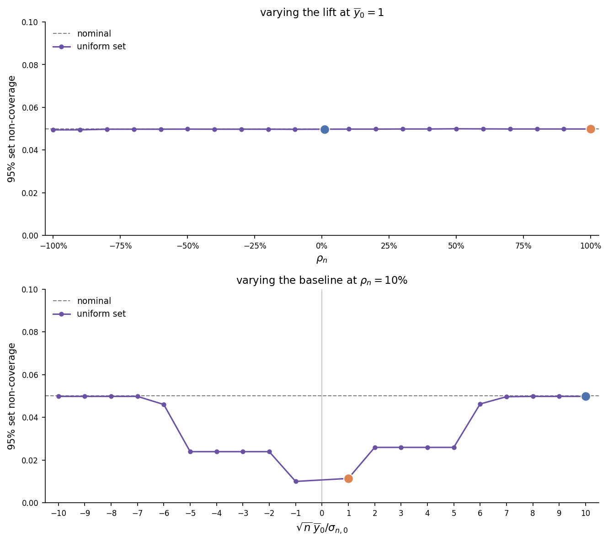

# Uniformly Valid Confidence Intervals for Percentage Lift
David Malison
2026-06-12

Average treatment effects (ATEs) are often reported as a percentage of
the baseline mean. This note studies how to conduct robust statistical
inference on this ratio. We first show why scaling the ATE confidence
interval or applying the delta method yields confidence intervals with
unreliable coverage. We then construct a uniformly valid confidence set
by combining Fieller’s method with a test of the baseline mean’s
sign.[^1]

# Percentage lift

We continue working with the fixed [potential outcomes
model](../treatment_group_means/index.md#model) introduced in the note
on treatment group means. Let
$$\overline{\Delta} = \overline{y_1} - \overline{y_0}$$
denote the average treatment effect (ATE). Since the ATE is measured in
units of the outcome variable, comparison can be difficult across
contexts. It is therefore common to also report the ATE as a percentage
of the average control outcome $\overline{y_0}$. When
$\overline{y_0} \neq 0$, define the **percentage lift** (or **relative
treatment effect**) as 
$$\Delta^\% = \frac{\overline{\Delta}}{|\overline{y_0}|} = \frac{\overline{y_1} - \overline{y_0}}{|\overline{y_0}|}.
 \qquad(1)$$

The absolute value in the denominator ensures $\Delta^\%$ and
$\overline{\Delta}$ share the same sign. A natural estimator for
$\Delta^\%$ is
$$\widehat{\Delta}^\% = \frac{\widehat{\Delta}}{|\widehat{y_0}|} = \frac{\widehat{y_1} - \widehat{y_0}}{|\widehat{y_0}|}.$$
where $\widehat{\Delta}$ is the [difference-in-means
estimator](../treatment_group_means/index.md#eq-estimators) for the ATE
and $\widehat{y_0}$ is the average outcome among the observed control
units.

## Scaled ATE confidence interval

A simple but naive way to construct a confidence interval for
$\Delta^\%$ is to scale the [ATE confidence
interval](../treatment_group_means/index.md#eq-wald-ci) by
$1/|\widehat{y_0}|$. This approach yields the interval

$$\widehat{\Delta}^\%
\pm
\frac{z_{1-\alpha/2}\,\widehat{\sigma}_{n,\overline{\Delta}}}{\sqrt{n}\,|\widehat{y_0}|},
 \qquad(2)$$ where

$$\begin{gathered}
\widehat{\sigma}_{n,\overline{\Delta}} = \widehat{\sigma}_{n,0}+\widehat{\sigma}_{n,1}, \qquad
\widehat{\sigma}_{n,0}^2 = \frac{\overline D\,\widehat{S}_{n,0}^2}{1-\overline D}, \qquad \widehat{\sigma}_{n,1}^2 = \frac{(1-\overline D)\,\widehat{S}_{n,1}^2}{\overline D}, \\[1ex]
\widehat{S}_{n,0}^2 = \frac{1}{n(1-\overline D)}\sum_{i=1}^n (1-D_i)\left(Y_i-\widehat{y_0}\right)^2, \qquad \widehat{S}_{n,1}^2 = \frac{1}{n\overline D}\sum_{i=1}^n D_i\left(Y_i-\widehat{y_1}\right)^2.
\end{gathered}$$

The problem with this interval is that it effectively ignores sampling
variability in the denominator. Since the impact of denominator
variability scales with the percentage lift, its actual asymptotic
coverage equals its nominal level only when the percentage lift is zero.

<a href="#fig-scaled-ate-noncoverage" class="quarto-xref">Figure 1</a>
illustrates this behavior. To generate the data for this figure, we
simulated $10{,}000$ draws from a $N(0,1)$ distribution and normalized
the sample to have exactly zero mean and unit variance. We then set the
potential outcomes for each unit according to

$$\begin{aligned}
y_{i,0} &= 1 + \epsilon_i, \\[1ex]
y_{i,1} &= 1 + \Delta^\% + \epsilon_i,
\end{aligned}
 \qquad(3)$$ where $\epsilon_i$ is the normalized draw for unit
$i$. The top two panels plot the sampling distribution of
$$\frac{\sqrt n(\widehat{\Delta}^\% - \Delta^\%)}
{\widehat{\sigma}_{n,\overline{\Delta}}/|\widehat{y_0}|}$$
for $\Delta^\%=1\%$ and $\Delta^\%=100\%$. The bottom panel plots the
empirical noncoverage as a function of $\Delta^\%$, with the two lift
values from the top panels marked in their corresponding histogram
colors.

Figure 1: Top: sampling distribution of the studentized scaled-ATE
statistic. Bottom: empirical non-coverage of the nominal $95\%$
scaled-ATE interval.

In the next section, we show that the actual standard deviation of
$\sqrt n(\widehat{\Delta}^\% - \Delta^\%)$ is approximately
$(|1+\Delta^\%|+1)$ for this data-generating process (see
(<a href="#eq-delta-method-sd" class="quarto-xref">6</a>)). The standard
deviation used by the scaled-ATE interval instead always converges to
$2$. At $\Delta^\%=1\%$, the difference is negligible and the
studentized statistic is close to $N(0,1)$; at $\Delta^\%=100\%$, the
statistic is visibly over-dispersed because the denominator uncertainty
is ignored.

The bottom panel shows that non-coverage matches the nominal level only
when $\Delta^\%=0$. For positive lifts, the interval is too narrow; for
negative lifts, the interval is too wide.

## Delta method

To incorporate denominator uncertainty into inference, we can apply the
[delta method](https://en.wikipedia.org/wiki/Delta_method) to

$$\sqrt{n}\left(\widehat{\Delta}^\% - \Delta^\%\right).
 \qquad(4)$$

Taking a Taylor expansion of
(<a href="#eq-percentage-lift" class="quarto-xref">1</a>) around
$(\overline{y_0}, \overline{y_1})$ and evaluating at
$(\widehat{y_0}, \widehat{y_1})$ gives

$$\sqrt{n}\left(\widehat{\Delta}^\% - \Delta^\%\right) = 
\frac{1}{|\overline{y_0}|}
\sqrt n\left[
\left(\widehat{y_1}-\overline{y_1}\right)
-
\left(1+\operatorname{sgn}(\overline{y_0})\Delta^\%\right)
\left(\widehat{y_0}-\overline{y_0}\right)
\right] + R_n.
 \qquad(5)$$ where $R_n$ is the remainder term. The variance of
the bracketed term can be bounded by
$$\begin{aligned}
&\mathbb{V}_\theta\left\{
\sqrt n\left[
\left(\widehat{y_1}-\overline{y_1}\right)
-
\left(1+\operatorname{sgn}(\overline{y_0})\Delta^\%\right)
\left(\widehat{y_0}-\overline{y_0}\right)
\right]
\right\} \\
&\qquad =
\sigma_{n,1}^2
+
\left(1+\operatorname{sgn}(\overline{y_0})\Delta^\%\right)^2\sigma_{n,0}^2
-
2\left(1+\operatorname{sgn}(\overline{y_0})\Delta^\%\right)
\operatorname{Cov}_\theta\left(
\sqrt n(\widehat{y_1}-\overline{y_1}),
\sqrt n(\widehat{y_0}-\overline{y_0})
\right) \\
&\qquad \leq
\sigma_{n,1}^2
+
\left(1+\operatorname{sgn}(\overline{y_0})\Delta^\%\right)^2\sigma_{n,0}^2
+
2\left|1+\operatorname{sgn}(\overline{y_0})\Delta^\%\right|\sigma_{n,0}\sigma_{n,1} \\
&\qquad =
\left(
\left|1+\operatorname{sgn}(\overline{y_0})\Delta^\%\right|\sigma_{n,0}+\sigma_{n,1}
\right)^2,
\end{aligned}$$
where $\sigma_{n,d}$ denotes the standard deviation of
$\sqrt n(\widehat{y_d}-\overline{y_d})$ and the inequality bounds the
unidentified covariance term using Cauchy–Schwarz. Taking square roots
and dividing by $|\overline{y_0}|$ gives the delta-method standard
deviation 
$$\sigma = \frac{1}{|\overline{y_0}|}\left(\left|1+\operatorname{sgn}(\overline{y_0})\Delta^\%\right|\sigma_{n,0}+\sigma_{n,1}\right).
 \qquad(6)$$ Replacing unknown quantities by their plug-in
estimates yields the delta-method confidence interval

$$\widehat{\Delta}^\%
\pm
\frac{z_{1-\alpha/2}}{\sqrt n\,|\widehat{y_0}|}
\left(
\left|1+\operatorname{sgn}(\widehat{y_0})\widehat{\Delta}^\%\right|\widehat{\sigma}_{n,0}
+
\widehat{\sigma}_{n,1}
\right).
 \qquad(7)$$

The top two panels replicate the top two panels of
<a href="#fig-scaled-ate-noncoverage" class="quarto-xref">Figure 1</a>
but with the delta-method standard deviation used in the denominator. In
both cases, the empirical distribution is close to $N(0,1)$. The bottom
panel shows that delta-method non-coverage remains near the nominal
level across the full range of lifts.

Figure 2: Top: sampling distribution of the studentized delta-method
statistic. Bottom: empirical non-coverage of the nominal $95\%$
delta-method interval as a function of $\Delta^\%$.

Although the delta method approach accounts for sampling variation in
the denominator, the quality of the approximation in
(<a href="#eq-lift-linearization" class="quarto-xref">5</a>) is governed
by how many standard errors separate the denominator from zero.
<a href="#fig-lift-skewness" class="quarto-xref">Figure 3</a>
illustrates this behavior. To generate the data for this figure, we set
the potential outcomes for each unit according to

$$\begin{aligned}
y_{i, 0} &= \overline{y_0} + \epsilon_i, \\[1ex]
y_{i, 1} &= 1.1 \overline{y_0} + \epsilon_i
\end{aligned}
 \qquad(8)$$ The top two panels in the figure again plot the
sampling distribution of the standardized statistic. The left figure
displays the distribution for $\overline{y_0} = 0.01$, while the right
figure displays the distribution for $\overline{y_0} = 0.1$. The bottom
panel plots the empirical non-coverage of the delta-method confidence
interval against the number of standard errors
$\sqrt{n}\,\overline{y_0}/\sigma_{n,0}$ separating the baseline from
zero.

Figure 3: Top: sampling distribution of the standardized statistic
$\sqrt{n}(\widehat{\Delta}^\% - \Delta^\%)/\sigma$ at $n = 10{,}000$ for
$\overline{y_0}=0.01$ (left) and $\overline{y_0}=0.1$ (right), with the
$N(0,1)$ density overlaid as a dashed curve. Bottom: empirical
non-coverage of the nominal $95\%$ delta-method interval as a function
of the number of standard errors $\sqrt{n}\,\overline{y_0}/\sigma_{n,0}$
separating the baseline from zero; the dotted lines mark the two
baselines shown above.

At $\overline{y_0}=0.1$ the standardized statistic is close to $N(0,1)$
and the delta-method non-coverage is near nominal, while at
$\overline{y_0}=0.01$ the right skew pushes it well above the nominal
level. The bottom panel shows that the delta method only achieves
nominal coverage when the baseline mean is more than 10 standard errors
from zero.

# Uniform confidence sets

## Uniform validity

<a href="#fig-delta-studentized" class="quarto-xref">Figure 2</a>
illustrates how the delta method can yield confidence intervals with
poor coverage when the baseline mean is close to zero. To perform more
robust inference, we need a coverage guarantee that holds uniformly over
the parameter space. Let
$$C_{n, 1-\alpha}^\%
=
C_{n, 1-\alpha}^\%(D_1, \cdots, D_n, Y_1, \cdots, Y_n)$$
denote a confidence set for $\Delta^\%$ with nominal coverage
$1-\alpha$. We say that $C_{n, 1-\alpha}^\%$ is **uniformly valid** over
$\Theta$ if 
$$\liminf_{n \to \infty} \inf_{\theta \in \Theta} \mathbb{P}_\theta\left(\Delta^\% \in C_{n, 1-\alpha}^\%\right) \geq 1-\alpha.
 \qquad(9)$$

Equivalently, for every $\epsilon > 0$, there exists an index $N$ such
that, for all $n \geq N$,
$$\inf_{\theta\in\Theta}
\mathbb{P}_\theta\left(\Delta^\% \in C_{n, 1-\alpha}^\%\right)
>
1-\alpha-\epsilon.$$
Unlike pointwise validity, the index $N$ in this definition does not
depend on the model parameters $\theta$.

## Uniformity assumptions

We use the uniformity assumptions stated in the [treatment group means
note](../treatment_group_means/index.md#model). For the lift problem,
those assumptions are applied to the centered two-dimensional vector

$$\mathbf{u}_{i,n}(\theta) = \begin{pmatrix} y_{i,0} - \overline{y_0} \\ y_{i,1} - \overline{y_1} \end{pmatrix},
\qquad
\mathbf{V}_n(\theta) = \frac{1}{n}\sum_{i=1}^n \mathbf{u}_{i,n}(\theta)\mathbf{u}_{i,n}(\theta)'.$$

In this two-dimensional specialization, [Assumption
2](../treatment_group_means/index.md#asm-no-dominant-units) and
[Assumption 3](../treatment_group_means/index.md#asm-nondegenerate) are

$$\limsup_{n\to\infty}\sup_{\theta \in \Theta}
\frac{\lambda_{\max}\left(\mathbf{V}_n(\theta)\right)}
{\lambda_{\min}\left(\mathbf{V}_n(\theta)\right)}
\leq K.$$

$$\lim_{n \to \infty} \sup_{\theta \in \Theta}
\frac{1}{n^{3/2}}
\sum_{i=1}^n
\left\|
\mathbf{V}_n(\theta)^{-1/2}\mathbf{u}_{i,n}(\theta)
\right\|^3
= 0.$$

## Uniform confidence set

We now adapt the Berry–Esseen argument in the [treatment group
means](../treatment_group_means/index.md#normal-approximation) note to
apply uniformly over $\Theta$. Let
$\mathbf{a}_n(\theta) = (a_{n, 0}(\theta), a_{n, 1}(\theta))'$ be a
sequence of nonzero vectors that may depend on $\theta$. Define
$$\psi_n(\theta) = \mathbf{a}_n(\theta)'\overline{\mathbf{y}},
\qquad
\widehat{\psi}_n(\theta) = \mathbf{a}_n(\theta)'\widehat{\mathbf{y}}.$$

For $\alpha\in(0,1)$, let $z_{1-\alpha/2}$ be the $(1-\alpha/2)$
quantile of the standard normal distribution, and define

$$C_{n,1-\alpha}(\theta)
=
\left[
\widehat{\psi}_n(\theta)
-
z_{1-\alpha/2}\sqrt{\frac{\widehat{\sigma}_n^2(\theta)}{n}},
\widehat{\psi}_n(\theta)
+
z_{1-\alpha/2}\sqrt{\frac{\widehat{\sigma}_n^2(\theta)}{n}}
\right]
 \qquad(10)$$ where 
$$\begin{aligned}
\widehat{\sigma}_n^2
&=
\overline D(1-\overline D)
\left(
\frac{|a_{n,0}(\theta)|\widehat{S}_{n,0}}{1-\overline D}
+
\frac{|a_{n,1}(\theta)|\widehat{S}_{n,1}}{\overline D}
\right)^2.
\end{aligned}
 \qquad(11)$$

In the [Appendix](#sec-uniform-coverage), we show

$$\liminf_{n\to\infty}
\inf_{\theta\in\Theta}
\mathbb{P}_\theta\left(
\psi_n(\theta)\in C_{n,1-\alpha}(\theta)
\right)
\geq 1 - \alpha
 \qquad(12)$$ under Assumptions 1’, 2’, and 3’. The proof follows
the same structure as the [pointwise
proof](../treatment_group_means/index.md#coverage): use the Berry–Esseen
theorem to derive a [uniform normal
approximation](#sec-uniform-normal-approximation), show [uniform
convergence](#sec-uniform-variance-convergence) of the variance
estimator to its population analogue, and show that the remainder term
is [uniformly negligible](#sec-uniform-remainder).

# Fieller’s method

## Splitting by the control mean sign

In the previous section, we showed how to construct a uniformly valid
confidence set for a linear combination of means. To apply this result
to $\Delta^\%$, we first eliminate the absolute value by defining
$$\Delta^{\%, +} = \frac{\overline{\Delta}}{\overline{y_0}},\qquad \Delta^{\%, -} = -\frac{\overline{\Delta}}{\overline{y_0}}$$
In this section, we construct uniformly valid confidence sets for
$\Delta^{\%, +}$ and $\Delta^{\%, -}$ using [Fieller’s
method](https://en.wikipedia.org/wiki/Fieller%27s_theorem). In the
following section, we combine them to obtain a uniformly valid
confidence set for $\Delta^\%$.

Define $\psi^+$ and $\psi^-$ by
$$\psi^+ = (1+\Delta^{\%, +})\,\overline{y_0} - \overline{y_1},
\qquad
\psi^- = \overline{y_1} - (1-\Delta^{\%, -})\,\overline{y_0},$$
with sample analogues $\widehat{\psi}^+$ and $\widehat{\psi}^-$ obtained
by replacing $\overline{y_d}$ with $\widehat{y_d}$. Let
$C^+_{n,1-\alpha}$ and $C^-_{n,1-\alpha}$ denote the confidence sets for
$\psi^+$ and $\psi^-$ defined in
(<a href="#eq-uniform-confidence-set" class="quarto-xref">10</a>). By
construction, the confidence sets satisfy
$$\left\{\psi^s \in C_{n,1-\alpha}^s\right\}
\iff
\left\{\left|\frac{\widehat{\psi}^s - \psi^s}{\sqrt{(\widehat{\sigma}_n^{s}(\theta))^2/n}}\right| \leq z_{1-\alpha/2}\right\}$$
for $s \in \{+,-\}$, where
$$\begin{aligned}
(\widehat{\sigma}_n^{+}(\theta))^2 &= \left(\left|1+\Delta^{\%, +}\right|\,\widehat{\sigma}_{n,0} + \widehat{\sigma}_{n,1}\right)^2, \\[1ex]
(\widehat{\sigma}_n^{-}(\theta))^2 &= \left(\left|1-\Delta^{\%, -}\right|\,\widehat{\sigma}_{n,0} + \widehat{\sigma}_{n,1}\right)^2
\end{aligned}$$

For any value of $\Delta^{\%, s}$, the sample analogues simplify to
$$\widehat{\psi}^+ = \widehat{y_0}\,\Delta^{\%, +} - \widehat{\Delta},
\qquad
\widehat{\psi}^- = \widehat{y_0}\,\Delta^{\%, -} + \widehat{\Delta}.$$
At the true values of $\Delta^{\%,+}$ and $\Delta^{\%,-}$, we also have
$$\psi^+ = \psi^- = 0.$$ We can therefore write
$$\left\{\left|\frac{\widehat{\psi}^+ - \psi^+}{\sqrt{(\widehat{\sigma}_n^{+}(\theta))^2/n}}\right| \leq z_{1-\alpha/2}\right\} \iff \left\{\left|\frac{\widehat{y_0}\,\Delta^{\%, +} - \widehat{\Delta}}{\frac{\left|1+\Delta^{\%, +}\right|\,\widehat{\sigma}_{n,0} + \widehat{\sigma}_{n,1}}{\sqrt n}}\right| \leq z_{1-\alpha/2}\right\}$$

$$\left\{\left|\frac{\widehat{\psi}^- - \psi^-}{\sqrt{(\widehat{\sigma}_n^{-}(\theta))^2/n}}\right| \leq z_{1-\alpha/2}\right\} \iff \left\{\left|\frac{\widehat{y_0}\,\Delta^{\%, -} + \widehat{\Delta}}{\frac{\left|1-\Delta^{\%, -}\right|\,\widehat{\sigma}_{n,0} + \widehat{\sigma}_{n,1}}{\sqrt n}}\right| \leq z_{1-\alpha/2}\right\}.$$

Inverting the right-hand side expressions, we obtain the confidence sets

$$\begin{aligned}
C_{n,1-\alpha}^{\%, +} = \Bigg\{\Delta^{\%, +} :{}\ 
& \left(\widehat{y_0}^2 - \frac{z_{1-\alpha/2}^2}{n}\,\widehat{\sigma}_{n,0}^2\right)(\Delta^{\%, +})^2 \\
&- 2\left(\widehat{y_0}\,\widehat{\Delta} + \frac{z_{1-\alpha/2}^2}{n}\,\widehat{\sigma}_{n,0}^2\right)\Delta^{\%, +} - \frac{2z_{1-\alpha/2}^2}{n}\,\widehat{\sigma}_{n,0}\,\widehat{\sigma}_{n,1}\left(\left|1+\Delta^{\%, +}\right| - 1\right) \;\\
&+ \widehat{\Delta}^2 - \frac{z_{1-\alpha/2}^2}{n}\,\widehat{\sigma}_{n,\overline{\Delta}}^2 \leq\; 0\Bigg\}.
\end{aligned}
 \qquad(13)$$ 
$$\begin{aligned}
C_{n,1-\alpha}^{\%, -} = \Bigg\{\Delta^{\%, -} :{}\ 
& \left(\widehat{y_0}^2 - \frac{z_{1-\alpha/2}^2}{n}\,\widehat{\sigma}_{n,0}^2\right)(\Delta^{\%, -})^2 \\
&+ 2\left(\widehat{y_0}\,\widehat{\Delta} + \frac{z_{1-\alpha/2}^2}{n}\,\widehat{\sigma}_{n,0}^2\right)\Delta^{\%, -} - \frac{2z_{1-\alpha/2}^2}{n}\,\widehat{\sigma}_{n,0}\,\widehat{\sigma}_{n,1}\left(\left|1-\Delta^{\%, -}\right| - 1\right) \;\\
&+ \widehat{\Delta}^2 - \frac{z_{1-\alpha/2}^2}{n}\,\widehat{\sigma}_{n,\overline{\Delta}}^2 \leq\; 0\Bigg\}.
\end{aligned}
 \qquad(14)$$

These confidence sets are bounded if and only if
$$\frac{|\widehat{y_0}|}{\widehat{\sigma}_{n,0} / \sqrt{n}} > z_{1-\alpha/2}.$$
This result is intuitive: if we cannot bound the control mean away from
zero at level $\alpha$, then we cannot bound the magnitude of the
percentage lift at level $\alpha$.

We can also compare these confidence sets with the delta-method
confidence interval in
(<a href="#eq-delta-method-interval" class="quarto-xref">7</a>). For the
positive-denominator region, the inverted inequality in
(<a href="#eq-fieller-set-pos" class="quarto-xref">13</a>) can be
written as

$$\left|
\Delta^{\%,+}
-
\frac{\widehat{\Delta}}{\widehat{y_0}}
\right|
\leq
\frac{z_{1-\alpha/2}}{\sqrt n\,|\widehat{y_0}|}
\left(
\left|1+\Delta^{\%,+}\right|\widehat{\sigma}_{n,0}
+
\widehat{\sigma}_{n,1}
\right).$$

When $\widehat{y_0} > 0$, the only difference from the interval in
(<a href="#eq-delta-method-interval" class="quarto-xref">7</a>) is that
the right-hand side substitutes $\Delta^{\%,+}$ for
$\widehat{\Delta}/\widehat{y_0}$. A similar expression holds for the
negative-denominator region. In the
[Appendix](#sec-fieller-delta-equivalence), we show this substitution
has a negligible impact on the confidence set whenever the baseline mean
is well-separated from zero.

Since
$$\left\{\psi^s \in C_{n,1-\alpha}^s\right\} \iff \left\{\Delta^{\%, s} \in C_{n,1-\alpha}^{\%, s}\right\},$$
the uniform coverage result in
(<a href="#eq-uniform-psi-coverage" class="quarto-xref">12</a>) implies

$$\liminf_{n\to\infty} \inf_{\theta \in \Theta} \mathbb{P}_\theta\left(\Delta^{\%, s} \in C_{n,1-\alpha}^{\%, s}\right)
= \liminf_{n\to\infty} \inf_{\theta \in \Theta} \mathbb{P}_\theta\left(\psi^s \in C_{n,1-\alpha}^s\right) \geq 1-\alpha.
 \qquad(15)$$ Therefore $C_{n,1-\alpha}^{\%,s}$ is a uniformly
valid confidence set for $\Delta^{\%, s}$.

## Confidence set for $\Delta^{\%}$

For the final step, we combine the confidence sets for $\Delta^{\%, +}$
and $\Delta^{\%, -}$ to obtain a uniformly valid confidence set for
$\Delta^\%$. Choose $\alpha_0,\alpha_1>0$ with
$\alpha_0+\alpha_1=\alpha$ and define the test statistic

$$T_{n,0}
=
\frac{\sqrt n\,\widehat{y_0}}{\widehat{\sigma}_{n,0}}.$$

Define the confidence set for $\Delta^\%$ as

$$C_{n,1-\alpha}^{\%}
=
\begin{cases}
C_{n,1-\alpha_1}^{\%,+},
& T_{n,0}>z_{1-\alpha_0/2}, \\[1ex]
C_{n,1-\alpha_1}^{\%,-},
& T_{n,0}<-z_{1-\alpha_0/2}, \\[1ex]
\mathbb{R},
& |T_{n,0}|\leq z_{1-\alpha_0/2}.
\end{cases}
 \qquad(16)$$

If $T_{n,0}$ is significantly positive at level $\alpha_0 / 2$,
$C_{n,1-\alpha}^{\%}$ uses the positive-denominator set; if it is
significantly negative, $C_{n,1-\alpha}^{\%}$ uses the
negative-denominator set. If the sign test is inconclusive,
$C_{n,1-\alpha}^{\%}$ reverts to the real line.

To prove $C_{n,1-\alpha}^{\%}$ is uniformly asymptotically valid, fix
$n$ and $\theta$ with $\overline{y_0}\neq0$. Partition the sample space
by the three possible outcomes of the sign test:

$$E_{0,+}
=
\left\{
T_{n,0} > z_{1-\alpha_0/2}
\right\},
\qquad
E_{0,-}
=
\left\{
T_{n,0} < -z_{1-\alpha_0/2}
\right\},
\qquad
E_{0}
=
\left\{
\left|T_{n,0}\right|\leq z_{1-\alpha_0/2}
\right\}.$$

Let

$$E_+
=
\left\{
\Delta^{\%,+}\in C_{n,1-\alpha_1}^{\%,+}
\right\},
\qquad
E_-
=
\left\{
\Delta^{\%,-}\in C_{n,1-\alpha_1}^{\%,-}
\right\}.$$

First suppose $\overline{y_0}>0$. If $E_{0,+}\cap E_+$ occurs, then
$C_{n,1-\alpha}^{\%}=C_{n,1-\alpha_1}^{\%,+}$ and
$\Delta^\%=\Delta^{\%,+}$, so $\Delta^\%\in C_{n,1-\alpha}^{\%}$. If
$E_{0}$ occurs, then $C_{n,1-\alpha}^{\%}=\mathbb{R}$, so
$\Delta^\%\in C_{n,1-\alpha}^{\%}$ automatically. Therefore

$$\begin{aligned}
\mathbb{P}_\theta\left(\Delta^\%\in C_{n,1-\alpha}^{\%}\right)
&\geq
\mathbb{P}_\theta\left((E_{0,+}\cap E_+)\cup E_{0}\right) \\[1ex]
&=
\mathbb{P}_\theta\left(E_{0,-}^c \cap (E_{0}\cup E_+)\right) \\[1ex]
&=
1-\mathbb{P}_\theta\left(E_{0,-}\cup (E_{0}^c\cap E_+^c)\right) \\[1ex]
&\geq
1-\mathbb{P}_\theta(E_{0,-})-\mathbb{P}_\theta(E_+^c).
\end{aligned}
 \qquad(17)$$

When $\overline{y_0}>0$,

$$\begin{aligned}
E_{0,-}
&=
\left\{
T_{n,0}<-z_{1-\alpha_0/2}
\right\} \\
&\subseteq
\left\{
\sqrt n
\frac{\widehat{y_0}-\overline{y_0}}
{\widehat{\sigma}_{n,0}}
<-z_{1-\alpha_0/2}
\right\} \\
&\subseteq
\left\{
\left|
\sqrt n
\frac{\widehat{y_0}-\overline{y_0}}
{\widehat{\sigma}_{n,0}}
\right|
> z_{1-\alpha_0/2}
\right\},
\end{aligned}
 \qquad(18)$$

Combining the inclusion in
(<a href="#eq-E0-minus-inclusion" class="quarto-xref">18</a>) with the
bound in (<a href="#eq-coverage-lower-bound" class="quarto-xref">17</a>)
gives

$$\mathbb{P}_\theta\left(
\Delta^\%\notin C_{n,1-\alpha}^{\%}
\right)
\leq
\mathbb{P}_\theta\left(
\left|
\sqrt n
\frac{\widehat{y_0}-\overline{y_0}}
{\widehat{\sigma}_{n,0}}
\right|
> z_{1-\alpha_0/2}
\right)
+
\mathbb{P}_\theta(E_+^c).$$

The same argument with signs reversed shows that, if $\overline{y_0}<0$,

$$\mathbb{P}_\theta\left(
\Delta^\%\notin C_{n,1-\alpha}^{\%}
\right)
\leq
\mathbb{P}_\theta\left(
\left|
\sqrt n
\frac{\widehat{y_0}-\overline{y_0}}
{\widehat{\sigma}_{n,0}}
\right|
> z_{1-\alpha_0/2}
\right)
+
\mathbb{P}_\theta(E_-^c).$$

Therefore, for every $n$ and every $\theta\in\Theta$ with
$\overline{y_0}\neq0$,

$$\begin{aligned}
&\mathbb{P}_\theta\left(
\Delta^\%\notin C_{n,1-\alpha}^{\%}
\right) \\
&\qquad\leq
\mathbb{P}_\theta\left(
\left|
\sqrt n
\frac{\widehat{y_0}-\overline{y_0}}
{\widehat{\sigma}_{n,0}}
\right|
> z_{1-\alpha_0/2}
\right)
+
\max\left\{
\mathbb{P}_\theta(E_+^c),
\mathbb{P}_\theta(E_-^c)
\right\}.
\end{aligned}$$

Taking the supremum over $\theta\in\Theta$ with $\overline{y_0}\neq0$,
for this fixed $n$, gives

$$\begin{aligned}
&\sup_{\theta\in\Theta:\,\overline{y_0}\neq0}
\mathbb{P}_\theta\left(
\Delta^\%\notin C_{n,1-\alpha}^{\%}
\right) \\
&\qquad\leq
\sup_{\theta\in\Theta}
\mathbb{P}_\theta\left(
\left|
\sqrt n
\frac{\widehat{y_0}-\overline{y_0}}
{\widehat{\sigma}_{n,0}}
\right|
> z_{1-\alpha_0/2}
\right) +
\max\left\{
\sup_{\theta\in\Theta}\mathbb{P}_\theta(E_+^c),
\sup_{\theta\in\Theta}\mathbb{P}_\theta(E_-^c)
\right\}.
\end{aligned}$$

The first term is controlled by the uniform coverage result in
(<a href="#eq-uniform-psi-coverage" class="quarto-xref">12</a>) applied
to the control group mean. The maximum term is controlled by the uniform
asymptotic validity of the sign-specific confidence sets in
(<a href="#eq-uniform-sign-specific-coverage" class="quarto-xref">15</a>).
Thus

$$\limsup_{n\to\infty}
\sup_{\theta\in\Theta:\,\overline{y_0}\neq0}
\mathbb{P}_\theta\left(
\Delta^\%\notin C_{n,1-\alpha}^{\%}
\right)
\leq
\alpha_0+\alpha_1
=
\alpha.$$

Equivalently,

$$\liminf_{n\to\infty}
\inf_{\theta\in\Theta:\,\overline{y_0}\neq0}
\mathbb{P}_\theta\left(
\Delta^\%\in C_{n,1-\alpha}^{\%}
\right)
\geq
1-\alpha.$$

<a href="#fig-uniform-noncoverage" class="quarto-xref">Figure 4</a>
recreates the bottom panels of
<a href="#fig-scaled-ate-noncoverage" class="quarto-xref">Figure 1</a>
and <a href="#fig-lift-skewness" class="quarto-xref">Figure 3</a>, but
reports the non-coverage of the uniform set in
(<a href="#eq-final-confidence-set" class="quarto-xref">16</a>). The top
panel varies the lift at a fixed baseline $\overline{y_0}=1$. As with
the delta-method confidence interval, the uniform set’s non-coverage
remains near the nominal level for every lift. The bottom panel varies
the baseline at a fixed lift $\Delta^\%=10\%$, as in
<a href="#fig-lift-skewness" class="quarto-xref">Figure 3</a>. While the
delta-method interval’s non-coverage rose as the baseline approached
zero, the uniform set’s non-coverage falls because the sign pretest
fails and the set defaults to the real line. Its non-coverage never
exceeds the nominal $5\%$.

Figure 4: Empirical non-coverage of the nominal $95\%$ uniformly valid
confidence set in
(<a href="#eq-final-confidence-set" class="quarto-xref">16</a>), with
$\alpha_0=0.001$ and $\alpha_1=0.049$. Top: as a function of the
percentage lift $\Delta^\%$ at fixed baseline $\overline{y_0}=1$.
Bottom: as a function of the number of standard errors
$\sqrt{n}\,\overline{y_0}/\sigma_{n,0}$ separating the baseline from
zero at fixed lift $\Delta^\%=10\%$.

# Appendix

## Equivalence of the Fieller and delta-method intervals

We show that the positive-denominator Fieller set in
(<a href="#eq-fieller-set-pos" class="quarto-xref">13</a>), written in
the form
$$\left|
\Delta^{\%,+}
-
\frac{\widehat{\Delta}}{\widehat{y_0}}
\right|
\leq
\frac{z_{1-\alpha/2}}{\sqrt n\,|\widehat{y_0}|}
\left(
\left|1+\Delta^{\%,+}\right|\widehat{\sigma}_{n,0}
+
\widehat{\sigma}_{n,1}
\right),$$
is asymptotically equivalent to the delta-method interval in
(<a href="#eq-delta-method-interval" class="quarto-xref">7</a>). To
compare the two intervals, write

$$d =
\left|
\Delta^{\%,+}
-
\frac{\widehat{\Delta}}{\widehat{y_0}}
\right|,
\qquad
h =
\frac{z_{1-\alpha/2}}{\sqrt n\,|\widehat{y_0}|}
\left(
\left|1+\frac{\widehat{\Delta}}{\widehat{y_0}}\right|\widehat{\sigma}_{n,0}
+
\widehat{\sigma}_{n,1}
\right),
\qquad
b =
\frac{z_{1-\alpha/2}\widehat{\sigma}_{n,0}}{\sqrt n\,|\widehat{y_0}|}.$$

Since

$$\left|
\left|1+\Delta^{\%,+}\right|
-
\left|1+\frac{\widehat{\Delta}}{\widehat{y_0}}\right|
\right|
\leq
\left|
\Delta^{\%,+}
-
\frac{\widehat{\Delta}}{\widehat{y_0}}
\right|,$$

any value in the Fieller set satisfies $d\leq h + bd$. Therefore,
whenever $b<1$,

$$d\leq \frac{h}{1-b}.$$

This gives the outer inclusion

$$C_{n,1-\alpha}^{\%,+}
\subseteq
\left\{
\Delta^{\%,+}: d\leq\frac{h}{1-b}
\right\}.$$

Conversely, the reverse triangle inequality gives
$$\left|1+\Delta^{\%,+}\right|
\geq
\left|1+\frac{\widehat{\Delta}}{\widehat{y_0}}\right|
- d.$$
Thus the Fieller right-hand side is at least $h-bd$. Consequently, if
$d\leq h/(1+b)$, then $d\leq h-bd$, so the candidate lies in the Fieller
set:

$$\left\{
\Delta^{\%,+}: d\leq\frac{h}{1+b}
\right\}
\subseteq
C_{n,1-\alpha}^{\%,+}.$$

When

$$|\widehat{y_0}| \gg \frac{z_{1-\alpha/2}}{\sqrt{n}}\,\widehat{\sigma}_{n,0},$$

we have $b=o(1)$, so $h/(1+b)=h(1+o(1))$ and $h/(1-b)=h(1+o(1))$. The
Fieller set is therefore squeezed between a $1+o(1)$ contraction and a
$1+o(1)$ expansion of the delta-method interval in
(<a href="#eq-delta-method-interval" class="quarto-xref">7</a>), and is
asymptotically equivalent to it.

The same argument applies to the negative-denominator region after
replacing $\widehat{\Delta}/\widehat{y_0}$ by
$-\widehat{\Delta}/\widehat{y_0}$ and $\left|1+\Delta^{\%, +}\right|$ by
$\left|1-\Delta^{\%, -}\right|$.

## Asymptotic linearization

As shown in the [treatment group means
note](../treatment_group_means/index.md#eq-means-asymptotic-linearization),
we can write 
$$\sqrt{n}\left(\frac{\widehat{\psi}_n(\theta) - \psi_n(\theta)}{\widehat{\sigma}_n(\theta)}\right)
=
\frac{\sum_{i=1}^n X_{i,n}(\theta)}{\sigma_n(\theta)}\frac{\sigma_n(\theta)}{\widehat{\sigma}_n(\theta)}
+ \frac{R_n(\theta)}{\widehat{\sigma}_n(\theta)}
 \qquad(19)$$

for each $\theta\in\Theta$, where

$$X_{i,n}(\theta)
=
\frac{D_i - p}{\sqrt{n}}\,
\mathbf{b}_n(\theta)'\mathbf{u}_{i,n}(\theta), \qquad 
\mathbf{b}_n(\theta)
=
\begin{pmatrix}
-\dfrac{a_{n, 0}(\theta)}{1-p} \\[2ex]
\dfrac{a_{n, 1}(\theta)}{p}
\end{pmatrix},$$

$$\begin{aligned}
\sigma_n^2(\theta)
&=
\sum_{i=1}^n\mathbb{V}_\theta\left(X_{i,n}(\theta)\right) \\
&=
p(1-p)\mathbf{b}_n(\theta)'\mathbf{V}_n(\theta)\mathbf{b}_n(\theta),
\end{aligned}$$

$$\begin{aligned}
R_n(\theta)
&=
-\sqrt n(\overline D-p)
\left[
\frac{a_{n,0}(\theta)}{(1-\overline D)(1-p)}T_{n,0}(\theta)
+
\frac{a_{n,1}(\theta)}{\overline D\,p}T_{n,1}(\theta)
\right], \\[1ex]
T_{n,d}(\theta)
&=
\frac{1}{n}\sum_{i=1}^n (D_i-p)(y_{i,d}-\overline{y_d}),
\qquad d\in\{0,1\}.
\end{aligned}$$

## Uniform normal approximation

We first show that the first term on the right hand side of
(<a href="#eq-uniform-decomposition" class="quarto-xref">19</a>)
converges uniformly to a standard normal.

By the uniform covariance regularity assumption, we can choose a finite
constant $K$ and an index $N$ such that, for all $n\geq N$,

$$\sup_{\theta\in\Theta}
\frac{\lambda_{\max}\left(\mathbf{V}_n(\theta)\right)}
{\lambda_{\min}\left(\mathbf{V}_n(\theta)\right)}
\leq K.$$

Because each $\mathbf{V}_n(\theta)$ is a covariance matrix,
$\lambda_{\min}(\mathbf{V}_n(\theta))\geq0$. The finite bound therefore
implies $\lambda_{\min}(\mathbf{V}_n(\theta))>0$ for every
$\theta\in\Theta$ and all $n\geq N$. Therefore, for all $n\geq N$ and
every $\theta\in\Theta$,

$$\begin{aligned}
\sigma_n^2(\theta)
&=
p(1-p)\mathbf{b}_n(\theta)'\mathbf{V}_n(\theta)\mathbf{b}_n(\theta) \\
&\geq
p(1-p)\lambda_{\min}\left(\mathbf{V}_n(\theta)\right)
\left\|\mathbf{b}_n(\theta)\right\|^2
>0.
\end{aligned}$$

For each $\theta$, the summands $X_{i,n}(\theta)/\sigma_n(\theta)$ are
independent and mean zero, with variances summing to one. Moreover,

$$\begin{aligned}
\sum_{i=1}^n
\mathbb{E}_\theta
\left|
\frac{X_{i,n}(\theta)}{\sigma_n(\theta)}
\right|^3
&=
\frac{p^2+(1-p)^2}{\sqrt{p(1-p)}}
\frac{1}{n^{3/2}}
\sum_{i=1}^n
\frac{
\left|\mathbf{b}_n(\theta)'\mathbf{u}_{i,n}(\theta)\right|^3
}{
\left(\mathbf{b}_n(\theta)'\mathbf{V}_n(\theta)\mathbf{b}_n(\theta)\right)^{3/2}
} \\
&\leq
\frac{1}{\sqrt{\eta(1-\eta)}}
\frac{1}{n^{3/2}}
\sum_{i=1}^n
\left\|
\mathbf{V}_n(\theta)^{-1/2}\mathbf{u}_{i,n}(\theta)
\right\|^3.
\end{aligned}$$

Taking the supremum over $\theta$ and using the uniform Berry–Esseen
condition, we can conclude

$$\sup_{\theta\in\Theta}
\sum_{i=1}^n
\mathbb{E}_\theta
\left|
\frac{X_{i,n}(\theta)}{\sigma_n(\theta)}
\right|^3
\to 0.$$

The Berry–Esseen theorem for independent, non-identically distributed
summands therefore gives

$$\begin{aligned}
\sup_{\theta\in\Theta}\sup_{t\in\mathbb{R}}
\left|
\mathbb{P}_\theta\left(
\frac{\sum_{i=1}^n X_{i,n}(\theta)}{\sigma_n(\theta)}
\leq t
\right)
-\Phi(t)
\right|
&\leq
C\sup_{\theta\in\Theta}
\sum_{i=1}^n
\mathbb{E}_\theta
\left|
\frac{X_{i,n}(\theta)}{\sigma_n(\theta)}
\right|^3 \\
&\to 0,
\end{aligned}
 \qquad(20)$$

where $C$ is a finite universal constant. Consequently, for any
$t \in \mathbb{R}$,

$$\sup_{\theta\in\Theta}\left|\mathbb{P}_\theta\left(
\frac{\sum_{i=1}^n X_{i,n}(\theta)}{\sigma_n(\theta)}
\leq t
\right)
-\Phi(t)
\right|
\to 0.
 \qquad(21)$$

## Uniform convergence to the variance bound

We next show that the feasible variance estimator converges uniformly to
its population analogue. Define

$$\widetilde{\sigma}_n^2(\theta)
=
p(1-p)
\left(
\frac{|a_{n,0}(\theta)|S_{n,0}(\theta)}{1-p}
+
\frac{|a_{n,1}(\theta)|S_{n,1}(\theta)}{p}
\right)^2,
 \qquad(22)$$

where $S_{n,d}^2(\theta)$ is the $d$th diagonal entry of
$\mathbf{V}_n(\theta)$. Then

$$\begin{aligned}
\frac{\widehat{\sigma}_n^2(\theta)}{\widetilde{\sigma}_n^2(\theta)}
&=
\frac{\overline D(1-\overline D)}{p(1-p)}
\left[
\omega_{n,0}(\theta)
\frac{1-p}{1-\overline D}
\frac{\widehat{S}_{n,0}}{S_{n,0}(\theta)}
+
\omega_{n,1}(\theta)
\frac{p}{\overline D}
\frac{\widehat{S}_{n,1}}{S_{n,1}(\theta)}
\right]^2
\end{aligned}
 \qquad(23)$$ where

$$\omega_{n,0}(\theta)
=
\frac{|a_{n,0}(\theta)|S_{n,0}(\theta)/(1-p)}
{B_n(\theta)},
\qquad
\omega_{n,1}(\theta)=1-\omega_{n,0}(\theta)$$
and
$$B_n(\theta)
=
\frac{|a_{n,0}(\theta)|S_{n,0}(\theta)}{1-p}
+
\frac{|a_{n,1}(\theta)|S_{n,1}(\theta)}{p}.$$

In the [Appendix](#sec-uniform-sigma-consistency), we show

$$\begin{aligned}
\mathbb{P}_\theta \left(\left|\frac{\widehat{\sigma}_n^2(\theta)}{\widetilde{\sigma}_n^2(\theta)} - 1 \right|>\epsilon\right)
\leq{}
& \mathbb{P}_\theta\left(\left|\overline D-p\right|>\frac{\eta\epsilon}{12}\right) \\
&+
\mathbb{P}_\theta\left(\left|\frac{\widehat{S}_{n,0}^2}{S_{n,0}^2(\theta)} - 1 \right|>\frac{\eta\epsilon}{12}\right) \\
&+
\mathbb{P}_\theta\left(\left|\frac{\widehat{S}_{n,1}^2}{S_{n,1}^2(\theta)} - 1 \right|>\frac{\eta\epsilon}{12}\right).
\end{aligned}
 \qquad(24)$$

for $0<\epsilon\leq 1$. By Chebyshev’s inequality, for any $\delta > 0$
we have

$$\begin{aligned}
\sup_{\theta \in \Theta}\mathbb{P}_\theta\left(\left|\overline D-p\right|>\delta\right)
&\leq
\sup_{\theta\in\Theta}
\frac{p(1-p)}{n\delta^2} \\
&\leq
\frac{1}{4n\delta^2}
\to 0.
\end{aligned}$$

In the [Appendix](#sec-uniform-Shat-consistency), we also show

$$\sup_{\theta \in \Theta} \mathbb{P}_\theta\left(\left|\frac{\widehat{S}_{n,d}^2}{S_{n,d}^2(\theta)} - 1\right|>\delta\right) \to 0.$$

for any $\delta > 0$.

Hence
(<a href="#eq-uniform-sigma-ratio-inclusion" class="quarto-xref">24</a>)
implies

$$\sup_{\theta\in\Theta}
\mathbb{P}_\theta\left(
\left|
\frac{\widehat{\sigma}_n^2(\theta)}
{\widetilde{\sigma}_n^2(\theta)}
-1
\right|>\epsilon
\right)
\to0.
 \qquad(25)$$

## Uniform negligibility of the remainder

We next show that the remainder term
$R_n(\theta)/\widehat{\sigma}_n(\theta)$ is uniformly negligible. Since
$\left|R_n(\theta)/\widetilde{\sigma}_n(\theta)\right|\leq\epsilon/2$
and $\widetilde{\sigma}_n(\theta)/\widehat{\sigma}_n(\theta)\leq2$
implies
$\left|R_n(\theta)/\widehat{\sigma}_n(\theta)\right|\leq\epsilon$, we
have 
$$\sup_{\theta \in \Theta}\mathbb{P}_\theta\left(\left|\frac{R_n(\theta)}{\widehat{\sigma}_n(\theta)}\right|>\epsilon\right)
\leq
\sup_{\theta \in \Theta}\mathbb{P}_\theta\left(\left|\frac{R_n(\theta)}{\widetilde{\sigma}_n(\theta)}\right|>\frac{\epsilon}{2}\right)
+
\sup_{\theta \in \Theta}\mathbb{P}_\theta\left(\left|\frac{\widetilde{\sigma}_n^2(\theta)}{\widehat{\sigma}_n^2(\theta)}-1\right|>3\right).
 \qquad(26)$$

By (<a href="#eq-uniform-variance-ratio" class="quarto-xref">25</a>),
the second term tends to zero. Therefore it suffices to show that
$R_n(\theta)/\widetilde{\sigma}_n(\theta)$ is uniformly negligible.

Write
$$W_n(\theta)
=
\frac{
|a_{n,0}(\theta)|\,|T_{n,0}(\theta)|
+
|a_{n,1}(\theta)|\,|T_{n,1}(\theta)|
}{\widetilde{\sigma}_n(\theta)}$$

and let

$$E_n=\{\eta/2\leq \overline D\leq 1-\eta/2\}.$$

On $E_n$,

$$\left|
\frac{R_n(\theta)}{\widetilde{\sigma}_n(\theta)}
\right|
\leq
\frac{2}{\eta^2}
\left|\sqrt n(\overline D-p)\right|
W_n(\theta).
 \qquad(27)$$

Fix $\epsilon > 0$ and $M>0$ and choose $\delta = \epsilon\eta^2/(2M)$.
On $E_n$, the bound in
(<a href="#eq-Rn-En-bound" class="quarto-xref">27</a>) shows that
$\left|R_n(\theta)/\widetilde{\sigma}_n(\theta)\right|\leq\epsilon$
whenever $\left|\sqrt n(\overline D-p)\right|\leq M$ and
$W_n(\theta)\leq\delta$. A union bound therefore gives

$$\mathbb{P}_\theta\left(
\left|\frac{R_n(\theta)}{\widetilde{\sigma}_n(\theta)}\right|>\epsilon
\right)
\leq
\mathbb{P}_\theta\left(E_n^c\right)
+
\mathbb{P}_\theta\left(
\left|\sqrt n(\overline D-p)\right|>M
\right)
+
\mathbb{P}_\theta\left(
W_n(\theta)>\delta
\right).
 \qquad(28)$$

Because $p\in[\eta,1-\eta]$,

$$E_n^c
\subseteq
\left\{
\left|\overline D-p\right|>\eta/2
\right\}.$$

Therefore, by Chebyshev’s inequality,

$$\begin{aligned}
\sup_{\theta\in\Theta}\mathbb{P}_\theta(E_n^c)
&\leq
\sup_{\theta\in\Theta}
\mathbb{P}_\theta\left(
\left|\overline D-p\right|>\eta/2
\right) \\
&\leq
\sup_{\theta\in\Theta}
\frac{p(1-p)}{n(\eta/2)^2} \\
&\leq
\frac{1}{n\eta^2} \\
&\to 0.
\end{aligned}
 \qquad(29)$$

We can apply Chebyshev’s inequality to the second term to obtain:

$$\begin{aligned}
\sup_{\theta\in\Theta}
\mathbb{P}_\theta\left(
\left|\sqrt n(\overline D-p)\right|>M
\right)
&\leq
\sup_{\theta\in\Theta}
\frac{p(1-p)}{M^2} \\
&\leq
\frac{1}{4M^2}.
\end{aligned}
 \qquad(30)$$ for any $M > 0$.

In the [Appendix](#sec-Wn-second-moment), we show

$$\mathbb{E}_\theta
\left[
W_n(\theta)
\right]^2 \leq \frac{2}{n}.
 \qquad(31)$$

Thus, for every $\delta>0$, Markov’s inequality gives

$$\begin{aligned}
\sup_{\theta\in\Theta}
\mathbb{P}_\theta\left(
W_n(\theta)
>\delta
\right) &\leq
\frac{1}{\delta^2}
\sup_{\theta\in\Theta}
\mathbb{E}_\theta
\left[
W_n(\theta)
\right]^2 \\[1ex]
&\leq
\frac{2}{n\delta^2} \\[1ex]
&\to 0.
\end{aligned}
 \qquad(32)$$

Combining
(<a href="#eq-uniform-remainder-union-bound" class="quarto-xref">28</a>),(<a href="#eq-uniform-En-bound" class="quarto-xref">29</a>),
(<a href="#eq-uniform-Dbar-bound" class="quarto-xref">30</a>), and
(<a href="#eq-uniform-Wn-bound" class="quarto-xref">32</a>), we have

$$\limsup_{n \to \infty}\sup_{\theta\in\Theta}\mathbb{P}_\theta\left(
\left|\frac{R_n(\theta)}{\widetilde{\sigma}_n(\theta)}\right|>\epsilon
\right)
\leq
\frac{1}{4M^2}$$

for $n$ sufficiently large. Letting $M\to\infty$, we can conclude

$$\sup_{\theta\in\Theta}\mathbb{P}_\theta\left(
\left|\frac{R_n(\theta)}{\widetilde{\sigma}_n(\theta)}\right|>\epsilon
\right)
\to 0
 \qquad(33)$$

Returning to the reduction in
(<a href="#eq-uniform-remainder-reduction" class="quarto-xref">26</a>)
gives

$$\sup_{\theta \in \Theta}
\mathbb{P}_\theta\left(
\left|\frac{R_n(\theta)}{\widehat{\sigma}_n(\theta)}\right|>\epsilon
\right)
\to0.
 \qquad(34)$$

## Uniform coverage

We show that the confidence set $C_{n,1-\alpha}(\theta)$ constructed
above is uniformly asymptotically valid. By construction,

$$\psi_n(\theta)\in C_{n,1-\alpha}(\theta)
\iff
\sqrt n
\left|
\frac{\widehat{\psi}_n(\theta)-\psi_n(\theta)}
{\widehat{\sigma}_n(\theta)}
\right|
\leq
z_{1-\alpha/2}.$$

Let

$$Z_n(\theta)
=
\frac{\sum_{i=1}^n X_{i,n}(\theta)}{\sigma_n(\theta)},
\qquad
r_n(\theta)
=
\frac{R_n(\theta)}{\widehat{\sigma}_n(\theta)}.$$

From (<a href="#eq-uniform-decomposition" class="quarto-xref">19</a>),

$$\sqrt n
\frac{\widehat{\psi}_n(\theta)-\psi_n(\theta)}
{\widehat{\sigma}_n(\theta)}
=
Z_n(\theta)\frac{\sigma_n(\theta)}{\widehat{\sigma}_n(\theta)}
+
r_n(\theta).$$

Fix $\epsilon\in(0,z_{1-\alpha/2})$. The decomposition
(<a href="#eq-uniform-decomposition" class="quarto-xref">19</a>) and the
conservative variance bound
$\sigma_n(\theta)\leq\widetilde{\sigma}_n(\theta)$ imply

$$\left\{
|Z_n(\theta)|\leq\frac{z_{1-\alpha/2}-\epsilon}{1+\epsilon}
\right\}
\cap
\left\{
\frac{\widetilde{\sigma}_n(\theta)}{\widehat{\sigma}_n(\theta)}\leq1+\epsilon
\right\}
\cap
\left\{
|r_n(\theta)|\leq\epsilon
\right\}
\subseteq
\left\{
\psi_n(\theta)\in C_{n,1-\alpha}(\theta)
\right\}.$$

Hence

$$\begin{aligned}
&\mathbb{P}_\theta\left(
\psi_n(\theta)\in C_{n,1-\alpha}(\theta)
\right) \\
&\qquad\geq
\mathbb{P}_\theta\left(
|Z_n(\theta)|\leq\frac{z_{1-\alpha/2}-\epsilon}{1+\epsilon}
\right)
-
\mathbb{P}_\theta\left(
\frac{\widetilde{\sigma}_n(\theta)}{\widehat{\sigma}_n(\theta)}>1+\epsilon
\right)
-
\mathbb{P}_\theta\left(
|r_n(\theta)|>\epsilon
\right).
\end{aligned}$$

which implies 
$$\begin{aligned}
&\inf_{\theta\in\Theta}
\mathbb{P}_\theta\left(
\psi_n(\theta)\in C_{n,1-\alpha}(\theta)
\right) \\
&\qquad\geq
\inf_{\theta\in\Theta}
\mathbb{P}_\theta\left(
|Z_n(\theta)|\leq\frac{z_{1-\alpha/2}-\epsilon}{1+\epsilon}
\right)
-
\sup_{\theta\in\Theta}
\mathbb{P}_\theta\left(
\frac{\widetilde{\sigma}_n(\theta)}{\widehat{\sigma}_n(\theta)}>1+\epsilon
\right)
-
\sup_{\theta\in\Theta}
\mathbb{P}_\theta\left(
|r_n(\theta)|>\epsilon
\right).
\end{aligned}
 \qquad(35)$$

The second term tends to zero by
(<a href="#eq-uniform-variance-ratio" class="quarto-xref">25</a>) and
the third by
(<a href="#eq-uniform-remainder-hat" class="quarto-xref">34</a>), while
the first is controlled by the uniform normal approximation in
(<a href="#eq-uniform-linear-combination-clt" class="quarto-xref">20</a>).
Therefore

$$\liminf_{n\to\infty}
\inf_{\theta\in\Theta}
\mathbb{P}_\theta\left(
\psi_n(\theta)\in C_{n,1-\alpha}(\theta)
\right)
\geq
\Phi\left(\frac{z_{1-\alpha/2}-\epsilon}{1+\epsilon}\right)
-
\Phi\left(-\frac{z_{1-\alpha/2}-\epsilon}{1+\epsilon}\right).$$

Letting $\epsilon\downarrow0$ gives

$$\liminf_{n\to\infty}
\inf_{\theta\in\Theta}
\mathbb{P}_\theta\left(
\psi_n(\theta)\in C_{n,1-\alpha}(\theta)
\right)
\geq 1 - \alpha$$

## Uniform consistency of $\widehat{S}_{n,d}^2$

We first show $\widehat{S}_{n,d}^2$ is uniformly consistent for
$S_{n,d}^2(\theta)$. For $d \in \{0, 1\}$,

$$\frac{\widehat{S}_{n,d}^2}{S_{n,d}^2(\theta)}
=
\frac{p_d}{\overline{D_d}}
+
\frac{
\overline{D_d u_d^2(\theta)}-p_dS_{n,d}^2(\theta)
}{
\overline{D_d}S_{n,d}^2(\theta)
}
-
\left(
\frac{\overline{D_d u_d(\theta)}}
{\overline{D_d}S_{n,d}(\theta)}
\right)^2$$

By Chebyshev’s inequality and the uniform Berry–Esseen condition,

$$\begin{aligned}
\sup_{\theta\in\Theta}
\mathbb{P}_\theta\left(
\left|
\frac{\overline{D_d u_d^2(\theta)}-p_dS_{n,d}^2(\theta)}
{S_{n,d}^2(\theta)}
\right|>\epsilon
\right) &\leq \sup_{\theta \in \Theta} \frac{\max_{1\leq i\leq n}u_{i,d}(\theta)^2}{nS_{n,d}^2(\theta)\epsilon^2} \\
&\leq
\frac{1}{\epsilon^2}
\left[
\sup_{\theta\in\Theta}
\frac{1}{n^{3/2}}
\sum_{i=1}^n
\left\|\mathbf{V}_n(\theta)^{-1/2}\mathbf{u}_{i,n}(\theta)\right\|^3
\right]^{2/3} \\ &\to 0.
\end{aligned}
 \qquad(36)$$

and

$$\sup_{\theta\in\Theta}
\mathbb{P}_\theta\left(
\left|
\frac{\overline{D_d u_d}}{S_{n,d}(\theta)}
\right|>\epsilon
\right)
\leq \frac{1}{4 n \epsilon^2} \to 0.
 \qquad(37)$$

(See the [appendix of the treatment group means
note](../treatment_group_means/index.md#sec-variance-ratio-consistency)
for further details on these bounds.)

On $E_n$, the bound $\overline{D_d}\geq\eta/2$ gives
$$\left|\frac{p_d}{\overline{D_d}}-1\right|
=
\frac{\left|\overline{D_d}-p_d\right|}{\overline{D_d}}
\leq
\frac{2}{\eta}\left|\overline{D_d}-p_d\right|,$$
Therefore, by Chebyshev’s inequality,

$$\sup_{\theta\in\Theta}
\mathbb{P}_\theta\left(
\left|\frac{p_d}{\overline{D_d}}-1\right|>\epsilon
\right)
\leq
\sup_{\theta\in\Theta}
\frac{4}{\eta^2}\frac{p(1-p)}{n\epsilon^2}
\leq
\frac{1}{n\eta^2\epsilon^2} \to 0.
 \qquad(38)$$

It suffices to consider $0<\epsilon\leq1$, since the event
$\{|\widehat{S}_{n,d}^2/S_{n,d}^2(\theta) - 1|>\epsilon\}$ shrinks as
$\epsilon$ grows; for such $\epsilon$ the squared first-moment term
satisfies $(\epsilon/3)^2\leq\epsilon/3$, so that controlling each of
the three contributions at level $\epsilon/3$ controls their sum at
level $\epsilon$. Since
$$\begin{aligned}
\left\{\left|\frac{\widehat{S}_{n,d}^2}{S_{n,d}^2(\theta)} - 1\right|>\epsilon\right\}
\subseteq{}
& E_n^c \cup
\left(
\left\{
\left|\frac{p_d}{\overline{D_d}}-1\right|>\epsilon/3
\right\}
\cap E_n
\right) \\
&\cup
\left\{
\left|\frac{\overline{D_d u_d^2(\theta)}-p_dS_{n,d}^2(\theta)}
{\overline{D_d}S_{n,d}^2(\theta)}\right|>\epsilon/3
\right\}\\
&\cup
\left\{
\left|\frac{\overline{D_d u_d(\theta)}}{\overline{D_d}S_{n,d}(\theta)}\right|>\epsilon/3
\right\},
\end{aligned}$$

(<a href="#eq-uniform-second-moment-consistency"
class="quarto-xref">36</a>),
(<a href="#eq-uniform-first-moment-consistency"
class="quarto-xref">37</a>),
(<a href="#eq-uniform-En-bound" class="quarto-xref">29</a>), and
(<a href="#eq-uniform-propensity-consistency" class="quarto-xref">38</a>)
imply
$$\sup_{\theta\in\Theta}\mathbb{P}_\theta\left(
\left|\frac{\widehat{S}_{n,d}^2}{S_{n,d}^2(\theta)} - 1\right|>\epsilon\right) \to 0.$$

## Uniform consistency of $\widehat{\sigma}_n^2$

The bound
(<a href="#eq-uniform-sigma-ratio-inclusion" class="quarto-xref">24</a>),
valid for $0<\epsilon\leq1$, follows by a union bound from the set
inclusion 
$$\left\{\left|\frac{\widehat{\sigma}_n^2(\theta)}{\widetilde{\sigma}_n^2(\theta)} - 1 \right|>\epsilon\right\}
\subseteq
\left\{\left|\overline D-p\right|>\frac{\eta\epsilon}{12}\right\} \cup
\left\{\left|\frac{\widehat{S}_{n,0}^2}{S_{n,0}^2(\theta)} - 1 \right|>\frac{\eta\epsilon}{12}\right\} \cup
\left\{\left|\frac{\widehat{S}_{n,1}^2}{S_{n,1}^2(\theta)} - 1 \right|>\frac{\eta\epsilon}{12}\right\}.
 \qquad(39)$$

To prove this, set $\beta=\epsilon/12$ and suppose the three events on
the right do not occur. Since $p,1-p\geq\eta$,

$$\left|\frac{\overline D}{p}-1\right|
\leq
\beta,
\qquad
\left|\frac{1-\overline D}{1-p}-1\right|
\leq
\beta.$$

Also, because $\eta\leq1$ and $|\sqrt{x}-1|\leq |x-1|$ for $x\geq0$,

$$\left|
\frac{\widehat{S}_{n,d}}{S_{n,d}(\theta)}
-1
\right|
\leq
\beta
\qquad
d\in\{0,1\}.$$

Rewriting the right-hand side of
(<a href="#eq-uniform-sigma-ratio-expansion" class="quarto-xref">23</a>),

$$\frac{\widehat{\sigma}_n^2(\theta)}{\widetilde{\sigma}_n^2(\theta)}
=
\frac{
\left(
\omega_{n,0}(\theta)\dfrac{\widehat{S}_{n,0}}{S_{n,0}(\theta)}\dfrac{\overline D}{p}
+
\omega_{n,1}(\theta)\dfrac{\widehat{S}_{n,1}}{S_{n,1}(\theta)}\dfrac{1-\overline D}{1-p}
\right)^2
}{
\dfrac{\overline D}{p}\cdot\dfrac{1-\overline D}{1-p}
}.$$

The four factors

$$\frac{\overline D}{p},
\qquad
\frac{1-\overline D}{1-p},
\qquad
\frac{\widehat{S}_{n,0}}{S_{n,0}(\theta)},
\qquad
\frac{\widehat{S}_{n,1}}{S_{n,1}(\theta)}$$

therefore lie in $[1-\beta,1+\beta]$. Since
$\omega_{n,0}(\theta),\omega_{n,1}(\theta)\in[0,1]$ and
$\omega_{n,0}(\theta)+\omega_{n,1}(\theta)=1$, this implies

$$\frac{(1-\beta)^4}{(1+\beta)^2}
\leq
\frac{\widehat{\sigma}_n^2(\theta)}{\widetilde{\sigma}_n^2(\theta)}
\leq
\frac{(1+\beta)^4}{(1-\beta)^2}.$$

For $0<\epsilon\leq1$ and $\beta=\epsilon/12$,

$$\frac{(1-\beta)^4}{(1+\beta)^2}
\geq
1-12\beta
=
1-\epsilon,
\qquad
\frac{(1+\beta)^4}{(1-\beta)^2}
\leq
1+12\beta
=
1+\epsilon.$$

Hence
$\left|\widehat{\sigma}_n^2(\theta)/\widetilde{\sigma}_n^2(\theta)-1\right|\leq\epsilon$
whenever the three events on the right do not occur, which establishes
(<a href="#eq-sigma-ratio-set-inclusion" class="quarto-xref">39</a>).

## A second-moment bound for $W_n$

We prove the bound
(<a href="#eq-Wn-tilde-second-moment" class="quarto-xref">31</a>), where
$$W_n(\theta)
=
\frac{
|a_{n,0}(\theta)|\,|T_{n,0}(\theta)|
+
|a_{n,1}(\theta)|\,|T_{n,1}(\theta)|
}{\widetilde{\sigma}_n(\theta)}.$$
By the inequality $(x+y)^2\leq2(x^2+y^2)$,
$$\mathbb{E}_\theta\left[W_n(\theta)\right]^2
=
\frac{
\mathbb{E}_\theta\left(
|a_{n,0}(\theta)|\,|T_{n,0}(\theta)|
+
|a_{n,1}(\theta)|\,|T_{n,1}(\theta)|
\right)^2
}{\widetilde{\sigma}_n^2(\theta)}
\leq
\frac{
2\left(
a_{n,0}(\theta)^2\,\mathbb{E}_\theta T_{n,0}^2(\theta)
+
a_{n,1}(\theta)^2\,\mathbb{E}_\theta T_{n,1}^2(\theta)
\right)
}{\widetilde{\sigma}_n^2(\theta)}.$$
The [treatment group means
note](../treatment_group_means/index.md#sec-residual-appendix) shows
$\mathbb{E}_\theta\left[T_{n,d}(\theta)/S_{n,d}(\theta)\right]=0$ and
$\mathbb{V}_\theta\left(T_{n,d}(\theta)/S_{n,d}(\theta)\right)=p(1-p)/n$,
so
$\mathbb{E}_\theta T_{n,d}^2(\theta)=\frac{p(1-p)}{n}S_{n,d}^2(\theta)$.
Hence
$$\mathbb{E}_\theta\left[W_n(\theta)\right]^2
\leq
\frac{2p(1-p)}{n\,\widetilde{\sigma}_n^2(\theta)}
\left(
a_{n,0}(\theta)^2 S_{n,0}^2(\theta)
+
a_{n,1}(\theta)^2 S_{n,1}^2(\theta)
\right).$$
Now
$a_{n,0}(\theta)^2 S_{n,0}^2(\theta)+a_{n,1}(\theta)^2 S_{n,1}^2(\theta)\leq\left(|a_{n,0}(\theta)|S_{n,0}(\theta)+|a_{n,1}(\theta)|S_{n,1}(\theta)\right)^2$,
while, because $1/(1-p),1/p\geq1$,
$$\widetilde{\sigma}_n^2(\theta)
=
p(1-p)\left(
\frac{|a_{n,0}(\theta)|S_{n,0}(\theta)}{1-p}
+
\frac{|a_{n,1}(\theta)|S_{n,1}(\theta)}{p}
\right)^2
\geq
p(1-p)\left(
|a_{n,0}(\theta)|S_{n,0}(\theta)
+
|a_{n,1}(\theta)|S_{n,1}(\theta)
\right)^2.$$
Substituting these two bounds shows
$\mathbb{E}_\theta\left[W_n(\theta)\right]^2\leq\frac{2}{n}$, which
proves
(<a href="#eq-Wn-tilde-second-moment" class="quarto-xref">31</a>).

[^1]: The author thanks Sergey Gitlin for proposing the solution
    developed here.
