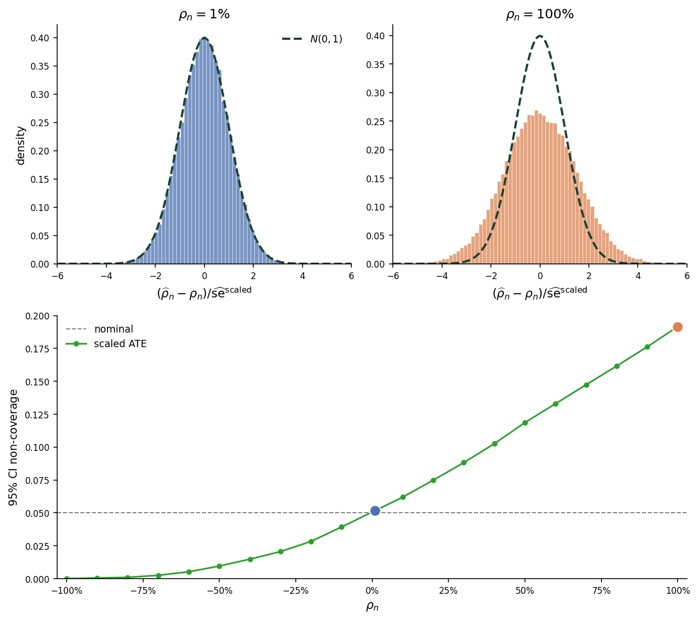
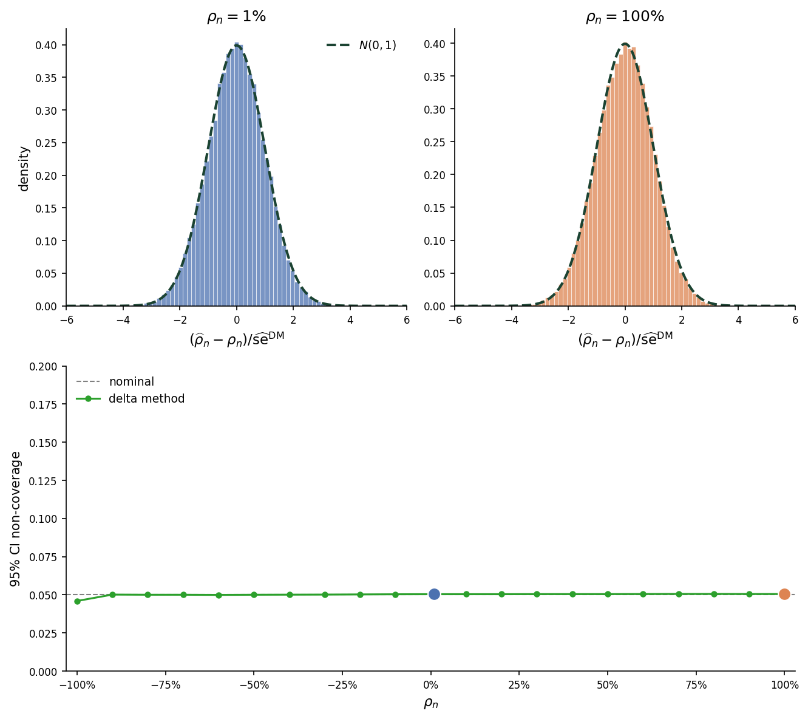
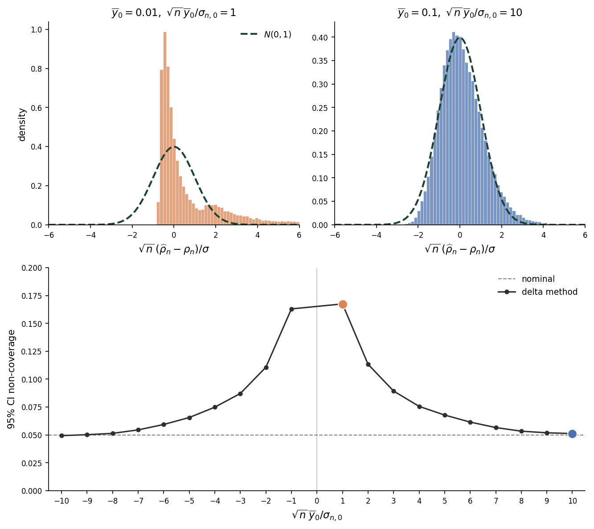
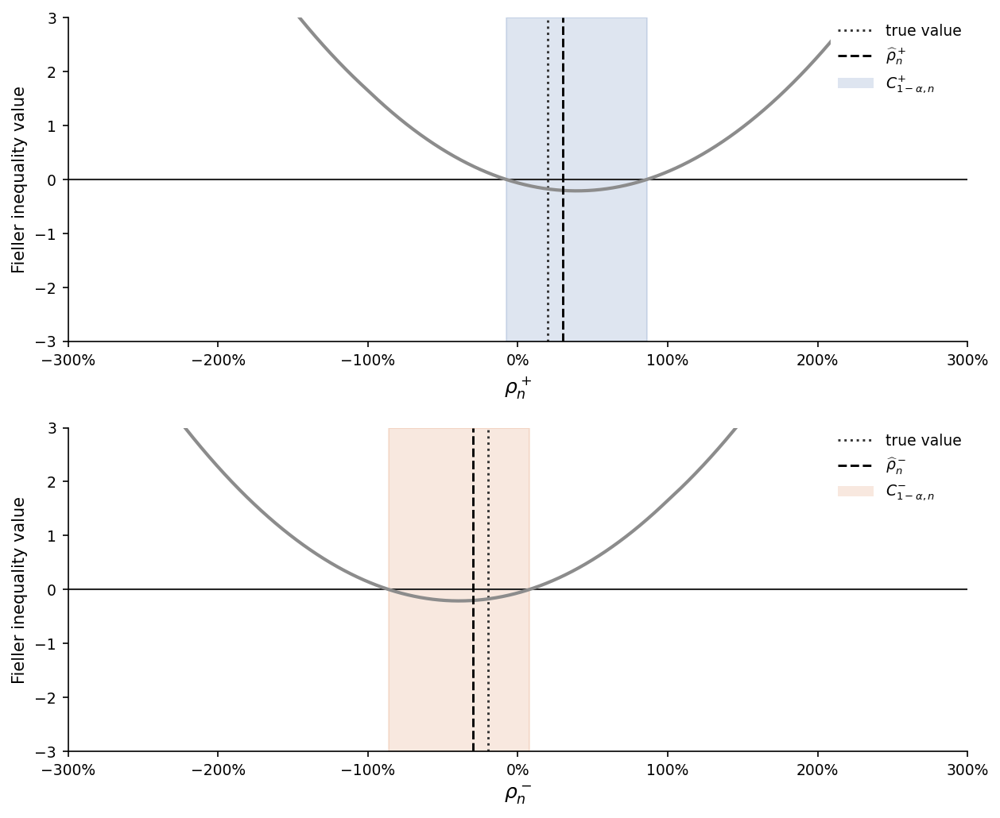
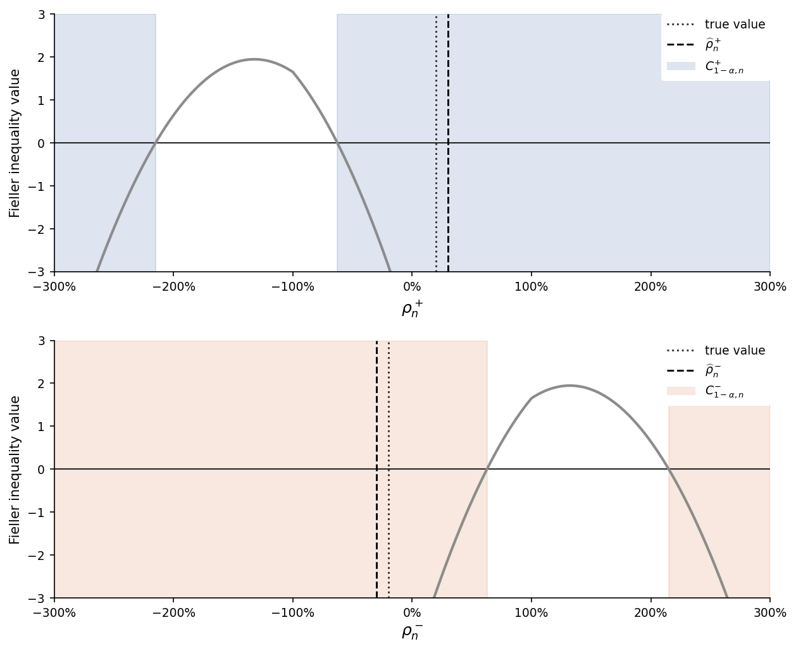

Average treatment effects (ATEs) are often reported relative to a baseline mean. This note studies robust statistical inference for that ratio. We first show why scaling the confidence interval for the ATE or applying the delta method can yield confidence intervals with unreliable coverage. We then construct uniformly-valid confidence intervals by combining Fieller's method with sign tests. We also show how to adapt the construction when effects are reported relative to a full-population baseline. ^[I thank Sergey Gitlin for proposing many of the ideas developed here.]

# Relative treatment effect

We continue working with the fixed potential outcomes model introduced in the [treatment group means note](../treatment-group-means/).
In this note, we restrict the parameter space $\Theta$ so that $\overline{y}_{0,n} \neq 0$ for all $n$.
Let
$$
\psi_n^{\mathrm{ATE}} = \overline{y}_{1,n} - \overline{y}_{0,n}
$$
denote the average treatment effect (ATE) and define the **relative treatment effect** (or **treatment effect lift**) as
$$
\rho_n = \frac{\psi_n^{\mathrm{ATE}}}{|\overline{y}_{0,n}|} = \frac{\overline{y}_{1,n} - \overline{y}_{0,n}}{|\overline{y}_{0,n}|}.
$$ {#eq-percentage-lift}

The absolute value in the denominator ensures $\rho_n$ and $\psi_n^{\mathrm{ATE}}$ share the same sign.
Our goal in this note is to construct a uniformly asymptotically valid confidence set for $\rho_n$.

## Scaled ATE confidence interval

A simple but naive confidence interval for $\rho_n$ can be obtained by scaling the confidence interval for the ATE by $1/|\widehat{y}_{0,n}|$.
This approach yields the interval

$$
C_{1-\alpha,n}^{\mathrm{scaled}}
=
\left[
\widehat{\rho}_n - z_{1-\alpha/2}\widehat{\mathrm{se}}^{\,\mathrm{scaled}}_n,
\widehat{\rho}_n + z_{1-\alpha/2}\widehat{\mathrm{se}}^{\,\mathrm{scaled}}_n
\right]
$$ {#eq-scaled-ate-interval}
where

$$
\begin{gathered}
\widehat{\rho}_n = \frac{\widehat{y}_{1,n} - \widehat{y}_{0,n}}{|\widehat{y}_{0,n}|},
\qquad
\widehat{\mathrm{se}}^{\,\mathrm{scaled}}_n
=
\frac{\widehat{\sigma}_n^{\mathrm{ATE}}}{\sqrt{n}\,|\widehat{y}_{0,n}|},\\[1ex]
\widehat{\sigma}_n^{\mathrm{ATE}} = \widehat{\sigma}_{0,n}+\widehat{\sigma}_{1,n}, \qquad
\widehat{\sigma}_{0,n}^2 = \frac{\overline{D}_n\,\widehat{S}_{0,n}^2}{1-\overline{D}_n}, \qquad \widehat{\sigma}_{1,n}^2 = \frac{(1-\overline{D}_n)\,\widehat{S}_{1,n}^2}{\overline{D}_n}.
\end{gathered}
$$

The problem with this interval is that it effectively ignores sampling variability in the denominator.
As a consequence, its asymptotic coverage need not equal its nominal level.

@fig-scaled-ate-noncoverage illustrates this behavior.
We simulated $10{,}000$ draws from a $N(0,1)$ distribution and normalized them to have exactly zero mean and unit variance.
We then set the potential outcomes for each unit according to
$$
\begin{aligned}
y_{i,0} &= 1 + \epsilon_i, \\[1ex]
y_{i,1} &= 1 + \rho_n + \epsilon_i,
\end{aligned}
$$ {#eq-scaled-ate-dgp}
where $\epsilon_i$ is the normalized draw for unit $i$.
The top two panels plot the sampling distribution of
$$
\frac{\widehat{\rho}_n - \rho_n}
{\widehat{\mathrm{se}}^{\,\mathrm{scaled}}_n}
$$
for $\rho_n=1\%$ and $\rho_n=100\%$.
The bottom panel plots the empirical non-coverage as a function of $\rho_n$, with the two lift values from the top panels marked in their corresponding histogram colors.

{#fig-scaled-ate-noncoverage}

At $\rho_n=1\%$, the studentized statistic is close to $N(0,1)$;
at $\rho_n=100\%$, however, it is visibly over-dispersed.
The bottom panel shows that non-coverage matches the nominal level only when $\rho_n=0$. For positive lifts, the interval is too narrow; for negative lifts, the interval is too wide.

## Delta method

To address the coverage problem illustrated in @fig-scaled-ate-noncoverage, we need to incorporate denominator uncertainty into inference.
One approach is to apply the [delta method](https://en.wikipedia.org/wiki/Delta_method).
Taking a first-order Taylor expansion of (-@eq-percentage-lift) around $(\overline{y}_{0,n}, \overline{y}_{1,n})$ and evaluating it at $(\widehat{y}_{0,n}, \widehat{y}_{1,n})$ gives

$$
\sqrt{n}\left(\widehat{\rho}_n - \rho_n\right) = 
\frac{1}{|\overline{y}_{0,n}|}
\sqrt n\left[
\left(\widehat{y}_{1,n}-\overline{y}_{1,n}\right)
-
\left(1+\operatorname{sgn}(\overline{y}_{0,n})\rho_n\right)
\left(\widehat{y}_{0,n}-\overline{y}_{0,n}\right)
\right] + R_n
$$ {#eq-lift-linearization}
where $R_n$ is the Taylor remainder.
This expansion yields the delta-method confidence interval
$$
C_{1-\alpha,n}^{\mathrm{DM}}
=
\left[
\widehat{\rho}_n - z_{1-\alpha/2}\widehat{\mathrm{se}}^{\,\mathrm{DM}}_n,
\widehat{\rho}_n + z_{1-\alpha/2}\widehat{\mathrm{se}}^{\,\mathrm{DM}}_n
\right]
$$ {#eq-delta-method-interval}
where
$$
\widehat{\mathrm{se}}^{\,\mathrm{DM}}_n
=
\frac{1}{\sqrt n\,|\widehat{y}_{0,n}|}
\left(
\left|1+\operatorname{sgn}(\widehat{y}_{0,n})\widehat{\rho}_n\right|\widehat{\sigma}_{0,n}
+
\widehat{\sigma}_{1,n}
\right).
$$

If we compare (-@eq-scaled-ate-interval) with (-@eq-delta-method-interval), we see that the delta-method standard error accounts for denominator uncertainty by replacing $\widehat{\sigma}_{0,n}$ with $\left|1+\operatorname{sgn}(\widehat{y}_{0,n})\widehat{\rho}_n\right|\widehat{\sigma}_{0,n}$.
This difference explains the pattern in @fig-scaled-ate-noncoverage: the intervals are similar near $\rho_n=0$, but diverge as the lift moves away from zero. Because the baseline in this simulation is positive, the scaled-ATE interval understates sampling variance for positive lifts and overstates it for negative lifts.

@fig-delta-studentized repeats the simulation in @fig-scaled-ate-noncoverage but with the delta-method standard error used in place of the scaled-ATE standard error.
The studentized statistic is close to $N(0,1)$ at both lift values, and coverage remains near the nominal level across all values of $\rho_n$.

{#fig-delta-studentized}

Although the delta method addresses the coverage problem in @fig-scaled-ate-noncoverage, the Taylor remainder introduced in (-@eq-lift-linearization) is not uniformly controlled across the parameter space.
As a result, coverage can still be poor along sequences in which the denominator approaches zero.

@fig-lift-skewness illustrates this behavior.
To generate the data for this figure, we set the potential outcomes for each unit according to 
$$
\begin{aligned}
y_{i, 0} &= \overline{y}_{0,n} + \epsilon_i, \\[1ex]
y_{i, 1} &= 1.1 \overline{y}_{0,n} + \epsilon_i
\end{aligned}
$$ {#eq-lift-dgp}
using the same $\epsilon_i$ draws as before.
The top two panels in the figure again plot the sampling distribution of the standardized statistic.
The left panel displays the distribution for $\overline{y}_{0,n} = 0.01$, while the right panel displays the distribution for $\overline{y}_{0,n} = 0.1$.
The bottom panel plots the empirical non-coverage of the delta-method confidence interval against the number of standard errors $\sqrt{n}\,\overline{y}_{0,n}/\sigma_{0,n}$ separating the baseline from zero.

{#fig-lift-skewness}

At $\overline{y}_{0,n}=0.01$, the delta-method non-coverage is well above the nominal level, while at $\overline{y}_{0,n}=0.1$, the standardized statistic is close to $N(0,1)$ and non-coverage is near nominal.
The bottom panel shows that the delta method achieves nominal coverage only when the baseline mean is more than 10 standard errors from zero.

# Fieller's method

To address the problem in @fig-lift-skewness, we need a coverage property that holds uniformly over the parameter space.
In the [treatment group means note](../treatment-group-means/), we showed how to construct uniformly valid confidence sets for linear combinations of means.
We now use that result to construct a uniformly valid confidence interval for $\rho_n$.

## Splitting by the control mean sign

To remove the absolute value from the denominator of $\rho_n$, define
$$
\rho_n^+ = \frac{\psi_n^{\mathrm{ATE}}}{\overline{y}_{0,n}},
\qquad
\rho_n^- = -\frac{\psi_n^{\mathrm{ATE}}}{\overline{y}_{0,n}}.
$$
We construct confidence sets for $\rho_n^+$ and $\rho_n^-$ using [Fieller's method](https://en.wikipedia.org/wiki/Fieller%27s_theorem).
Define $\psi_n^+$ and $\psi_n^-$ by
$$
\psi_n^+ = (1+\rho_n^+)\,\overline{y}_{0,n} - \overline{y}_{1,n},
\qquad
\psi_n^- = \overline{y}_{1,n} - (1-\rho_n^-)\,\overline{y}_{0,n},
$$
with sample analogues $\widehat{\psi}_n^+$ and $\widehat{\psi}_n^-$.
Because $\psi_n^+$ and $\psi_n^-$ are linear combinations of the treatment-group means, we can apply the results from the treatment group means note after verifying the regularity conditions for the target-specific coefficient vector
$$
\mathbf a_n^s
=
(\rho_n^s+m^s,-m^s)',
$$
where $s\in\{+,-\}$, $m^+=1$, and $m^-=-1$.
Let
$$
\gamma_n
=
\frac{n^{-1}\sum_{i=1}^n u_{i,0,n}u_{i,1,n}}
{S_{0,n}S_{1,n}},
$$
denote the correlation between the control and treatment potential-outcome sequences.
A sufficient condition for Assumption 3(ii) is that Assumption 3(i) holds and
$$
\liminf_{n\to\infty}\inf_{\theta\in\Theta}
\left[
\operatorname{sgn}\left(
\frac{\overline y_{1,n}}{\overline y_{0,n}}
\right)\gamma_n
\right]
> -1.
$$ {#eq-sign-specific-correlation-condition}
When the two potential-outcome means have the same sign, (-@eq-sign-specific-correlation-condition) reduces to the ATE condition that $\gamma_n$ remain uniformly bounded away from $-1$.
When the means have opposite signs, it instead requires $\gamma_n$ to remain uniformly bounded away from $1$.

Fix $\alpha\in(0,1)$, and let $C^s_{1-\alpha,n}$ denote the confidence set for $\psi_n^s$ defined in the treatment group means note.
Under Assumption 3(i) and (-@eq-sign-specific-correlation-condition), we have
$$
\liminf_{n\to \infty}
\inf_{\theta \in \Theta}
\mathbb{P}_\theta
\left(\psi_n^s \in C_{1-\alpha,n}^s\right)
\geq 1-\alpha.
$$ {#eq-sign-specific-linear-combination-coverage}

By construction,
$$
\left\{\psi_n^s \in C_{1-\alpha,n}^s\right\}
\iff
\left\{\left|\frac{\widehat{\psi}_n^s - \psi_n^s}{\sqrt{(\widehat{\sigma}_n^{s}(\theta))^2/n}}\right| \leq z_{1-\alpha/2}\right\},
$$
where
$$
(\widehat{\sigma}_n^{s}(\theta))^2
=
\left(\left|1+m^s\rho_n^s\right|\,\widehat{\sigma}_{0,n} + \widehat{\sigma}_{1,n}\right)^2.
$$
For any candidate value $r$, the sample analogue is
$$
\widehat{\psi}_n^s(r)
=
\widehat{y}_{0,n}\,r - m^s\widehat{\psi}_n^{\mathrm{ATE}}.
$$
At the true value of $\rho_n^s$, we also have
$$\psi_n^s = 0.$$
We can therefore write
$$
\left\{\left|
\frac{\widehat{\psi}_n^s - \psi_n^s}
{\sqrt{(\widehat{\sigma}_n^{s}(\theta))^2/n}}
\right| \leq z_{1-\alpha/2}\right\}
\iff
\left\{\left|
\frac{\widehat{y}_{0,n}\,\rho_n^s - m^s\widehat{\psi}_n^{\mathrm{ATE}}}
{\left(\left|1+m^s\rho_n^s\right|\,\widehat{\sigma}_{0,n} + \widehat{\sigma}_{1,n}\right)/\sqrt n}
\right| \leq z_{1-\alpha/2}\right\}.
$$ {#eq-fieller-inversion}

Inverting the right-hand side, we obtain the confidence set
$$
\begin{aligned}
C_{1-\alpha,n}^{s}
= \Bigg\{r :{}&
\left(\widehat{y}_{0,n}^2 - \frac{z_{1-\alpha/2}^2}{n}\,\widehat{\sigma}_{0,n}^2\right)r^2 \\
&\quad - 2m^s\left(\widehat{y}_{0,n}\,\widehat{\psi}_n^{\mathrm{ATE}} + \frac{z_{1-\alpha/2}^2}{n}\,\widehat{\sigma}_{0,n}^2\right)r
- \frac{2z_{1-\alpha/2}^2}{n}\,\widehat{\sigma}_{0,n}\,\widehat{\sigma}_{1,n}\left(\left|1+m^sr\right| - 1\right) \\
&\quad + (\widehat{\psi}_n^{\mathrm{ATE}})^2 - \frac{z_{1-\alpha/2}^2}{n}\,(\widehat{\sigma}_n^{\mathrm{ATE}})^2 \leq 0\Bigg\}.
\end{aligned}
$$ {#eq-fieller-sets}

The coverage property in (-@eq-sign-specific-linear-combination-coverage) and the equivalence in (-@eq-fieller-inversion) imply
$$
\liminf_{n \to \infty} \inf_{\theta \in \Theta} \mathbb{P}_\theta(\rho_n^s \in C_{1-\alpha,n}^{s}) \geq 1-\alpha
$$ {#eq-sign-specific-fieller-coverage}

The expression on the left-hand side of the inequality in (-@eq-fieller-sets) is piecewise quadratic. Each piece has leading coefficient

$$
\widehat{y}_{0,n}^2 - \frac{z_{1-\alpha/2}^2}{n}\,\widehat{\sigma}_{0,n}^2.
$$

If this coefficient is positive, the sign-specific confidence set is a bounded interval; otherwise, it contains values that are arbitrarily large in magnitude.
Equivalently, the confidence sets are bounded intervals if and only if
$$
\frac{|\widehat{y}_{0,n}|}{\widehat{\sigma}_{0,n} / \sqrt{n}} > z_{1-\alpha/2}.
$$ {#eq-baseline-significance-condition}
The expression in (-@eq-baseline-significance-condition) is exactly the condition for rejecting the null hypothesis that the control mean is zero at level $\alpha$.
Thus, if we cannot bound the control mean away from zero at level $\alpha$, we also do not obtain a bounded confidence set for $\rho_n^s$ at this level.

Evaluating the inequalities in (-@eq-fieller-sets) at $r=0$ also shows that $0 \notin C_{1-\alpha,n}^{s}$ if and only if
$$
(\widehat{\psi}_n^{\mathrm{ATE}})^2 - \frac{z_{1-\alpha/2}^2}{n}\,(\widehat{\sigma}_n^{\mathrm{ATE}})^2 > 0,
$$
or equivalently,
$$
\frac{|\widehat{\psi}_n^{\mathrm{ATE}}|}{\widehat{\sigma}_n^{\mathrm{ATE}} / \sqrt n} > z_{1-\alpha/2}.
$$
Thus the sign-specific confidence set excludes zero exactly when the usual two-sided ATE test rejects $\psi_n^\mathrm{ATE} = 0$ at level $\alpha$.

Finally, note that the numerators on the right-hand side of (-@eq-fieller-inversion) equal zero at $\rho_n^s = \widehat{\rho}_n^s$, where
$$
\widehat{\rho}_n^+
=
\frac{\widehat{\psi}_n^{\mathrm{ATE}}}{\widehat{y}_{0,n}},
\qquad
\widehat{\rho}_n^-
=
-\frac{\widehat{\psi}_n^{\mathrm{ATE}}}{\widehat{y}_{0,n}}.
$$
As a consequence, these sign-specific point estimates always lie in their respective confidence sets.
However, they need not be the midpoints of their confidence sets.

@fig-fieller-confidence-set-bounded and @fig-fieller-confidence-set-unbounded illustrate the confidence sets in (-@eq-fieller-sets).
In each panel, the shaded region marks the values of $\rho_n^s$ for which the corresponding Fieller inequality value in (-@eq-fieller-sets) is below zero.

@fig-fieller-confidence-set-bounded displays the bounded case. The value of the Fieller inequality is positive in both tails, so each sign-specific confidence set is an interval around the corresponding point estimate. Note that the point estimate is not the midpoint of the interval.

{#fig-fieller-confidence-set-bounded}

@fig-fieller-confidence-set-unbounded displays the unbounded case. The value of the Fieller inequality is negative in the tails, so the confidence set contains arbitrarily large positive or negative lifts.

{#fig-fieller-confidence-set-unbounded}

### Comparison with delta method

It is useful to compare the sign-specific confidence sets with the delta-method confidence interval in (-@eq-delta-method-interval).
The sign-specific confidence set in (-@eq-fieller-sets) can be written as

$$
C_{1-\alpha,n}^{s}
=
\left\{
r:
\left|
r
-
\widehat{\rho}_n^s
\right|
\leq
\frac{z_{1-\alpha/2}}{\sqrt n\,|\widehat{y}_{0,n}|}
\left(
\left|1+m^sr\right|\widehat{\sigma}_{0,n}
+
\widehat{\sigma}_{1,n}
\right)
\right\}
$$ {#eq-fieller-sign-specific-form}

while the delta-method confidence interval can be written as

$$
C_{1-\alpha,n}^{\mathrm{DM}}
=
\left\{
r:
\left|
r
-
\widehat{\rho}_n
\right|
\leq
\frac{z_{1-\alpha/2}}{\sqrt n\,|\widehat{y}_{0,n}|}
\left(
\left|1+\operatorname{sgn}(\widehat{y}_{0,n})\widehat{\rho}_n\right|\widehat{\sigma}_{0,n}
+
\widehat{\sigma}_{1,n}
\right)
\right\}.
$$ {#eq-delta-method-form}

Suppose $m^s = \operatorname{sgn}(\widehat{y}_{0,n})$.
Then $\widehat{\rho}_n^s=\widehat{\rho}_n$, so the only difference between $C_{1-\alpha,n}^{s}$ and $C_{1-\alpha,n}^{\mathrm{DM}}$ is that the right-hand side of (-@eq-fieller-sign-specific-form) substitutes the candidate value $r$ for the point estimate $\widehat{\rho}_n$.
Now let $T_{0,n}$ be the test statistic for whether the baseline mean is zero:
$$
T_{0,n}
=
\frac{\sqrt n\,\widehat{y}_{0,n}}{\widehat{\sigma}_{0,n}}
$$ {#eq-baseline-statistic}
In the [Appendix](#sec-fieller-delta-equivalence), we show that whenever $|T_{0,n}|>z_{1-\alpha/2}$,
$$
\frac{\lambda\left(C_{1-\alpha,n}^{s}\triangle C_{1-\alpha,n}^{\mathrm{DM}}\right)}
{\lambda\left(C_{1-\alpha,n}^{\mathrm{DM}}\right)}
\leq
\frac{2\left|T_{0,n}\right|/z_{1-\alpha/2}}
{\left(\left|T_{0,n}\right|/z_{1-\alpha/2}\right)^2-1}
$$
where $\lambda$ denotes Lebesgue measure. Therefore, when $|T_{0,n}|$ is large, the right-hand side is close to zero and the two sets are approximately equal.

## Confidence interval for $\rho_n$

### Known baseline sign

We now use the sign-specific confidence sets to construct a confidence interval for $\rho_n$.
First suppose the sign of $\overline{y}_{0,n}$ is known to be $s\in\{+,-\}$.
For example, many outcomes are known to take only nonnegative values.
Then $\rho_n=\rho_n^s$,
so the sign-specific confidence set $C_{1-\alpha,n}^{s}$ is asymptotically valid for $\rho_n$ by (-@eq-sign-specific-fieller-coverage).
However, as illustrated in @fig-fieller-confidence-set-unbounded, this set may not be an interval when the denominator is not statistically distinguishable from zero.
To construct a connected set, we choose $\alpha^{\mathrm{Fieller}},\alpha^{\mathrm{ATE}}>0$ with $\alpha^{\mathrm{Fieller}}+\alpha^{\mathrm{ATE}}=\alpha$ and $\alpha^{\mathrm{ATE}}\leq\alpha^{\mathrm{Fieller}}$.
Let $C_{1-\alpha^{\mathrm{Fieller}},n}^{s}$ denote the corresponding sign-specific confidence set and define the ATE sign statistic

$$
T_n^{\mathrm{ATE}}
=
\frac{\sqrt n\,\widehat{\psi}_n^{\mathrm{ATE}}}{\widehat{\sigma}_n^{\mathrm{ATE}}}.
$$

Consider the confidence interval

$$
I_{1-\alpha,n}^{s}
=
\begin{cases}
C_{1-\alpha^{\mathrm{Fieller}},n}^{s},
& |T_{0,n}|>z_{1-\alpha^{\mathrm{Fieller}}/2}, \\[3ex]
C_{1-\alpha^{\mathrm{Fieller}},n}^{s}\cap[0,\infty),
& |T_{0,n}|\leq z_{1-\alpha^{\mathrm{Fieller}}/2},
\quad T_n^{\mathrm{ATE}}>z_{1-\alpha^{\mathrm{ATE}}/2}, \\[3ex]
C_{1-\alpha^{\mathrm{Fieller}},n}^{s}\cap(-\infty,0],
& |T_{0,n}|\leq z_{1-\alpha^{\mathrm{Fieller}}/2},
\quad T_n^{\mathrm{ATE}}<-z_{1-\alpha^{\mathrm{ATE}}/2}, \\[3ex]
\mathbb{R},
& |T_{0,n}|\leq z_{1-\alpha^{\mathrm{Fieller}}/2},
\quad |T_n^{\mathrm{ATE}}|\leq z_{1-\alpha^{\mathrm{ATE}}/2}.
\end{cases}
$$ {#eq-sign-specific-interval}

When the denominator is statistically distinguishable from zero, the sign-specific confidence set is a bounded interval and we use it directly.
When the denominator is not statistically distinguishable from zero, we use an ATE sign test.
If the ATE is significantly positive, we truncate the sign-specific confidence set to nonnegative values; if it is significantly negative, we truncate it to nonpositive values.
If the ATE sign test is inconclusive, we return the real line.
The condition $\alpha^{\mathrm{ATE}}\leq\alpha^{\mathrm{Fieller}}$ ensures that, when truncation occurs, the resulting set is a ray rather than two disjoint pieces.

To see why $I_{1-\alpha,n}^{s}$ is uniformly valid,
define the inclusion event
$$
E^{\mathrm{Fieller},s}
=
\left\{
\rho_n^s\in C_{1-\alpha^{\mathrm{Fieller}},n}^{s}
\right\}
$$
First suppose $\psi_n^{\mathrm{ATE}}>0$.
Then $\rho_n>0$, so on $E^{\mathrm{Fieller},s}$ the interval can fail to contain $\rho_n$ only if the ATE sign test incorrectly selects the negative sign.
Thus
$$
\mathbb{P}_\theta\{\rho_n \notin I_{1-\alpha,n}^{s}\}
\leq
\mathbb{P}_\theta\{(E^{\mathrm{Fieller},s})^c\}
+
\mathbb{P}_\theta\left\{T_n^{\mathrm{ATE}}<-z_{1-\alpha^{\mathrm{ATE}}/2}\right\}.
$$
Since $\psi_n^{\mathrm{ATE}}>0$,
$$
\left\{T_n^{\mathrm{ATE}}<-z_{1-\alpha^{\mathrm{ATE}}/2}\right\}
\subseteq
\left\{
\sqrt n\frac{\widehat{\psi}_n^{\mathrm{ATE}}-\psi_n^{\mathrm{ATE}}}{\widehat{\sigma}_n^{\mathrm{ATE}}}
<-z_{1-\alpha^{\mathrm{ATE}}/2}
\right\}.
$$
If $\psi_n^{\mathrm{ATE}}<0$, the same argument gives the analogous bound with the event $\{T_n^{\mathrm{ATE}}>z_{1-\alpha^{\mathrm{ATE}}/2}\}$.
If $\psi_n^{\mathrm{ATE}}=0$, then $\rho_n=0$, and any truncation contains the true value whenever $E^{\mathrm{Fieller},s}$ holds.
Therefore, in all cases,
$$
\begin{aligned}
\mathbb{P}_\theta\{\rho_n \notin I_{1-\alpha,n}^{s}\}
&\leq
\mathbb{P}_\theta\{(E^{\mathrm{Fieller},s})^c\}
+
\mathbb{P}_\theta\left\{
\left|
\sqrt n\frac{\widehat{\psi}_n^{\mathrm{ATE}}-\psi_n^{\mathrm{ATE}}}{\widehat{\sigma}_n^{\mathrm{ATE}}}
\right|
>z_{1-\alpha^{\mathrm{ATE}}/2}
\right\} \\
&=
\mathbb{P}_\theta\{\rho_n^s \notin C_{1-\alpha^{\mathrm{Fieller}},n}^{s}\}
+
\mathbb{P}_\theta\left\{
\psi_n^{\mathrm{ATE}} \notin C_{1-\alpha^{\mathrm{ATE}},n}^{\mathrm{ATE}}
\right\} \\
\end{aligned}
$$
where $C_{1-\alpha^{\mathrm{ATE}},n}^{\mathrm{ATE}}$ is the usual ATE confidence interval.
The coverage property in (-@eq-sign-specific-fieller-coverage) and the asymptotic validity of the ATE confidence interval then give
$$
\begin{aligned}
\liminf_{n\to\infty}\inf_{\theta \in \Theta}\mathbb{P}_\theta\{\rho_n \in I_{1-\alpha,n}^{s}\}
&\geq
1 - \alpha^{\mathrm{Fieller}} - \alpha^{\mathrm{ATE}} \\[1ex]
&= 1 - \alpha.
\end{aligned}
$$

Therefore $\{I_{1-\alpha,n}^s\}_{n \geq 1}$ is asymptotically valid for $\{\rho_n\}_{n \geq 1}$ over $\Theta$.

### Unknown baseline sign

When the sign of $\overline{y}_{0,n}$ is unknown, we can use the denominator statistic $T_{0,n}$ in (-@eq-baseline-statistic) to determine which sign-specific set to use.
Choose $\alpha^{\mathrm{Fieller}},\alpha_0>0$ with $\alpha^{\mathrm{Fieller}}+\alpha_0=\alpha$ and $\alpha_0\leq\alpha^{\mathrm{Fieller}}$.
Define the confidence interval for $\rho_n$ as

$$
I_{1-\alpha,n}
=
\begin{cases}
C_{1-\alpha^{\mathrm{Fieller}},n}^{+},
& T_{0,n}>z_{1-\alpha_0/2}, \\[1ex]
C_{1-\alpha^{\mathrm{Fieller}},n}^{-},
& T_{0,n}<-z_{1-\alpha_0/2}, \\[1ex]
\mathbb{R},
& |T_{0,n}|\leq z_{1-\alpha_0/2}.
\end{cases}
$$ {#eq-final-confidence-set}

If $T_{0,n}$ is significantly positive in the upper tail at level $\alpha_0 / 2$, $I_{1-\alpha,n}$ uses the positive-denominator set; if it is significantly negative, $I_{1-\alpha,n}$ uses the negative-denominator set.
If the sign test is inconclusive, $I_{1-\alpha,n}$ returns the real line.
Because $\alpha_0\leq\alpha^{\mathrm{Fieller}}$, rejection of the denominator sign test implies the selected sign-specific confidence set is a bounded interval.

To prove $I_{1-\alpha,n}$ is uniformly asymptotically valid, partition the sample space according to the three possible outcomes of the sign test:

$$
E_0^s
=
\left\{
 m^s T_{0,n} > z_{1-\alpha_0/2}
\right\},
\qquad
E_0^0
=
\left\{
\left|T_{0,n}\right|\leq z_{1-\alpha_0/2}
\right\}.
$$

First suppose $\overline{y}_{0,n}>0$.
If $E_0^+\cap E^{\mathrm{Fieller},+}$ occurs, then $I_{1-\alpha,n}=C_{1-\alpha^{\mathrm{Fieller}},n}^{+}$ and $\rho_n=\rho_n^+$, so $\rho_n\in I_{1-\alpha,n}$.
If $E_0^0$ occurs, then $I_{1-\alpha,n}=\mathbb{R}$, so $\rho_n\in I_{1-\alpha,n}$ automatically.
Therefore

$$
\begin{aligned}
\mathbb{P}_\theta\left(\rho_n\in I_{1-\alpha,n}\right)
&\geq
\mathbb{P}_\theta\left((E_0^+\cap E^{\mathrm{Fieller},+})\cup E_0^0\right) \\[1ex]
&=
\mathbb{P}_\theta\left((E_0^-)^c \cap (E_0^0\cup E^{\mathrm{Fieller},+})\right) \\[1ex]
&=
1-\mathbb{P}_\theta\left(E_0^-\cup ((E_0^0)^c\cap (E^{\mathrm{Fieller},+})^c)\right) \\[1ex]
&\geq
1-\mathbb{P}_\theta(E_0^-)-\mathbb{P}_\theta((E^{\mathrm{Fieller},+})^c).
\end{aligned}
$$ {#eq-coverage-lower-bound}

Since $\overline{y}_{0,n}>0$,

$$
\begin{aligned}
E_0^-
&=
\left\{
T_{0,n}<-z_{1-\alpha_0/2}
\right\} \\
&\subseteq
\left\{
\sqrt n
\frac{\widehat{y}_{0,n}-\overline{y}_{0,n}}
{\widehat{\sigma}_{0,n}}
<-z_{1-\alpha_0/2}
\right\} \\
&\subseteq
\left\{
\left|
\sqrt n
\frac{\widehat{y}_{0,n}-\overline{y}_{0,n}}
{\widehat{\sigma}_{0,n}}
\right|
> z_{1-\alpha_0/2}
\right\} \\
&= \left\{
\overline{y}_{0,n} \notin C_{1-\alpha_0,n}^{0}
\right\}
\end{aligned}
$$ {#eq-baseline-minus-inclusion}
where $C_{1-\alpha_0,n}^{0}$ is the $(1-\alpha_0)$ confidence set for $\overline{y}_{0,n}$.
Combining the inclusion in (-@eq-baseline-minus-inclusion) with the bound in (-@eq-coverage-lower-bound) gives

$$
\mathbb{P}_\theta\left(
\rho_n\notin I_{1-\alpha,n}
\right)
\leq
\mathbb{P}_\theta\left(
\overline{y}_{0,n} \notin C_{1-\alpha_0,n}^{0}
\right)
+
\mathbb{P}_\theta(\rho_n^+ \notin C_{1-\alpha^{\mathrm{Fieller}},n}^{+}).
$$

The same argument with signs reversed shows that, if $\overline{y}_{0,n}<0$,

$$
\mathbb{P}_\theta\left(
\rho_n\notin I_{1-\alpha,n}
\right)
\leq
\mathbb{P}_\theta\left(
\overline{y}_{0,n} \notin C_{1-\alpha_0,n}^{0}
\right)
+
\mathbb{P}_\theta(\rho_n^- \notin C_{1-\alpha^{\mathrm{Fieller}},n}^{-}).
$$

Therefore, for every $n$ and $\theta\in\Theta$,

$$
\begin{aligned}
&\mathbb{P}_\theta\left(
\rho_n\notin I_{1-\alpha,n}
\right) \\
&\qquad\leq
\mathbb{P}_\theta\left(
\overline{y}_{0,n} \notin C_{1-\alpha_0,n}^{0}
\right)
+
\max \left\{\mathbb{P}_\theta(\rho_n^{+} \notin C_{1-\alpha^{\mathrm{Fieller}},n}^{+}), \mathbb{P}_\theta(\rho_n^{-} \notin C_{1-\alpha^{\mathrm{Fieller}},n}^{-})\right\}.
\end{aligned}
$$

Taking the supremum over $\theta\in\Theta$ gives

$$
\begin{aligned}
&\sup_{\theta\in\Theta}
\mathbb{P}_\theta\left(
\rho_n\notin I_{1-\alpha,n}
\right) \\
&\qquad\leq
\sup_{\theta\in\Theta}
\mathbb{P}_\theta\left(
\overline{y}_{0,n} \notin C_{1-\alpha_0,n}^{0}
\right)
+
\max \left\{\sup_{\theta\in\Theta}\mathbb{P}_\theta(\rho_n^{+} \notin C_{1-\alpha^{\mathrm{Fieller}},n}^{+}), \sup_{\theta\in\Theta}\mathbb{P}_\theta(\rho_n^{-} \notin C_{1-\alpha^{\mathrm{Fieller}},n}^{-})\right\}.
\end{aligned}
$$

The first term is controlled by the asymptotic validity of the control-group mean confidence set.
The second term is controlled by the asymptotic validity of the sign-specific confidence sets.
Thus

$$
\limsup_{n\to\infty}
\sup_{\theta\in\Theta}
\mathbb{P}_\theta\left(
\rho_n\notin I_{1-\alpha,n}
\right)
\leq
\alpha^{\mathrm{Fieller}}+\alpha_0
=
\alpha.
$$

Equivalently,

$$
\liminf_{n\to\infty}
\inf_{\theta\in\Theta}
\mathbb{P}_\theta\left(
\rho_n\in I_{1-\alpha,n}
\right)
\geq
1-\alpha.
$$

Therefore $\{I_{1-\alpha,n}\}_{n \geq 1}$ is asymptotically valid for $\{\rho_n\}_{n \geq 1}$ over $\Theta$.

### Illustration

@fig-uniform-noncoverage recreates the bottom panels of @fig-scaled-ate-noncoverage and @fig-lift-skewness, but reports non-coverage for the uniformly-valid confidence interval in (-@eq-final-confidence-set). In the top panel, the lift varies while the baseline is fixed at $\overline{y}_{0,n}=1$.
Like the delta-method interval, the uniformly-valid confidence interval maintains nominal coverage across the range of lifts.
In the bottom panel, the baseline varies while the lift is fixed at $\rho_n=10\%$.
This panel also reports non-coverage for the known-sign intervals $I_{1-\alpha,n}^{+}$ and $I_{1-\alpha,n}^{-}$.
Near zero, the uniformly-valid confidence intervals are conservative because the sign tests often return the real line.
Across the full range of baseline values, their non-coverage rate remains below the nominal level.

![Empirical non-coverage of the nominal $95\%$ uniformly-valid confidence interval in (-@eq-final-confidence-set), with $\alpha_0=0.001$ and $\alpha^{\mathrm{Fieller}}=0.049$, along with the known-positive and known-negative baseline intervals $I_{1-\alpha,n}^{+}$ and $I_{1-\alpha,n}^{-}$ from the known-baseline-sign construction. Top: as a function of the percentage lift $\rho_n$ at fixed baseline $\overline{y}_{0,n}=1$. Bottom: as a function of the number of standard errors $\sqrt{n}\,\overline{y}_{0,n}/\sigma_{0,n}$ separating the baseline from zero at fixed lift $\rho_n=10\%$.](lift_uniform_noncoverage.png){#fig-uniform-noncoverage}

# Full-population relative effects

The units in an experiment often represent only a subset of a larger population of interest.
For example, the experimental units may correspond to a set of users who qualified for a promotion, while the population of interest is all product users.
In such settings, cross-experiment comparisons are easier if treatment effects are reported relative to a full-population baseline rather than to a particular experiment's control group.

Let $N_n^{\mathrm{untreated}}$ denote the number of units outside the experiment, and let $\overline{y}_n^{\mathrm{untreated}}$ denote their mean outcome.
We assume outcomes for untreated units are unaffected by the experiment's randomization and are therefore held fixed.
For $d\in\{0,1\}$, the full-population mean under treatment state $d$ is given by

$$
\overline{y}^\mathrm{full}_{d,n} = \frac{n}{N_n^{\mathrm{untreated}} + n}\overline{y}_{d, n} + \frac{N_n^{\mathrm{untreated}}}{N_n^{\mathrm{untreated}} + n} \overline{y}^{\mathrm{untreated}}_n
$$

The full-population average treatment effect is defined as

$$
\psi_n^{\mathrm{full}} = \overline{y}^\mathrm{full}_{1,n} - \overline{y}^\mathrm{full}_{0,n} = \frac{n}{N_n^{\mathrm{untreated}} + n} \psi_n^{\mathrm{ATE}}
$$

and the **full-population relative effect** is given by

$$
\rho_n^{\mathrm{full}}
= \frac{\psi_n^{\mathrm{full}}}{|\overline{y}_{0,n}^{\mathrm{full}}|}
$$ {#eq-full-relative-effect-definition}

To construct a confidence set for $\rho_n^{\mathrm{full}}$, define

$$
q_n = \frac{N_n^{\mathrm{untreated}}}{n},
\qquad
B_n = \overline{y}_{0,n}+q_n\overline{y}_n^{\mathrm{untreated}},
\qquad
\widehat{B}_n = \widehat{y}_{0,n}+q_n\overline{y}_n^{\mathrm{untreated}}.
$$

Dividing the numerator and denominator in (-@eq-full-relative-effect-definition) by $n/(N_n^{\mathrm{untreated}}+n)$ gives
$$
\rho_n^{\mathrm{full}}=\frac{\psi_n^{\mathrm{ATE}}}{|B_n|}
$$ {#eq-full-relative-effect-shifted-denominator}
Since

$$
\sqrt n(\widehat{B}_n-B_n)=\sqrt n(\widehat{y}_{0,n}-\overline{y}_{0,n}),
$$

the standard-error term for the denominator in (-@eq-full-relative-effect-shifted-denominator) equals $\widehat{\sigma}_{0,n}/\sqrt n$.
Define the sign-specific targets

$$
\rho_n^{\mathrm{full},s}=m^s\frac{\psi_n^{\mathrm{ATE}}}{B_n}
$$

and the corresponding linear combinations

$$
\begin{aligned}
\psi_n^{\mathrm{full},s}
&=
\rho_n^{\mathrm{full},s}B_n-m^s\psi_n^{\mathrm{ATE}} \\[1ex]
&=
\left(m^s+\rho_n^{\mathrm{full},s}\right)\overline{y}_{0,n}
-m^s\overline{y}_{1,n}
+\rho_n^{\mathrm{full},s}q_n\overline{y}_n^{\mathrm{untreated}}.
\end{aligned}
$$

At the true value of $\rho_n^{\mathrm{full},s}$, we again have $\psi_n^{\mathrm{full},s}=0$.
For any candidate value $r$, the sample analogue simplifies to $\widehat{B}_n r-m^s\widehat{\psi}_n^{\mathrm{ATE}}$.
Define the sign-specific confidence set as

$$
C_{1-\alpha,n}^{\mathrm{full},s}
=
\left\{
r:
\left|\widehat{B}_n r-m^s\widehat{\psi}_n^{\mathrm{ATE}}\right|
\leq
\frac{z_{1-\alpha/2}}{\sqrt n}
\left(\left|1+m^sr\right|\widehat{\sigma}_{0,n}+\widehat{\sigma}_{1,n}\right)
\right\}.
$$ {#eq-full-fieller-sets}

Inverting this set, we obtain

$$
\begin{aligned}
C_{1-\alpha,n}^{\mathrm{full},s}
= \Bigg\{r :{}&
\left(\widehat{B}_n^2 - \frac{z_{1-\alpha/2}^2}{n}\,\widehat{\sigma}_{0,n}^2\right)r^2 \\
&\qquad - 2m^s\left(\widehat{B}_n\,\widehat{\psi}_n^{\mathrm{ATE}} + \frac{z_{1-\alpha/2}^2}{n}\,\widehat{\sigma}_{0,n}^2\right)r
- \frac{2z_{1-\alpha/2}^2}{n}\,\widehat{\sigma}_{0,n}\,\widehat{\sigma}_{1,n}\left(\left|1+m^sr\right| - 1\right) \\
&\qquad + (\widehat{\psi}_n^{\mathrm{ATE}})^2 - \frac{z_{1-\alpha/2}^2}{n}\,(\widehat{\sigma}_n^{\mathrm{ATE}})^2 \leq 0\Bigg\}.
\end{aligned}
$$ {#eq-full-fieller-sets-inverted}

These confidence sets have the same form as the confidence sets in (-@eq-fieller-sets), with $\widehat{B}_n$ replacing $\widehat{y}_{0,n}$.

As in the control-baseline case, the sign-specific confidence sets may fail to be intervals when the denominator is not statistically distinguishable from zero.
Define the full-population denominator statistic
$$
T_{0,n}^{\mathrm{full}}
=
\frac{\sqrt n\,\widehat{B}_n}{\widehat{\sigma}_{0,n}}.
$$
If $B_n$ is known to have sign $s$, we use the known-sign interval

$$
I_{1-\alpha,n}^{\mathrm{full},s}
=
\begin{cases}
C_{1-\alpha^{\mathrm{Fieller}},n}^{\mathrm{full},s},
& |T_{0,n}^{\mathrm{full}}|>z_{1-\alpha^{\mathrm{Fieller}}/2}, \\[3ex]
C_{1-\alpha^{\mathrm{Fieller}},n}^{\mathrm{full},s}\cap[0,\infty),
& |T_{0,n}^{\mathrm{full}}|\leq z_{1-\alpha^{\mathrm{Fieller}}/2},
\quad T_n^{\mathrm{ATE}}>z_{1-\alpha^{\mathrm{ATE}}/2}, \\[3ex]
C_{1-\alpha^{\mathrm{Fieller}},n}^{\mathrm{full},s}\cap(-\infty,0],
& |T_{0,n}^{\mathrm{full}}|\leq z_{1-\alpha^{\mathrm{Fieller}}/2},
\quad T_n^{\mathrm{ATE}}<-z_{1-\alpha^{\mathrm{ATE}}/2}, \\[3ex]
\mathbb{R},
& |T_{0,n}^{\mathrm{full}}|\leq z_{1-\alpha^{\mathrm{Fieller}}/2},
\quad |T_n^{\mathrm{ATE}}|\leq z_{1-\alpha^{\mathrm{ATE}}/2}.
\end{cases}
$$ {#eq-full-sign-specific-interval}

When the sign of $B_n$ is unknown, we use the statistic $T_{0,n}^{\mathrm{full}}$ to determine which sign-specific set to use:

$$
I_{1-\alpha,n}^{\mathrm{full}}
=
\begin{cases}
C_{1-\alpha^{\mathrm{Fieller}},n}^{\mathrm{full},+},
& T_{0,n}^{\mathrm{full}}>z_{1-\alpha_0/2}, \\[1ex]
C_{1-\alpha^{\mathrm{Fieller}},n}^{\mathrm{full},-},
& T_{0,n}^{\mathrm{full}}<-z_{1-\alpha_0/2}, \\[1ex]
\mathbb{R},
& |T_{0,n}^{\mathrm{full}}|\leq z_{1-\alpha_0/2}.
\end{cases}
$$ {#eq-full-final-confidence-set}

The proof of uniform validity is the same as the proof for (-@eq-final-confidence-set), with $\widehat{y}_{0,n}$ replaced by $\widehat{B}_n$.
The sign-pretest error is controlled because $\widehat{B}_n-B_n=\widehat{y}_{0,n}-\overline{y}_{0,n}$, and the sign-specific sets in (-@eq-full-fieller-sets) are valid confidence sets for $\psi_n^{\mathrm{full},s}$.
Thus, over parameter sequences with $B_n\neq0$,

$$
\liminf_{n\to\infty}
\inf_{\theta\in\Theta:\,B_n\neq0}
\mathbb{P}_\theta\left(
\rho_n^{\mathrm{full}}\in I_{1-\alpha,n}^{\mathrm{full}}
\right)
\geq
1-\alpha.
$$

# Appendix

## Comparison of the sign-specific and delta-method confidence sets{#sec-fieller-delta-equivalence}

We take $s$ such that $m^s = \operatorname{sgn}(\widehat{y}_{0,n})$ and compare the sign-specific confidence set in (-@eq-fieller-sign-specific-form) to the delta-method confidence interval in (-@eq-delta-method-form).
Define

$$
\begin{gathered}
T_{0,n}
=
\frac{\sqrt n\,\widehat{y}_{0,n}}{\widehat{\sigma}_{0,n}},
\qquad
b =
\frac{z_{1-\alpha/2}}{|T_{0,n}|}, \\
h =
\frac{z_{1-\alpha/2}}{\sqrt n\,|\widehat{y}_{0,n}|}
\left(
\left|1+m^s\widehat{\rho}_n\right|\widehat{\sigma}_{0,n}
+
\widehat{\sigma}_{1,n}
\right).
\end{gathered}
$$

Throughout this section, assume that $|T_{0,n}|> z_{1-\alpha/2}$, which implies $b < 1$.
Any value in the sign-specific confidence set satisfies

$$
\begin{aligned}
\left|r-\widehat{\rho}_n\right|
&\leq
\frac{z_{1-\alpha/2}}{\sqrt n\,|\widehat{y}_{0,n}|}
\left(
\left|1+m^sr\right|\widehat{\sigma}_{0,n}
+
\widehat{\sigma}_{1,n}
\right) \\
&\leq
h
+
b
\left|
\left|1+m^sr\right|
-
\left|1+m^s\widehat{\rho}_n\right|
\right| \\
&\leq h+b\left|r-\widehat{\rho}_n\right|.
\end{aligned}
$$

Therefore

$$
\left|r-\widehat{\rho}_n\right|\leq \frac{h}{1-b}.
$$

This gives the outer inclusion

$$
C_{1-\alpha,n}^{s}
\subseteq
\left\{
r: \left|r-\widehat{\rho}_n\right|\leq\frac{h}{1-b}
\right\}.
$$ {#eq-fieller-delta-outer-inclusion}

Conversely, the reverse triangle inequality gives
$$
\left|1+m^sr\right|
\geq
\left|1+m^s\widehat{\rho}_n\right|
- \left|r-\widehat{\rho}_n\right|.
$$
Therefore the right-hand side of the sign-specific confidence-set inequality is bounded below by

$$
\begin{aligned}
&\frac{z_{1-\alpha/2}}{\sqrt n\,|\widehat{y}_{0,n}|}
\left(
\left|1+m^sr\right|\widehat{\sigma}_{0,n}
+
\widehat{\sigma}_{1,n}
\right) \\
&\qquad\geq
\frac{z_{1-\alpha/2}}{\sqrt n\,|\widehat{y}_{0,n}|}
\left(
\left|1+m^s\widehat{\rho}_n\right|\widehat{\sigma}_{0,n}
-\left|r-\widehat{\rho}_n\right|\widehat{\sigma}_{0,n}
+
\widehat{\sigma}_{1,n}
\right) \\
&\qquad= h-b\left|r-\widehat{\rho}_n\right|.
\end{aligned}
$$

If $\left|r-\widehat{\rho}_n\right|\leq h/(1+b)$, then $\left|r-\widehat{\rho}_n\right|\leq h-b\left|r-\widehat{\rho}_n\right|$.
We therefore have

$$
\left\{
r: \left|r-\widehat{\rho}_n\right|\leq\frac{h}{1+b}
\right\}
\subseteq
C_{1-\alpha,n}^{s}.
$$ {#eq-fieller-delta-inner-inclusion}

Since the delta-method confidence interval can be written as $\{r: |r-\widehat{\rho}_n|\leq h\}$, (-@eq-fieller-delta-outer-inclusion) and (-@eq-fieller-delta-inner-inclusion) imply that the sign-specific confidence set is squeezed between a contraction and expansion of the delta-method confidence interval.
Therefore,

$$
\frac{\lambda\left(C_{1-\alpha,n}^{s}\triangle C_{1-\alpha,n}^{\mathrm{DM}}\right)}
{\lambda\left(C_{1-\alpha,n}^{\mathrm{DM}}\right)}
\leq
\frac{2b}{1-b^2}
=
\frac{2\left|T_{0,n}\right|/z_{1-\alpha/2}}
{\left(\left|T_{0,n}\right|/z_{1-\alpha/2}\right)^2-1}.
$$
