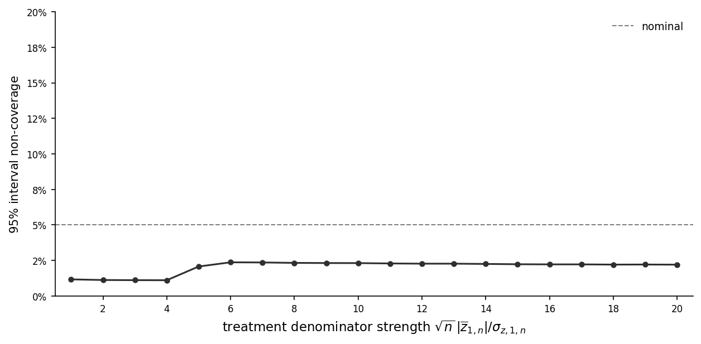
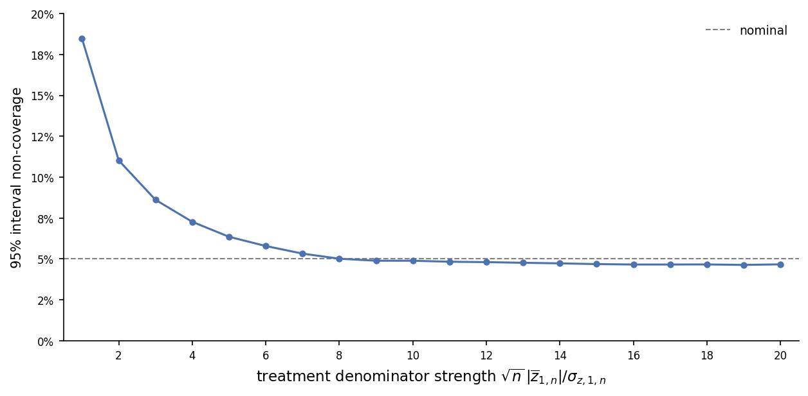
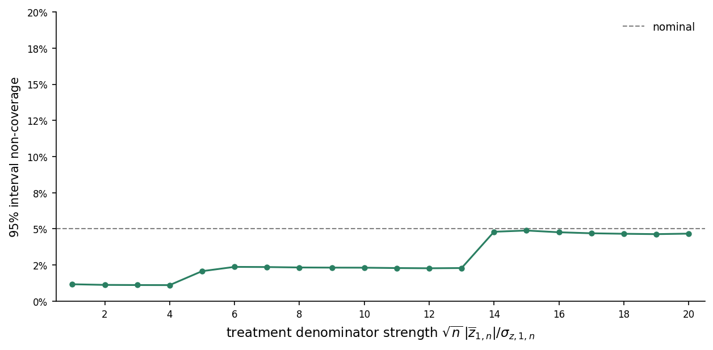

This note develops inference procedures for ratio metrics in randomized experiments.

# Model

To extend the [potential outcome model](../treatment-group-means/#model) to ratio metrics, suppose we observe two outcomes $Y_i$ and $Z_i$ for each unit $i$.
Let $y_{i,d}$ and $z_{i,d}$ denote unit $i$'s potential outcomes for $Y_i$ and $Z_i$ under treatment $d\in\{0,1\}$, respectively.
We replace Assumption 2 with the following multivariate analogue:

::: {.assumption #asm-sutva}
**Assumption 2'.** The observed outcomes are determined by

$$
Y_i = D_i y_{i,1} + (1-D_i)y_{i,0},
\qquad
Z_i = D_i z_{i,1} + (1-D_i)z_{i,0}.
$$ {#eq-ratio-observed-outcomes}
:::

Define the potential outcome means
$$
\overline y_{d,n}
=
\frac{1}{n}\sum_{i=1}^n y_{i,d},
\qquad
\overline z_{d,n}
=
\frac{1}{n}\sum_{i=1}^n z_{i,d},
\qquad
d\in\{0,1\},
$$
and collect the potential outcomes into the vectors
$$
\mathbf w_{i,d}
=
\begin{pmatrix}
y_{i,d} \\
z_{i,d}
\end{pmatrix},
\qquad
\overline{\mathbf w}_{d,n}
=
\begin{pmatrix}
\overline y_{d,n} \\
\overline z_{d,n}
\end{pmatrix},
\qquad
d\in\{0,1\}.
$$

Define the centered potential outcome vectors and covariance matrices by
$$
\mathbf u_{i,d,n}
=
\mathbf w_{i,d}-\overline{\mathbf w}_{d,n},
\qquad
\mathbf S_{dd,n}
=
\frac{1}{n}\sum_{i=1}^n
\mathbf u_{i,d,n}\mathbf u_{i,d,n}'.
$$ {#eq-ratio-arm-covariance}

Collect the model primitives into the parameter vector
$$
{\theta}
=
\left(
p,
\{\mathbf{w}_{i,0}\}_{i=1}^\infty,
\{\mathbf{w}_{i,1}\}_{i=1}^\infty
\right),
$$
and let $\Theta \subseteq (0,1)\times (\mathbb R^2)^\mathbb N\times (\mathbb R^2)^\mathbb N$ denote the set of parameters under consideration.
We replace Assumption 3 with the following multivariate regularity condition:

::: {.assumption #asm-nondegenerate}
**Assumption 3'.** There exists an index $N$ for which $\mathbf S_{dd,n}$ is positive definite for all $n\geq N$, $d\in\{0,1\}$, and $\theta\in\Theta$.
In addition, for each $d\in\{0,1\}$,

$$
\lim_{n\to\infty}
\sup_{\theta\in\Theta}
\max_{1\leq i\leq n}
\frac{
\mathbf u_{i,d,n}'\mathbf S_{dd,n}^{-1}\mathbf u_{i,d,n}
}{n}
=0.
$$
:::

Assumption 3' implies the coordinatewise no-dominant-unit condition in the treatment-group-means note.

# Ratio treatment effects

We assume that $\overline z_{d,n}\neq0$ for all $n$ and $d\in\{0,1\}$.
The **ratio treatment effect** $r_n$ is defined as
$$
r_n
=
\frac{\overline y_{1,n}}{\overline z_{1,n}}
-
\frac{\overline y_{0,n}}{\overline z_{0,n}}.
$$ {#eq-ratio-def}

We construct an asymptotically valid confidence interval for $r_n$ in three steps.
First, we use Fieller's method to obtain a difference interval that remains valid even when either denominator is statistically close to zero, although it can be conservative when both are well separated from zero.
Second, we derive a delta-method interval that is tighter when the denominators are sufficiently strong but can undercover when either denominator is weak.
Finally, we use a denominator-strength screen to select between the two intervals. The resulting hybrid interval is uniformly asymptotically valid: it defaults to the Fieller difference interval unless the screen certifies both denominators as strong, in which case it uses the tighter delta-method interval.

## Fieller difference confidence interval

### Arm-specific Fieller intervals

We first use Fieller's method to construct confidence intervals for the ratios in each treatment arm.
For $d\in\{0,1\}$, define
$$
r_{d,n}
=
\frac{\overline y_{d,n}}{\overline z_{d,n}}.
$$

For $r\in\mathbb R$, define
$$
v_{i,d}(r)
=
y_{i,d}-rz_{i,d},\qquad
\overline v_{d,n}(r)
=
\overline y_{d,n}-r\overline z_{d,n}.
$$ {#eq-candidate-projected-outcomes}

Denote the observed treatment-group means by
$$
\begin{aligned}
\overline Y_{d,n}
&=
\frac{1}{n\overline D_{d,n}}
\sum_{i=1}^nD_{i,d}Y_i, \\
\overline Z_{d,n}
&=
\frac{1}{n\overline D_{d,n}}
\sum_{i=1}^nD_{i,d}Z_i.
\end{aligned}
$$ {#eq-ratio-sample-means}

We use these to form the sample analogue of $\overline v_{d,n}(r)$:
$$
\widehat v_{d,n}(r)
=
\overline Y_{d,n}-r\overline Z_{d,n}.
$$

Also define the within-group covariance components
$$
\begin{aligned}
\widehat S_{YY,d,n}
&=
\frac{1}{n\overline D_{d,n}}
\sum_{i=1}^nD_{i,d}(Y_i-\overline Y_{d,n})^2, \\
\widehat S_{YZ,d,n}
&=
\frac{1}{n\overline D_{d,n}}
\sum_{i=1}^nD_{i,d}
(Y_i-\overline Y_{d,n})(Z_i-\overline Z_{d,n}), \\
\widehat S_{ZZ,d,n}
&=
\frac{1}{n\overline D_{d,n}}
\sum_{i=1}^nD_{i,d}(Z_i-\overline Z_{d,n})^2
\end{aligned}
$$
and collect them into the covariance matrix
$$
\widehat{\mathbf S}_{dd,n}
=
\begin{pmatrix}
\widehat S_{YY,d,n} & \widehat S_{YZ,d,n} \\
\widehat S_{YZ,d,n} & \widehat S_{ZZ,d,n}
\end{pmatrix}.
$$

The estimator of the variance of $\sqrt n\{\widehat v_{d,n}(r)-\overline v_{d,n}(r)\}$ is given by
$$
\widehat\sigma_{v,d,n}^2(r)
=
\frac{\overline D_{1-d,n}}{\overline D_{d,n}}
\widehat S_{d,n}^2(r)
$$ {#eq-single-arm-v-scale}
where
$$
\begin{aligned}
\widehat S_{d,n}^2(r)
&=
\frac{1}{n\overline D_{d,n}}
\sum_{i=1}^nD_{i,d}
\left[
(Y_i-\overline Y_{d,n})
-r(Z_i-\overline Z_{d,n})
\right]^2 \\
&=
\widehat S_{YY,d,n}
-2r\widehat S_{YZ,d,n}
+r^2\widehat S_{ZZ,d,n}.
\end{aligned}
$$ {#eq-single-arm-residual-variance}

For fixed $r\in\mathbb R$, the [treatment-group-means note](../treatment-group-means/#eq-wald-ci) shows that the confidence set
$$
C_{1-\alpha/2,d,n}(r)
=\left\{
v\in\mathbb R:
|\widehat v_{d,n}(r)-v|
\leq
\frac{z_{1-\alpha/4}}{\sqrt n}
\widehat\sigma_{v,d,n}(r)
\right\},
\qquad d\in\{0,1\}.
$$ {#eq-single-arm-v-interval}
has asymptotic coverage at least $1-\alpha/2$.
The [Appendix](#sec-uniform-projected-coverage) extends this result to show that this coverage guarantee holds uniformly over $r$:
$$
\liminf_{n\to\infty}
\inf_{\theta\in\Theta}
\inf_{r\in\mathbb R}
\mathbb P_\theta
\left(
\overline v_{d,n}(r)\in C_{1-\alpha/2,d,n}(r)
\right)
\geq
1-\frac{\alpha}{2}.
$$ {#eq-uniform-projected-coverage}
Since $\overline v_{d,n}(r_{d,n})=0$, we can invert $C_{1-\alpha/2,d,n}(r)$ at $v = 0$ to define
$$
\begin{aligned}
C_{1-\alpha/2,d,n}^{\mathrm F}
&=
\left\{r\in\mathbb R:
|\widehat v_{d,n}(r)|
\leq
\frac{z_{1-\alpha/4}}{\sqrt n}
\widehat\sigma_{v,d,n}(r)\right\} \\
&=\Bigg\{r\in\mathbb R:\ {}
\left(
\overline Z_{d,n}^2
-
\frac{z_{1-\alpha/4}^2}{n}
\widehat\sigma_{z,d,n}^2
\right)r^2
-2\left(
\overline Y_{d,n}\overline Z_{d,n}
-
\frac{z_{1-\alpha/4}^2}{n}
\widehat\sigma_{yz,d,n}
\right)r
\\
&\qquad\qquad\qquad +\,\overline Y_{d,n}^2
-
\frac{z_{1-\alpha/4}^2}{n}
\widehat\sigma_{y,d,n}^2
\leq0
\Bigg\},
\end{aligned}
$$
where
$$
\widehat\sigma_{y,d,n}^2
=
\frac{\overline D_{1-d,n}}{\overline D_{d,n}}
\widehat S_{YY,d,n},
\qquad
\widehat\sigma_{z,d,n}^2
=
\frac{\overline D_{1-d,n}}{\overline D_{d,n}}
\widehat S_{ZZ,d,n},
\qquad
\widehat\sigma_{yz,d,n}
=
\frac{\overline D_{1-d,n}}{\overline D_{d,n}}
\widehat S_{YZ,d,n}.
$$

The set $C_{1-\alpha/2,d,n}^{\mathrm F}$ has the same form as the sign-specific Fieller interval in the relative treatment effects note.
In particular, it is a bounded interval if and only if
$$
\frac{
\sqrt n\,|\overline Z_{d,n}|
}{
\widehat\sigma_{z,d,n}
}
>
z_{1-\alpha/4}.
$$
This is also the rejection condition for the two-sided level-$\alpha/2$ test of $\overline z_{d,n}=0$.
By construction,
$$
\left\{r_{d,n}\in C_{1-\alpha/2,d,n}^{\mathrm F}\right\}
=
\left\{0 \in C_{1-\alpha/2,d,n}(r_{d,n})\right\}.
$$
Therefore, (-@eq-uniform-projected-coverage) implies
$$
\limsup_{n\to\infty}
\sup_{\theta\in\Theta}
\mathbb P_\theta
\left(r_{d,n}\notin C_{1-\alpha/2,d,n}^{\mathrm F}\right)
\leq
\frac{\alpha}{2},
\qquad d\in\{0,1\}.
$$ {#eq-armwise-fieller-coverage}

### Difference confidence interval

We now combine the armwise Fieller sets to construct a confidence interval for $r_n=r_{1,n}-r_{0,n}$.
To determine whether both armwise sets are bounded, define the denominator test statistics
$$
T_{d,n}^z =
\frac{\sqrt n\,|\overline Z_{d,n}|}{\widehat\sigma_{z,d,n}}, \qquad
T_n^z = \min\{T_{0,n}^z,T_{1,n}^z\}
$$
and consider the confidence interval for $r_n$ defined by
$$
C_{1-\alpha,n}^{\mathrm F}
=
\begin{cases}
\mathbb R,
&
T_n^z \leq z_{1-\alpha/4} ,
\\[3ex]
\left[
\inf C_{1-\alpha/2,1,n}^{\mathrm F}-\sup C_{1-\alpha/2,0,n}^{\mathrm F},
\quad
\sup C_{1-\alpha/2,1,n}^{\mathrm F}-\inf C_{1-\alpha/2,0,n}^{\mathrm F}
\right],
&
\text{otherwise}.
\end{cases}
$$
Since $r_n=r_{1,n}-r_{0,n}$,
$$
\left\{r_{1,n}\in C_{1-\alpha/2,1,n}^{\mathrm F}\right\}
\cap
\left\{r_{0,n}\in C_{1-\alpha/2,0,n}^{\mathrm F}\right\}
\subseteq
\left\{r_n\in C_{1-\alpha,n}^{\mathrm F}\right\}.
$$
Indeed, if $T_n^z\leq z_{1-\alpha/4}$, then $C_{1-\alpha,n}^{\mathrm F}=\mathbb R$.
Otherwise, the endpoint construction contains every difference $x_1-x_0$ with $x_d\in C_{1-\alpha/2,d,n}^{\mathrm F}$, and hence contains $r_{1,n}-r_{0,n}$ whenever both armwise sets cover their respective targets.
Therefore, Bonferroni's inequality gives
$$
\mathbb P_\theta
\left(r_n\notin C_{1-\alpha,n}^{\mathrm F}\right)
\leq
\mathbb P_\theta
\left(r_{1,n}\notin C_{1-\alpha/2,1,n}^{\mathrm F}\right)
+
\mathbb P_\theta
\left(r_{0,n}\notin C_{1-\alpha/2,0,n}^{\mathrm F}\right).
$$
Applying (-@eq-armwise-fieller-coverage) to the two terms on the right yields
$$
\liminf_{n\to\infty}
\inf_{\theta\in\Theta}
\mathbb P_\theta
\left(r_n\in C_{1-\alpha,n}^{\mathrm F}\right)
\geq
1-\alpha.
$$ {#eq-fieller-difference-coverage}

### Illustration

@fig-ratio-sharp-null-noncoverage plots the finite-sample non-coverage rate of the Fieller difference interval as the treatment denominator strength varies.
We draw and fix two residual sequences, $\{\epsilon_{y,i}\}_{i=1}^n$ and $\{\epsilon_{z,i}\}_{i=1}^n$, and use them to construct a family of finite populations of $n=10{,}000$ units satisfying
$$
y_{i,1}=10\overline z_{1,n}+\epsilon_{y,i},
\qquad
z_{i,1}=\overline z_{1,n}+\epsilon_{z,i},
$$
and
$$
y_{i,0}=\epsilon_{y,i},
\qquad
z_{i,0}=1+\epsilon_{z,i},
$$
where each residual sequence has mean zero and variance one, and the two sequences have zero covariance.
Across the grid, we vary $\overline z_{1,n}$ while holding the residual sequences and the control denominator mean fixed.
We set $p=1/2$ and reuse the same 20,000 treatment assignments at each value of $\overline z_{1,n}$.

{#fig-ratio-sharp-null-noncoverage}

When the treatment denominator is not separated by many standard errors from zero, the interval frequently equals $\mathbb R$, and its non-coverage rate is well below nominal.
As the number of standard errors separating the denominator from zero grows, non-coverage stabilizes around $2.5\%$.

The simulation suggests that the Fieller difference interval is conservative. This is because the Bonferroni argument controls the larger event that at least one armwise Fieller set misses its target rather than the smaller event that the Fieller difference interval misses $r_n$. Sharpening the bound requires controlling the joint behavior of the two random sets, which leads to a difficult Gaussian interval-overlap problem.

## Delta method interval

When both denominators are well separated from zero, the delta method provides an asymptotically valid approximation and a tighter alternative to the conservative Fieller difference interval.
To construct the delta-method confidence interval, define the ratio-difference function
$$
g(y_0,z_0,y_1,z_1)
=
\frac{y_1}{z_1}
-
\frac{y_0}{z_0}.
$$

A first-order Taylor expansion of $g$ around $(\overline y_{0,n},\overline z_{0,n},\overline y_{1,n},\overline z_{1,n})$ gives
$$
\begin{aligned}
\sqrt n(\widehat r_n-r_n)
&=
\sqrt n\left[
\frac{\overline Y_{1,n}-\overline y_{1,n}}{\overline z_{1,n}}
-
\frac{\overline y_{1,n}}{\overline z_{1,n}^2}
(\overline Z_{1,n}-\overline z_{1,n})
\right] \\
&\quad-
\sqrt n\left[
\frac{\overline Y_{0,n}-\overline y_{0,n}}{\overline z_{0,n}}
-
\frac{\overline y_{0,n}}{\overline z_{0,n}^2}
(\overline Z_{0,n}-\overline z_{0,n})
\right]
+ R_n,
\end{aligned}
$$ {#eq-ratio-linearization}
where $\widehat r_n = g(\overline Y_{0,n},\overline Z_{0,n},\overline Y_{1,n},\overline Z_{1,n})$ is the plug-in estimator and $R_n$ is the Taylor remainder.
Define the population and sample scores as
$$
\begin{aligned}
\ell_{i,d,n}
&=
\frac{y_{i,d}-\overline y_{d,n}}{\overline z_{d,n}}
-
\frac{\overline y_{d,n}}{\overline z_{d,n}^2}
(z_{i,d}-\overline z_{d,n}), \\[2ex]
\widehat\ell_{i,d,n}
&=
\frac{Y_i-\overline Y_{d,n}}{\overline Z_{d,n}}
-
\frac{\overline Y_{d,n}}{\overline Z_{d,n}^2}
(Z_i-\overline Z_{d,n}).
\end{aligned}
$$ {#eq-ratio-score}
Using $D_{i,d}Y_i=D_{i,d}y_{i,d}$, $D_{i,d}Z_i=D_{i,d}z_{i,d}$, and $\sum_{i=1}^n\ell_{i,d,n}=0$, we can then rewrite (-@eq-ratio-linearization) as
$$
\sqrt n(\widehat r_n-r_n)
=
\frac{1}{\sqrt n}
\sum_{i=1}^n
\left(
\frac{D_{i,1}-p_1}{\overline D_{1,n}}\ell_{i,1,n}
-
\frac{D_{i,0}-p_0}{\overline D_{0,n}}\ell_{i,0,n}
\right)
+R_n.
$$ {#eq-ratio-score-linearization}
Now define
$$
X_{i,n} = \frac{D_{i,1}-p_1}{p_1}\ell_{i,1,n}
-
\frac{D_{i,0}-p_0}{p_0}\ell_{i,0,n}.
$$
Substituting into (-@eq-ratio-score-linearization) gives
$$
\sqrt n(\widehat r_n-r_n)
=
\frac{1}{\sqrt n}
\sum_{i=1}^n X_{i,n}
+ R_n + U_n
$$ {#eq-ratio-score-decomposition}
where
$$
U_n
=
\frac{1}{\sqrt n}
\sum_{i=1}^n
\Bigg[
(D_{i,1}-p_1)
\left(
\frac{1}{\overline D_{1,n}}-\frac{1}{p_1}
\right)
\ell_{i,1,n}
-
(D_{i,0}-p_0)
\left(
\frac{1}{\overline D_{0,n}}-\frac{1}{p_0}
\right)
\ell_{i,0,n}
\Bigg].
$$

Define the variance of the leading term as
$$
\sigma_{r,n}^2 = \mathbb V_\theta\left(\frac{1}{\sqrt n}\sum_{i=1}^n X_{i,n}\right).
$$
Let
$$
S_{\ell,d,n}^2
=
\frac{1}{n}\sum_{i=1}^n\ell_{i,d,n}^2,
\qquad
\widehat S_{\ell,d,n}^2
=
\frac{\sum_{i=1}^n D_{i,d}\widehat\ell_{i,d,n}^2}
{\sum_{i=1}^n D_{i,d}}
$$ {#eq-ratio-score-variances}
denote the population and sample variances of the scores, respectively.
Also define
$$
\sigma_{\ell,d,n}^2
=
\frac{p_{1-d}}{p_d}S_{\ell,d,n}^2,
\qquad
\widehat\sigma_{\ell,d,n}^2
=
\frac{\overline D_{1-d,n}}{\overline D_{d,n}}
\widehat S_{\ell,d,n}^2,
\qquad d\in\{0,1\},
$$ {#eq-ratio-armwise-scale}
and let
$$
\widetilde{\sigma}_{r,n}
=
\sigma_{\ell,0,n}
+
\sigma_{\ell,1,n},
\qquad
\widehat{\sigma}_{r,n}
=
\widehat\sigma_{\ell,0,n}
+
\widehat\sigma_{\ell,1,n}
$$ {#eq-ratio-robust-scale}
Under Assumption 3', $\widetilde{\sigma}_{r,n}>0$ for all $n$ sufficiently large.
We therefore define
$$
\omega_n^2 = \frac{\sigma_{r,n}^2}{\widetilde{\sigma}_{r,n}^2}
$$
for $n$ sufficiently large.
The [Appendix](#sec-ratio-delta-approximation) shows that if $Z_n\sim\mathcal N(0,\omega_n^2)$, then
$$
\frac{1}{\sqrt n\,\widetilde{\sigma}_{r,n}}
\sum_{i=1}^n X_{i,n}
\stackrel{\mathcal P}{\approx}Z_n.
$$ {#eq-ratio-oracle-normal-approximation}
The regular-denominator condition is
$$
\min_{d\in\{0,1\}}
\frac{\sqrt n\,|\overline z_{d,n}|}{\sigma_{z,d,n}}
\to\infty,
$$ {#eq-ratio-regular-denominator-condition}
Along every sequence satisfying (-@eq-ratio-regular-denominator-condition), the Appendix also shows
$$
\frac{\widehat{\sigma}_{r,n}}{\widetilde{\sigma}_{r,n}}
\stackrel{\mathcal P}{\to}1,
\qquad
\frac{R_n}{\widetilde{\sigma}_{r,n}}=o_{\mathcal P}(1),
\qquad
\frac{U_n}{\widetilde{\sigma}_{r,n}}=o_{\mathcal P}(1).
$$ {#eq-ratio-regular-sequence-bounds}
@prp-continuous-mapping(i), applied to the scale consistency in (-@eq-ratio-regular-sequence-bounds), gives
$$
\frac{\widetilde{\sigma}_{r,n}}{\widehat{\sigma}_{r,n}}
\stackrel{\mathcal P}{\to}1.
$$ {#eq-ratio-reciprocal-scale-consistency}
Since $\omega_n^2\leq1$, $Z_n=O_{\mathcal P}(1)$.
@prp-asymptotic-equivalence-tightness and (-@eq-ratio-oracle-normal-approximation) therefore imply
$$
\frac{1}{\sqrt n\,\widetilde{\sigma}_{r,n}}
\sum_{i=1}^n X_{i,n}
=O_{\mathcal P}(1).
$$ {#eq-ratio-oracle-leading-tightness}
@prp-stochastic-order(iii), applied to (-@eq-ratio-reciprocal-scale-consistency) and (-@eq-ratio-oracle-leading-tightness), therefore gives
$$
\left(
\frac{\widetilde{\sigma}_{r,n}}{\widehat{\sigma}_{r,n}}-1
\right)
\frac{1}{\sqrt n\,\widetilde{\sigma}_{r,n}}
\sum_{i=1}^n X_{i,n}
=o_{\mathcal P}(1).
$$ {#eq-ratio-scale-replacement-remainder}
@prp-stochastic-order(iii), applied to (-@eq-ratio-regular-sequence-bounds) and (-@eq-ratio-reciprocal-scale-consistency), also gives
$$
\frac{R_n}{\widehat{\sigma}_{r,n}}=o_{\mathcal P}(1),
\qquad
\frac{U_n}{\widehat{\sigma}_{r,n}}=o_{\mathcal P}(1).
$$ {#eq-ratio-feasible-remainder-bounds}
Using (-@eq-ratio-score-decomposition), (-@eq-ratio-scale-replacement-remainder), and (-@eq-ratio-feasible-remainder-bounds), we can therefore write
$$
\begin{aligned}
\frac{\sqrt n(\widehat r_n-r_n)}{\widehat{\sigma}_{r,n}}
&=
\frac{1}{\sqrt n\,\widetilde{\sigma}_{r,n}}
\sum_{i=1}^n X_{i,n}
+o_{\mathcal P}(1).
\end{aligned}
$$ {#eq-ratio-feasible-normal-approximation}
Together with (-@eq-ratio-oracle-normal-approximation), @prp-asymptotic-equivalence-perturbation implies
$$
\frac{\sqrt n(\widehat r_n-r_n)}{\widehat{\sigma}_{r,n}}
\stackrel{\mathcal P}{\approx}Z_n.
$$
Define the delta method confidence interval
$$
C_{1-\alpha,n}^{\mathrm{DM}}
=
\left[
\widehat r_n-z_{1-\alpha/2}\frac{\widehat{\sigma}_{r,n}}{\sqrt n},
\widehat r_n+z_{1-\alpha/2}\frac{\widehat{\sigma}_{r,n}}{\sqrt n}
\right].
$$ {#eq-ratio-delta-method-interval}

Using the same argument as in the treatment group means note, we conclude that, for every sequence $\theta_n\in\Theta$ satisfying (-@eq-ratio-regular-denominator-condition),
$$
\liminf_{n \to \infty}
\mathbb{P}_{\theta_n}\left(r_n \in C_{1-\alpha,n}^{\mathrm{DM}}\right)
\geq 1 - \alpha
$$ {#eq-regular-sequence-delta-coverage}

@fig-ratio-delta-sharp-null-noncoverage repeats the simulation in @fig-ratio-sharp-null-noncoverage using the same fixed population and treatment assignments, but reports results for the delta-method interval in (-@eq-ratio-delta-method-interval).

{#fig-ratio-delta-sharp-null-noncoverage}

For treatment denominators that are statistically close to zero, delta-method non-coverage substantially exceeds the nominal $5\%$ level.
As denominator strength increases, the non-coverage rate approaches $5\%$.

## Hybrid interval

The simulations in @fig-ratio-sharp-null-noncoverage and @fig-ratio-delta-sharp-null-noncoverage suggest that the two confidence intervals can play complementary roles.
The Fieller difference interval remains valid when the denominators are statistically close to zero, but is conservative when they are strong.
Conversely, the delta-method interval can undercover near zero but approaches nominal coverage as denominator strength increases.
In this section, we combine the intervals using a denominator-strength screen.

Choose a deterministic sequence $\tau_n$ such that
$$
{\tau}_n\to\infty,
\qquad
\frac{\tau_n}{\sqrt n}\to0
$$
and define
$$
C_{1-\alpha,n}^{\mathrm H}
=
\begin{cases}
C_{1-\alpha,n}^{\mathrm{DM}}, & T_n^z\geq\tau_n, \\[2ex]
C_{1-\alpha,n}^{\mathrm F}, & T_n^z<\tau_n.
\end{cases}
$$ {#eq-hybrid-confidence-interval}

To show that $C_{1-\alpha,n}^{\mathrm H}$ is asymptotically valid, suppose to the contrary that there exist $\epsilon>0$, a sequence $n_k\to\infty$, and parameters $\theta_k\in\Theta$ such that
$$
\mathbb P_{\theta_k}
\left(
r_{n_k}\notin C_{1-\alpha,n_k}^{\mathrm H}
\right)
\geq
\alpha+\epsilon
$$ {#eq-hybrid-bad-sequence}
for every $k$.
Define
$$
q_k
=
\mathbb P_{\theta_k}
\left(T_{n_k}^z\geq\tau_{n_k}\right).
$$
Because $[0,1]$ is compact, there exist a strictly increasing sequence
$\{k_j\}_{j\geq1}$ and $q\in[0,1]$ such that
$q_{k_j}\to q$.
We will show that
$$
\limsup_{j\to\infty}
\mathbb P_{\theta_{k_j}}
\left(
r_{n_{k_j}}\notin C_{1-\alpha,n_{k_j}}^{\mathrm H}
\right)
\leq \alpha,
$$
contradicting (-@eq-hybrid-bad-sequence).

First suppose $q = 0$.
On $\{T_{n_{k_j}}^z<\tau_{n_{k_j}}\}$, the hybrid interval equals the Fieller interval.
Therefore, a hybrid miss can occur only if the Fieller interval misses or if the screen selects the delta-method intervalL
$$
\begin{aligned}
\mathbb P_{\theta_{k_j}}
\left(
r_{n_{k_j}}\notin C_{1-\alpha,n_{k_j}}^{\mathrm H}
\right)
&\leq
\mathbb P_{\theta_{k_j}}
\left(
r_{n_{k_j}}\notin C_{1-\alpha,n_{k_j}}^{\mathrm F}
\right)
+q_{k_j}.
\end{aligned}
$$
Because $q_{k_j}\to0$, (-@eq-fieller-difference-coverage) implies
$$
\limsup_{j\to\infty}
\mathbb P_{\theta_{k_j}}
\left(
r_{n_{k_j}}\notin C_{1-\alpha,n_{k_j}}^{\mathrm H}
\right)
\leq\alpha.
$$

Now suppose $q > 0$.
Then
$$
\liminf_{j\to\infty}
\mathbb P_{\theta_{k_j}}
\left(T_{n_{k_j}}^z\geq\tau_{n_{k_j}}\right)
>0.
$$ {#eq-positive-screening-probability}
In the [Appendix](#sec-screening-implies-regularity), we show that (-@eq-positive-screening-probability) implies that (-@eq-ratio-regular-denominator-condition) holds along $\{n_{k_j}\}_{j\geq1}$.
Therefore by (-@eq-regular-sequence-delta-coverage), we have
$$
\limsup_{j\to\infty}
\mathbb P_{\theta_{k_j}}
\left(
r_{n_{k_j}}\notin C_{1-\alpha,n_{k_j}}^{\mathrm{DM}}
\right)
\leq\alpha.
$$ {#eq-positive-subsequence-delta-coverage}
Now let
$$
K_\alpha
=
\frac{z_{1-\alpha/2}z_{1-\alpha/4}}
{z_{1-\alpha/4}-z_{1-\alpha/2}}.
$$ {#eq-nesting-threshold}
In the [Appendix](#sec-estimated-denominator-strength), we show that (-@eq-ratio-regular-denominator-condition) implies
$$
\mathbb P_{\theta_{k_j}}
\left(T_{n_{k_j}}^z<K_\alpha\right)
\to0.
$$ {#eq-positive-subsequence-nesting-probability}
The [Appendix](#sec-delta-fieller-nesting) also shows that
$$
T_{n_{k_j}}^z\geq K_\alpha
\quad\Longrightarrow\quad
C_{1-\alpha,n_{k_j}}^{\mathrm{DM}}
\subseteq
C_{1-\alpha,n_{k_j}}^{\mathrm F}.
$$ {#eq-delta-fieller-nesting}

Because $\tau_n\to\infty$, we also have $\tau_{n_{k_j}}\geq K_\alpha$ for all sufficiently large $j$.
Therefore, on $\{T_{n_{k_j}}^z\geq K_\alpha\}$, the hybrid interval contains the delta-method interval: if $T_{n_{k_j}}^z\geq\tau_{n_{k_j}}$, then the hybrid interval equals the delta-method interval, while if $K_\alpha\leq T_{n_{k_j}}^z<\tau_{n_{k_j}}$, then the hybrid interval equals the Fieller interval, which contains the delta-method interval by (-@eq-delta-fieller-nesting).
Consequently,
$$
\begin{aligned}
\mathbb P_{\theta_{k_j}}
\left(
r_{n_{k_j}}\notin C_{1-\alpha,n_{k_j}}^{\mathrm H}
\right)
&\leq
\mathbb P_{\theta_{k_j}}
\left(
r_{n_{k_j}}\notin C_{1-\alpha,n_{k_j}}^{\mathrm{DM}}
\right)
+
\mathbb P_{\theta_{k_j}}
\left(T_{n_{k_j}}^z<K_\alpha\right).
\end{aligned}
$$ {#eq-positive-subsequence-hybrid-miss-bound}
Taking limit superiors in (-@eq-positive-subsequence-hybrid-miss-bound) and applying (-@eq-positive-subsequence-delta-coverage) and (-@eq-positive-subsequence-nesting-probability) gives
$$
\limsup_{j\to\infty}
\mathbb P_{\theta_{k_j}}
\left(
r_{n_{k_j}}\notin C_{1-\alpha,n_{k_j}}^{\mathrm H}
\right)
\leq\alpha.
$$

Both possible values of $q$ lead to a contradiction.
Therefore,
$$
\liminf_{n\to\infty}
\inf_{\theta\in\Theta}
\mathbb P_\theta
\left(
r_n\in C_{1-\alpha,n}^{\mathrm H}
\right)
\geq 1-\alpha.
$$ {#eq-hybrid-coverage}

@fig-ratio-hybrid-sharp-null-noncoverage repeats the simulations in @fig-ratio-sharp-null-noncoverage and @fig-ratio-delta-sharp-null-noncoverage using the hybrid interval in (-@eq-hybrid-confidence-interval).
For this finite-sample implementation, we set
$$
	\tau_n=\max\{K_\alpha,\sqrt{\log n}\}.
$$
At $n=10{,}000$, $K_\alpha=15.61$ and $\sqrt{\log n}=3.03$, so $\tau_n=15.61$.

{#fig-ratio-hybrid-sharp-null-noncoverage}

The hybrid interval tracks the Fieller interval through denominator strength $13$.
At strengths $14$, $15$, and $16$, the screen selects the delta-method interval in approximately $6\%$, $27\%$, and $65\%$ of assignments, respectively, while non-coverage remains between $4.7\%$ and $4.9\%$.
By strength $18$, the screen selects the delta-method interval in $99\%$ of assignments and the two non-coverage rates coincide.
Enforcing $\tau_n\geq K_\alpha$ prevents the finite-sample screen from selecting the delta-method interval in the region where the nesting relation has not been established.

# Appendix

## Derivation of (-@eq-uniform-projected-coverage) {#sec-uniform-projected-coverage}

We first establish a normal approximation that is uniform over $\theta\in\Theta$ and $r\in\mathbb R$.
Consider arbitrary sequences $n_k\to\infty$, $\theta_k\in\Theta$, and $r_k\in\mathbb R$.
For brevity, relabel the subsequence by $n$ and write its parameters as $\theta_n$ and $r_n$.
The treatment-group mean admits the exact representation
$$
\sqrt n
\left\{
\widehat v_{d,n}(r_n)-\overline v_{d,n}(r_n)
\right\}
=
\frac{1}{\sqrt n\,\overline D_{d,n}}
\sum_{i=1}^n
(D_{i,d}-p_d)
\left\{
v_{i,d}(r_n)-\overline v_{d,n}(r_n)
\right\}.
$$ {#eq-projected-mean-linearization}
Write the centered summands in (-@eq-projected-mean-linearization) as
$$
X_{i,d,n}(r_n)
=
(D_{i,d}-p_d)
\left\{v_{i,d}(r_n)-\overline v_{d,n}(r_n)\right\}.
$$
Define the finite-population variance of the projected outcomes by
$$
S_{d,n}^2(r)
=
\frac{1}{n}\sum_{i=1}^n
\left\{v_{i,d}(r)-\overline v_{d,n}(r)\right\}^2.
$$
$\{X_{i,d,n}(r_n)\}$ forms a triangular array of row-wise independent, mean-zero random variables.
The variance of the $n$th row sum is
$$
s_{d,n}^2(r_n)
:=
\sum_{i=1}^n
\mathbb E_{\theta_n}\left[X_{i,d,n}^2(r_n)\right]
=
np_dp_{1-d}S_{d,n}^2(r_n).
$$
The Lindeberg condition for this array requires that, for every $\epsilon>0$,
$$
\lim_{n\to\infty}
\frac{1}{s_{d,n}^2(r_n)}
\sum_{i=1}^n
\mathbb E_{\theta_n}
\left[
X_{i,d,n}^2(r_n)
\mathbf 1
\left\{
|X_{i,d,n}(r_n)|
>
\epsilon s_{d,n}(r_n)
\right\}
\right]
=0.
$$ {#eq-uniform-projected-lindeberg}
To verify this condition, observe that
$$
\frac{X_{i,d,n}^2(r_n)}{s_{d,n}^2(r_n)}
=
\frac{
(D_{i,d}-p_d)^2
\left[v_{i,d}(r_n)-\overline v_{d,n}(r_n)\right]^2
}{
np_dp_{1-d}S_{d,n}^2(r_n)
}
\leq
\frac{
\left[v_{i,d}(r_n)-\overline v_{d,n}(r_n)\right]^2
}{
np_dp_{1-d}S_{d,n}^2(r_n)
},
$$
where the inequality uses $|D_{i,d}-p_d|\leq1$.
Assumption 1 bounds $p_dp_{1-d}$ below by some $c>0$, so the Rayleigh-quotient inequality and Assumption 3' give
$$
\begin{aligned}
\max_{1\leq i\leq n}
\frac{X_{i,d,n}^2(r_n)}{s_{d,n}^2(r_n)}
&\leq
\frac{1}{c}
\max_{1\leq i\leq n}
\frac{
\left[v_{i,d}(r_n)-\overline v_{d,n}(r_n)\right]^2
}{
nS_{d,n}^2(r_n)
} \\[1ex]
&\leq
\frac{1}{c}
\sup_{\theta\in\Theta}
\max_{1\leq i\leq n}
\frac{
\mathbf u_{i,d,n}'\mathbf S_{dd,n}^{-1}\mathbf u_{i,d,n}
}{n} \\[2ex]
&\to0.
\end{aligned}
$$
For fixed $\epsilon>0$, the left-hand side is therefore eventually smaller than $\epsilon^2$.
Thus $|X_{i,d,n}(r_n)|\leq\epsilon s_{d,n}(r_n)$ for every $i$ once $n$ is sufficiently large along the chosen sequence.
This proves the Lindeberg condition in (-@eq-uniform-projected-lindeberg).

By the Lindeberg--Feller theorem, we have
$$
\frac{1}{s_{d,n}(r_n)}
\sum_{i=1}^n X_{i,d,n}(r_n)
\rightsquigarrow
\mathcal N(0,1).
$$
Define
$$
\sigma_{v,d,n}^2(r)
=
\frac{p_{1-d}}{p_d}S_{d,n}^2(r).
$$
By (-@eq-projected-mean-linearization),
$$
\frac{
\sqrt n\{\widehat v_{d,n}(r_n)-\overline v_{d,n}(r_n)\}
}{
\sigma_{v,d,n}(r_n)
}
=
\frac{p_d}{\overline D_{d,n}}
\frac{1}{s_{d,n}(r_n)}
\sum_{i=1}^n X_{i,d,n}(r_n).
$$
Since $\overline D_{d,n}\stackrel p\to p_d$, Slutsky's theorem yields
$$
\frac{
\sqrt n\{\widehat v_{d,n}(r_n)-\overline v_{d,n}(r_n)\}
}{
\sigma_{v,d,n}(r_n)
}
\rightsquigarrow
\mathcal N(0,1).
$$ {#eq-oracle-uniform-projected-normal}

We next replace the denominator by its sample analogue.
Fix $d\in\{0,1\}$ and define
$$
\mathbf u_{i,d,n}^{\circ}
=
\mathbf S_{dd,n}^{-1/2}\mathbf u_{i,d,n}.
$$
Then
$$
\frac{1}{n}\sum_{i=1}^n
\mathbf u_{i,d,n}^{\circ}\mathbf u_{i,d,n}^{\circ\prime}
=\mathbf I_2,
\qquad
\sum_{i=1}^n\mathbf u_{i,d,n}^{\circ}=\mathbf0.
$$
Independence of the assignments across units gives
$$
\begin{aligned}
\mathbb E_{\theta_n}
\left\|
\frac{1}{n}\sum_{i=1}^n
(D_{i,d}-p_d)
\mathbf u_{i,d,n}^{\circ}\mathbf u_{i,d,n}^{\circ\prime}
\right\|_{\mathrm F}^2
&=
\frac{p_dp_{1-d}}{n^2}
\sum_{i=1}^n\|\mathbf u_{i,d,n}^{\circ}\|^4 \\
&\leq
\frac{1}{2}
\max_{1\leq i\leq n}
\frac{\|\mathbf u_{i,d,n}^{\circ}\|^2}{n} \\[1ex]
&\to0.
\end{aligned}
$$
where convergence follows from Assumption 3'.
For every $\epsilon>0$, the operator-norm bound and Markov's inequality therefore give
$$
\begin{aligned}
\mathbb P_{\theta_n}
\left(
\left\|
\frac{1}{n}\sum_{i=1}^n
(D_{i,d}-p_d)
\mathbf u_{i,d,n}^{\circ}\mathbf u_{i,d,n}^{\circ\prime}
\right\|>\epsilon
\right)
&\leq
\mathbb P_{\theta_n}
\left(
\left\|
\frac{1}{n}\sum_{i=1}^n
(D_{i,d}-p_d)
\mathbf u_{i,d,n}^{\circ}\mathbf u_{i,d,n}^{\circ\prime}
\right\|_{\mathrm F}>\epsilon
\right) \\
&\leq
\frac{1}{\epsilon^2}
\mathbb E_{\theta_n}
\left\|
\frac{1}{n}\sum_{i=1}^n
(D_{i,d}-p_d)
\mathbf u_{i,d,n}^{\circ}\mathbf u_{i,d,n}^{\circ\prime}
\right\|_{\mathrm F}^2 \\
&\to0.
\end{aligned}
$$
Thus
$$
\left\|
\frac{1}{n}\sum_{i=1}^n
(D_{i,d}-p_d)
\mathbf u_{i,d,n}^{\circ}\mathbf u_{i,d,n}^{\circ\prime}
\right\|
\stackrel p\to0.
$$ {#eq-whitened-covariance-fluctuation}
Similarly,
$$
\mathbb E_{\theta_n}
\left\|
\frac{1}{n}\sum_{i=1}^n
(D_{i,d}-p_d)\mathbf u_{i,d,n}^{\circ}
\right\|^2
=
\frac{2p_dp_{1-d}}{n}
\leq\frac{1}{2n} \to 0.
$$ {#eq-whitened-mean-second-moment}
Now define
$$
\overline U_{d,n}^{\circ}
=
\frac{1}{n\overline D_{d,n}}
\sum_{i=1}^nD_{i,d}\mathbf u_{i,d,n}^{\circ}
=
\frac{1}{\overline D_{d,n}}
\frac{1}{n}\sum_{i=1}^n
(D_{i,d}-p_d)\mathbf u_{i,d,n}^{\circ}.
$$
Since $\overline D_{d,n}\stackrel p\to p_d$ and $p_d$ is bounded away from zero, (-@eq-whitened-mean-second-moment) gives
$$
\overline U_{d,n}^{\circ}\stackrel p\to0.
$$ {#eq-whitened-mean-consistency}
The componentwise definition of the sample covariance gives
$$
\begin{aligned}
\mathbf S_{dd,n}^{-1/2}
\widehat{\mathbf S}_{dd,n}
\mathbf S_{dd,n}^{-1/2}
&=
\frac{1}{n\overline D_{d,n}}
\sum_{i=1}^nD_{i,d}
(\mathbf u_{i,d,n}^{\circ}-\overline U_{d,n}^{\circ})
(\mathbf u_{i,d,n}^{\circ}-\overline U_{d,n}^{\circ})' \\
&=
\frac{p_d}{\overline D_{d,n}}\mathbf I_2
+
\frac{1}{\overline D_{d,n}}
\frac{1}{n}\sum_{i=1}^n
(D_{i,d}-p_d)
\mathbf u_{i,d,n}^{\circ}\mathbf u_{i,d,n}^{\circ\prime}
-
\overline U_{d,n}^{\circ}
\overline U_{d,n}^{\circ\prime}.
\end{aligned}
$$
Consequently, $\overline D_{d,n}\stackrel p\to p_d$, (-@eq-whitened-covariance-fluctuation), and (-@eq-whitened-mean-consistency) give
$$
\begin{aligned}
\left\|
\mathbf S_{dd,n}^{-1/2}
\widehat{\mathbf S}_{dd,n}
\mathbf S_{dd,n}^{-1/2}
-\mathbf I_2
\right\|
&\leq
\left|\frac{p_d}{\overline D_{d,n}}-1\right|
+
\frac{1}{\overline D_{d,n}}
\left\|
\frac{1}{n}\sum_{i=1}^n
(D_{i,d}-p_d)
\mathbf u_{i,d,n}^{\circ}\mathbf u_{i,d,n}^{\circ\prime}
\right\|
+
\|\overline U_{d,n}^{\circ}\|^2 \\
&
\stackrel p\to0.
\end{aligned}
$$ {#eq-relative-covariance-consistency}
For every $r\in\mathbb R$, the Rayleigh-quotient bound gives
$$
\begin{aligned}
&\left|\frac{\widehat S_{d,n}^2(r)}{S_{d,n}^2(r)}-1\right| \leq \left\|\mathbf S_{dd,n}^{-1/2}\widehat{\mathbf S}_{dd,n}\mathbf S_{dd,n}^{-1/2}-\mathbf I_2\right\|.
\end{aligned}
$$ {#eq-uniform-projected-variance-bound}
Equations (-@eq-relative-covariance-consistency) and (-@eq-uniform-projected-variance-bound) imply
$$
\frac{\widehat{S}_{d,n}^2(r_n)}{S_{d,n}^2(r_n)} \stackrel p\to1.
$$ {#eq-uniform-projected-variance-consistency}
Since
$$
\frac{\widehat\sigma_{v,d,n}^2(r_n)}
{\sigma_{v,d,n}^2(r_n)}
=
\frac{p_d\overline D_{1-d,n}}
{p_{1-d}\overline D_{d,n}}
\frac{\widehat S_{d,n}^2(r_n)}
{S_{d,n}^2(r_n)}
$$ {#eq-uniform-projected-scale-decomposition}
(-@eq-uniform-projected-variance-consistency) and (-@eq-uniform-projected-scale-decomposition) imply
$$
\frac{\widehat\sigma_{v,d,n}^2(r_n)}
{\sigma_{v,d,n}^2(r_n)}\stackrel p\to1.
$$ {#eq-uniform-projected-scale-consistency}
Combining this result with (-@eq-oracle-uniform-projected-normal), Slutsky's theorem gives
$$
\frac{\sqrt n\{\widehat v_{d,n}(r_n)-\overline v_{d,n}(r_n)\}}{\widehat\sigma_{v,d,n}(r_n)}
\rightsquigarrow
\mathcal N(0,1).
$$ {#eq-feasible-uniform-projected-normal}
Therefore, for $Z\sim\mathcal N(0,1)$, we have
$$
\begin{aligned}
&\mathbb P_{\theta_n}
\left(
\overline v_{d,n}(r_n)
\in C_{1-\alpha/2,d,n}(r_n)
\right) \\
&\qquad=
\mathbb P_{\theta_n}
\left(
\left|
\frac{
\sqrt n\{\widehat v_{d,n}(r_n)-\overline v_{d,n}(r_n)\}
}{
\widehat\sigma_{v,d,n}(r_n)
}
\right|
\leq z_{1-\alpha/4}
\right) \\
&\qquad\to
\mathbb P
\left(
|Z|\leq z_{1-\alpha/4}
\right)
=1-\frac{\alpha}{2}.
\end{aligned}
$$ {#eq-sequencewise-uniform-projected-coverage}

If (-@eq-uniform-projected-coverage) failed, there would exist $\epsilon>0$, a subsequence $n_k\to\infty$, and choices $\theta_k\in\Theta$ and $r_k\in\mathbb R$ such that
$$
\mathbb P_{\theta_k}
\left(
\overline v_{d,n_k}(r_k)
\in C_{1-\alpha/2,d,n_k}(r_k)
\right)
\leq
1-\frac{\alpha}{2}-\epsilon
$$
for every $k$.
But then
$$
\limsup_{k\to\infty}\mathbb P_{\theta_k}
\left(
\overline v_{d,n_k}(r_k)
\in C_{1-\alpha/2,d,n_k}(r_k)
\right)
\leq
1-\frac{\alpha}{2}-\epsilon,
$$
which contradicts (-@eq-sequencewise-uniform-projected-coverage) applied to that subsequence.
Hence (-@eq-uniform-projected-coverage) follows.

## Screening implies regularity {#sec-screening-implies-regularity}

Recall that
$$
\sigma_{z,d,n}^2
=
\frac{p_{1-d}}{p_d}S_{z,d,n}^2.
$$
Uniform covariance consistency and uniform tightness of the studentized denominator errors imply that, for every sequence $\theta_n\in\Theta$,
$$
\liminf_{n\to\infty}
\mathbb P_{\theta_n}(T_n^z\geq\tau_n)>0
\quad\Longrightarrow\quad
\min_{d\in\{0,1\}}
\frac{\sqrt n\,|\overline z_{d,n}|}
{\sigma_{z,d,n}}
\to\infty.
$$ {#eq-screening-implies-regularity}
Indeed, if the conclusion failed, there would be a further subsequence along which the displayed minimum is bounded.
For an arm attaining the minimum, the triangle inequality gives
$$
\frac{\sqrt n\,|\overline Z_{d,n}|}{\widehat\sigma_{z,d,n}}
\leq
\frac{\sigma_{z,d,n}}{\widehat\sigma_{z,d,n}}
\left(
\frac{\sqrt n\,|\overline z_{d,n}|}{\sigma_{z,d,n}}
+
\frac{\sqrt n\,|\overline Z_{d,n}-\overline z_{d,n}|}
{\sigma_{z,d,n}}
\right).
$$
The ratio multiplying the parentheses converges uniformly in probability to one, while the final term is uniformly tight.
The estimated denominator statistic is therefore tight along this further subsequence, so the probability that it exceeds $\tau_n\to\infty$ converges to zero, contradicting the premise of (-@eq-screening-implies-regularity).

## Estimated denominator strength {#sec-estimated-denominator-strength}

Consider an arbitrary sequence $\theta_n\in\Theta$ satisfying (-@eq-ratio-regular-denominator-condition).
For each arm, the reverse triangle inequality gives
$$
\frac{\sqrt n\,|\overline Z_{d,n}|}{\widehat\sigma_{z,d,n}}
\geq
\frac{\sigma_{z,d,n}}{\widehat\sigma_{z,d,n}}
\left(
\frac{\sqrt n\,|\overline z_{d,n}|}{\sigma_{z,d,n}}
-
\frac{\sqrt n\,|\overline Z_{d,n}-\overline z_{d,n}|}{\sigma_{z,d,n}}
\right).
$$
Taking the minimum over the two arms yields
$$
T_n^z
\geq
\min_{d\in\{0,1\}}
\frac{\sigma_{z,d,n}}{\widehat\sigma_{z,d,n}}
\left[
\min_{d\in\{0,1\}}
\frac{\sqrt n\,|\overline z_{d,n}|}{\sigma_{z,d,n}}
-
\max_{d\in\{0,1\}}
\frac{\sqrt n\,|\overline Z_{d,n}-\overline z_{d,n}|}{\sigma_{z,d,n}}
\right].
$$ {#eq-estimated-denominator-strength-lower-bound}
Along $\theta_n$, covariance consistency implies that the factor before the brackets converges in probability to one, (-@eq-ratio-regular-denominator-condition) makes the first term in brackets diverge, and tightness of the studentized denominator errors makes the second term $O_{\mathcal P}(1)$.
Thus $T_n^z\stackrel{\mathcal P}{\to}\infty$, and hence, for the fixed threshold $K_\alpha$ in (-@eq-nesting-threshold),
$$
\mathbb P_{\theta_n}(T_n^z<K_\alpha)
\to0.
$$

## Exact ratio decomposition {#sec-ratio-exact-decomposition}

For $d\in\{0,1\}$, define
$$
q_{d,n}=\frac{\overline y_{d,n}}{\overline z_{d,n}},
\qquad
\widehat q_{d,n}=\frac{\overline Y_{d,n}}{\overline Z_{d,n}},
\qquad
\Delta Y_{d,n}=\overline Y_{d,n}-\overline y_{d,n},
\qquad
\Delta Z_{d,n}=\overline Z_{d,n}-\overline z_{d,n}.
$$
Then
$$
\widehat q_{d,n}-q_{d,n}
=
\frac{\Delta Y_{d,n}-q_{d,n}\Delta Z_{d,n}}
{\overline z_{d,n}+\Delta Z_{d,n}}.
$$
Let
$$
L_{d,n}
=
\frac{\Delta Y_{d,n}-q_{d,n}\Delta Z_{d,n}}
{\overline z_{d,n}},
\qquad
\eta_{d,n}
=
\frac{\Delta Z_{d,n}}{\overline z_{d,n}}.
$$
The ratio error can be written exactly as
$$
\widehat q_{d,n}-q_{d,n}
=
\frac{L_{d,n}}{1+\eta_{d,n}}
=
L_{d,n}
-
L_{d,n}\frac{\eta_{d,n}}{1+\eta_{d,n}}.
$$ {#eq-ratio-exact-remainder}

## Delta--Fieller nesting {#sec-delta-fieller-nesting}

We prove the deterministic nesting relation in (-@eq-delta-fieller-nesting).
For each arm, observe that
$$
\widehat\sigma_{\ell,d,n}
=
\frac{\widehat\sigma_{v,d,n}(\widehat q_{d,n})}
{|\overline Z_{d,n}|}.
$$ {#eq-armwise-delta-fieller-scale}
Changing $x$ by $h$ changes the projected outcome by $-hZ_i$.
The reverse triangle inequality for the corresponding standard deviations therefore gives
$$
\widehat\sigma_{v,d,n}(x)
\geq
\widehat\sigma_{v,d,n}(\widehat q_{d,n})
-
|x-\widehat q_{d,n}|\widehat\sigma_{z,d,n}.
$$ {#eq-fieller-reverse-triangle}
Suppose
$$
|x-\widehat q_{d,n}|
\leq
\frac{z_{1-\alpha/2}}{\sqrt n}
\widehat\sigma_{\ell,d,n}.
$$
On $\{T_n^z\geq K_\alpha\}$, equations (-@eq-nesting-threshold)--(-@eq-armwise-delta-fieller-scale) imply
$$
\begin{aligned}
&|x-\widehat q_{d,n}|
\left(
|\overline Z_{d,n}|
+
\frac{z_{1-\alpha/4}}{\sqrt n}\widehat\sigma_{z,d,n}
\right) \\
&\qquad\leq
\frac{z_{1-\alpha/2}}{\sqrt n}
\widehat\sigma_{v,d,n}(\widehat q_{d,n})
\left(
1+\frac{z_{1-\alpha/4}}{K_\alpha}
\right)
=
\frac{z_{1-\alpha/4}}{\sqrt n}
\widehat\sigma_{v,d,n}(\widehat q_{d,n}).
\end{aligned}
$$
Combining this inequality with (-@eq-fieller-reverse-triangle) shows that
$$
|\overline Y_{d,n}-x\overline Z_{d,n}|
=
|x-\widehat q_{d,n}|\,|\overline Z_{d,n}|
\leq
\frac{z_{1-\alpha/4}}{\sqrt n}\widehat\sigma_{v,d,n}(x).
$$
Thus
$$
\left[
\widehat q_{d,n}
-
\frac{z_{1-\alpha/2}}{\sqrt n}\widehat\sigma_{\ell,d,n},
\quad
\widehat q_{d,n}
+
\frac{z_{1-\alpha/2}}{\sqrt n}\widehat\sigma_{\ell,d,n}
\right]
\subseteq
C_{1-\alpha/2,d,n}^{\mathrm F}
$$ {#eq-armwise-nesting}
on $\{T_n^z\geq K_\alpha\}$.
Taking pairwise differences in (-@eq-armwise-nesting) proves (-@eq-delta-fieller-nesting).

## Delta-method approximation {#sec-ratio-delta-approximation}

Recall the oracle scores in (-@eq-ratio-score).
Recall their population variances in (-@eq-ratio-score-variances), and define their cross-arm covariance by
$$
S_{\ell,01,n}
=
\frac{1}{n}\sum_{i=1}^n
\ell_{i,0,n}\ell_{i,1,n}.
$$
Recall the armwise and aggregate population scales in (-@eq-ratio-armwise-scale) and (-@eq-ratio-robust-scale), respectively.
Because $D_{i,0}-p_0=-(D_{i,1}-p_1)$ and assignments are independent across units,
$$
\begin{aligned}
\omega_n^2
&=
\mathbb V_\theta\left(
\frac{1}{\sqrt n\,\widetilde{\sigma}_{r,n}}
\sum_{i=1}^n X_{i,n}
\right) \\
&=
\frac{1}{\widetilde{\sigma}_{r,n}^2}
\left(
\frac{p_1}{p_0}S_{\ell,0,n}^2
+
\frac{p_0}{p_1}S_{\ell,1,n}^2
+2S_{\ell,01,n}
\right) \\
&\leq
\frac{1}{\widetilde{\sigma}_{r,n}^2}
\left(
\frac{p_1}{p_0}S_{\ell,0,n}^2
+
\frac{p_0}{p_1}S_{\ell,1,n}^2
+2S_{\ell,0,n}S_{\ell,1,n}
\right) \\
&=1,
\end{aligned}
$$ {#eq-ratio-conservative-variance}
where the inequality follows from Cauchy--Schwarz.

To verify the normal approximation, write
$$
\mathbf a_{d,n}
=
\begin{pmatrix}
1/\overline z_{d,n} \\
-\overline y_{d,n}/\overline z_{d,n}^2
\end{pmatrix},
\qquad
\ell_{i,d,n}=\mathbf a_{d,n}'\mathbf u_{i,d,n}.
$$
The Rayleigh-quotient inequality gives
$$
\frac{\ell_{i,d,n}^2}{S_{\ell,d,n}^2}
\leq
\mathbf u_{i,d,n}'
\mathbf S_{dd,n}^{-1}
\mathbf u_{i,d,n}.
$$
Thus Assumption 3' implies the scalar no-dominant-unit condition for both oracle score sequences.
The [treatment-group-means normal approximation](../treatment-group-means/#eq-infeasible-scalar-normal-approximation), applied to their difference, therefore gives
$$
\frac{1}{\sqrt n\,\widetilde{\sigma}_{r,n}}
\sum_{i=1}^n X_{i,n}
\stackrel{\mathcal P}{\approx}Z_n,
\qquad
Z_n\sim\mathcal N(0,\omega_n^2),
$$
which establishes (-@eq-ratio-oracle-normal-approximation).

We next derive the linearization.
Let
$$
U_{d,n}
=
\frac{1}{\sqrt n\,p_d}
\sum_{i=1}^n
(D_{i,d}-p_d)\ell_{i,d,n}.
$$
Since $\sum_{i=1}^n\ell_{i,d,n}=0$ and
$D_{i,d}Y_i=D_{i,d}y_{i,d}$ and $D_{i,d}Z_i=D_{i,d}z_{i,d}$, the arm-$d$ term in (-@eq-ratio-linearization) is exactly
$$
\frac{1}{\sqrt n\,\overline D_{d,n}}
\sum_{i=1}^nD_{i,d}\ell_{i,d,n}
=
\frac{p_d}{\overline D_{d,n}}U_{d,n}.
$$
Moreover, $\mathbb V_\theta(U_{d,n})=\sigma_{\ell,d,n}^2$.
Since $\overline D_{d,n}\stackrel{\mathcal P}{\to}p_d$ uniformly and $\sigma_{\ell,d,n}/\widetilde{\sigma}_{r,n}\leq1$,
$$
\frac{\sqrt n(\widehat r_n-r_n)}{\widetilde{\sigma}_{r,n}}
=
\frac{1}{\sqrt n\,\widetilde{\sigma}_{r,n}}
\sum_{i=1}^n X_{i,n}
+\frac{R_n}{\widetilde{\sigma}_{r,n}}
+o_{\mathcal P}(1)
$$ {#eq-ratio-oracle-linearization}
uniformly over $\Theta$.

It remains to justify replacing $\widetilde{\sigma}_{r,n}$ by $\widehat{\sigma}_{r,n}$.
Define the population projected-outcome variance and scale by
$$
S_{d,n}^2(x)
=
\frac{1}{n}\sum_{i=1}^n
\left[
(y_{i,d}-\overline y_{d,n})
-x(z_{i,d}-\overline z_{d,n})
\right]^2,
\qquad
\sigma_{v,d,n}^2(x)
=
\frac{p_{1-d}}{p_d}S_{d,n}^2(x).
$$
Consider an arbitrary sequence $\theta_n\in\Theta$ satisfying (-@eq-ratio-regular-denominator-condition).
Uniform tightness of the studentized denominator errors gives
$$
\max_{d\in\{0,1\}}
\left|
\frac{\overline Z_{d,n}-\overline z_{d,n}}
{\overline z_{d,n}}
\right|
=o_{\mathcal P}(1).
$$ {#eq-regular-relative-denominator-error}
For $\mathbf c(x)=(1,-x)'$, the Rayleigh-quotient inequality gives
$$
\sup_{x\in\mathbb R}
\left|
\frac{\widehat S_{d,n}^2(x)}{S_{d,n}^2(x)}-1
\right|
\leq
\left\|
\mathbf S_{dd,n}^{-1/2}
\widehat{\mathbf S}_{dd,n}
\mathbf S_{dd,n}^{-1/2}
-\mathbf I_2
\right\|.
$$
The right-hand side is $o_{\mathcal P}(1)$ uniformly over $\Theta$ by relative covariance consistency.
Together with $\overline D_{d,n}\stackrel{\mathcal P}{\to}p_d$, this gives
$$
\frac{\widehat\sigma_{v,d,n}(q_{d,n})}
{\sigma_{v,d,n}(q_{d,n})}
\stackrel{\mathcal P}{\to}1.
$$
Also,
$$
\widehat q_{d,n}-q_{d,n}
=
\frac{\widehat v_{d,n}(q_{d,n})}{\overline Z_{d,n}},
$$
so tightness of the projected sample mean and (-@eq-regular-relative-denominator-error) imply
$$
|\widehat q_{d,n}-q_{d,n}|
=
O_{\mathcal P}\left(
\frac{\sigma_{v,d,n}(q_{d,n})}
{\sqrt n\,|\overline z_{d,n}|}
\right).
$$
The triangle inequality for the covariance norm consequently gives
$$
\begin{aligned}
\frac{
|\widehat\sigma_{v,d,n}(\widehat q_{d,n})
-\widehat\sigma_{v,d,n}(q_{d,n})|
}{
\sigma_{v,d,n}(q_{d,n})
}
&\leq
\frac{
|\widehat q_{d,n}-q_{d,n}|\widehat\sigma_{z,d,n}
}{
\sigma_{v,d,n}(q_{d,n})
} \\
&=
O_{\mathcal P}\left(
\frac{\sigma_{z,d,n}}
{\sqrt n\,|\overline z_{d,n}|}
\right)
=o_{\mathcal P}(1).
\end{aligned}
$$
Finally,
$$
\widehat\sigma_{\ell,d,n}
=
\frac{\widehat\sigma_{v,d,n}(\widehat q_{d,n})}
{|\overline Z_{d,n}|},
\qquad
\sigma_{\ell,d,n}
=
\frac{\sigma_{v,d,n}(q_{d,n})}
{|\overline z_{d,n}|}.
$$
Combining the preceding relations yields
$$
\max_{d\in\{0,1\}}
\left|
\frac{\widehat\sigma_{\ell,d,n}}
{\sigma_{\ell,d,n}}-1
\right|
=o_{\mathcal P}(1),
$$
and hence
$$
\frac{\widehat{\sigma}_{r,n}}
{\widetilde{\sigma}_{r,n}}
\stackrel{\mathcal P}{\to}1.
$$ {#eq-regular-delta-scale-consistency}
Indeed,
$$
\left|
\frac{\widehat{\sigma}_{r,n}}{\widetilde{\sigma}_{r,n}}-1
\right|
\leq
\max_{d\in\{0,1\}}
\left|
\frac{\widehat\sigma_{\ell,d,n}}
{\sigma_{\ell,d,n}}-1
\right|.
$$

Multiplying (-@eq-ratio-oracle-linearization) by $\widetilde{\sigma}_{r,n}/\widehat{\sigma}_{r,n}$ and using (-@eq-ratio-oracle-normal-approximation) now gives
$$
\frac{\sqrt n(\widehat r_n-r_n)}{\widehat{\sigma}_{r,n}}
=
\frac{1}{\sqrt n\,\widetilde{\sigma}_{r,n}}
\sum_{i=1}^n X_{i,n}
+\frac{R_n}{\widehat{\sigma}_{r,n}}
+o_{\mathcal P}(1).
$$
For the armwise linear terms defined in (-@eq-ratio-exact-remainder),
$$
\frac{\sqrt n\,L_{d,n}}{\sigma_{\ell,d,n}}
=O_{\mathcal P}(1).
$$
Equation (-@eq-ratio-exact-remainder) writes each armwise remainder as $-L_{d,n}\eta_{d,n}/(1+\eta_{d,n})$.
Together with (-@eq-regular-relative-denominator-error), $\sigma_{\ell,d,n}/\widetilde{\sigma}_{r,n}\leq1$, and (-@eq-regular-delta-scale-consistency), this implies
$$
\frac{R_n}{\widehat{\sigma}_{r,n}}
=o_{\mathcal P}(1),
$$
which proves (-@eq-ratio-feasible-normal-approximation).
Together with (-@eq-ratio-oracle-normal-approximation), this gives a Gaussian approximation with variance $\omega_n^2\leq1$ for the feasible statistic.
Therefore its two-sided rejection probability at the critical value $z_{1-\alpha/2}$ has limit superior at most $\alpha$, establishing (-@eq-regular-sequence-delta-coverage).
