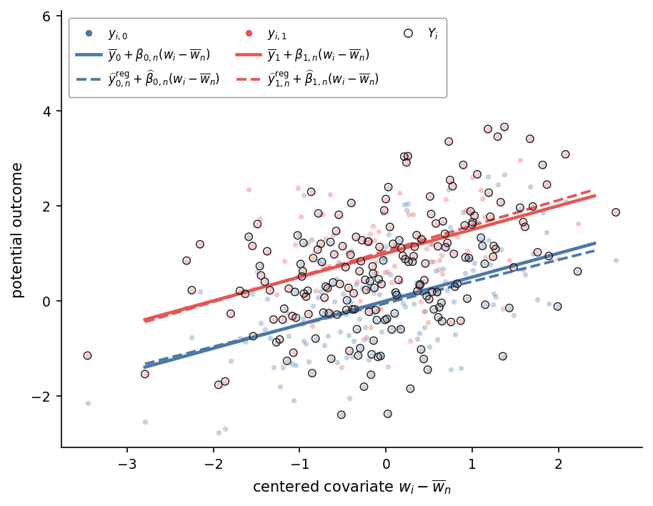
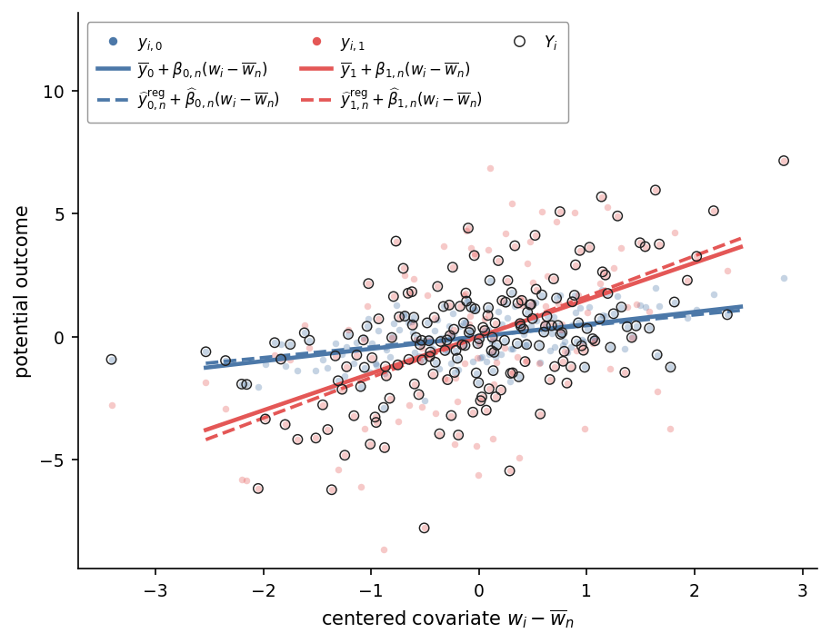

In this note, we extend the model for randomized experiments to include a vector of covariates.
We use these covariates to construct a least-squares estimator for a linear combination of treatment-group means.
The resulting estimator has weakly smaller conservative asymptotic variance than either the unadjusted treatment-group-means estimator or CUPED.
We illustrate the variance reduction and its effect on confidence-interval width with a finite-sample simulation.

# Model

Our starting point is the [data model for randomized experiments](../treatment-group-means/#model) provided in the treatment group means note.
In addition to $(D_i,Y_i)$, suppose that for each unit we observe a $k$-dimensional vector of covariates $\boldsymbol{w}_i\in\mathbb{R}^k$.
Unlike the outcome $Y_i$, the observed covariate vector $\boldsymbol{w}_i$ is assumed to be unaffected by treatment assignment.
In practice, this condition is often satisfied by constructing $\boldsymbol{w}_i$ from information recorded before unit $i$ was first assigned a treatment group.
We treat the sequence $\{\boldsymbol{w}_i\}_{i=1}^\infty$ as fixed, so treatment assignment remains the model's only source of randomness.

Let $\overline{\boldsymbol w}_n$ denote the covariate mean vector:
$$
\overline{\boldsymbol w}_n
=
\frac{1}{n}\sum_{i=1}^n\boldsymbol w_i.
$$ {#eq-regression-covariate-mean}

Also define the centered covariate matrix and the potential-outcome vectors

$$
\mathbf W_n
=
\begin{pmatrix}
(\boldsymbol w_1-\overline{\boldsymbol w}_n)' \\
\vdots \\
(\boldsymbol w_n-\overline{\boldsymbol w}_n)'
\end{pmatrix},
\qquad
\boldsymbol y_{0,n}
=
\begin{pmatrix}
y_{1,0} \\
\vdots \\
y_{n,0}
\end{pmatrix},
\qquad
\boldsymbol y_{1,n}
=
\begin{pmatrix}
y_{1,1} \\
\vdots \\
y_{n,1}
\end{pmatrix}.
$$

Let

$$
\boldsymbol\beta_{d,n}
=
\left(\mathbf W_n'\mathbf W_n
\right)^\dagger
\mathbf W_n'\boldsymbol y_{d,n}
$$
denote the vector of linear projection coefficients, where $\mathbf A^\dagger$ denotes the Moore-Penrose pseudoinverse of a matrix $\mathbf A$.
The vector $\boldsymbol\beta_{d,n}$ minimizes the sum of squared residuals:
$$
\boldsymbol\beta_{d,n}
\in
\underset{\boldsymbol b\in\mathbb R^k}{\operatorname{argmin}}
\sum_{i=1}^n
\left[
y_{i,d}
-\overline y_{d,n}
-\left(\boldsymbol w_i-\overline{\boldsymbol w}_n\right)'
\boldsymbol b
\right]^2.
$$ {#eq-regression-projection-minimization}

Define the projection residuals by
$$
u_{i,d,n}^{\mathrm{reg}}
=
y_{i,d}
-\overline y_{d,n}
-\left(\boldsymbol w_i-\overline{\boldsymbol w}_n\right)'
\boldsymbol\beta_{d,n}
$$ {#eq-regression-projection-residuals}

Summing over $i$, we obtain

$$
\sum_{i=1}^nu_{i,d,n}^{\mathrm{reg}}
=0.
$$ {#eq-regression-population-residual-sum-zero}

The first-order conditions for the minimization problem in (-@eq-regression-projection-minimization) also imply
$$
\sum_{i=1}^n
\left(\boldsymbol w_i-\overline{\boldsymbol w}_n\right)
u_{i,d,n}^{\mathrm{reg}}
=\boldsymbol0.
$$ {#eq-regression-population-normal-equations}

Collect the residuals into the vector

$$
\boldsymbol u_{i,n}^{\mathrm{reg}}
=
\begin{pmatrix}
u_{i,0,n}^{\mathrm{reg}} \\
u_{i,1,n}^{\mathrm{reg}}
\end{pmatrix}
$$

and define the finite-population covariance matrix

$$
\mathbf S_n^{\mathrm{reg}}
=
\frac{1}{n}\sum_{i=1}^n
\boldsymbol u_{i,n}^{\mathrm{reg}}
\left(\boldsymbol u_{i,n}^{\mathrm{reg}}\right)'
=
\begin{pmatrix}
s_{00,n}^{2,\mathrm{reg}} & s_{01,n}^{\mathrm{reg}} \\
s_{01,n}^{\mathrm{reg}} & s_{11,n}^{2,\mathrm{reg}}
\end{pmatrix}.
$$ {#eq-regression-residual-second-moments}

Also define unit $i$'s covariate leverage by
$$
h_{i,n}
=
\frac{1}{n}
+
\left(\boldsymbol w_i-\overline{\boldsymbol w}_n\right)'
\left(\mathbf W_n'\mathbf W_n\right)^\dagger
\left(\boldsymbol w_i-\overline{\boldsymbol w}_n\right),
$$

Collect the model primitives into the parameter vector

$$
\boldsymbol\theta
=
\left(
p,
\{y_{i,0}\}_{i=1}^\infty,
\{y_{i,1}\}_{i=1}^\infty,
\{\boldsymbol w_i\}_{i=1}^\infty
\right)
$$

and let

$$
\Theta
\subseteq
[\underline p,1-\underline p]
\times\mathbb R^\mathbb N
\times\mathbb R^\mathbb N
\times(\mathbb R^k)^\mathbb N
$$

denote the set of parameter configurations under consideration.
We replace [Assumption 3](../treatment-group-means/#asm-nondegenerate) with the following regularity conditions:

::: {.assumption #asm-regression-covariates}
**Assumption 3'' (Regression regularity)**

[**(i)**]{.part-label} **(Non-degeneracy)** There exists an index $n_0$ such that $s_{dd,n}^{2,\mathrm{reg}}>0$ for every $n\geq n_0$, $\boldsymbol\theta\in\Theta$, and $d\in\{0,1\}$.

[**(ii)**]{.part-label} **(Maximum variance share)** For each $d\in\{0,1\}$,

$$
\lim_{n\to\infty}
\sup_{\boldsymbol\theta\in\Theta}
\max_{1\leq i\leq n}
\frac{|u_{i,d,n}^{\mathrm{reg}}|}{\sqrt n\,s_{dd,n}^{\mathrm{reg}}}
=0.
$$

[**(iii)**]{.part-label} **(Maximum leverage)**

$$
\lim_{n\to\infty}
\sup_{\boldsymbol\theta\in\Theta}
\max_{1\leq i\leq n}
 h_{i,n}
=0.
$$
:::

Part (i) ensures that the residual variances are nonzero for all sufficiently large sample sizes and is analogous to the non-degeneracy condition in Assumption 3.
Part (ii) is the analogue of the maximum variance-share condition in Assumption 3(ii), with projection residuals replacing centered potential outcomes.
Part (iii) is the covariate analogue of the maximum variance-share condition; indeed, when $k=1$, the two conditions are equivalent with the centered potential outcome replaced by the centered covariate.
In the [Appendix](#sec-regression-stationary-ergodic-conditions), we show that these restrictions hold on a set of arbitrarily high probability when the potential outcomes and covariates are generated jointly by a stationary ergodic process with finite second moments and positive residual variances.

# Estimator

In this section, we derive a least-squares estimator for a linear combination of treatment-group means.
Rearrange (-@eq-regression-projection-residuals) to obtain
$$
\begin{aligned}
y_{i,d}
&=
\overline y_{d,n}
+
\left(\boldsymbol w_i-\overline{\boldsymbol w}_n\right)'
\boldsymbol\beta_{d,n}
+
u_{i,d,n}^{\mathrm{reg}},
\qquad d\in\{0,1\}.
\end{aligned}
$$ {#eq-regression-potential-outcome-decomposition-centered}

Define

$$
U_{i,n}^{\mathrm{reg}}
=
(1-D_i)u_{i,0,n}^{\mathrm{reg}}
+D_i u_{i,1,n}^{\mathrm{reg}}.
$$

Plugging into the observation equation from [Assumption 2](../treatment-group-means/#asm-sutva) gives

$$
\begin{aligned}
Y_i
&=
(1-D_i)\overline y_{0,n}
+
D_i\overline y_{1,n}
\\
&\quad+
(1-D_i)
\left(\boldsymbol w_i-\overline{\boldsymbol w}_n\right)'
\boldsymbol\beta_{0,n}
+
D_i
\left(\boldsymbol w_i-\overline{\boldsymbol w}_n\right)'
\boldsymbol\beta_{1,n}
+U_{i,n}^{\mathrm{reg}}.
\end{aligned}
$$ {#eq-regression-fully-interacted-observed-outcome}

Now define the vectors

$$
\boldsymbol D_n
=
\begin{pmatrix}
D_1 \\
\vdots \\
D_n
\end{pmatrix},
\qquad
\boldsymbol 1_n
=
\begin{pmatrix}
1 \\
\vdots \\
1
\end{pmatrix}
$$
and use them to construct the design matrix corresponding to (-@eq-regression-fully-interacted-observed-outcome):
$$
\mathbf X_n
=
\begin{pmatrix}
\boldsymbol 1_n-\boldsymbol D_n
&
\boldsymbol D_n
&
\operatorname{diag}(\boldsymbol 1_n-\boldsymbol D_n)\mathbf W_n
&
\operatorname{diag}(\boldsymbol D_n)\mathbf W_n
\end{pmatrix}.
$$

The least-squares coefficients are defined as

$$
\begin{pmatrix}
\widehat y_{0,n}^{\mathrm{reg}} \\
\widehat y_{1,n}^{\mathrm{reg}} \\
\widehat{\boldsymbol\beta}_{0,n} \\
\widehat{\boldsymbol\beta}_{1,n}
\end{pmatrix}
=
\left[
\left(\mathbf X_n\right)'
\mathbf X_n
\right]^\dagger
\left(\mathbf X_n\right)'
\boldsymbol Y_n,
$$ {#eq-regression-fully-interacted-coefficient-estimator}
where
$$
\boldsymbol Y_n
=
\begin{pmatrix}
Y_1 \\
\vdots \\
Y_n
\end{pmatrix}
$$

These coefficients can equivalently be computed from separate regressions of $Y_i$ on a constant and $\boldsymbol w_i-\overline{\boldsymbol w}_n$ within each treatment group.
The first-order condition with respect to $\widehat y_{d,n}^{\mathrm{reg}}$ is

$$
\frac{1}{N_{d,n}}\sum_{i=1}^n
D_{i,d}
\left[
Y_i
-\widehat y_{d,n}^{\mathrm{reg}}
-\left(\boldsymbol w_i-\overline{\boldsymbol w}_n\right)'
\widehat{\boldsymbol\beta}_{d,n}
\right]
=0,
\qquad d\in\{0,1\},
$$
where

$$
\widehat{\boldsymbol w}_{d,n}
=
\frac{1}{N_{d,n}}\sum_{i=1}^nD_{i,d}\boldsymbol w_i
$$
denotes the covariate mean in treatment group $d\in\{0,1\}$.
Evaluating the sum and rearranging gives

$$
\widehat y_{d,n}^{\mathrm{reg}}
=
\widehat y_{d,n}
-
\left(\widehat{\boldsymbol w}_{d,n}-\overline{\boldsymbol w}_n\right)'
\widehat{\boldsymbol\beta}_{d,n}.
$$ {#eq-regression-adjusted-treatment-group-mean}

For nonrandom coefficients satisfying $(a_{0,n},a_{1,n})\neq(0,0)$, the target is

$$
\psi_n
=
a_{0,n}\overline y_{0,n}
+a_{1,n}\overline y_{1,n}.
$$
The regression estimator of $\psi_n$ is the corresponding linear combination of the regression-adjusted treatment-group means:

$$
\widehat\psi_n^{\mathrm{reg}}
=
a_{0,n}\widehat y_{0,n}^{\mathrm{reg}}
+a_{1,n}\widehat y_{1,n}^{\mathrm{reg}}.
$$ {#eq-regression-fully-interacted-estimator}

For the ATE, $\widehat\psi_n^{\mathrm{reg}}$ can be written as

$$
\begin{aligned}
\widehat\psi_n^{\mathrm{reg}}
&=
\widehat y_{1,n}^{\mathrm{reg}}
-\widehat y_{0,n}^{\mathrm{reg}}
\\
&=
\left[\left(
\widehat y_{1,n}
-\widehat{\boldsymbol w}_{1,n}'\widehat{\boldsymbol\beta}_{1,n}
\right)
-
\left(
\widehat y_{0,n}
-\widehat{\boldsymbol w}_{0,n}'\widehat{\boldsymbol\beta}_{0,n}
\right)\right]
+
\overline{\boldsymbol w}_n'
\left(
\widehat{\boldsymbol\beta}_{1,n}
-\widehat{\boldsymbol\beta}_{0,n}
\right).
\end{aligned}
$$ {#eq-regression-ate-decomposition}

This decomposition has an intuitive interpretation.
The quantity $\widehat y_{d,n}-\widehat{\boldsymbol w}_{d,n}' \widehat{\boldsymbol\beta}_{d,n}$ is the mean outcome in treatment group $d$ net of the fitted covariate component.
The bracketed difference is therefore the "level" component of the estimated ATE.
The remaining term is the "interaction" component, which measures the difference between the two covariate components evaluated at the overall covariate mean.

# Inference

## Error decomposition

In this section, we decompose the regression estimator's error into a weighted combination of residual means and a remainder term.
Averaging (-@eq-regression-potential-outcome-decomposition-centered) over treatment group $d$ gives

$$
\widehat y_{d,n}
=
\overline y_{d,n}
+
\left(\widehat{\boldsymbol w}_{d,n}-\overline{\boldsymbol w}_n\right)'
\boldsymbol\beta_{d,n}
+
\widehat u_{d,n}^{\mathrm{reg}},
$$
where
$$
\widehat u_{d,n}^{\mathrm{reg}}
=
\frac{1}{N_{d,n}}\sum_{i=1}^nD_{i,d}u_{i,d,n}^{\mathrm{reg}}.
$$

Substituting this expression into (-@eq-regression-adjusted-treatment-group-mean) gives

$$
\begin{aligned}
\widehat y_{d,n}^{\mathrm{reg}}
&=
\overline y_{d,n}
-
\left(\widehat{\boldsymbol w}_{d,n}-\overline{\boldsymbol w}_n\right)'
\left(\widehat{\boldsymbol\beta}_{d,n}-\boldsymbol\beta_{d,n}\right) +
\widehat u_{d,n}^{\mathrm{reg}}.
\end{aligned}
$$ {#eq-regression-adjusted-mean-error}

Plugging into $\widehat\psi_n^{\mathrm{reg}} =a_{0,n}\widehat y_{0,n}^{\mathrm{reg}} +a_{1,n}\widehat y_{1,n}^{\mathrm{reg}}$, we obtain

$$
\widehat\psi_n^{\mathrm{reg}}-\psi_n
=
[a_{0,n}\widehat u_{0,n}^{\mathrm{reg}}
+a_{1,n}\widehat u_{1,n}^{\mathrm{reg}}]
+R_n^{\mathrm{reg}},
$$ {#eq-regression-target-error-decomposition}

where

$$
R_n^{\mathrm{reg}}
=
-a_{0,n}
\left(\widehat{\boldsymbol w}_{0,n}-\overline{\boldsymbol w}_n\right)'
\left(\widehat{\boldsymbol\beta}_{0,n}-\boldsymbol\beta_{0,n}\right)
-a_{1,n}
\left(\widehat{\boldsymbol w}_{1,n}-\overline{\boldsymbol w}_n\right)'
\left(\widehat{\boldsymbol\beta}_{1,n}-\boldsymbol\beta_{1,n}\right).
$$ {#eq-regression-remainder-definition}

## Normal approximation

The leading term in (-@eq-regression-target-error-decomposition) is the treatment-group-means estimator applied to the residual arrays $\{u_{i,0,n}^{\mathrm{reg}}\}$ and $\{u_{i,1,n}^{\mathrm{reg}}\}$.
The finite-population mean of each residual array is zero by (-@eq-regression-population-residual-sum-zero), while Assumptions 3''(i) and (ii) provide the regularity conditions required by Assumption 3.
We can therefore directly apply [the normal approximation](../treatment-group-means/#normal-approximation) from the treatment-group-means note.

Define the armwise asymptotic variances by

$$
\sigma_{d,n}^{2,\mathrm{reg}}
=
\frac{1-p_d}{p_d}s_{dd,n}^{2,\mathrm{reg}},
\qquad
d\in\{0,1\}.
$$ {#eq-regression-arm-asymptotic-variances}

If the projection residuals were observed, the corresponding oracle estimators would be

$$
\check\sigma_{d,n}^{2,\mathrm{reg}}
=
\frac{1-\overline D_{d,n}}{\overline D_{d,n}}
\left[
\frac{1}{N_{d,n}}\sum_{i=1}^n
D_{i,d}\left(U_{i,n}^{\mathrm{reg}}-\widehat u_{d,n}^{\mathrm{reg}}\right)^2
\right],
\qquad d\in\{0,1\}.
$$ {#eq-regression-arm-oracle-variance-estimators}

Use these quantities to define the conservative asymptotic variance and its oracle estimator:

$$
\begin{aligned}
\widetilde\sigma_n^{2,\mathrm{reg}}
&=
\left(
|a_{0,n}|\sigma_{0,n}^{\mathrm{reg}}
+|a_{1,n}|\sigma_{1,n}^{\mathrm{reg}}
\right)^2,
\\[1ex]
\check\sigma_n^{2,\mathrm{reg}}
&=
\left(
|a_{0,n}|\check\sigma_{0,n}^{\mathrm{reg}}
+|a_{1,n}|\check\sigma_{1,n}^{\mathrm{reg}}
\right)^2.
\end{aligned}
$$ {#eq-regression-conservative-variance-and-oracle-estimator}

Applying the [studentized normal approximation](../treatment-group-means/#eq-treatment-group-feasible-normal-approximation){.quarto-xref} from the treatment-group-means note gives

$$
\sqrt n
\frac{
a_{0,n}\widehat u_{0,n}^{\mathrm{reg}}
+a_{1,n}\widehat u_{1,n}^{\mathrm{reg}}
}{\check\sigma_n^{\mathrm{reg}}}
\stackrel{\mathcal P}{\approx}
Z_n^{\mathrm{reg}},
\qquad
Z_n^{\mathrm{reg}}
\sim
N\left(
0,
\frac{\sigma_n^{2,\mathrm{reg}}}
{\widetilde\sigma_n^{2,\mathrm{reg}}}
\right),
$$ {#eq-regression-oracle-normal-approximation}
where

$$
\sigma_n^{2,\mathrm{reg}}
=
a_{0,n}^2\sigma_{0,n}^{2,\mathrm{reg}}
+a_{1,n}^2\sigma_{1,n}^{2,\mathrm{reg}}
-2a_{0,n}a_{1,n}s_{01,n}^{\mathrm{reg}}.
$$ {#eq-regression-leading-term-asymptotic-variance}

Relative to the treatment-group-means setting, the regression case requires one additional step because the projection residuals are unobserved.
To obtain a feasible estimator, we replace the projection residuals with their fitted counterparts:

$$
\begin{aligned}
\widehat U_{i,n}^{\mathrm{reg}}
&=
Y_i
-(1-D_i)\widehat y_{0,n}^{\mathrm{reg}}
-D_i\widehat y_{1,n}^{\mathrm{reg}}
\\
&\quad-
(1-D_i)
\left(\boldsymbol w_i-\overline{\boldsymbol w}_n\right)'
\widehat{\boldsymbol\beta}_{0,n}
-D_i
\left(\boldsymbol w_i-\overline{\boldsymbol w}_n\right)'
\widehat{\boldsymbol\beta}_{1,n}.
\end{aligned}
$$ {#eq-regression-fitted-residual}

Equations (-@eq-regression-adjusted-treatment-group-mean) and (-@eq-regression-fitted-residual) imply that, for each nonempty treatment group,

$$
\frac{1}{N_{d,n}}
\sum_{i=1}^n
D_{i,d}\widehat U_{i,n}^{\mathrm{reg}}
=0,
\qquad d\in\{0,1\}.
$$ {#eq-regression-fitted-residual-zero-mean}

We therefore define the feasible within-treatment-group fitted-residual variances by

$$
\widehat s_{dd,n}^{2,\mathrm{reg}}
=
\frac{1}{N_{d,n}}\sum_{i=1}^n
D_{i,d}\left(\widehat U_{i,n}^{\mathrm{reg}}\right)^2
$$ {#eq-regression-fitted-residual-variances}

and construct

$$
\widehat\sigma_{d,n}^{2,\mathrm{reg}}
=
\frac{1-\overline D_{d,n}}{\overline D_{d,n}}
\widehat s_{dd,n}^{2,\mathrm{reg}},
\qquad
\widehat\sigma_n^{2,\mathrm{reg}}
=
\left(
|a_{0,n}|\widehat\sigma_{0,n}^{\mathrm{reg}}
+|a_{1,n}|\widehat\sigma_{1,n}^{\mathrm{reg}}
\right)^2.
$$ {#eq-regression-conservative-variance-estimator}

In the [Appendix](#sec-regression-oracle-feasible-arm-variance), we show that

$$
\frac{\check\sigma_n^{2,\mathrm{reg}}}
{\widehat\sigma_n^{2,\mathrm{reg}}}
\stackrel{\mathcal P}{\to}1.
$$ {#eq-regression-oracle-feasible-variance-consistency}

Applying @prp-continuous-mapping(i) with the nonnegative square-root map gives $\check\sigma_n^{\mathrm{reg}}/\widehat\sigma_n^{\mathrm{reg}} \stackrel{\mathcal P}{\to}1$.
Moreover, $\sigma_n^{2,\mathrm{reg}}\leq\widetilde\sigma_n^{2,\mathrm{reg}}$ implies $Z_n^{\mathrm{reg}}=O_{\mathcal P}(1)$.
Therefore (-@eq-regression-oracle-normal-approximation) and @prp-asymptotic-equivalence-slutsky imply

$$
\sqrt n
\frac{
a_{0,n}\widehat u_{0,n}^{\mathrm{reg}}
+a_{1,n}\widehat u_{1,n}^{\mathrm{reg}}
}{\widehat\sigma_n^{\mathrm{reg}}}
\stackrel{\mathcal P}{\approx}
Z_n^{\mathrm{reg}}.
$$ {#eq-regression-feasible-residual-means-normal-approximation}

## Confidence interval

The [Appendix](#sec-regression-remainder-negligibility) shows that the remainder term is negligible:

$$
\frac{\sqrt n\,R_n^{\mathrm{reg}}}
{\widehat\sigma_n^{\mathrm{reg}}}
\stackrel{\mathcal P}{\to}0.
$$ {#eq-regression-remainder-negligibility}

Combining (-@eq-regression-target-error-decomposition), (-@eq-regression-feasible-residual-means-normal-approximation), and (-@eq-regression-remainder-negligibility), and applying @prp-asymptotic-equivalence-perturbation gives

$$
\sqrt n
\frac{\widehat\psi_n^{\mathrm{reg}}-\psi_n}
{\widehat\sigma_n^{\mathrm{reg}}}
\stackrel{\mathcal P}{\approx}
Z_n^{\mathrm{reg}}.
$$ {#eq-regression-feasible-normal-approximation}

Define the confidence interval by

$$
C_{1-\alpha,n}^{\mathrm{reg}}
=
\left[
\widehat\psi_n^{\mathrm{reg}}
-z_{1-\alpha/2}
\sqrt{\frac{\widehat\sigma_n^{2,\mathrm{reg}}}{n}},
\widehat\psi_n^{\mathrm{reg}}
+z_{1-\alpha/2}
\sqrt{\frac{\widehat\sigma_n^{2,\mathrm{reg}}}{n}}
\right].
$$ {#eq-regression-confidence-interval}

The [uniform-coverage argument](../treatment-group-means/#confidence-interval) from the treatment-group-means note then gives

$$
\liminf_{n\to\infty}
\inf_{\boldsymbol\theta\in\Theta}
\mathbb P_{\boldsymbol\theta}\left(\psi_n\in C_{1-\alpha,n}^{\mathrm{reg}}\right)
\geq 1-\alpha.
$$ {#eq-regression-confidence-interval-coverage}

# Comparison with other estimators

In this section, we compare the regression estimator with two alternatives: the unadjusted treatment-group-means estimator and CUPED.

## Unadjusted estimator

Squaring the decomposition in (-@eq-regression-potential-outcome-decomposition-centered) and applying the population normal equations in (-@eq-regression-population-normal-equations) gives, for each $d\in\{0,1\}$,

$$
\frac{1}{n}\sum_{i=1}^n
\left(y_{i,d}-\overline y_{d,n}\right)^2
=
s_{dd,n}^{2,\mathrm{reg}}
+\boldsymbol\beta_{d,n}'
\left(\frac{1}{n}\mathbf W_n'\mathbf W_n\right)
\boldsymbol\beta_{d,n}.
$$ {#eq-regression-adjusted-residual-second-moments}

Define the finite-population coefficient of determination for treatment group $d$ as

$$
r_{d,n}^2
=
\frac{
\boldsymbol\beta_{d,n}'
\left(\frac{1}{n}\mathbf W_n'\mathbf W_n\right)
\boldsymbol\beta_{d,n}
}{
\frac{1}{n}\sum_{i=1}^n\left(y_{i,d}-\overline y_{d,n}\right)^2
}.
$$

The two terms on the right-hand side of (-@eq-regression-adjusted-residual-second-moments) are nonnegative, so $0\leq r_{d,n}^2\leq 1$.
Rearranging gives

$$
s_{dd,n}^{2,\mathrm{reg}}
=
(1-r_{d,n}^2)
\frac{1}{n}\sum_{i=1}^n
\left(y_{i,d}-\overline y_{d,n}\right)^2.
$$

Using (-@eq-regression-arm-asymptotic-variances), we then have

$$
\sigma_{d,n}^{2,\mathrm{reg}}
=
\left(1-r_{d,n}^2\right)\sigma_{d,n}^2.
$$

The conservative regression variance in (-@eq-regression-conservative-variance-and-oracle-estimator) therefore satisfies

$$
\widetilde\sigma_n^{2,\mathrm{reg}}
=
\left(
|a_{0,n}|\sqrt{1-r_{0,n}^2}\,\sigma_{0,n}
+|a_{1,n}|\sqrt{1-r_{1,n}^2}\,\sigma_{1,n}
\right)^2.
$$

Taking nonnegative square roots and rearranging, we obtain

$$
\frac{\widetilde\sigma_n - \widetilde\sigma_n^{\mathrm{reg}}}{\widetilde\sigma_n}
=
\pi_{0,n}\left(1-\sqrt{1-r_{0,n}^2}\right)
+\pi_{1,n}\left(1-\sqrt{1-r_{1,n}^2}\right),
$$
where

$$
\pi_{d,n}
=
\frac{|a_{d,n}|\sigma_{d,n}}{|a_{d,n}|\sigma_{d,n}+|a_{1-d,n}|\sigma_{1-d,n}}
,
\qquad d\in\{0,1\},
$$

denotes the share of the unadjusted conservative standard deviation contributed by treatment group $d$.
The relative reduction in the conservative standard deviation is therefore a weighted average of the armwise reduction factors $1-\sqrt{1-r_{d,n}^2}$.
Taking a first-order expansion around $r_{d,n}^2=0$ yields

$$
1-\sqrt{1-r_{d,n}^2}
=
\frac{r_{d,n}^2}{2}
+O\left(r_{d,n}^4\right).
$$

Thus, when both armwise $r^2$ values are small, the relative reduction is approximately

$$
\frac{\widetilde\sigma_n - \widetilde\sigma_n^{\mathrm{reg}}}{\widetilde\sigma_n}
\approx
\frac{\pi_{0,n}r_{0,n}^2+\pi_{1,n}r_{1,n}^2}{2}.
$$

For example, if the covariates explain $50\%$ of the variance in both treatment groups, the exact reduction in the conservative standard deviation is $29.3\%$ while the first-order approximation is  $25\%$.
The map $r^2\mapsto1-\sqrt{1-r^2}$ is convex: increasing the coefficient of determination from $0$ to $0.1$ in both treatment groups reduces the conservative standard deviation by $5.1$ percentage points, whereas increasing it from $0.9$ to $1$ yields a further reduction of $31.6$ percentage points.

## CUPED

[CUPED](https://doi.org/10.1145/2433396.2433413) is a commonly used technique that reduces variance by subtracting a covariate adjustment from each treatment-group mean.
Let

$$
\widehat{\boldsymbol\gamma}_n
=
\left(\mathbf W_n'\mathbf W_n\right)^\dagger
\mathbf W_n'\boldsymbol Y_n
$$ {#eq-regression-cuped-coefficient-estimator}

denote the pooled coefficient estimator and define the CUPED-adjusted treatment-group mean by

$$
\widehat y_{d,n}^{\mathrm{cuped}}
=
\widehat y_{d,n}
-\left(\widehat{\boldsymbol w}_{d,n}-\overline{\boldsymbol w}_n\right)'
\widehat{\boldsymbol\gamma}_n,
\qquad d\in\{0,1\}.
$$ {#eq-regression-cuped-adjusted-treatment-group-mean}

Compared with the regression-adjusted means in (-@eq-regression-adjusted-treatment-group-mean), the CUPED-adjusted means replace the treatment-group-specific coefficient $\widehat{\boldsymbol\beta}_{d,n}$ with a single coefficient vector shared across treatment groups.
The CUPED estimator of $\psi_n$ is given by

$$
\begin{aligned}
\widehat\psi_n^{\mathrm{cuped}}
&=
a_{0,n}\widehat y_{0,n}^{\mathrm{cuped}}
+a_{1,n}\widehat y_{1,n}^{\mathrm{cuped}}.
\end{aligned}
$$ {#eq-regression-cuped-estimator}

For the ATE, $\widehat\psi_n^{\mathrm{cuped}}$ reduces to

$$
\begin{aligned}
\widehat\psi_n^{\mathrm{cuped}}
&=
\widehat y_{1,n}^{\mathrm{cuped}}
-\widehat y_{0,n}^{\mathrm{cuped}}
\\
&=
\left(
\widehat y_{1,n}
-\widehat{\boldsymbol w}_{1,n}'\widehat{\boldsymbol\gamma}_n
\right)
-
\left(
\widehat y_{0,n}
-\widehat{\boldsymbol w}_{0,n}'\widehat{\boldsymbol\gamma}_n
\right)
.
\end{aligned}
$$ {#eq-regression-cuped-ate-decomposition}

In contrast to the regression ATE estimator in (-@eq-regression-ate-decomposition), the CUPED estimator has only a level component because it uses the same coefficient vector to adjust both treatment groups.

To describe the CUPED estimator's asymptotic behavior, define

$$
\begin{aligned}
\boldsymbol\gamma_n
&=
\mathbb E_{\boldsymbol\theta}\left[\widehat{\boldsymbol\gamma}_n\right]
\\
&=
\left(\mathbf W_n'\mathbf W_n\right)^\dagger
\mathbf W_n'
\left[(1-p)\boldsymbol y_{0,n}+p\boldsymbol y_{1,n}\right]
\\
&=
(1-p)\boldsymbol\beta_{0,n}
+p\boldsymbol\beta_{1,n}.
\end{aligned}
$$ {#eq-regression-standard-cuped-coefficient}

Averaging (-@eq-regression-potential-outcome-decomposition-centered) over treatment group $d$ and substituting the result into (-@eq-regression-cuped-adjusted-treatment-group-mean) yields

$$
\begin{aligned}
\widehat y_{d,n}^{\mathrm{cuped}}
&=
\overline y_{d,n}
+\widehat u_{d,n}^{\mathrm{cuped}}
-\left(\widehat{\boldsymbol w}_{d,n}-\overline{\boldsymbol w}_n\right)'
\left(\widehat{\boldsymbol\gamma}_n-\boldsymbol\gamma_n\right),
\end{aligned}
$$ {#eq-regression-cuped-residual}

where

$$
\begin{aligned}
\widehat u_{d,n}^{\mathrm{cuped}}
&=
\frac{1}{N_{d,n}}\sum_{i=1}^n
D_{i,d}u_{i,d,n}^{\mathrm{cuped}},
\\[1ex]
u_{i,d,n}^{\mathrm{cuped}}
&=
u_{i,d,n}^{\mathrm{reg}}
+\left(\boldsymbol w_i-\overline{\boldsymbol w}_n\right)'
\left(\boldsymbol\beta_{d,n}-\boldsymbol\gamma_n\right)
.
\end{aligned}
$$

Consequently,

$$
\widehat\psi_n^{\mathrm{cuped}}-\psi_n
=
a_{0,n}\widehat u_{0,n}^{\mathrm{cuped}}
+a_{1,n}\widehat u_{1,n}^{\mathrm{cuped}}
+R_n^{\mathrm{cuped}},
$$ {#eq-regression-cuped-error-decomposition}

where

$$
\begin{aligned}
R_n^{\mathrm{cuped}}
&=
-a_{0,n}
\left(\widehat{\boldsymbol w}_{0,n}-\overline{\boldsymbol w}_n\right)'
\left(\widehat{\boldsymbol\gamma}_n-\boldsymbol\gamma_n\right)
\\
&\quad-
a_{1,n}
\left(\widehat{\boldsymbol w}_{1,n}-\overline{\boldsymbol w}_n\right)'
\left(\widehat{\boldsymbol\gamma}_n-\boldsymbol\gamma_n\right).
\end{aligned}
$$ {#eq-regression-cuped-remainder}

Define

$$
\sigma_{d,n}^{2,\mathrm{cuped}}
=
\frac{1-p_d}{p_d}
\left(
\frac{1}{n}\sum_{i=1}^n
\left(u_{i,d,n}^{\mathrm{cuped}}\right)^2
\right)
.
$$

Because $\boldsymbol\beta_{d,n}$ is the projection coefficient, the population normal equations (-@eq-regression-population-normal-equations) give $\sum_{i=1}^n(\boldsymbol w_i-\overline{\boldsymbol w}_n)u_{i,d,n}^{\mathrm{reg}}=\boldsymbol0$.
Therefore,

$$
\begin{aligned}
\frac{1}{n}\sum_{i=1}^n
\left(u_{i,d,n}^{\mathrm{cuped}}\right)^2
&=
s_{dd,n}^{2,\mathrm{reg}}
+
\left(\boldsymbol\beta_{d,n}-\boldsymbol\gamma_n\right)'
\left(\frac{1}{n}\mathbf W_n'\mathbf W_n\right)
\left(\boldsymbol\beta_{d,n}-\boldsymbol\gamma_n\right)
.
\end{aligned}
$$ {#eq-regression-cuped-second-moments}

This implies
$$
\sigma_{d,n}^{2,\mathrm{cuped}}
=
\sigma_{d,n}^{2,\mathrm{reg}}
+
\frac{1-p_d}{p_d}
\left(\boldsymbol\beta_{d,n}-\boldsymbol\gamma_n\right)'
\left(\frac{1}{n}\mathbf W_n'\mathbf W_n\right)
\left(\boldsymbol\beta_{d,n}-\boldsymbol\gamma_n\right).
$$ {#eq-regression-cuped-arm-variance-decomposition}

Therefore $\sigma_{d,n}^{2,\mathrm{cuped}}\geq\sigma_{d,n}^{2,\mathrm{reg}}$ for each $d\in\{0,1\}$, so the conservative CUPED variance satisfies

$$
\begin{aligned}
\widetilde\sigma_n^{2,\mathrm{cuped}}
&=
\left(
|a_{0,n}|\sigma_{0,n}^{\mathrm{cuped}}
+|a_{1,n}|\sigma_{1,n}^{\mathrm{cuped}}
\right)^2
\\[1ex]
&\geq
\left(
|a_{0,n}|\sigma_{0,n}^{\mathrm{reg}}
+|a_{1,n}|\sigma_{1,n}^{\mathrm{reg}}
\right)^2
\\[1ex]
&=
\widetilde\sigma_n^{2,\mathrm{reg}}.
\end{aligned}
$$ {#eq-regression-cuped-conservative-variance}

Since

$$
\begin{aligned}
\mathbf W_n\left(\boldsymbol\beta_{0,n}-\boldsymbol\gamma_n\right)
&=
p\,\mathbf W_n
\left(\boldsymbol\beta_{0,n}-\boldsymbol\beta_{1,n}\right),
\\[1ex]
\mathbf W_n\left(\boldsymbol\beta_{1,n}-\boldsymbol\gamma_n\right)
&=
-(1-p)\,\mathbf W_n
\left(\boldsymbol\beta_{0,n}-\boldsymbol\beta_{1,n}\right),
\end{aligned}
$$

$\sigma_{d,n}^{2,\mathrm{cuped}} = \sigma_{d,n}^{2,\mathrm{reg}}$ if and only if

$$
\mathbf W_n\boldsymbol\beta_{0,n}
=
\mathbf W_n\boldsymbol\beta_{1,n}.
$$

The regression estimator therefore has weakly smaller conservative asymptotic variance than the CUPED estimator, with strict inequality whenever the linear projections differ across treatment groups.

# Illustration

In this section, we compare the finite-sample performance of the treatment-group-means, CUPED, and regression estimators of the ATE using simulated data.
We set $k=1$ and parameterize a finite population by target means $\overline y_0,\overline y_1,\overline w\in\mathbb R$, a vector of marginal standard deviations

$$
\boldsymbol\sigma
=
\begin{pmatrix}
\sigma_0 \\
\sigma_1 \\
\sigma_w
\end{pmatrix}
\in(0,\infty)^3,
$$

and a positive-semidefinite correlation matrix

$$
\mathbf R
=
\begin{pmatrix}
1 & \rho_{01} & \rho_{0w} \\
\rho_{01} & 1 & \rho_{1w} \\
\rho_{0w} & \rho_{1w} & 1
\end{pmatrix}.
$$

To construct the finite population, we first draw auxiliary vectors

$$
\boldsymbol x_i
\overset{\mathrm{iid}}{\sim}
N\left(\boldsymbol 0,\mathbf I_3\right),
\qquad i=1,\ldots,n,
$$

and set

$$
\overline{\boldsymbol x}_n
=
\frac1n\sum_{i=1}^n\boldsymbol x_i,
\qquad
\widehat{\boldsymbol\Sigma}_{x,n}
=
\frac1n\sum_{i=1}^n
\left(\boldsymbol x_i
-\overline{\boldsymbol x}_n\right)
\left(\boldsymbol x_i
-\overline{\boldsymbol x}_n\right)'.
$$

We then construct

$$
\begin{pmatrix}
y_{i,0} \\
y_{i,1} \\
w_i
\end{pmatrix}
=
\begin{pmatrix}
\overline y_0 \\
\overline y_1 \\
\overline w
\end{pmatrix}
+
\operatorname{diag}(\boldsymbol\sigma)
\mathbf L
\widehat{\boldsymbol\Sigma}_{x,n}^{-1/2}
\left(\boldsymbol x_i
-\overline{\boldsymbol x}_n\right)
,
$$
where $\mathbf L$ is a matrix satisfying $\mathbf R=\mathbf L\mathbf L'$.
The finite population then satisfies

$$
\frac1n\sum_{i=1}^n
\begin{pmatrix}
y_{i,0} \\
y_{i,1} \\
w_i
\end{pmatrix}
=
\begin{pmatrix}
\overline y_0 \\
\overline y_1 \\
\overline w
\end{pmatrix},
\qquad
\frac1n\sum_{i=1}^n
\begin{pmatrix}
y_{i,0}-\overline y_0 \\
y_{i,1}-\overline y_1 \\
w_i-\overline w
\end{pmatrix}
\begin{pmatrix}
y_{i,0}-\overline y_0 \\
y_{i,1}-\overline y_1 \\
w_i-\overline w
\end{pmatrix}
'
=
\boldsymbol\Sigma,
$$

where

$$
\boldsymbol\Sigma
=
\operatorname{diag}(\boldsymbol\sigma)
\mathbf R
\operatorname{diag}(\boldsymbol\sigma).
$$

The ATE equals $\overline y_1-\overline y_0$, and the armwise covariate projection coefficients satisfy

$$
\beta_{d,n}
=
\frac{
\sum_{i=1}^n
(w_i-\overline w_n)(y_{i,d}-\overline y_{d,n})
}{
\sum_{i=1}^n(w_i-\overline w_n)^2
}
=
\rho_{dw}\frac{\sigma_d}{\sigma_w},
\qquad d\in\{0,1\}.
$$

For each parameter configuration below, we generate a single finite population with $n=1{,}000$ units and hold it fixed across 50,000 independent Bernoulli treatment assignments with $p=0.5$.

### Level shift only

For the first simulation, we set
$$
(\overline y_0,\overline y_1,\overline w)
=(0,1,0),
\qquad
\boldsymbol\sigma
=
\begin{pmatrix}
1 \\
1 \\
1
\end{pmatrix},
\qquad
(\rho_{01},\rho_{0w},\rho_{1w})
=
\left(
1,
\frac12,
\frac12
\right).
$$
The finite population has a constant treatment effect $y_{i,1}-y_{i,0}=1$ and projection coefficients $\beta_{0,n}=\beta_{1,n}=1/2$.

@fig-regression-level-effect-illustration plots the potential outcomes against the centered covariate for 200 units.
The blue and red dots correspond to the control and treatment potential outcomes, respectively, and black outlines identify the outcomes selected by one example assignment.
By construction, each red dot is one unit above its corresponding blue dot.
The solid lines show the population linear projections, while the dashed lines show the estimated projections from the example assignment.

{#fig-regression-level-effect-illustration}

@tbl-regression-level-effect-comparison reports empirical coverage and average confidence-interval width across the assignment draws.
Since the two projection residuals are perfectly positively correlated across treatment groups, the Cauchy--Schwarz variance bound is sharp.
The three intervals therefore have empirical coverage close to their nominal $95\%$ level.
CUPED and regression have similar average widths because the population projection coefficients are the same across treatment groups.
The regression interval is about $13\%$ narrower than the treatment-group-means interval.
Since $r_{0,n}^2=r_{1,n}^2=(1/2)^2=0.25$, this reduction is close to the approximation $r_{d,n}^2/2=12.5\%$.

| Estimator | Coverage | Average CI width |
|---|---:|---:|
| Treatment-group means | $94.79\%$ | $0.248$ |
| CUPED | $94.73\%$ | $0.215$ |
| Regression | $94.70\%$ | $0.215$ |

: Empirical coverage and average width of nominal $95\%$ Cauchy--Schwarz confidence intervals for the constant-effect configuration. {#tbl-regression-level-effect-comparison}

### Interaction effect only

In this simulation, we set
$$
(\overline y_0,\overline y_1,\overline w)
=(0,0,0),
\qquad
\boldsymbol\sigma
=
\begin{pmatrix}
1 \\
3 \\
1
\end{pmatrix},
\qquad
(\rho_{01},\rho_{0w},\rho_{1w})
=
\left(
1,
\frac12,
\frac12
\right).
$$
In this case, $y_{i,1}=3y_{i,0}$ for every unit.
The finite population has an ATE of zero and covariate projection coefficients $\beta_{0,n}=1/2$ and $\beta_{1,n}=3/2$.

@fig-regression-interaction-effect-illustration plots the potential outcomes against the centered covariate for 200 units.
The red projection line is steeper because the treatment-group coefficient is larger.

{#fig-regression-interaction-effect-illustration}

@tbl-regression-interaction-effect-comparison reports empirical coverage and average confidence-interval width.
Since $\gamma_n=1$, the CUPED coefficient differs from each treatment-group-specific coefficient by $1/2$ in absolute value.
Because $p=1/2$ and $n^{-1}\mathbf W_n'\mathbf W_n=1$, (-@eq-regression-cuped-arm-variance-decomposition) gives

$$
\sigma_{0,n}^{2,\mathrm{cuped}}-\sigma_{0,n}^{2,\mathrm{reg}}
=
\sigma_{1,n}^{2,\mathrm{cuped}}-\sigma_{1,n}^{2,\mathrm{reg}}
=
\frac14.
$$

The regression arm variances are $3/4$ and $27/4$, so the CUPED arm variances are $1$ and $7$.
The relative increase in the conservative standard deviation from regression to CUPED is therefore

$$
\frac{\widetilde\sigma_n^{\mathrm{cuped}} - \widetilde\sigma_n^{\mathrm{reg}}}
{\widetilde\sigma_n^{\mathrm{reg}}}
=
\frac{\sqrt1+\sqrt7}
{\sqrt{3/4}+\sqrt{27/4}}
-1
\approx 5.2\%.
$$

This value closely matches the empirical relative increase in average width, $(0.452-0.429)/0.429\approx5.3\%$.
The regression interval is about $13.4\%$ narrower than the treatment-group-means interval, again close to the first-order approximation $r_{d,n}^2/2=12.5\%$.

| Estimator | Coverage | Average CI width |
|---|---:|---:|
| Treatment-group means | $94.74\%$ | $0.496$ |
| CUPED | $95.87\%$ | $0.452$ |
| Regression | $94.80\%$ | $0.429$ |

: Empirical coverage and average width of nominal $95\%$ Cauchy--Schwarz confidence intervals for the interaction-effect configuration. {#tbl-regression-interaction-effect-comparison}

# Appendix

## A mixture-model motivation for [Assumption 3''](#asm-regression-covariates) {#sec-regression-stationary-ergodic-conditions}

Let $\mathcal Q$ be a collection of probability laws on the path space $(\mathbb R^2\times\mathbb R^k)^\mathbb N$.
Under each $Q\in\mathcal Q$, suppose the joint coordinate process

$$
\left\{
\begin{pmatrix}
Y_{i,0} \\
Y_{i,1} \\
\boldsymbol W_i
\end{pmatrix}
:i\geq1
\right\}
$$

is stationary and ergodic.
Suppose also that, for each $d\in\{0,1\}$,

$$
\mathbb E_Q\left[Y_{1,d}^2\right]<\infty,
\qquad
\mathbb E_Q\left[\|\boldsymbol W_1\|^2\right]<\infty.
$$

Define

$$
\begin{gathered}
\mu_d(Q)
=
\mathbb E_Q[Y_{1,d}],
\qquad
\boldsymbol\mu_w(Q)
=
\mathbb E_Q[\boldsymbol W_1],
\\[2ex]
\boldsymbol\Sigma_w(Q)
=
\mathbb E_Q\left[
\left(\boldsymbol W_1-\boldsymbol\mu_w(Q)\right)
\left(\boldsymbol W_1-\boldsymbol\mu_w(Q)\right)'
\right],
\\[2ex]
\boldsymbol\beta_d(Q)
=
\boldsymbol\Sigma_w(Q)^\dagger
\mathbb E_Q\left[
\left(\boldsymbol W_1-\boldsymbol\mu_w(Q)\right)
\left(Y_{1,d}-\mu_d(Q)\right)
\right],
\\[2ex]
s_{dd}^{2,\mathrm{reg}}(Q)
=
\mathbb E_Q\left[
\left\{
Y_{1,d}-\mu_d(Q)
-\left(\boldsymbol W_1-\boldsymbol\mu_w(Q)\right)'
\boldsymbol\beta_d(Q)
\right\}^2
\right],
\end{gathered}
$$

and assume $s_{dd}^{2,\mathrm{reg}}(Q)>0$.
Let $\Pi$ be a probability distribution on $\mathcal Q$.
Generate a path of potential outcomes and covariates by first drawing $Q\sim\Pi$ and then drawing the path according to $Q$.

For each $d\in\{0,1\}$, define the empirical quantities

$$
\begin{gathered}
\overline Y_{d,n}
=
\frac{1}{n}\sum_{i=1}^nY_{i,d},
\qquad
\overline{\boldsymbol W}_n
=
\frac{1}{n}\sum_{i=1}^n\boldsymbol W_i,
\\[2ex]
\boldsymbol Y_{d,n}
=
\begin{pmatrix}
Y_{1,d} \\
\vdots \\
Y_{n,d}
\end{pmatrix},
\qquad
\mathbf W_n
=
\begin{pmatrix}
(\boldsymbol W_1-\overline{\boldsymbol W}_n)' \\
\vdots \\
(\boldsymbol W_n-\overline{\boldsymbol W}_n)'
\end{pmatrix}.
\end{gathered}
$$

We use the existing notation $\boldsymbol\beta_{d,n}$, $u_{i,d,n}^{\mathrm{reg}}$, $s_{dd,n}^{2,\mathrm{reg}}$, and $h_{i,n}$ for the corresponding functions of these random empirical data.

### Projection coefficient convergence

We first show that

$$
\boldsymbol\beta_{d,n}\to\boldsymbol\beta_d(Q)
$$ {#eq-regression-ergodic-coefficient-convergence}
$Q$-almost surely.
The ergodic theorem gives

$$
\begin{gathered}
\frac{1}{n}\mathbf W_n'\mathbf W_n
\to
\boldsymbol\Sigma_w(Q)
\\[2ex]
\frac{1}{n}\mathbf W_n'\boldsymbol Y_{d,n}
\to
\mathbb E_Q\left[
\left(\boldsymbol W_1-\boldsymbol\mu_w(Q)\right)
\left(Y_{1,d}-\mu_d(Q)\right)
\right]
\end{gathered}
$$ {#eq-regression-ergodic-projection-moment-convergence}
$Q$-almost surely.
Let

$$
r
=
\operatorname{rank}(\boldsymbol\Sigma_w(Q)).
$$

We consider three cases.

**Case 1: full rank**.
If $r=k$, $\boldsymbol\Sigma_w(Q)$ is positive definite.
The empirical covariance matrix is therefore positive definite for all sufficiently large $n$, and continuity of matrix inversion gives

$$
\left(
\frac{1}{n}\mathbf W_n'\mathbf W_n
\right)^{-1}
\to
\boldsymbol\Sigma_w(Q)^{-1}.
$$

For all such $n$,

$$
\begin{aligned}
\boldsymbol\beta_{d,n}
&=
\left(
\frac{1}{n}\mathbf W_n'\mathbf W_n
\right)^{-1}
\left(
\frac{1}{n}\mathbf W_n'\boldsymbol Y_{d,n}
\right)
\\[1ex]
&\to
\boldsymbol\Sigma_w(Q)^{-1}
\mathbb E_Q\left[
\left(\boldsymbol W_1-\boldsymbol\mu_w(Q)\right)
\left(Y_{1,d}-\mu_d(Q)\right)
\right]
\\[1ex]
&=
\boldsymbol\beta_d(Q).
\end{aligned}
$$

**Case 2: zero rank**.
If $r=0$, then $\boldsymbol\Sigma_w(Q)=\mathbf0$, so $\boldsymbol W_i=\boldsymbol\mu_w(Q)$ simultaneously for every $i\geq1$, $Q$-almost surely.
Hence $\mathbf W_n=\mathbf0$ and $\boldsymbol\beta_{d,n}=\boldsymbol\beta_d(Q)=\boldsymbol0$ for every $n$.

**Case 3: intermediate rank**.
Suppose instead that $0<r<k$.
Since the Moore--Penrose inverse is continuous along fixed-rank sequences, it suffices to show that the empirical covariance matrix $\frac{1}{n}\mathbf W_n'\mathbf W_n$ has rank $r$ for all sufficiently large $n$, $Q$-almost surely.
Toward this end, let $\left\{\boldsymbol q_1(Q),\ldots,\boldsymbol q_{k-r}(Q)\right\}$ be an orthonormal basis of $\operatorname{null}(\boldsymbol\Sigma_w(Q))$.
For each $j\in\{1,\ldots,k-r\}$,

$$
\begin{aligned}
0
&=
\boldsymbol q_j(Q)'\boldsymbol\Sigma_w(Q)\boldsymbol q_j(Q)
\\
&=
\mathbb E_Q\left[
\left\{
\boldsymbol q_j(Q)'
\left(\boldsymbol W_1-\boldsymbol\mu_w(Q)\right)
\right\}^2
\right].
\end{aligned}
$$

Therefore, for all $j\in\{1,\ldots,k-r\}$,

$$
\boldsymbol q_j(Q)'
\left(\boldsymbol W_1-\boldsymbol\mu_w(Q)\right)
=0
$$

$Q$-almost surely.
Hence

$$
\boldsymbol W_1-\boldsymbol\mu_w(Q)
\in
\operatorname{null}(\boldsymbol\Sigma_w(Q))^\perp
=
\operatorname{col}(\boldsymbol\Sigma_w(Q))
$$

$Q$-almost surely.
By stationarity and countable subadditivity, this inclusion holds simultaneously for every $i\geq1$, $Q$-almost surely.
On this probability-one event,

$$
\overline{\boldsymbol W}_n-\boldsymbol\mu_w(Q)
=
\frac{1}{n}\sum_{i=1}^n
\left(\boldsymbol W_i-\boldsymbol\mu_w(Q)\right)
\in
\operatorname{col}(\boldsymbol\Sigma_w(Q))
$$

and

$$
\boldsymbol W_i-\overline{\boldsymbol W}_n
=
\left(\boldsymbol W_i-\boldsymbol\mu_w(Q)\right)
-
\left(\overline{\boldsymbol W}_n-\boldsymbol\mu_w(Q)\right)
\in
\operatorname{col}(\boldsymbol\Sigma_w(Q)).
$$

Consequently,

$$
0
\leq
\operatorname{rank}\left(\frac{1}{n}\mathbf W_n'\mathbf W_n\right)
=
\operatorname{rank}(\mathbf W_n)
\leq
r.
$$ {#eq-regression-ergodic-covariance-rank-upper-bound}

Let $\lambda_r(\mathbf A)$ denote the $r$th largest eigenvalue of a symmetric matrix $\mathbf A$.
Since $\boldsymbol\Sigma_w(Q)$ has rank $r>0$,

$$
\lambda_r\left(\boldsymbol\Sigma_w(Q)\right)>0.
$$

Convergence of the empirical covariance matrix implies

$$
\lambda_r\left(\frac{1}{n}\mathbf W_n'\mathbf W_n\right)
\to
\lambda_r\left(\boldsymbol\Sigma_w(Q)\right)>0.
$$

Therefore, for all sufficiently large $n$,

$$
\operatorname{rank}\left(\frac{1}{n}\mathbf W_n'\mathbf W_n\right)
\geq r.
$$

Combining this inequality with (-@eq-regression-ergodic-covariance-rank-upper-bound) gives

$$
\operatorname{rank}\left(\frac{1}{n}\mathbf W_n'\mathbf W_n\right)
=
r
=
\operatorname{rank}(\boldsymbol\Sigma_w(Q))
$$

for all sufficiently large $n$.
Hence
$$
\left(
\frac{1}{n}\mathbf W_n'\mathbf W_n
\right)^\dagger
\to
\boldsymbol\Sigma_w(Q)^\dagger,
$$
which implies
$$
\begin{aligned}
\boldsymbol\beta_{d,n}
&=
\left(
\frac{1}{n}\mathbf W_n'\mathbf W_n
\right)^\dagger
\left(
\frac{1}{n}\mathbf W_n'\boldsymbol Y_{d,n}
\right)
\\[1ex]
&\to
\boldsymbol\Sigma_w(Q)^\dagger
\mathbb E_Q\left[
\left(\boldsymbol W_1-\boldsymbol\mu_w(Q)\right)
\left(Y_{1,d}-\mu_d(Q)\right)
\right]
\\[1ex]
&=
\boldsymbol\beta_d(Q).
\end{aligned}
$$

### Residual-variance convergence

We next show that the residual variance converges to the population value $Q$-almost surely.
Expanding the square gives

$$
\begin{aligned}
s_{dd,n}^{2,\mathrm{reg}}
&=
\frac{1}{n}\sum_{i=1}^n
\left(Y_{i,d}-\overline Y_{d,n}\right)^2 -
2\boldsymbol\beta_{d,n}'
\left(
\frac{1}{n}\mathbf W_n'\boldsymbol Y_{d,n}
\right) +
\boldsymbol\beta_{d,n}'
\left(
\frac{1}{n}\mathbf W_n'\mathbf W_n
\right)
\boldsymbol\beta_{d,n}.
\end{aligned}
$$

The ergodic theorem also gives

$$
\frac{1}{n}\sum_{i=1}^n
\left(Y_{i,d}-\overline Y_{d,n}\right)^2
\to
\mathbb E_Q\left[
\left(Y_{1,d}-\mu_d(Q)\right)^2
\right]
$$

$Q$-almost surely.
Combining this limit with (-@eq-regression-ergodic-coefficient-convergence) and (-@eq-regression-ergodic-projection-moment-convergence) gives

$$
\begin{aligned}
s_{dd,n}^{2,\mathrm{reg}}
&\to
\mathbb E_Q\left[
\left(Y_{1,d}-\mu_d(Q)\right)^2
\right]
\\[1ex]
&\quad-
2\boldsymbol\beta_d(Q)'
\mathbb E_Q\left[
\left(\boldsymbol W_1-\boldsymbol\mu_w(Q)\right)
\left(Y_{1,d}-\mu_d(Q)\right)
\right]
\\[1ex]
&\quad+
\boldsymbol\beta_d(Q)'
\boldsymbol\Sigma_w(Q)
\boldsymbol\beta_d(Q)
\\[1ex]
&=
\mathbb E_Q\left[
\left\{
Y_{1,d}-\mu_d(Q)
-
\left(\boldsymbol W_1-\boldsymbol\mu_w(Q)\right)'
\boldsymbol\beta_d(Q)
\right\}^2
\right]
\\
&=
s_{dd}^{2,\mathrm{reg}}(Q).
\end{aligned}
$$ {#eq-regression-ergodic-residual-variance-convergence}

$Q$-almost surely for each $d\in\{0,1\}$.

### Maximum variance-share and leverage conditions

We next show the maximum variance-share and maximum-leverage conditions hold $Q$-almost surely.
The dyadic union-bound and Borel--Cantelli argument used in the [mixture-model motivation for Assumption 3](../treatment-group-means/#sec-stationary-ergodic-conditions) applies to every coordinate of the joint process.
The finite-second-moment conditions therefore imply

$$
\frac{1}{\sqrt n}
\max_{1\leq i\leq n}
\left(
|Y_{i,0}|+|Y_{i,1}|+\|\boldsymbol W_i\|
\right)
\to 0
$$

$Q$-almost surely.
The ergodic theorem also gives

$$
\overline Y_{d,n}
\to
\mu_d(Q),
\qquad
\overline{\boldsymbol W}_n
\to
\boldsymbol\mu_w(Q)
$$

$Q$-almost surely.
On every path for which these convergences hold, we have

$$
\begin{aligned}
\frac{1}{\sqrt n}
\max_{1\leq i\leq n}
|u_{i,d,n}^{\mathrm{reg}}|
&\leq
\frac{1}{\sqrt n}
\max_{1\leq i\leq n}|Y_{i,d}|
+
\frac{|\overline Y_{d,n}|}{\sqrt n}
\\
&\quad+
\|\boldsymbol\beta_{d,n}\|
\left(
\frac{1}{\sqrt n}
\max_{1\leq i\leq n}\|\boldsymbol W_i\|
+
\frac{\|\overline{\boldsymbol W}_n\|}{\sqrt n}
\right)
\\
&\to 0.
\end{aligned}
$$ {#eq-regression-ergodic-residual-maximum}

Together with the positive limit in (-@eq-regression-ergodic-residual-variance-convergence), this gives

$$
\max_{1\leq i\leq n}
\frac{|u_{i,d,n}^{\mathrm{reg}}|}{\sqrt n\,s_{dd,n}^{\mathrm{reg}}}
\to 0
$$

$Q$-almost surely.

For leverage, suppose first that $r>0$.
The convergence results above imply that $\left\|\left(\frac{1}{n}\mathbf W_n'\mathbf W_n\right)^\dagger\right\|$ is bounded for all sufficiently large $n$.
Hence

$$
\begin{aligned}
\max_{1\leq i\leq n}h_{i,n}
&\leq
\frac{1}{n}
+
\left\|
\left(\frac{1}{n}\mathbf W_n'\mathbf W_n\right)^\dagger
\right\|
\max_{1\leq i\leq n}
\frac{\|\boldsymbol W_i-\overline{\boldsymbol W}_n\|^2}{n}
\to 0.
\end{aligned}
$$ {#eq-regression-ergodic-leverage}
$Q$-almost surely.

When $r=0$, $h_{i,n}=1/n$, so the same conclusion holds.

### Uniformity over $\Theta$

Let $\mathbb P_{\boldsymbol Y,\boldsymbol W}$ denote the mixture law of the path.
The events on which the convergences in (-@eq-regression-ergodic-residual-variance-convergence), (-@eq-regression-ergodic-residual-maximum), and (-@eq-regression-ergodic-leverage) hold are measurable and have $Q$-probability one for every $Q\in\mathcal Q$.
Their intersection, taken over $d\in\{0,1\}$ where applicable, therefore has probability one under $\mathbb P_{\boldsymbol Y,\boldsymbol W}$.

For a realized path $(\boldsymbol y,\boldsymbol w)$, define the measurable pathwise limit

$$
s_{dd}^{2,\mathrm{reg},*}(\boldsymbol y,\boldsymbol w)
=
\limsup_{n\to\infty}s_{dd,n}^{2,\mathrm{reg}}.
$$

Then $0<s_{dd}^{2,\mathrm{reg},*}(\boldsymbol Y,\boldsymbol W)<\infty$ almost surely.
The same continuity-from-below and Egorov argument used in the [mixture-model motivation for Assumption 3](../treatment-group-means/#sec-stationary-ergodic-conditions) shows that, for every $\eta>0$, there exist $c>0$ and a measurable set $E$ such that $\mathbb P_{\boldsymbol Y,\boldsymbol W}(E)>1-\eta$ and, for $d\in\{0,1\}$,

$$
\begin{gathered}
\inf_{(\boldsymbol y,\boldsymbol w)\in E}s_{dd}^{2,\mathrm{reg},*}(\boldsymbol y,\boldsymbol w)\geq c,
\\
\sup_{(\boldsymbol y,\boldsymbol w)\in E}
\left|s_{dd,n}^{2,\mathrm{reg}}-s_{dd}^{2,\mathrm{reg},*}(\boldsymbol y,\boldsymbol w)\right|
\to0,
\\
\sup_{(\boldsymbol y,\boldsymbol w)\in E}
\frac{1}{\sqrt n}
\max_{1\leq i\leq n}|u_{i,d,n}^{\mathrm{reg}}|
\to0,
\qquad
\sup_{(\boldsymbol y,\boldsymbol w)\in E}
\max_{1\leq i\leq n}h_{i,n}
\to0.
\end{gathered}
$$ {#eq-regression-uniform-pathwise-convergences}

Let $\Theta$ be the set of parameter configurations whose treatment probability satisfies Assumption 1 and whose potential-outcome and covariate path lies in $E$.
(-@eq-regression-uniform-pathwise-convergences) implies that this $\Theta$ satisfies Assumption 3''.
Thus, for every $\eta>0$, the mixture law assigns probability greater than $1-\eta$ to a set of paths that induces a parameter space satisfying Assumption 3''.

## Derivation of (-@eq-regression-oracle-feasible-variance-consistency) {#sec-regression-oracle-feasible-arm-variance}

Let

$$
r_n
=
\operatorname{rank}\left(\frac{1}{n}\mathbf W_n'\mathbf W_n\right).
$$

Suppose $r_n=0$.
Then $\mathbf W_n=\mathbf0$ and the Moore--Penrose coefficients satisfy

$$
\widehat y_{d,n}^{\mathrm{reg}}=\widehat y_{d,n},
\qquad
\widehat{\boldsymbol\beta}_{d,n}=\boldsymbol0
$$
for each non-empty treatment group $d$.
Consequently, for every unit in treatment group $d$,

$$
\widehat U_{i,n}^{\mathrm{reg}}
=
Y_i-\widehat y_{d,n}
=
u_{i,d,n}^{\mathrm{reg}}-\widehat u_{d,n}^{\mathrm{reg}}.
$$

It follows that

$$
\widehat s_{dd,n}^{2,\mathrm{reg}}
=
\frac{1}{N_{d,n}}\sum_{i=1}^n
D_{i,d}
\left(u_{i,d,n}^{\mathrm{reg}}-\widehat u_{d,n}^{\mathrm{reg}}\right)^2.
$$

Thus, $\widehat\sigma_{d,n}^{2,\mathrm{reg}} =\check\sigma_{d,n}^{2,\mathrm{reg}}$ for every nonempty treatment group.
When both treatment groups are nonempty, it follows that $\widehat\sigma_n^{2,\mathrm{reg}} =\check\sigma_n^{2,\mathrm{reg}}$.

Suppose $r_n>0$, and fix a reduced eigendecomposition

$$
\frac{1}{n}\mathbf W_n'\mathbf W_n
=
\mathbf U_n\boldsymbol\Lambda_n\mathbf U_n',
$$

where the columns of $\mathbf U_n\in\mathbb R^{k\times r_n}$ are orthonormal and $\boldsymbol\Lambda_n\in\mathbb R^{r_n\times r_n}$ is diagonal and positive definite.
Define

$$
\boldsymbol z_{i,n}
=
\boldsymbol\Lambda_n^{-1/2}\mathbf U_n'
\left(\boldsymbol w_i-\overline{\boldsymbol w}_n\right),
\qquad
\widehat{\boldsymbol z}_{d,n}
=
\frac{1}{N_{d,n}}\sum_{i=1}^nD_{i,d}\boldsymbol z_{i,n}.
$$

Since

$$
\operatorname{null}(\mathbf W_n'\mathbf W_n)
=
\operatorname{null}(\mathbf W_n),
$$

we have

$$
\begin{aligned}
\operatorname{col}(\mathbf W_n')
&=
\operatorname{null}(\mathbf W_n)^\perp
\\
&=
\operatorname{null}(\mathbf W_n'\mathbf W_n)^\perp
\\
&=
\operatorname{col}(\mathbf W_n'\mathbf W_n)
\\
&=
\operatorname{col}
\left(\mathbf U_n\boldsymbol\Lambda_n\mathbf U_n'\right)
\\
&=
\operatorname{col}(\mathbf U_n).
\end{aligned}
$$

Therefore, for each $i$, there exists a vector $\boldsymbol c_{i,n}\in\mathbb R^{r_n}$ such that

$$
\boldsymbol w_i-\overline{\boldsymbol w}_n=\mathbf U_n\boldsymbol c_{i,n}.
$$

This implies

$$
\begin{aligned}
\mathbf U_n\boldsymbol\Lambda_n^{1/2}\boldsymbol z_{i,n}
&=
\mathbf U_n\boldsymbol\Lambda_n^{1/2}
\boldsymbol\Lambda_n^{-1/2}\mathbf U_n'
\left(\boldsymbol w_i-\overline{\boldsymbol w}_n\right)
\\
&=
\mathbf U_n\mathbf U_n'
\left(\boldsymbol w_i-\overline{\boldsymbol w}_n\right)
\\
&=
\mathbf U_n\mathbf U_n'\mathbf U_n\boldsymbol c_{i,n}
\\
&=
\mathbf U_n\boldsymbol c_{i,n}
\\
&=
\boldsymbol w_i-\overline{\boldsymbol w}_n.
\end{aligned}
$$

Averaging within treatment group $d$ gives

$$
\widehat{\boldsymbol w}_{d,n}-\overline{\boldsymbol w}_n
=
\mathbf U_n\boldsymbol\Lambda_n^{1/2}\widehat{\boldsymbol z}_{d,n}.
$$ {#eq-regression-arm-standardized-covariate-mean}

Averaging (-@eq-regression-potential-outcome-decomposition-centered) over treatment group $d$ and applying (-@eq-regression-arm-standardized-covariate-mean) gives

$$
\widehat y_{d,n}
=
\overline y_{d,n}
+\widehat{\boldsymbol z}_{d,n}'
\boldsymbol\Lambda_n^{1/2}\mathbf U_n'\boldsymbol\beta_{d,n}
+\widehat u_{d,n}^{\mathrm{reg}}.
$$

Substituting this expression and (-@eq-regression-arm-standardized-covariate-mean) into (-@eq-regression-adjusted-treatment-group-mean), we obtain

$$
\begin{aligned}
\widehat y_{d,n}^{\mathrm{reg}}
&=
\widehat y_{d,n}
-\widehat{\boldsymbol z}_{d,n}'
\boldsymbol\Lambda_n^{1/2}\mathbf U_n'
\widehat{\boldsymbol\beta}_{d,n}
\\[1ex]
&=
\overline y_{d,n}
+\widehat{\boldsymbol z}_{d,n}'
\boldsymbol\Lambda_n^{1/2}\mathbf U_n'\boldsymbol\beta_{d,n}
+\widehat u_{d,n}^{\mathrm{reg}}
-\widehat{\boldsymbol z}_{d,n}'
\boldsymbol\Lambda_n^{1/2}\mathbf U_n'
\widehat{\boldsymbol\beta}_{d,n}
\\[1ex]
&=
\overline y_{d,n}
+\widehat u_{d,n}^{\mathrm{reg}}
-\widehat{\boldsymbol z}_{d,n}'
\boldsymbol\Delta_{d,n},
\end{aligned}
$$
where

$$
\boldsymbol\Delta_{d,n}
=
\boldsymbol\Lambda_n^{1/2}\mathbf U_n'
\left(\widehat{\boldsymbol\beta}_{d,n}-\boldsymbol\beta_{d,n}\right).
$$ {#eq-regression-standardized-slope-error}

Substituting this identity and (-@eq-regression-potential-outcome-decomposition-centered) into (-@eq-regression-fitted-residual) gives

$$
\begin{aligned}
\widehat U_{i,n}^{\mathrm{reg}}
&=
(1-D_i)\left[
u_{i,0,n}^{\mathrm{reg}}-\widehat u_{0,n}^{\mathrm{reg}}
-
\left(\boldsymbol z_{i,n}-\widehat{\boldsymbol z}_{0,n}\right)'
\boldsymbol\Delta_{0,n}
\right]
\\
&\quad+
D_i\left[
u_{i,1,n}^{\mathrm{reg}}-\widehat u_{1,n}^{\mathrm{reg}}
-
\left(\boldsymbol z_{i,n}-\widehat{\boldsymbol z}_{1,n}\right)'
\boldsymbol\Delta_{1,n}
\right].
\end{aligned}
$$ {#eq-regression-standardized-fitted-residual-decomposition}

Substituting (-@eq-regression-standardized-fitted-residual-decomposition) into (-@eq-regression-fitted-residual-variances) and expanding the square gives

$$
\begin{aligned}
\widehat\sigma_{d,n}^{2,\mathrm{reg}}
&=
\frac{1-\overline D_{d,n}}{\overline D_{d,n}}
\frac{1}{N_{d,n}}\sum_{i=1}^nD_{i,d}
\Bigg[
u_{i,d,n}^{\mathrm{reg}}-\widehat u_{d,n}^{\mathrm{reg}}
-
\left(\boldsymbol z_{i,n}-\widehat{\boldsymbol z}_{d,n}\right)'
\boldsymbol\Delta_{d,n}
\Bigg]^2
\\[1ex]
&=
\check\sigma_{d,n}^{2,\mathrm{reg}}
-
2\frac{1-\overline D_{d,n}}{\overline D_{d,n}^2}
\boldsymbol\Delta_{d,n}'
\boldsymbol M_{d,n}
+
\frac{1-\overline D_{d,n}}{\overline D_{d,n}^2}
\boldsymbol\Delta_{d,n}'
\mathbf G_{d,n}
\boldsymbol\Delta_{d,n},
\end{aligned}
$$ {#eq-regression-arm-fitted-residual-variance-decomposition}

where

$$
\begin{aligned}
\boldsymbol M_{d,n}
&=
\frac{1}{n}\sum_{i=1}^nD_{i,d}
\left(\boldsymbol z_{i,n}-\widehat{\boldsymbol z}_{d,n}\right)
\left(u_{i,d,n}^{\mathrm{reg}}-\widehat u_{d,n}^{\mathrm{reg}}\right),\\[1ex]
\mathbf G_{d,n}
&=
\frac{1}{n}\sum_{i=1}^nD_{i,d}
\left(\boldsymbol z_{i,n}-\widehat{\boldsymbol z}_{d,n}\right)
\left(\boldsymbol z_{i,n}-\widehat{\boldsymbol z}_{d,n}\right)'.
\end{aligned}
$$ {#eq-regression-arm-standardized-moment-definitions}

Dividing (-@eq-regression-arm-fitted-residual-variance-decomposition) by $\check\sigma_{d,n}^{2,\mathrm{reg}}$ gives

$$
\begin{aligned}
\frac{\widehat\sigma_{d,n}^{2,\mathrm{reg}}}
{\check\sigma_{d,n}^{2,\mathrm{reg}}}
-1
&=
-2\frac{1-\overline D_{d,n}}{\overline D_{d,n}^2}
\left(
\frac{\boldsymbol\Delta_{d,n}}
{\check\sigma_{d,n}^{\mathrm{reg}}}
\right)'
\left(
\frac{\boldsymbol M_{d,n}}
{\check\sigma_{d,n}^{\mathrm{reg}}}
\right)
\\[1ex]
&\quad+
\frac{1-\overline D_{d,n}}{\overline D_{d,n}^2}
\left(
\frac{\boldsymbol\Delta_{d,n}}
{\check\sigma_{d,n}^{\mathrm{reg}}}
\right)'
\mathbf G_{d,n}
\left(
\frac{\boldsymbol\Delta_{d,n}}
{\check\sigma_{d,n}^{\mathrm{reg}}}
\right).
\end{aligned}
$$ {#eq-regression-arm-feasible-oracle-variance-ratio-decomposition}

In the following section, we show that the right-hand side of (-@eq-regression-arm-feasible-oracle-variance-ratio-decomposition) is $o_\mathcal{P}(1)$.
Since the armwise standard deviations are nonnegative, @prp-continuous-mapping(i) gives

$$
\frac{\widehat\sigma_{d,n}^{\mathrm{reg}}}
{\check\sigma_{d,n}^{\mathrm{reg}}}
\stackrel{\mathcal P}{\to}1,
\qquad d\in\{0,1\}.
$$

Using (-@eq-regression-conservative-variance-and-oracle-estimator) and (-@eq-regression-conservative-variance-estimator), we therefore have

$$
\begin{aligned}
\left|
\frac{\widehat\sigma_n^{\mathrm{reg}}}
{\check\sigma_n^{\mathrm{reg}}}
-1
\right|
&=
\frac{
\left|
|a_{0,n}|\check\sigma_{0,n}^{\mathrm{reg}}
\left(
\frac{\widehat\sigma_{0,n}^{\mathrm{reg}}}
{\check\sigma_{0,n}^{\mathrm{reg}}}
-1
\right)
+
|a_{1,n}|\check\sigma_{1,n}^{\mathrm{reg}}
\left(
\frac{\widehat\sigma_{1,n}^{\mathrm{reg}}}
{\check\sigma_{1,n}^{\mathrm{reg}}}
-1
\right)
\right|
}{
|a_{0,n}|\check\sigma_{0,n}^{\mathrm{reg}}
+
|a_{1,n}|\check\sigma_{1,n}^{\mathrm{reg}}
}
\\[2ex]
&\leq
\max\left\{
\left|
\frac{\widehat\sigma_{0,n}^{\mathrm{reg}}}
{\check\sigma_{0,n}^{\mathrm{reg}}}
-1
\right|,
\left|
\frac{\widehat\sigma_{1,n}^{\mathrm{reg}}}
{\check\sigma_{1,n}^{\mathrm{reg}}}
-1
\right|
\right\}
\\[2ex]
&=o_{\mathcal P}(1).
\end{aligned}
$$

Therefore another application of @prp-continuous-mapping(i) yields

$$
\frac{\check\sigma_n^{2,\mathrm{reg}}}
{\widehat\sigma_n^{2,\mathrm{reg}}}
\stackrel{\mathcal P}{\to}1.
$$

### Armwise variance consistency

**Step 1: $\frac{\boldsymbol M_{d,n}}{s_{dd,n}^{\mathrm{reg}}}=o_{\mathcal P}(1)$**

Expanding the definition of $\boldsymbol M_{d,n}$ gives

$$
\begin{aligned}
\boldsymbol M_{d,n}
&=
\frac{1}{n}\sum_{i=1}^n
(D_{i,d}-p_d)\boldsymbol z_{i,n}u_{i,d,n}^{\mathrm{reg}}
-
\overline D_{d,n}\widehat{\boldsymbol z}_{d,n}
\widehat u_{d,n}^{\mathrm{reg}}.
\end{aligned}
$$ {#eq-regression-arm-residual-covariate-cross-moment-decomposition}

Since leverage can be written as

$$
\begin{aligned}
h_{i,n}
&=
\frac{1}{n}
+
\boldsymbol z_{i,n}'\boldsymbol\Lambda_n^{1/2}\mathbf U_n'
\left(
\frac{1}{n}\mathbf U_n\boldsymbol\Lambda_n^{-1}\mathbf U_n'
\right)
\mathbf U_n\boldsymbol\Lambda_n^{1/2}\boldsymbol z_{i,n}
\\
&=
\frac{1+\|\boldsymbol z_{i,n}\|^2}{n},
\end{aligned}
$$

the first term in (-@eq-regression-arm-residual-covariate-cross-moment-decomposition) satisfies

$$
\begin{aligned}
\mathbb E_{\boldsymbol\theta}
\left\|
\frac{1}{n}\sum_{i=1}^n
(D_{i,d}-p_d)\boldsymbol z_{i,n}u_{i,d,n}^{\mathrm{reg}}
\right\|^2
&=
\frac{p_d(1-p_d)}{n^2}
\sum_{i=1}^n
\|\boldsymbol z_{i,n}\|^2\left(u_{i,d,n}^{\mathrm{reg}}\right)^2
\\[1ex]
&\leq
p_d(1-p_d)s_{dd,n}^{2,\mathrm{reg}}
\max_{1\leq i\leq n}h_{i,n}.
\end{aligned}
$$

Dividing by $s_{dd,n}^{2,\mathrm{reg}}$, taking the supremum over $\boldsymbol\theta\in\Theta$, and applying Assumption 3''(iii) gives

$$
\begin{aligned}
&\sup_{\boldsymbol\theta\in\Theta}
\mathbb E_{\boldsymbol\theta}
\left\|
\frac{1}{n s_{dd,n}^{\mathrm{reg}}}
\sum_{i=1}^n
(D_{i,d}-p_d)\boldsymbol z_{i,n}u_{i,d,n}^{\mathrm{reg}}
\right\|^2
\to0.
\end{aligned}
$$

Therefore @prp-uniform-moment-bounds(i) implies

$$
\frac{1}{n s_{dd,n}^{\mathrm{reg}}}
\sum_{i=1}^n
(D_{i,d}-p_d)\boldsymbol z_{i,n}u_{i,d,n}^{\mathrm{reg}}
=o_{\mathcal P}(1).
$$ {#eq-regression-arm-residual-covariate-assignment-fluctuation-negligibility}

For the second term in (-@eq-regression-arm-residual-covariate-cross-moment-decomposition), first observe that

$$
\begin{aligned}
\frac{1}{n}\sum_{i=1}^n\|\boldsymbol z_{i,n}\|^2
&=
\frac{1}{n}
\operatorname{tr}\left(
\boldsymbol\Lambda_n^{-1/2}\mathbf U_n'
\mathbf W_n'\mathbf W_n
\mathbf U_n\boldsymbol\Lambda_n^{-1/2}
\right)
\\
&=
\operatorname{tr}\left(
\boldsymbol\Lambda_n^{-1/2}\mathbf U_n'
\mathbf U_n\boldsymbol\Lambda_n\mathbf U_n'
\mathbf U_n\boldsymbol\Lambda_n^{-1/2}
\right)
\\
&=
\operatorname{tr}\left(
\boldsymbol\Lambda_n^{-1/2}
\boldsymbol\Lambda_n
\boldsymbol\Lambda_n^{-1/2}
\right)
\\
&=
r_n.
\end{aligned}
$$ {#eq-regression-standardized-covariate-average-squared-norm}

It follows that

$$
\begin{aligned}
\mathbb E_{\boldsymbol\theta}
\left\|
\sqrt n\,\overline D_{d,n}\widehat{\boldsymbol z}_{d,n}
\right\|^2
&=
\frac{p_d}{n}\sum_{i=1}^n\|\boldsymbol z_{i,n}\|^2
+
\frac{p_d^2}{n}\sum_{i\ne j}\boldsymbol z_{i,n}'\boldsymbol z_{j,n}
\\
&=
\frac{p_d}{n}\sum_{i=1}^n\|\boldsymbol z_{i,n}\|^2
+
\frac{p_d^2}{n}
\left(
\left\|\sum_{i=1}^n\boldsymbol z_{i,n}\right\|^2
-
\sum_{i=1}^n\|\boldsymbol z_{i,n}\|^2
\right)
\\
&=
\frac{p_d}{n}\sum_{i=1}^n\|\boldsymbol z_{i,n}\|^2
-
\frac{p_d^2}{n}\sum_{i=1}^n\|\boldsymbol z_{i,n}\|^2
\\
&=
\frac{p_d(1-p_d)}{n}
\sum_{i=1}^n\|\boldsymbol z_{i,n}\|^2
\\
&=
p_d(1-p_d)r_n
\\[1ex]
&\leq
\frac{k}{4}.
\end{aligned}
$$ {#eq-regression-arm-standardized-covariate-mean-second-moment}

@prp-uniform-moment-bounds(ii) therefore gives

$$
\sqrt n\,\overline D_{d,n}\widehat{\boldsymbol z}_{d,n}
=O_{\mathcal P}(1).
$$ {#eq-regression-arm-standardized-covariate-mean-order}

The [treatment-group-mean stochastic-order bound](../treatment-group-means/#eq-treatment-group-mean-stochastic-order){.quarto-xref}, applied to the residual array $\{u_{i,d,n}^{\mathrm{reg}}\}_{i=1}^n$, gives

$$
\sqrt n\,\frac{|\widehat u_{d,n}^{\mathrm{reg}}|}{s_{dd,n}^{\mathrm{reg}}}
=O_{\mathcal P}(1).
$$

Consequently,

$$
\frac{
\overline D_{d,n}\widehat{\boldsymbol z}_{d,n}
\widehat u_{d,n}^{\mathrm{reg}}
}{s_{dd,n}^{\mathrm{reg}}}
=
\frac{1}{n}
\left(
\sqrt n\,\overline D_{d,n}\widehat{\boldsymbol z}_{d,n}
\right)
\left(
\sqrt n\,\frac{\widehat u_{d,n}^{\mathrm{reg}}}{s_{dd,n}^{\mathrm{reg}}}
\right)
=o_{\mathcal P}(1).
$$ {#eq-regression-arm-residual-covariate-centering-correction-negligibility}

Combining (-@eq-regression-arm-residual-covariate-cross-moment-decomposition), (-@eq-regression-arm-residual-covariate-assignment-fluctuation-negligibility), and (-@eq-regression-arm-residual-covariate-centering-correction-negligibility) gives

$$
\frac{\boldsymbol M_{d,n}}{s_{dd,n}^{\mathrm{reg}}}
=o_{\mathcal P}(1).
$$ {#eq-regression-arm-residual-covariate-cross-moment-negligibility-v}

**Step 2: $\mathbf G_{d,n}-p_d\mathbf I_{r_n}=o_{\mathcal P}(1)$**

Expanding the definition of $\mathbf G_{d,n}$ gives

$$
\mathbf G_{d,n}
=
\frac{1}{n}\sum_{i=1}^n
D_{i,d}\boldsymbol z_{i,n}\boldsymbol z_{i,n}'
-
\overline D_{d,n}
\widehat{\boldsymbol z}_{d,n}\widehat{\boldsymbol z}_{d,n}'.
$$

Since $n^{-1}\sum_{i=1}^n\boldsymbol z_{i,n}\boldsymbol z_{i,n}'=\mathbf I_{r_n}$, subtracting $p_d\mathbf I_{r_n}$ gives

$$
\begin{aligned}
\mathbf G_{d,n}-p_d\mathbf I_{r_n}
&=
\frac{1}{n}\sum_{i=1}^n
(D_{i,d}-p_d)\boldsymbol z_{i,n}\boldsymbol z_{i,n}'
-
\overline D_{d,n}
\widehat{\boldsymbol z}_{d,n}\widehat{\boldsymbol z}_{d,n}'.
\end{aligned}
$$ {#eq-regression-arm-standardized-covariate-second-moment-decomposition}

By (-@eq-regression-standardized-covariate-average-squared-norm), $\sum_{i=1}^n\|\boldsymbol z_{i,n}\|^2=nr_n$.
Therefore,

$$
\begin{aligned}
\mathbb E_{\boldsymbol\theta}
\left\|
\frac{1}{n}\sum_{i=1}^n
(D_{i,d}-p_d)\boldsymbol z_{i,n}\boldsymbol z_{i,n}'
\right\|^2
&\leq
\mathbb E_{\boldsymbol\theta}
\operatorname{tr}
\left[
\left\{
\frac{1}{n}\sum_{i=1}^n
(D_{i,d}-p_d)\boldsymbol z_{i,n}\boldsymbol z_{i,n}'
\right\}^2
\right]
\\
&=
\frac{p_d(1-p_d)}{n^2}
\sum_{i=1}^n\|\boldsymbol z_{i,n}\|^4
\\
&\leq
\frac{p_d(1-p_d)}{n^2}
\max_{1\leq i\leq n}\|\boldsymbol z_{i,n}\|^2
\sum_{i=1}^n\|\boldsymbol z_{i,n}\|^2
\\
&=
p_d(1-p_d)r_n
\max_{1\leq i\leq n}
\frac{\|\boldsymbol z_{i,n}\|^2}{n}
\\
&\leq
\frac{k}{4}
\max_{1\leq i\leq n}
\frac{\|\boldsymbol z_{i,n}\|^2}{n}
\\
&\leq
\frac{k}{4}
\max_{1\leq i\leq n}h_{i,n}.
\end{aligned}
$$

Assumption 3''(iii) and @prp-uniform-moment-bounds(i) therefore imply

$$
\left\|
\frac{1}{n}\sum_{i=1}^n
(D_{i,d}-p_d)\boldsymbol z_{i,n}\boldsymbol z_{i,n}'
\right\|
=o_{\mathcal P}(1).
$$ {#eq-regression-arm-standardized-covariate-assignment-fluctuation-negligibility}

$\overline D_{d,n}\stackrel{\mathcal P}{\to}p_d\geq\underline p$ and (-@eq-regression-arm-standardized-covariate-mean-order) imply

$$
\begin{aligned}
\left\|
\overline D_{d,n}
\widehat{\boldsymbol z}_{d,n}\widehat{\boldsymbol z}_{d,n}'
\right\|
&=
\overline D_{d,n}\|\widehat{\boldsymbol z}_{d,n}\|^2
\\[1ex]
&=
\frac{1}{n\overline D_{d,n}}
\left\|
\sqrt n\,\overline D_{d,n}\widehat{\boldsymbol z}_{d,n}
\right\|^2
\\[1ex]
&=o_{\mathcal P}(1).
\end{aligned}
$$ {#eq-regression-arm-standardized-covariate-centering-negligibility}

Applying the triangle inequality to (-@eq-regression-arm-standardized-covariate-second-moment-decomposition) and using (-@eq-regression-arm-standardized-covariate-assignment-fluctuation-negligibility) and (-@eq-regression-arm-standardized-covariate-centering-negligibility) gives

$$
\begin{aligned}
\left\|\mathbf G_{d,n}-p_d\mathbf I_{r_n}\right\|
&\leq
\left\|
\frac{1}{n}\sum_{i=1}^n
(D_{i,d}-p_d)\boldsymbol z_{i,n}\boldsymbol z_{i,n}'
\right\|
\\
&\quad+
\left\|
\overline D_{d,n}
\widehat{\boldsymbol z}_{d,n}\widehat{\boldsymbol z}_{d,n}'
\right\|
\\[1ex]
&=o_{\mathcal P}(1).
\end{aligned}
$$ {#eq-regression-arm-standardized-covariate-second-moment}

**Step 3: $\frac{\boldsymbol\Delta_{d,n}}{s_{dd,n}^{\mathrm{reg}}}=o_{\mathcal P}(1)$**

The first-order conditions for the intercept and slope in treatment group $d$ are

$$
\frac{1}{n}\sum_{i=1}^nD_{i,d}\widehat U_{i,n}^{\mathrm{reg}}
=0,
\qquad
\frac{1}{n}\sum_{i=1}^n
D_{i,d}
\left(\boldsymbol w_i-\overline{\boldsymbol w}_n\right)
\widehat U_{i,n}^{\mathrm{reg}}
=\boldsymbol0.
$$

Subtracting $(\widehat{\boldsymbol w}_{d,n}-\overline{\boldsymbol w}_n)$ times the first condition from the second and applying (-@eq-regression-arm-standardized-covariate-mean) gives

$$
\begin{aligned}
\boldsymbol0
&=
\frac{1}{n}\sum_{i=1}^n
D_{i,d}
\left(\boldsymbol w_i-\widehat{\boldsymbol w}_{d,n}\right)
\widehat U_{i,n}^{\mathrm{reg}}
\\
&=
\mathbf U_n\boldsymbol\Lambda_n^{1/2}
\left[
\frac{1}{n}\sum_{i=1}^n
D_{i,d}
\left(\boldsymbol z_{i,n}-\widehat{\boldsymbol z}_{d,n}\right)
\widehat U_{i,n}^{\mathrm{reg}}
\right].
\end{aligned}
$$ {#eq-regression-arm-standardized-normal-equation-factorization}

Because $\mathbf U_n\boldsymbol\Lambda_n^{1/2}$ has full column rank, (-@eq-regression-arm-standardized-normal-equation-factorization) implies

$$
\frac{1}{n}\sum_{i=1}^n
D_{i,d}
\left(\boldsymbol z_{i,n}-\widehat{\boldsymbol z}_{d,n}\right)
\widehat U_{i,n}^{\mathrm{reg}}
=\boldsymbol0.
$$ {#eq-regression-arm-standardized-fitted-residual-normal-equation}

Substituting (-@eq-regression-standardized-fitted-residual-decomposition) into (-@eq-regression-arm-standardized-fitted-residual-normal-equation) gives

$$
\begin{aligned}
\boldsymbol0
&=
\frac{1}{n}\sum_{i=1}^nD_{i,d}
\left(\boldsymbol z_{i,n}-\widehat{\boldsymbol z}_{d,n}\right)
\left[
u_{i,d,n}^{\mathrm{reg}}-\widehat u_{d,n}^{\mathrm{reg}}
-
\left(\boldsymbol z_{i,n}-\widehat{\boldsymbol z}_{d,n}\right)'
\boldsymbol\Delta_{d,n}
\right]
\\
&=
\frac{1}{n}\sum_{i=1}^nD_{i,d}
\left(\boldsymbol z_{i,n}-\widehat{\boldsymbol z}_{d,n}\right)
\left(u_{i,d,n}^{\mathrm{reg}}-\widehat u_{d,n}^{\mathrm{reg}}\right)
\\
&\quad-
\left[
\frac{1}{n}\sum_{i=1}^nD_{i,d}
\left(\boldsymbol z_{i,n}-\widehat{\boldsymbol z}_{d,n}\right)
\left(\boldsymbol z_{i,n}-\widehat{\boldsymbol z}_{d,n}\right)'
\right]
\boldsymbol\Delta_{d,n}
\\
&=
\boldsymbol M_{d,n}
-
\mathbf G_{d,n}\boldsymbol\Delta_{d,n}.
\end{aligned}
$$

Rearranging gives

$$
\mathbf G_{d,n}\boldsymbol\Delta_{d,n}
=
\boldsymbol M_{d,n}.
$$ {#eq-regression-arm-slope-normal-equations}

For every unit vector $\boldsymbol a\in\mathbb R^{r_n}$,

$$
\begin{aligned}
\boldsymbol a'\mathbf G_{d,n}\boldsymbol a
&=
p_d
+
\boldsymbol a'
\left(\mathbf G_{d,n}-p_d\mathbf I_{r_n}\right)
\boldsymbol a
\\
&\geq
p_d
-
\left|
\boldsymbol a'
\left(\mathbf G_{d,n}-p_d\mathbf I_{r_n}\right)
\boldsymbol a
\right|
\\
&\geq
p_d
-
\left\|\mathbf G_{d,n}-p_d\mathbf I_{r_n}\right\|.
\end{aligned}
$$

Taking the minimum over all unit vectors therefore gives

$$
\lambda_{\min}\left(\mathbf G_{d,n}\right)
\geq
p_d
-
\left\|\mathbf G_{d,n}-p_d\mathbf I_{r_n}\right\|.
$$

By (-@eq-regression-arm-standardized-covariate-second-moment),

$$
\inf_{\boldsymbol\theta\in\Theta}
\mathbb P_{\boldsymbol\theta}\left(
\left\|\mathbf G_{d,n}-p_d\mathbf I_{r_n}\right\|
\leq
\frac{\underline p}{2}
\right)
\to 1.
$$

On this event, $p_d\geq\underline p$ implies

$$
\begin{aligned}
\lambda_{\min}\left(\mathbf G_{d,n}\right)
&\geq
p_d-\frac{\underline p}{2}
\\
&\geq
\frac{\underline p}{2}
>0.
\end{aligned}
$$

Thus, with probability approaching one uniformly over $\Theta$, $\mathbf G_{d,n}$ is invertible and

$$
\left\|\mathbf G_{d,n}^{-1}\right\|
=
\frac{1}{\lambda_{\min}\left(\mathbf G_{d,n}\right)}
\leq
\frac{2}{\underline p}.
$$

On this event, premultiplying (-@eq-regression-arm-slope-normal-equations) by $\mathbf G_{d,n}^{-1}$ gives

$$
\boldsymbol\Delta_{d,n}
=
\mathbf G_{d,n}^{-1}
\boldsymbol M_{d,n}.
$$

Hence

$$
\begin{aligned}
\frac{\|\boldsymbol\Delta_{d,n}\|}{s_{dd,n}^{\mathrm{reg}}}
&=
\frac{
\left\|\mathbf G_{d,n}^{-1}\boldsymbol M_{d,n}\right\|
}{s_{dd,n}^{\mathrm{reg}}}
\\
&\leq
\left\|\mathbf G_{d,n}^{-1}\right\|
\frac{\|\boldsymbol M_{d,n}\|}{s_{dd,n}^{\mathrm{reg}}}
\\
&\leq
\frac{2}{\underline p}
\frac{\|\boldsymbol M_{d,n}\|}{s_{dd,n}^{\mathrm{reg}}}
\\
&=o_{\mathcal P}(1),
\end{aligned}
$$ {#eq-regression-arm-standardized-slope-error-negligibility}

where the final equality follows from (-@eq-regression-arm-residual-covariate-cross-moment-negligibility-v).

**Step 4: $\frac{s_{dd,n}^{\mathrm{reg}}}{\check\sigma_{d,n}^{\mathrm{reg}}} -\sqrt{\frac{p_d}{1-p_d}}=o_{\mathcal P}(1)$**

The [within-treatment-group variance-consistency result](../treatment-group-means/#eq-treatment-group-Shat-consistency){.quarto-xref}, applied to the residual array $\{u_{i,d,n}^{\mathrm{reg}}\}_{i=1}^n$ implies

$$
\begin{aligned}
\frac{\check\sigma_{d,n}^{2,\mathrm{reg}}}
{\sigma_{d,n}^{2,\mathrm{reg}}}
&\stackrel{\mathcal P}{\to}1.
\end{aligned}
$$

Because the standard deviations are nonnegative, @prp-continuous-mapping(i) gives

$$
\frac{\sigma_{d,n}^{\mathrm{reg}}}
{\check\sigma_{d,n}^{\mathrm{reg}}}
\stackrel{\mathcal P}{\to}1.
$$

Using $s_{dd,n}^{\mathrm{reg}}/\sigma_{d,n}^{\mathrm{reg}} =\sqrt{p_d/(1-p_d)}$, we obtain

$$
\begin{aligned}
&\frac{s_{dd,n}^{\mathrm{reg}}}{\check\sigma_{d,n}^{\mathrm{reg}}}
-\sqrt{\frac{p_d}{1-p_d}}
\\
&\qquad=
\sqrt{\frac{p_d}{1-p_d}}
\left(
\frac{\sigma_{d,n}^{\mathrm{reg}}}
{\check\sigma_{d,n}^{\mathrm{reg}}}
-1
\right)
\\
&\qquad=o_{\mathcal P}(1),
\end{aligned}
$$ {#eq-regression-arm-residual-oracle-scale-equivalence}

Since Assumption 1 bounds $\sqrt{p_d/(1-p_d)}$ uniformly, it follows that

$$
\frac{s_{dd,n}^{\mathrm{reg}}}{\check\sigma_{d,n}^{\mathrm{reg}}}
=O_{\mathcal P}(1).
$$ {#eq-regression-arm-residual-oracle-scale-boundedness}

**Step 5: $\frac{\widehat\sigma_{d,n}^{2,\mathrm{reg}}} {\check\sigma_{d,n}^{2,\mathrm{reg}}}-1=o_{\mathcal P}(1)$**

Combining (-@eq-regression-arm-residual-oracle-scale-boundedness) with (-@eq-regression-arm-residual-covariate-cross-moment-negligibility-v) and (-@eq-regression-arm-standardized-slope-error-negligibility) gives

$$
\begin{aligned}
\frac{\boldsymbol M_{d,n}}
{\check\sigma_{d,n}^{\mathrm{reg}}}
&=
\frac{\boldsymbol M_{d,n}}{s_{dd,n}^{\mathrm{reg}}}
\frac{s_{dd,n}^{\mathrm{reg}}}{\check\sigma_{d,n}^{\mathrm{reg}}}
=o_{\mathcal P}(1),
\\[1ex]
\frac{\boldsymbol\Delta_{d,n}}
{\check\sigma_{d,n}^{\mathrm{reg}}}
&=
\frac{\boldsymbol\Delta_{d,n}}{s_{dd,n}^{\mathrm{reg}}}
\frac{s_{dd,n}^{\mathrm{reg}}}{\check\sigma_{d,n}^{\mathrm{reg}}}
=o_{\mathcal P}(1).
\end{aligned}
$$ {#eq-regression-arm-oracle-scale-negligibility}

By (-@eq-regression-arm-standardized-covariate-second-moment),

$$
\begin{aligned}
\|\mathbf G_{d,n}\|
&\leq
\left\|\mathbf G_{d,n}-p_d\mathbf I_{r_n}\right\|
+p_d
\\[1ex]
&=O_{\mathcal P}(1).
\end{aligned}
$$ {#eq-regression-arm-standardized-covariate-second-moment-boundedness}

$\overline D_{d,n}\stackrel{\mathcal P}{\to}p_d$ and $p_d\geq\underline p$ also imply

$$
\frac{1-\overline D_{d,n}}{\overline D_{d,n}^2}
=O_{\mathcal P}(1).
$$ {#eq-regression-arm-treatment-share-factor-boundedness}

Applying the Cauchy--Schwarz and operator-norm inequalities to (-@eq-regression-arm-feasible-oracle-variance-ratio-decomposition) gives

$$
\begin{aligned}
\left|
\frac{\widehat\sigma_{d,n}^{2,\mathrm{reg}}}
{\check\sigma_{d,n}^{2,\mathrm{reg}}}
-1
\right|
&\leq
2\frac{1-\overline D_{d,n}}{\overline D_{d,n}^2}
\left\|
\frac{\boldsymbol\Delta_{d,n}}
{\check\sigma_{d,n}^{\mathrm{reg}}}
\right\|
\left\|
\frac{\boldsymbol M_{d,n}}
{\check\sigma_{d,n}^{\mathrm{reg}}}
\right\|
\\
&\quad+
\frac{1-\overline D_{d,n}}{\overline D_{d,n}^2}
\left\|
\frac{\boldsymbol\Delta_{d,n}}
{\check\sigma_{d,n}^{\mathrm{reg}}}
\right\|^2
\|\mathbf G_{d,n}\|
\\[2ex]
&=o_{\mathcal P}(1),
\end{aligned}
$$

where the final equality follows from (-@eq-regression-arm-oracle-scale-negligibility), (-@eq-regression-arm-standardized-covariate-second-moment-boundedness), and (-@eq-regression-arm-treatment-share-factor-boundedness).
Hence

$$
\frac{\widehat\sigma_{d,n}^{2,\mathrm{reg}}}
{\check\sigma_{d,n}^{2,\mathrm{reg}}}
\stackrel{\mathcal P}{\to}1,
\qquad d\in\{0,1\}.
$$ {#eq-regression-arm-feasible-oracle-variance-consistency}

This proves the armwise result used above and completes the proof of (-@eq-regression-oracle-feasible-variance-consistency).

## Derivation of (-@eq-regression-remainder-negligibility) {#sec-regression-remainder-negligibility}

If $r_n=0$, then $\mathbf W_n=\mathbf0$ and $R_n^{\mathrm{reg}}=0$, so the result follows immediately.
Suppose below that $r_n>0$.

We can write the term on the left-hand side of (-@eq-regression-remainder-negligibility) as

$$
\frac{\sqrt n\,R_n^{\mathrm{reg}}}
{\widehat\sigma_n^{\mathrm{reg}}}
=
\frac{\check\sigma_n^{\mathrm{reg}}}
{\widehat\sigma_n^{\mathrm{reg}}}
\frac{\widetilde\sigma_n^{\mathrm{reg}}}
{\check\sigma_n^{\mathrm{reg}}}
\frac{\sqrt n\,R_n^{\mathrm{reg}}}
{\widetilde\sigma_n^{\mathrm{reg}}}
.
$$ {#eq-regression-remainder-scale-factorization}

Applying @prp-continuous-mapping(i) to (-@eq-regression-oracle-feasible-variance-consistency) gives

$$
\frac{\check\sigma_n^{\mathrm{reg}}}
{\widehat\sigma_n^{\mathrm{reg}}}
\stackrel{\mathcal P}{\to}1.
$$ {#eq-regression-oracle-feasible-standard-deviation-consistency}

The [treatment-group-means variance-consistency result](../treatment-group-means/#eq-treatment-group-variance-ratio-consistency){.quarto-xref}, applied to the corresponding residual arrays, gives

$$
\frac{\check\sigma_n^{2,\mathrm{reg}}}
{\widetilde\sigma_n^{2,\mathrm{reg}}}
\stackrel{\mathcal P}{\to}1.
$$ {#eq-regression-oracle-conservative-variance-consistency}

Therefore @prp-continuous-mapping(i), applied with the reciprocal square-root map, gives

$$
\frac{\widetilde\sigma_n^{\mathrm{reg}}}
{\check\sigma_n^{\mathrm{reg}}}
\stackrel{\mathcal P}{\to}1.
$$ {#eq-regression-conservative-oracle-standard-deviation-consistency}

By (-@eq-regression-remainder-scale-factorization), (-@eq-regression-oracle-feasible-standard-deviation-consistency), (-@eq-regression-conservative-oracle-standard-deviation-consistency), and @prp-stochastic-order(iii), (-@eq-regression-remainder-negligibility) follow if we show

$$
\frac{\sqrt n\,R_n^{\mathrm{reg}}}
{\widetilde\sigma_n^{\mathrm{reg}}}
\stackrel{\mathcal P}{\to}0.
$$
Equations (-@eq-regression-arm-standardized-covariate-mean) and (-@eq-regression-standardized-slope-error) imply

$$
\left(\widehat{\boldsymbol w}_{d,n}-\overline{\boldsymbol w}_n\right)'
\left(\widehat{\boldsymbol\beta}_{d,n}-\boldsymbol\beta_{d,n}\right)
=
\widehat{\boldsymbol z}_{d,n}'
\boldsymbol\Delta_{d,n}.
$$ {#eq-regression-remainder-standardized-arm-inner-product}

Substituting (-@eq-regression-remainder-standardized-arm-inner-product) into (-@eq-regression-remainder-definition) gives the decomposition

$$
\begin{aligned}
\frac{\sqrt n\,R_n^{\mathrm{reg}}}
{\widetilde\sigma_n^{\mathrm{reg}}}
&=
-b_{0,n}^{\mathrm{reg}}
\left(\sqrt n\,\widehat{\boldsymbol z}_{0,n}\right)'
\frac{\boldsymbol\Delta_{0,n}}
{\sigma_{0,n}^{\mathrm{reg}}} -
b_{1,n}^{\mathrm{reg}}
\left(\sqrt n\,\widehat{\boldsymbol z}_{1,n}\right)'
\frac{\boldsymbol\Delta_{1,n}}
{\sigma_{1,n}^{\mathrm{reg}}},
\end{aligned}
$$ {#eq-regression-remainder-standardized-decomposition}
where

$$
b_{d,n}^{\mathrm{reg}}
=
\frac{a_{d,n}\sigma_{d,n}^{\mathrm{reg}}}
{\widetilde\sigma_n^{\mathrm{reg}}},
\qquad
d\in\{0,1\}.
$$ {#eq-regression-remainder-standardized-arm-coefficients}

The triangle and Cauchy--Schwarz inequalities therefore imply

$$
\begin{aligned}
\frac{\sqrt n\,|R_n^{\mathrm{reg}}|}
{\widetilde\sigma_n^{\mathrm{reg}}}
&\leq
\left|b_{0,n}^{\mathrm{reg}}\right|
\left\|\sqrt n\,\widehat{\boldsymbol z}_{0,n}\right\|
\frac{\left\|\boldsymbol\Delta_{0,n}\right\|}
{\sigma_{0,n}^{\mathrm{reg}}} +
\left|b_{1,n}^{\mathrm{reg}}\right|
\left\|\sqrt n\,\widehat{\boldsymbol z}_{1,n}\right\|
\frac{\left\|\boldsymbol\Delta_{1,n}\right\|}
{\sigma_{1,n}^{\mathrm{reg}}}.
\end{aligned}
$$ {#eq-regression-remainder-conservative-scale-bound}

By (-@eq-regression-arm-standardized-covariate-mean-order), $\sqrt n\,\overline D_{d,n}\widehat{\boldsymbol z}_{d,n}=O_{\mathcal P}(1)$.
Since $\overline D_{d,n}\stackrel{\mathcal P}{\to}p_d$ and $p_d\geq\underline p$, @prp-joint-convergence(i) and @prp-continuous-mapping(i) imply, for each $d\in\{0,1\}$,

$$
\sqrt n\,\widehat{\boldsymbol z}_{d,n}
=
\frac{1}{\overline D_{d,n}}
\left(
\sqrt n\,\overline D_{d,n}\widehat{\boldsymbol z}_{d,n}
\right)
=O_{\mathcal P}(1).
$$ {#eq-regression-remainder-standardized-covariate-mean-order}

Similarly, (-@eq-regression-arm-standardized-slope-error-negligibility) and (-@eq-regression-arm-asymptotic-variances), together with Assumption 1, imply that, for each $d\in\{0,1\}$,

$$
\frac{
\left\|\boldsymbol\Delta_{d,n}\right\|
}{\sigma_{d,n}^{\mathrm{reg}}}
=
\frac{\left\|\boldsymbol\Delta_{d,n}\right\|}{s_{dd,n}^{\mathrm{reg}}}
\sqrt{\frac{p_d}{1-p_d}}
=o_{\mathcal P}(1).
$$ {#eq-regression-remainder-standardized-slope-error-order}

By (-@eq-regression-conservative-variance-and-oracle-estimator), each $|b_{d,n}^{\mathrm{reg}}|$ is at most one.
It therefore follows from (-@eq-regression-remainder-conservative-scale-bound), (-@eq-regression-remainder-standardized-covariate-mean-order), and (-@eq-regression-remainder-standardized-slope-error-order) that

$$
\frac{\sqrt n\,|R_n^{\mathrm{reg}}|}
{\widetilde\sigma_n^{\mathrm{reg}}}
=o_{\mathcal P}(1).
$$ {#eq-regression-remainder-conservative-scale-negligibility}
