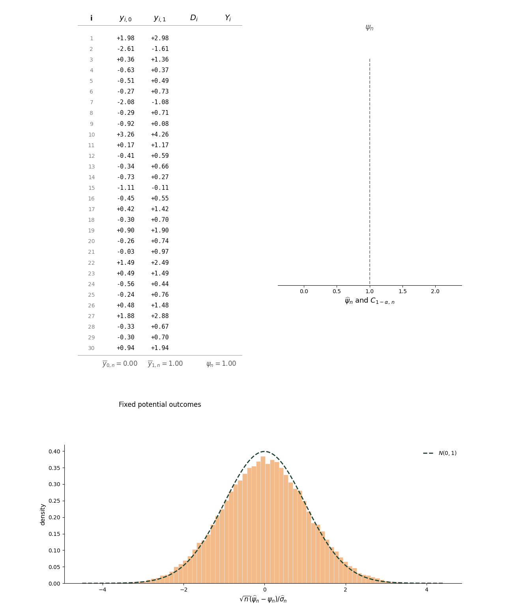

This note derives confidence intervals for linear combinations of treatment group means using data from a randomized experiment. We model the data using a fixed potential outcomes framework and show that the confidence intervals satisfy a uniform coverage property. We also illustrate the confidence intervals' finite-sample behavior using a Monte Carlo simulation.

# Model

Experimental units are indexed by $i = 1, 2, \ldots$.
Each unit is assigned to either treatment or control.
Let $D_i$ denote a treatment indicator, with $D_i = 1$ if unit $i$ is assigned to treatment and $D_i = 0$ otherwise.

Let $y_{i,d}$ denote the **potential outcome** for unit $i$ under treatment $d \in \{0, 1\}$.
We condition on the potential outcomes, so probabilities are computed only over the randomized treatment assignments.

For $d\in\{0,1\}$, define the potential outcome mean, centered potential outcomes, and potential outcome variance by
$$
\overline y_{d,n}
=
\frac{1}{n}\sum_{i=1}^n y_{i,d},
\qquad
u_{i,d,n}
=
y_{i,d}-\overline y_{d,n},
\qquad
S_{d,n}^2
=
\frac{1}{n}\sum_{i=1}^n u_{i,d,n}^2.
$$

Collect the means and centered potential outcomes into the vectors
$$
\overline{\mathbf y}_n
=
\begin{pmatrix}
\overline y_{0,n} \\
\overline y_{1,n}
\end{pmatrix},
\qquad
\mathbf u_{i,n}
=
\begin{pmatrix}
u_{i,0,n} \\
u_{i,1,n}
\end{pmatrix},
$$
and define the covariance matrix

$$
\mathbf{V}_n = \frac{1}{n}\sum_{i=1}^n \mathbf{u}_{i, n} \mathbf{u}_{i, n}'.
$$ {#eq-Vn-def}

We are interested in performing inference on a linear combination of the potential outcome means. Define

$$\psi_n = \mathbf{a}_n' \overline{\mathbf{y}}_n$$

for a nonzero, non-random coefficient vector $\mathbf{a}_n = (a_{0,n}, a_{1,n})'$.
Setting $\mathbf{a}_n = (1, 0)'$ or $\mathbf{a}_n = (0, 1)'$ yields the control or treatment group mean, respectively, while setting $\mathbf{a}_n = (-1, 1)'$ yields the **average treatment effect (ATE)**.
Although these examples use coefficient vectors that are fixed across $n$, we allow $\mathbf a_n$ to vary with $n$ to accommodate other applications. For example, the [sign-specific contrasts in the relative treatment effects note](../lift/#splitting-by-the-control-mean-sign) have coefficients that depend on $n$.

Collect the model primitives into the parameter vector

$$
\theta =
\left(
p,\{y_{i,0}\}_{i=1}^\infty,\{y_{i,1}\}_{i=1}^\infty
\right)
$$

and let $\Theta \subseteq (0, 1) \times \mathbb{R}^\mathbb{N} \times \mathbb{R}^\mathbb{N}$ denote the set of parameters under consideration.
We impose the following assumptions on the data-generating process:

::: {.assumption #asm-random}
**Assumption 1.** $D_1, D_2, \ldots$ are independent Bernoulli random variables with common treatment probability $p$, and there exists $\underline p>0$ such that $\underline p\leq p\leq1-\underline p$ for every $\theta\in\Theta$.
:::

::: {.assumption #asm-sutva}
**Assumption 2.** The observed outcome $Y_i$ satisfies

$$Y_i = D_i y_{i, 1} + (1 - D_i) y_{i, 0}.$$ {#eq-observed-outcome}
:::

::: {.assumption #asm-nondegenerate}
**Assumption 3.** The following regularity conditions hold:

(i) There exists an index $N$ for which $S_{d,n}^2>0$ for all $n\geq N$, $d\in\{0,1\}$, and $\theta\in\Theta$. In addition, for each $d\in\{0,1\}$,

$$
\lim_{n\to\infty}
\sup_{\theta\in\Theta}
\max_{1\leq i\leq n}
\frac{|y_{i,d}-\overline y_{d,n}|}{\sqrt n\,S_{d,n}}
=0.
$$

(ii) Let
$$
\mathbf{b}_n
=
\begin{pmatrix}
-\dfrac{a_{0,n}}{1-p} \\[2ex]
\dfrac{a_{1,n}}{p}
\end{pmatrix}.
$$
There exists an index $N$ for which $\mathbf{b}_n'\mathbf{V}_n\mathbf{b}_n>0$ for all $n\geq N$ and $\theta\in\Theta$. In addition,

$$
\lim_{n \to \infty}
\sup_{\theta\in\Theta}
\frac{1}{n^{3/2}}
\sum_{i=1}^n
\frac{|\mathbf{b}_n'\mathbf{u}_{i,n}|^3}
{(\mathbf{b}_n'\mathbf{V}_n\mathbf{b}_n)^{3/2}}
= 0.
$$ {#eq-scalar-be-condition}
:::

Assumption 1 requires the treatment assignment probability $p$ to be bounded away from zero and one.
In online experiments, randomization is typically performed by hashing unit identifiers into a finite number of buckets divided between treatment groups.
In this case, Assumption 1 holds by taking $\underline{p}$ to be the smallest permitted fraction of buckets that can be allocated to a group.

Assumption 2 requires unit $i$'s observed outcome to depend only on unit $i$'s treatment assignment and not on the treatment assignments of other units. This is a form of the [stable unit treatment value assumption (SUTVA)](https://en.wikipedia.org/wiki/Stable_unit_treatment_value_assumption) and can be restrictive in some settings. For example, if $i$ indexes user sessions, then Assumption 2 rules out treatment in one session changing potential outcomes in subsequent sessions.
In practice, such spillovers can often be handled by randomizing at a coarser level.

Assumption 3(i) rules out dominant units by requiring that no single unit accounts for a non-negligible share of potential outcome variation.
Assumption 3(ii) ensures the [Berry--Esseen bound](https://en.wikipedia.org/wiki/Berry%E2%80%93Esseen_theorem) for the target contrast vanishes uniformly over $\Theta$.
In the [Appendix](#sec-stationary-ergodic-conditions), we show that if candidate potential outcome paths are modeled as realizations of a stationary ergodic process with a finite third moment and positive definite covariance, then for any $\epsilon>0$ there is a set of potential outcome paths occurring with probability at least $1-\epsilon$ such that Assumption 3 holds after restricting $\Theta$ to parameters whose potential outcome paths lie in that set.

The positivity requirement in Assumption 3(ii) follows if $\mathbf V_n$ is positive definite for all sufficiently large $n$ and every $\theta\in\Theta$.
However, requiring positive definiteness is stronger than necessary and excludes natural cases such as $y_{i,1}=y_{i,0}$ for every $i$.
Weaker, target-specific conditions suffice in several cases of interest. For a single treatment group mean, Assumption 3(i) implies Assumption 3(ii) without any further restrictions.
In this case, the quadratic form $\mathbf b_n'\mathbf V_n\mathbf b_n$ is a positive multiple of $S_{d,n}^2$ and is therefore eventually positive by Assumption 3(i).
The scale factors in $\mathbf b_n'\mathbf u_{i,n}$ and $\mathbf b_n'\mathbf V_n\mathbf b_n$ also cancel, so the expression in (-@eq-scalar-be-condition) reduces to
$$
\frac{1}{n^{3/2}}
\sum_{i=1}^n
\frac{|u_{i,d,n}|^3}{S_{d,n}^3}.
$$
Since $n^{-1}\sum_{i=1}^n u_{i,d,n}^2/S_{d,n}^2=1$, this expression satisfies
$$
\begin{aligned}
\frac{1}{n^{3/2}}
\sum_{i=1}^n
\frac{|u_{i,d,n}|^3}{S_{d,n}^3}
&\leq
\max_{1\leq i\leq n}
\frac{|u_{i,d,n}|}{\sqrt n\,S_{d,n}}
\left(
\frac{1}{n}\sum_{i=1}^n
\frac{u_{i,d,n}^2}{S_{d,n}^2}
\right) \\
&=
\max_{1\leq i\leq n}
\frac{|u_{i,d,n}|}{\sqrt n\,S_{d,n}},
\end{aligned}
$$
which converges uniformly to zero by Assumption 3(i).
In the [Appendix](#sec-ate-regularity), we show that Assumption 3(i) also implies Assumption 3(ii) for the ATE as long as
$$
\liminf_{n\to\infty} \inf_{\theta\in\Theta} \frac{n^{-1}\sum_{i=1}^n u_{i,0,n}u_{i,1,n}}
{S_{0,n}S_{1,n}} > -1.
$$ {#eq-ate-correlation-condition}
This condition requires the potential outcome correlation to remain uniformly bounded away from $-1$.

We assume access to a finite sample $\{(D_i, Y_i)\}_{i=1}^n$.
For $\theta\in\Theta$, we let $\mathbb{P}_\theta$ denote probability of the observed sample under the random assignment mechanism in Assumption 1 and the observation equation in Assumption 2.
We let $\mathcal{P} = \{\mathbb{P}_\theta: \theta \in \Theta\}$ denote the set of possible probability measures.

# Inference

## Uniform asymptotics

Throughout this note, asymptotic statements are made uniformly over the family of distributions $\mathcal{P}$ induced by the parameters in $\Theta$.
Because this framework differs slightly from canonical pointwise asymptotics, we first define the relevant modes of convergence and stochastic-order notation.
We also record uniform analogues of a few pointwise asymptotic results and define the notion of uniform asymptotic validity for a sequence of confidence sets.

We say $X_n$ converges in $\mathcal{P}$ to $X$, written as $X_n \stackrel{\mathcal{P}}{\to} X$, if for every $\epsilon > 0$,
$$
\lim_{n \to \infty} \sup_{\theta \in \Theta} \mathbb{P}_\theta(\|X_n - X\| > \epsilon) = 0.
$$

Suppose $X$ has distribution function $F$ that does not depend on $\theta$.
We say $X_n$ converges weakly in $\mathcal{P}$ to $X$, written as $X_n \stackrel{\mathcal{P}}{\rightsquigarrow} X$, if for every continuity point $t$ of $F$, we have
$$
\lim_{n \to \infty} \sup_{\theta \in \Theta} \left|\mathbb{P}_\theta(X_n \leq t) - F(t)\right| = 0.
$$
For a positive deterministic sequence $r_n$, we write $X_n=o_{\mathcal{P}}(r_n)$ if $X_n/r_n \stackrel{\mathcal{P}}{\to} 0$.
We write $X_n=O_{\mathcal{P}}(r_n)$ if, for every $\epsilon > 0$, there exist finite constants $M$ and $N$ such that
$$
\sup_{\theta\in\Theta}
\mathbb{P}_\theta\left(\|X_n\|>Mr_n\right)
<\epsilon
$$
for all $n\geq N$.

We will use the following boundedness consequence of weak convergence:

::: {.theorem #weak-convergence-bounded-thm}
**Proposition 1.** If $X_n\stackrel{\mathcal{P}}{\rightsquigarrow}X$, then

$$
X_n=O_{\mathcal{P}}(1).
$$
:::

We will also use the following stochastic-order relationships:

::: {.theorem #stochastic-order-thm}
**Proposition 2.** For positive deterministic sequences $r_n$ and $s_n$, the following relationships hold:

$$
\begin{aligned}
X_n=O_{\mathcal{P}}(r_n),\ Y_n=O_{\mathcal{P}}(s_n)
&\quad\Rightarrow\quad
X_n+Y_n=O_{\mathcal{P}}(r_n+s_n), \\[1ex]
X_n=O_{\mathcal{P}}(r_n),\ Y_n=O_{\mathcal{P}}(s_n)
&\quad\Rightarrow\quad
X_nY_n=O_{\mathcal{P}}(r_ns_n), \\[1ex]
X_n=o_{\mathcal{P}}(r_n),\ Y_n=O_{\mathcal{P}}(s_n)
&\quad\Rightarrow\quad
X_nY_n=o_{\mathcal{P}}(r_ns_n), \\[1ex]
X_n=O_{\mathcal{P}}(r_n),\ r_n\to 0
&\quad\Rightarrow\quad
X_n=o_{\mathcal{P}}(1).
\end{aligned}
$$
:::

The next proposition is a uniform analogue of the [continuous mapping theorem](https://en.wikipedia.org/wiki/Continuous_mapping_theorem):

::: {.theorem #continuous-mapping-thm}
**Proposition 3.** Suppose $X_n\stackrel{\mathcal{P}}{\to}c$ for a constant $c$. If $g$ is continuous at $c$, then

$$
g(X_n)\stackrel{\mathcal{P}}{\to}g(c).
$$

If $X_n\stackrel{\mathcal{P}}{\rightsquigarrow}X$ and $g$ is continuous, then

$$
g(X_n)\stackrel{\mathcal{P}}{\rightsquigarrow}g(X).
$$
:::

The next result records useful joint-convergence rules:

::: {.theorem #joint-convergence-thm}
**Proposition 4.** If $X_n\stackrel{\mathcal{P}}{\to}X$ and $Y_n\stackrel{\mathcal{P}}{\to}Y$, then

$$
(X_n,Y_n)\stackrel{\mathcal{P}}{\to}(X,Y).
$$

If $X_n\stackrel{\mathcal{P}}{\rightsquigarrow}X$ and $Y_n\stackrel{\mathcal{P}}{\to}c$ for a real constant $c$, then

$$
(X_n,Y_n)\stackrel{\mathcal{P}}{\rightsquigarrow}(X,c).
$$
:::

Propositions 3 and 4 immediately imply a uniform version of [Slutsky's theorem](https://en.wikipedia.org/wiki/Slutsky%27s_theorem):

::: {.theorem #slutsky-thm}
**Proposition 5.** Suppose $X_n \stackrel{\mathcal{P}}{\rightsquigarrow} X$ and $Y_n \stackrel{\mathcal{P}}{\to} c$ for a real constant $c$. Then

$$
\begin{aligned}
X_n + Y_n &\stackrel{\mathcal{P}}{\rightsquigarrow} X + c, \\
X_nY_n &\stackrel{\mathcal{P}}{\rightsquigarrow} cX, \\
\frac{X_n}{Y_n} &\stackrel{\mathcal{P}}{\rightsquigarrow} X/c,\qquad c\neq0.
\end{aligned}
$$
:::

Proofs of these propositions can be found in the [Appendix](#sec-proposition-proofs).

Now for $\alpha \in (0, 1)$, let

$$C_{1-\alpha,n} = C_{1-\alpha,n}(D_1, \ldots, D_n, Y_1, \ldots, Y_n)$$ {#eq-ci-form}

denote a confidence set for $\psi_n$ with nominal coverage level $1-\alpha$.
The sequence $\{C_{1-\alpha,n}\}_{n \geq 1}$ is **finite-sample valid** for $\{\psi_n\}_{n \geq 1}$ over $\Theta$ if

$$\mathbb{P}_\theta\left(\psi_n \in C_{1-\alpha,n}\right) \geq 1 - \alpha \quad \text{ for all } n \geq 1 \text{ and } \theta \in \Theta.$$ {#eq-fixed-horizon-p}

This condition is typically too demanding, so we use an asymptotic criterion instead.
The sequence $\{C_{1-\alpha,n}\}_{n \geq 1}$ is **asymptotically valid** for $\{\psi_n\}_{n\geq 1}$ over $\Theta$ if

$$
\liminf_{n \to \infty}
\inf_{\theta\in\Theta}
\mathbb{P}_\theta\left(\psi_n \in C_{1-\alpha,n}\right)
\geq 1 - \alpha.
$$ {#eq-asymptotic-p}

If (-@eq-asymptotic-p) holds, then for any $\epsilon > 0$, there exists an index $N$ such that $C_{1-\alpha,n}$ contains $\psi_n$ with probability at least $1-\alpha-\epsilon$ for every $n\geq N$ and every $\theta\in\Theta$.

## Estimator

We estimate $\psi_n$ by replacing the potential outcome means with the control and treatment sample means.
Let $D_{i,1}=D_i$ and $D_{i,0}=1-D_i$.
For $d\in\{0,1\}$, define
$$
\overline D_{d,n}
=
\frac{1}{n}\sum_{i=1}^nD_{i,d}.
$$

Whenever $\overline D_{d,n}>0$, define the sample means
$$
\widehat y_{d,n}
=
\frac{1}{n\overline D_{d,n}}
\sum_{i=1}^nD_{i,d}Y_i,
\qquad
\widehat{\mathbf y}_n
=
\begin{pmatrix}
\widehat y_{0,n} \\
\widehat y_{1,n}
\end{pmatrix}
$$ {#eq-estimators}

and set

$$
\widehat{\psi}_n = \mathbf{a}_n'\widehat{\mathbf{y}}_n.
$$

We estimate the sampling variance of $\widehat{\psi}_n$ using

$$
\widehat{\sigma}_n^2
=
\overline D_{1,n}\overline D_{0,n}
\left(
\frac{|a_{0,n}|\widehat S_{0,n}}{\overline D_{0,n}}
+
\frac{|a_{1,n}|\widehat S_{1,n}}{\overline D_{1,n}}
\right)^2,
$$ {#eq-sigma-hat}

where

$$
\widehat S_{d,n}^2
=
\frac{1}{n\overline D_{d,n}}
\sum_{i=1}^nD_{i,d}\left(Y_i-\widehat y_{d,n}\right)^2,
\qquad d\in\{0,1\},
$$ {#eq-S-hat}

denote the observed within-group variances.
Let
$$
\widetilde{\sigma}_n^2 = p(1-p)
\left(
\frac{|a_{0,n}|S_{0,n}}{1-p}
+
\frac{|a_{1,n}|S_{1,n}}{p}
\right)^2
$$ {#eq-sigma-tilde}

In the [Appendix](#sec-estimator-asymptotics), we show
$$
\frac{\widehat{\sigma}_n^2}{\widetilde{\sigma}_n^2} \stackrel{\mathcal{P}}{\to} 1
$$ {#eq-variance-ratio-consistency}

We also show

$$
\sqrt{n}\left(\frac{\widehat{\psi}_n-\psi_n}{\widehat{\sigma}_n}\right)
= \frac{\sum_{i=1}^n X_{i,n}}{\widehat{\sigma}_n} + o_{\mathcal{P}}(1),
$$ {#eq-means-asymptotic-linearization}

where

$$
X_{i,n} = \frac{D_i - p}{\sqrt{n}}
\mathbf{b}_n'\mathbf{u}_{i,n}
$$

Under Assumption 1, the summands $X_{i,n}$ form a triangular array of row-wise independent, mean-zero random variables.
Define the variance of the sum as

$$
\sigma_n^2 = \sum_{i=1}^n \mathbb{V}(X_{i,n}) = p(1-p)\mathbf{b}_n'\mathbf{V}_n\mathbf{b}_n.
$$ {#eq-sigma}

By Assumption 3(ii), there exists an index $N$ for which $\sigma_n^2 > 0$ for all $n \geq N$ and all $\theta \in \Theta$.
The absolute third moment of the standardized summand is
$$
\begin{aligned}
\mathbb{E}_\theta\left|\frac{X_{i,n}}{\sigma_n}\right|^3
&=
\frac{\mathbb{E}_\theta|D_i-p|^3}{\{p(1-p)\}^{3/2}}\frac{1}{n^{3/2}}
\frac{|\mathbf{b}_n'\mathbf{u}_{i,n}|^3}{(\mathbf{b}_n'\mathbf{V}_n\mathbf{b}_n)^{3/2}} \\[1ex]
&=
\frac{p^2+(1-p)^2}{\sqrt{p(1-p)}}
\frac{1}{n^{3/2}}
\frac{|\mathbf{b}_n'\mathbf{u}_{i,n}|^3}{(\mathbf{b}_n'\mathbf{V}_n\mathbf{b}_n)^{3/2}}.
\end{aligned}
$$

Summing over $i$, taking the supremum over $\theta\in\Theta$, and using the lower bound on the assignment probabilities in Assumption 1, we have

$$
\begin{aligned}
\sup_{\theta\in\Theta}
\sum_{i=1}^n
\mathbb{E}_\theta\left|\frac{X_{i,n}}{\sigma_n}\right|^3
&\leq
\frac{1}{\sqrt{\underline p(1-\underline p)}}
\sup_{\theta\in\Theta}
\frac{1}{n^{3/2}}\sum_{i=1}^n
\frac{|\mathbf{b}_n'\mathbf{u}_{i,n}|^3}
{(\mathbf{b}_n'\mathbf{V}_n\mathbf{b}_n)^{3/2}}.
\end{aligned}
$$

The Berry--Esseen theorem for independent, non-identically distributed summands gives the uniform bound

$$
\begin{aligned}
\sup_{\theta\in\Theta}
\sup_{t\in\mathbb{R}}
\left|
\mathbb{P}_\theta\left(
\frac{\sum_{i=1}^n X_{i,n}}{\sigma_n}
\leq t
\right)
-
\Phi(t)
\right|
&\leq
C\sup_{\theta\in\Theta}
\sum_{i=1}^n\mathbb{E}_\theta\left|\frac{X_{i,n}}{\sigma_n}\right|^3 \\
&\leq
\frac{C}{\sqrt{\underline p(1-\underline p)}}
\sup_{\theta\in\Theta}
\frac{1}{n^{3/2}}\sum_{i=1}^n
\frac{|\mathbf{b}_n'\mathbf{u}_{i,n}|^3}
{(\mathbf{b}_n'\mathbf{V}_n\mathbf{b}_n)^{3/2}},
\end{aligned}
$$ {#eq-dim-clt}

where $C$ is a finite universal constant.
Therefore, by Assumption 3(ii),

$$
\lim_{n\to\infty}
\sup_{\theta\in\Theta}
\left|
\mathbb{P}_\theta\left(
\frac{\sum_{i=1}^n X_{i,n}}{\sigma_n}
\leq t
\right)
-
\Phi(t)
\right|
=0
$$ {#eq-normal-approx}
for every $t\in\mathbb{R}$.
Thus
$$
\frac{\sum_{i=1}^n X_{i,n}}{\sigma_n} \stackrel{\mathcal{P}}{\rightsquigarrow} N(0, 1).
$$

## Confidence interval

We now form the confidence interval

$$
C_{1-\alpha,n}
=
\left[
\widehat{\psi}_n - z_{1-\alpha/2}\sqrt{\frac{\widehat{\sigma}_n^2}{n}},
\widehat{\psi}_n + z_{1-\alpha/2}\sqrt{\frac{\widehat{\sigma}_n^2}{n}}
\right],
$$ {#eq-wald-ci}

where $z_{1-\alpha/2}$ is the $(1-\alpha/2)$ quantile of the standard normal distribution.
The event that this interval covers $\psi_n$ can be expressed as

$$
\sqrt{n}\left|\frac{\widehat{\psi}_n-\psi_n}{\widehat{\sigma}_n}\right|\leq z_{1-\alpha/2}.
$$

Fix $\epsilon\in(0,z_{1-\alpha/2})$ and define

$$
r_n =
\sqrt{n}\frac{\widehat{\psi}_n-\psi_n}{\widehat{\sigma}_n}
-
\frac{\sum_{i=1}^n X_{i,n}}{\sigma_n}\frac{\sigma_n}{\widehat{\sigma}_n}.
$$

By the triangle inequality, we have

$$
\sqrt{n}\left|\frac{\widehat{\psi}_n-\psi_n}{\widehat{\sigma}_n}\right|
\leq
\left|\frac{\sum_{i=1}^n X_{i,n}}{\sigma_n}\right|
\frac{\sigma_n}{\widehat{\sigma}_n}
+
\left|r_n\right|.
$$

By the Cauchy--Schwarz inequality, we also have
$$
\begin{aligned}
\sigma_n^2
&=
a_{0,n}^2\frac{p}{1-p}S_{0,n}^2
+
a_{1,n}^2\frac{1-p}{p}S_{1,n}^2 \\
&\quad
- 2a_{0,n}a_{1,n}\frac{1}{n}\sum_{i=1}^n
(y_{i,0}-\overline{y}_{0,n})(y_{i,1}-\overline{y}_{1,n})\\
&\leq
a_{0,n}^2\frac{p}{1-p}S_{0,n}^2
+
a_{1,n}^2\frac{1-p}{p}S_{1,n}^2 + 2|a_{0,n}a_{1,n}|S_{0,n}S_{1,n} \\
&= \widetilde{\sigma}_n^2.
\end{aligned}
$$ {#eq-conservative-variance}

Therefore

$$
\left\{
\left|\frac{\sum_{i=1}^n X_{i,n}}{\sigma_n}\right|
\leq
\frac{z_{1-\alpha/2}-\epsilon}{1+\epsilon}
\right\}
\cap
\left\{
\frac{\widetilde{\sigma}_n}{\widehat{\sigma}_n}
\leq1+\epsilon
\right\}
\cap
\left\{
\left|r_n\right|
\leq\epsilon
\right\}
\subseteq
\bigl\{\psi_n\in C_{1-\alpha,n}\bigr\},
$$

which implies

$$
\begin{aligned}
\inf_{\theta\in\Theta}
\mathbb{P}_\theta\left(\psi_n \in C_{1-\alpha, n}\right)
&\geq
\inf_{\theta\in\Theta}
\mathbb{P}_\theta\left(
\left|\frac{\sum_{i=1}^n X_{i,n}}{\sigma_n}\right|
\leq
\frac{z_{1-\alpha/2}-\epsilon}{1+\epsilon}
\right) \\
&\quad -
\sup_{\theta\in\Theta}
\mathbb{P}_\theta\left(
\frac{\widetilde{\sigma}_n}{\widehat{\sigma}_n}
>1+\epsilon
\right)
-
\sup_{\theta\in\Theta}
\mathbb{P}_\theta\left(\left|r_n\right|>\epsilon\right).
\end{aligned}
$$ {#eq-conservative-clt}

The second term tends to zero because of (-@eq-variance-ratio-consistency).
The third term tends to zero by (-@eq-means-asymptotic-linearization).
For the first term, (-@eq-normal-approx) gives

$$
\begin{aligned}
\liminf_{n\to\infty}
\inf_{\theta\in\Theta}
\mathbb{P}_\theta\left(\psi_n \in C_{1-\alpha, n}\right)
&\geq
\Phi\left(\frac{z_{1-\alpha/2}-\epsilon}{1+\epsilon}\right)-\Phi\left(-\frac{z_{1-\alpha/2}-\epsilon}{1+\epsilon}\right).
\end{aligned}
$$

Letting $\epsilon \downarrow 0$, we obtain

$$
\liminf_{n\to\infty}
\inf_{\theta\in\Theta}
\mathbb{P}_\theta\left(\psi_n \in C_{1-\alpha,n}\right)
\geq
\Phi(z_{1-\alpha/2}) - \Phi(-z_{1-\alpha/2}) = 1-\alpha.
$$ {#eq-asymptotic-conservative}

Therefore $\{C_{1-\alpha,n}\}_{n \geq 1}$ is asymptotically valid for $\{\psi_n\}_{n \geq 1}$ over $\Theta$.

# Illustration

The animation below illustrates the sampling behavior of the confidence interval in (-@eq-wald-ci).
The left panel displays a fixed set of potential outcomes for the first 20 observations of a sample of $n = 1{,}000$ units.
In each frame, a new treatment assignment is drawn and the corresponding observed outcomes are shown.
The potential outcomes do not change; all variation in the confidence intervals comes from the randomized assignment draws.
The top-right panel displays the resulting estimator for the average treatment effect $\psi_n = \overline{y}_{1,n} - \overline{y}_{0,n}$ and its corresponding $95\%$ confidence interval, colored green when the interval contains $\psi_n$ and red otherwise.
The bottom-right panel shows the sampling distribution of the studentized estimator $\sqrt{n}(\widehat{\psi}_n-\psi_n)/\widehat{\sigma}_n$ across 50,000 assignment draws, together with the standard normal density.

In the animation, $y_{i,1} = y_{i,0} + 1$ for every $i$.
In this case, the conservative bound in (-@eq-conservative-variance) coincides with the true variance. The studentized estimator closely tracks the standard normal and the empirical coverage is close to the nominal $95\%$ level.

{#fig-homogeneous-coverage}

# Appendix

## A stationary ergodic motivation for the regularity assumptions {#sec-stationary-ergodic-conditions}

Suppose $\mathbf{Y}_i = (Y_{i,0}, Y_{i,1})'$ is a stationary ergodic process.
Let $\mathbb{P}_\mathbf{Y}$ denote the process law for $\mathbf{Y}$.
Write

$$
\boldsymbol{\mu}=\mathbb{E}_\mathbf{Y}[\mathbf{Y}_1],
\qquad
\mathbf{M}=\mathbb{E}_\mathbf{Y}[\mathbf{Y}_1\mathbf{Y}_1'],
\qquad
\mathbf{V}=\mathbf{M}-\boldsymbol{\mu}\boldsymbol{\mu}'.
$$

Assume

$$
\mathbb{E}_\mathbf{Y}\|\mathbf{Y}_1\|^3<\infty
$$

and that $\mathbf{V}$ is positive definite.
By the ergodic theorem,

$$
\begin{gathered}
\frac{1}{n}\sum_{i=1}^n\mathbf{Y}_i
\to
\boldsymbol{\mu},
\\[1ex]
\frac{1}{n}\sum_{i=1}^n\mathbf{Y}_i\mathbf{Y}_i'
\to
\mathbf{M},
\\[1ex]
\frac{1}{n}\sum_{i=1}^n\|\mathbf{Y}_i\|^3
\to
\mathbb{E}_\mathbf{Y}\|\mathbf{Y}_1\|^3
\end{gathered}
$$

with $\mathbb{P}_\mathbf{Y}$-probability one.

Fix $\epsilon > 0$.
By [Egorov's theorem](https://en.wikipedia.org/wiki/Egorov%27s_theorem), there exists a set $E$ of paths with $\mathbb{P}_\mathbf{Y}(E)>1-\epsilon$ such that these convergences hold uniformly on $E$.
Let $\Theta$ be the set of parameters whose treatment probability satisfies Assumption 1 and whose potential outcome path lies in $E$.
For a realized path, write $\mathbf y_i=(y_{i,0},y_{i,1})'$.

We now verify $\Theta$ satisfies Assumption 3(i).
The uniform convergence of the first and second empirical moments implies

$$
\lim_{n\to\infty}
\sup_{\theta\in\Theta}
\left\|
\mathbf{V}_n-\mathbf{V}
\right\|
=0.
$$ {#eq-Vn-uniform-convergence}

Since $\mathbf{V}$ is positive definite, there exists $c>0$ such that

$$
\mathbf{x}'\mathbf{V}\mathbf{x}
\geq
c\|\mathbf{x}\|^2
\qquad
\text{for all }\,\mathbf{x}\in\mathbb{R}^2.
$$

Since
$$
\begin{aligned}
\mathbf{x}'\mathbf{V}_n\mathbf{x}
&=
\mathbf{x}'\mathbf{V}\mathbf{x}
+
\mathbf{x}'(\mathbf{V}_n-\mathbf{V})\mathbf{x} \\
&\geq
c\|\mathbf{x}\|^2
-
\|\mathbf{V}_n-\mathbf{V}\|\,\|\mathbf{x}\|^2
\end{aligned}
$$
for any $\theta\in\Theta$ and $\mathbf{x}\in\mathbb{R}^2$, (-@eq-Vn-uniform-convergence) implies the existence of an index $N$ for which

$$
\mathbf{x}'\mathbf{V}_n\mathbf{x}
\geq
\frac{c}{2}\|\mathbf{x}\|^2
$$ {#eq-quadratic-form-bound}

for all $n\geq N$, $\theta\in\Theta$, and $\mathbf{x}\in\mathbb{R}^2$.
Since $S_{d,n}^2=\mathbf{e}_d'\mathbf{V}_n\mathbf{e}_d$, where $\mathbf{e}_d$ is the coordinate vector corresponding to treatment state $d$, (-@eq-quadratic-form-bound) implies

$$
S_{d,n}^2
\geq \frac{c}{2} > 0
$$

for all $n \geq N$, $\theta\in\Theta$, and $d\in\{0,1\}$.

It remains to verify the negligibility condition.
For each $d\in\{0,1\}$, the Cauchy--Schwarz inequality gives

$$
\begin{aligned}
|u_{i,d,n}|
&=
|\mathbf{e}_d'\mathbf{u}_{i,n}| \\
&=
|(\mathbf{V}_n^{1/2}\mathbf{e}_d)'\mathbf{V}_n^{-1/2}\mathbf{u}_{i,n}| \\
&\leq
\left(\mathbf{e}_d'\mathbf{V}_n\mathbf{e}_d\right)^{1/2}
\left\|\mathbf{V}_n^{-1/2}\mathbf{u}_{i,n}\right\| \\
&=
S_{d,n}
\left\|\mathbf{V}_n^{-1/2}\mathbf{u}_{i,n}\right\|.
\end{aligned}
$$ {#eq-coordinate-cauchy-schwarz}

Therefore, using $\max_i z_i^3\leq\sum_i z_i^3$ for nonnegative $z_i$,

$$
\begin{aligned}
\sup_{\theta\in\Theta}
\max_{1\leq i\leq n}
\frac{|u_{i,d,n}|}{\sqrt n\,S_{d,n}}
&\leq
\left(
\sup_{\theta\in\Theta}
\frac{1}{n^{3/2}}
\sum_{i=1}^n
\left\|\mathbf{V}_n^{-1/2}\mathbf{u}_{i,n}\right\|^3
\right)^{1/3}.
\end{aligned}
$$ {#eq-marginal-leverage-via-full-vector}

Now using submultiplicativity of the operator norm, together with the triangle inequality and Jensen's inequality, we obtain

$$
\begin{aligned}
\sup_{\theta\in\Theta}
\frac{1}{n^{3/2}}
\sum_{i=1}^n
\left\|
\mathbf{V}_n^{-1/2}\mathbf{u}_{i,n}
\right\|^3
&\leq
\frac{1}{\sqrt n}
\sup_{\theta\in\Theta}\left\|\mathbf{V}_n^{-1/2}\right\|^3
\sup_{\theta\in\Theta}
\frac{1}{n}
\sum_{i=1}^n
\left\|
\mathbf{u}_{i,n}
\right\|^3 \\
&\leq
\frac{C}{\sqrt n}
\sup_{\theta\in\Theta}\left\|\mathbf{V}_n^{-1/2}\right\|^3
\left[
\sup_{\theta\in\Theta}
\frac{1}{n}
\sum_{i=1}^n
\left\|
\mathbf{y}_i
\right\|^3
+
\sup_{\theta\in\Theta}
\left\|
\overline{\mathbf{y}}_n
\right\|^3
\right].
\end{aligned}
$$ {#eq-be-bound}

The bound in (-@eq-quadratic-form-bound) implies

$$
\sup_{\theta\in\Theta}
\left\|\mathbf{V}_n^{-1/2}\right\|
\leq
\left(\frac{2}{c}\right)^{1/2}
$$

for $n \geq N$.
The bracketed term in (-@eq-be-bound) is also bounded uniformly for all sufficiently large $n$ by the uniform convergence of the first and third empirical moments.
Therefore

$$
\lim_{n\to\infty}
\sup_{\theta\in\Theta}
\frac{1}{n^{3/2}}
\sum_{i=1}^n
\left\|
\mathbf{V}_n^{-1/2}\mathbf{u}_{i,n}
\right\|^3
= 0.
$$ {#eq-full-vector-be-vanishing}

Combining (-@eq-full-vector-be-vanishing) with (-@eq-marginal-leverage-via-full-vector) gives

$$
\lim_{n\to\infty}
\sup_{\theta\in\Theta}
\max_{1\leq i\leq n}
\frac{|u_{i,d,n}|}{\sqrt n\,S_{d,n}}
= 0.
$$

We next verify Assumption 3(ii).
Since $\mathbf{a}_n$ is nonzero, so is $\mathbf{b}_n$. Applying (-@eq-quadratic-form-bound) with $\mathbf{x}=\mathbf{b}_n$ gives

$$\mathbf{b}_n'\mathbf{V}_n\mathbf{b}_n>0$$

for all $n \geq N$ and $\theta\in\Theta$.

For the scalar Berry--Esseen condition, using the same Cauchy--Schwarz argument as in (-@eq-coordinate-cauchy-schwarz) with $\mathbf{b}_n$ in place of $\mathbf{e}_d$, we obtain

$$
\frac{|\mathbf{b}_n'\mathbf{u}_{i,n}|^3}{(\mathbf{b}_n'\mathbf{V}_n\mathbf{b}_n)^{3/2}}
\leq
\left\|\mathbf{V}_n^{-1/2}\mathbf{u}_{i,n}\right\|^3.
$$

After summing over $i$ and applying (-@eq-full-vector-be-vanishing), we obtain

$$
\lim_{n\to\infty}
\sup_{\theta\in\Theta}
\frac{1}{n^{3/2}}
\sum_{i=1}^n
\frac{|\mathbf{b}_n'\mathbf{u}_{i,n}|^3}
{(\mathbf{b}_n'\mathbf{V}_n\mathbf{b}_n)^{3/2}}
= 0.
$$

## ATE regularity {#sec-ate-regularity}

For all sufficiently large $n$, define the correlation between the control and treatment potential outcomes by
$$
\rho_n
=
\frac{n^{-1}\sum_{i=1}^n u_{i,0,n}u_{i,1,n}}
{S_{0,n}S_{1,n}}.
$$
Under (-@eq-ate-correlation-condition), there exist $\delta\in(0,1]$ and an index $N$ such that $\rho_n\geq-1+\delta$ for every $n\geq N$ and $\theta\in\Theta$.
For the ATE,
$$
\mathbf b_n
=
\begin{pmatrix}
1/(1-p) \\
1/p
\end{pmatrix}.
$$
We then have
$$
\begin{aligned}
\mathbf b_n'\mathbf V_n\mathbf b_n
&=
\frac{S_{0,n}^2}{(1-p)^2}
+\frac{S_{1,n}^2}{p^2}
+2\rho_n\frac{S_{0,n}S_{1,n}}{p(1-p)} \\
&\geq
\frac{S_{0,n}^2}{(1-p)^2}
+\frac{S_{1,n}^2}{p^2}
-2(1-\delta)\frac{S_{0,n}S_{1,n}}{p(1-p)} \\
&\geq
\delta\left(
\frac{S_{0,n}^2}{(1-p)^2}
+\frac{S_{1,n}^2}{p^2}
\right).
\end{aligned}
$$ {#eq-ate-variance-lower-bound}
The Cauchy--Schwarz inequality and (-@eq-ate-variance-lower-bound) imply
$$
\max_{1\leq i\leq n}
\frac{|\mathbf b_n'\mathbf u_{i,n}|}
{\sqrt n\,(\mathbf b_n'\mathbf V_n\mathbf b_n)^{1/2}}
\leq
\frac{1}{\sqrt\delta}
\left\{
\sum_{d=0}^1
\left(
\max_{1\leq i\leq n}
\frac{|u_{i,d,n}|}{\sqrt n\,S_{d,n}}
\right)^2
\right\}^{1/2},
$$
which converges uniformly to zero by Assumption 3(i).
Therefore
$$
\begin{aligned}
\frac{1}{n^{3/2}}
\sum_{i=1}^n
\frac{|\mathbf b_n'\mathbf u_{i,n}|^3}
{(\mathbf b_n'\mathbf V_n\mathbf b_n)^{3/2}}
&\leq
\max_{1\leq i\leq n}
\frac{|\mathbf b_n'\mathbf u_{i,n}|}
{\sqrt n\,(\mathbf b_n'\mathbf V_n\mathbf b_n)^{1/2}}
\left(
\frac{1}{n}\sum_{i=1}^n
\frac{(\mathbf b_n'\mathbf u_{i,n})^2}
{\mathbf b_n'\mathbf V_n\mathbf b_n}
\right) \\
&=
\max_{1\leq i\leq n}
\frac{|\mathbf b_n'\mathbf u_{i,n}|}
{\sqrt n\,(\mathbf b_n'\mathbf V_n\mathbf b_n)^{1/2}},
\end{aligned}
$$
so Assumption 3(ii) follows.

## Proofs of the asymptotic propositions {#sec-proposition-proofs}

### [Proposition 1](#weak-convergence-bounded-thm)

Suppose $X_n\stackrel{\mathcal{P}}{\rightsquigarrow}X$.
Fix $\epsilon>0$ and let $F$ denote the distribution function of $X$.
Choose a finite constant $K$ such that $-K$ and $K$ are continuity points of $F$ and

$$
F(-K)+1-F(K)<\epsilon/2.
$$

Since

$$
\mathbb{P}_\theta(|X_n|>K)
\leq
\mathbb{P}_\theta(X_n\leq -K)
+
1-\mathbb{P}_\theta(X_n\leq K),
$$

$X_n\stackrel{\mathcal{P}}{\rightsquigarrow}X$ implies

$$
\limsup_{n\to\infty}
\sup_{\theta\in\Theta}
\mathbb{P}_\theta(|X_n|>K)
\leq
F(-K)+1-F(K)
<\epsilon/2.
$$

Thus, for all sufficiently large $n$,

$$
\sup_{\theta\in\Theta}
\mathbb{P}_\theta(|X_n|>K)<\epsilon.
$$

Since $\epsilon>0$ was arbitrary, $X_n=O_{\mathcal{P}}(1)$.

### [Proposition 2](#stochastic-order-thm)

For $M>0$, write $A_n^M=\{\|X_n\|>Mr_n\}$ and $B_n^M=\{\|Y_n\|>Ms_n\}$.

**Sum.**
Fix $\epsilon>0$.
By the two stochastic-order assumptions, we can choose finite constants $M_X$ and $M_Y$ and an index $N$ so that

$$
\sup_{\theta\in\Theta}\mathbb{P}_\theta\left(A_n^{M_X}\right)<\epsilon/2,
\qquad
\sup_{\theta\in\Theta}\mathbb{P}_\theta\left(B_n^{M_Y}\right)<\epsilon/2
$$

for all $n\geq N$.
Taking $M=\max\{M_X,M_Y\}$, the same bounds hold with $M$ in place of $M_X$ and $M_Y$.
On $\left(A_n^{M}\right)^c\cap\left(B_n^{M}\right)^c$ we have $\|X_n+Y_n\|\leq\|X_n\|+\|Y_n\|\leq M(r_n+s_n)$, so

$$
\sup_{\theta\in\Theta}\mathbb{P}_\theta\bigl(\|X_n+Y_n\|>M(r_n+s_n)\bigr)
\leq
\sup_{\theta\in\Theta}\mathbb{P}_\theta\left(A_n^{M}\right)
+
\sup_{\theta\in\Theta}\mathbb{P}_\theta\left(B_n^{M}\right)
<\epsilon
$$

for $n\geq N$.
Hence $X_n+Y_n=O_{\mathcal{P}}(r_n+s_n)$.

**Product.**
With the same $M$ and $N$, on $\left(A_n^{M}\right)^c\cap\left(B_n^{M}\right)^c$ we have $\|X_nY_n\|\leq\|X_n\|\,\|Y_n\|\leq M^2 r_ns_n$, so $\sup_{\theta\in\Theta}\mathbb{P}_\theta(\|X_nY_n\|>M^2 r_ns_n)<\epsilon$ for $n\geq N$.
Hence $X_nY_n=O_{\mathcal{P}}(r_ns_n)$.

**Product with a vanishing factor.**
Suppose $X_n=o_{\mathcal{P}}(r_n)$, and fix $\epsilon>0$ and $\delta>0$.
Since $Y_n=O_{\mathcal{P}}(s_n)$, we can choose $M$ and $N$ such that

$$
\sup_{\theta\in\Theta}
\mathbb{P}_\theta\left(B_n^{M}\right)<\delta
$$

for all $n\geq N$.
On $\left(B_n^{M}\right)^c$, the event $\|X_nY_n\|>\epsilon r_ns_n$ implies $\|X_n\|>(\epsilon/M)r_n$, so

$$
\mathbb{P}_\theta(\|X_nY_n\|>\epsilon r_ns_n)
\leq
\mathbb{P}_\theta\bigl(\|X_n\|>(\epsilon/M)r_n\bigr)
+\mathbb{P}_\theta\left(B_n^{M}\right).
$$

Taking the supremum over $\theta$ and the limit superior gives

$$
\begin{aligned}
&\limsup_{n\to\infty}
\sup_{\theta\in\Theta}
\mathbb{P}_\theta(\|X_nY_n\|>\epsilon r_ns_n) \\
&\qquad\leq
\limsup_{n\to\infty}
\sup_{\theta\in\Theta}
\mathbb{P}_\theta\bigl(\|X_n\|>(\epsilon/M)r_n\bigr)
+
\limsup_{n\to\infty}
\sup_{\theta\in\Theta}
\mathbb{P}_\theta\left(B_n^{M}\right)
\leq \delta.
\end{aligned}
$$

Taking $\delta\downarrow0$, we can conclude $X_nY_n=o_{\mathcal{P}}(r_ns_n)$.

**Vanishing rate.**
Suppose $X_n=O_{\mathcal{P}}(r_n)$ with $r_n\to 0$, and fix $\delta>0$ and $\epsilon>0$.
Choose $M$ and $N_0$ with $\sup_{\theta\in\Theta}\mathbb{P}_\theta\left(A_n^{M}\right)<\epsilon$ for $n\geq N_0$.
Since $r_n\to 0$, there is $N_1$ with $Mr_n<\delta$ for $n\geq N_1$.
Therefore $\{\|X_n\|>\delta\}\subseteq A_n^{M}$ and $\sup_{\theta\in\Theta}\mathbb{P}_\theta(\|X_n\|>\delta)<\epsilon$ for $n\geq\max(N_0,N_1)$.
Since $\epsilon>0$ was arbitrary, $X_n=o_{\mathcal{P}}(1)$.

### [Proposition 3](#continuous-mapping-thm)

Fix $\epsilon>0$.
Since $g$ is continuous at $c$, there exists $\delta>0$ such that

$$
\|z-c\|<\delta
\quad\Rightarrow\quad
\|g(z)-g(c)\|<\epsilon.
$$

Therefore

$$
\left\{
\|g(X_n)-g(c)\|>\epsilon
\right\}
\subseteq
\left\{
\|X_n-c\|>\delta/2
\right\}.
$$

Taking probabilities and then the supremum over $\theta\in\Theta$ gives

$$
\sup_{\theta\in\Theta}
\mathbb{P}_\theta
\left(
\|g(X_n)-g(c)\|>\epsilon
\right)
\leq
\sup_{\theta\in\Theta}
\mathbb{P}_\theta
\left(
\|X_n-c\|>\delta/2
\right).
$$

The right-hand side tends to zero because $X_n\stackrel{\mathcal{P}}{\to}c$.
Since $\epsilon>0$ was arbitrary, $g(X_n)\stackrel{\mathcal{P}}{\to}g(c)$.

For the weak-convergence statement, we will make use of the following lemma:

::: {.lemma #lem-uniform-continuity-sets}
Suppose $X_n\stackrel{\mathcal{P}}{\rightsquigarrow}X$, where $X_n$ and $X$ take values in $\mathbb{R}^k$. If $A$ is a Borel set with $\mathbb{P}(X\in\partial A)=0$, then

$$
\lim_{n\to \infty}\sup_{\theta\in\Theta}
\left|
\mathbb{P}_\theta(X_n\in A)-\mathbb{P}(X\in A)
\right|
= 0.
$$
:::

::: {.proof-block}
*Proof.* Let $F$ denote the joint distribution function of $X$ and fix $\gamma>0$.
Because probability measures on $\mathbb{R}^k$ are [regular](https://en.wikipedia.org/wiki/Regular_measure) and the boundary of $A$ has zero probability under the distribution of $X$, we can find finite unions of disjoint half-open rectangles $A_-$ and $A_+$, with all corners at continuity points of $F$, such that

$$
A_-\subseteq A\subseteq A_+,
\qquad
\mathbb{P}(X\in A_+\setminus A_-)<\gamma.
$$

Write
$$
A_+=\bigcup_{j=1}^{J_+} R_{+,j},
\qquad
R_{+,j}=\prod_{\ell=1}^k(a_{j\ell},b_{j\ell}],
$$

where the rectangles are disjoint and all corners of all $R_{+,j}$ are continuity points of $F$.
For any such rectangle, $\mathbb{P}_\theta(X_n\in R_{+,j})$ and $\mathbb{P}(X\in R_{+,j})$ can be written by inclusion-exclusion as finite sums of joint distribution-function values at the corners of $R_{+,j}$.
Uniform convergence of the joint distribution functions at those corners therefore implies

$$
\sup_{\theta\in\Theta}
\left|
\mathbb{P}_\theta(X_n\in R_{+,j})-\mathbb{P}(X\in R_{+,j})
\right|
\to 0
$$

for each $j$.
Summing over the finitely many rectangles yields

$$
\begin{gathered}
\sup_{\theta\in\Theta}
\left|
\mathbb{P}_\theta(X_n\in A_+)-\mathbb{P}(X\in A_+)
\right|
\to 0.
\end{gathered}
$$ {#eq-upper-bracketing-set-convergence}

The same argument applied to $A_-$ gives

$$
\begin{gathered}
\sup_{\theta\in\Theta}
\left|
\mathbb{P}_\theta(X_n\in A_-)-\mathbb{P}(X\in A_-)
\right|
\to 0.
\end{gathered}
$$ {#eq-lower-bracketing-set-convergence}

Since $A\subseteq A_+$,

$$
\begin{aligned}
\mathbb{P}_\theta(X_n\in A)-\mathbb{P}(X\in A)
&\leq
\left\{\mathbb{P}_\theta(X_n\in A_+)-\mathbb{P}(X\in A_+)\right\} \\[1ex]
&\quad+
\left\{\mathbb{P}(X\in A_+)-\mathbb{P}(X\in A)\right\}\\[1ex]
&<\left\{\mathbb{P}_\theta(X_n\in A_+)-\mathbb{P}(X\in A_+)\right\} + \gamma.
\end{aligned}
$$

Taking the supremum over $\theta$ and using (-@eq-upper-bracketing-set-convergence), we can conclude

$$
\limsup_{n\to\infty}
\sup_{\theta\in\Theta}
\left\{
\mathbb{P}_\theta(X_n\in A)-\mathbb{P}(X\in A)
\right\}
\leq \gamma.
$$

Similarly, since $A_-\subseteq A$,

$$
\begin{aligned}
\mathbb{P}(X\in A)-\mathbb{P}_\theta(X_n\in A)
&\leq
\left\{\mathbb{P}(X\in A_-)-\mathbb{P}_\theta(X_n\in A_-)\right\} \\[1ex]
&\quad+
\left\{\mathbb{P}(X\in A)-\mathbb{P}(X\in A_-)\right\} \\[1ex]
&<
\left\{\mathbb{P}(X\in A_-)-\mathbb{P}_\theta(X_n\in A_-)\right\}+\gamma.
\end{aligned}
$$

Using (-@eq-lower-bracketing-set-convergence) gives

$$
\limsup_{n\to\infty}
\sup_{\theta\in\Theta}
\left\{
\mathbb{P}(X\in A)-\mathbb{P}_\theta(X_n\in A)
\right\}
\leq \gamma.
$$

Therefore

$$
\limsup_{n\to\infty}
\sup_{\theta\in\Theta}
\left|\mathbb{P}(X\in A)-\mathbb{P}_\theta(X_n\in A)\right|
\leq \gamma.
$$

The desired convergence follows by taking $\gamma \downarrow 0$. $\square$
:::

Returning to the weak-convergence statement, let $H$ denote the distribution function of $g(X)$.
Fix a continuity point $t$ of $H$ and let

$$
A_t=\{z:g(z)\leq t\}.
$$

The inequality is componentwise if $g$ is vector-valued.
Since $g$ is continuous, $\partial A_t$ is contained in $\{z:g(z)\in\partial(-\infty,t]\}$.
Since $t$ is a continuity point of $H$,

$$
\mathbb{P}(X\in\partial A_t)
\leq
\mathbb{P}\left(g(X)\in\partial(-\infty,t]\right)
=0.
$$

Applying the lemma to $A_t$ gives

$$
\begin{aligned}
\sup_{\theta\in\Theta}
\left|
\mathbb{P}_\theta(g(X_n)\leq t)-H(t)
\right|
&=
\sup_{\theta\in\Theta}
\left|
\mathbb{P}_\theta(X_n\in A_t)-\mathbb{P}(X\in A_t)
\right| \\
&\to 0.
\end{aligned}
$$

Thus $g(X_n)\stackrel{\mathcal{P}}{\rightsquigarrow}g(X)$.

### [Proposition 4](#joint-convergence-thm)

First suppose $X_n\stackrel{\mathcal{P}}{\to}X$ and $Y_n\stackrel{\mathcal{P}}{\to}Y$.
For every $\epsilon>0$,

$$
\left\{
\|(X_n,Y_n)-(X,Y)\|>\epsilon
\right\}
\subseteq
\left\{
\|X_n-X\|>\epsilon/2
\right\}
\cup
\left\{
\|Y_n-Y\|>\epsilon/2
\right\}.
$$

Taking probabilities, taking the supremum over $\theta\in\Theta$, and using the two marginal convergences proves

$$
(X_n,Y_n)\stackrel{\mathcal{P}}{\to}(X,Y).
$$

Now suppose $X_n\stackrel{\mathcal{P}}{\rightsquigarrow}X$ and $Y_n\stackrel{\mathcal{P}}{\to}c$ for a real constant $c$.
Let $F$ denote the distribution function of $X$ and let $H$ denote the joint distribution function of $(X,c)$, so

$$
H(s,t)=F(s)\mathbf{1}\{c\leq t\}.
$$

Fix a continuity point $(s,t)$ of $H$.
If $t<c$, then $H(s,t)=0$ and

$$
\sup_{\theta\in\Theta}
\mathbb{P}_\theta(X_n\leq s,Y_n\leq t)
\leq
\sup_{\theta\in\Theta}
\mathbb{P}_\theta\left(|Y_n-c|>\frac{c-t}{2}\right)
\to 0.
$$

If $t=c$, then continuity of $H$ at $(s,c)$ implies $F(s)=0$ and that $s$ is a continuity point of $F$.
Thus $H(s,c)=0$ and

$$
\sup_{\theta\in\Theta}
\mathbb{P}_\theta(X_n\leq s,Y_n\leq c)
\leq
\sup_{\theta\in\Theta}
\mathbb{P}_\theta(X_n\leq s)
\to 0.
$$

If $t>c$, then continuity of $H$ implies that $s$ is a continuity point of $F$.
Since $H(s,t)=F(s)$,

$$
\begin{aligned}
&\sup_{\theta\in\Theta}
\left|
\mathbb{P}_\theta(X_n\leq s,Y_n\leq t)-F(s)
\right| \\
&\qquad\leq
\sup_{\theta\in\Theta}
\left|
\mathbb{P}_\theta(X_n\leq s)-F(s)
\right|
+
\sup_{\theta\in\Theta}
\mathbb{P}_\theta(|Y_n-c|>t-c)
\to 0.
\end{aligned}
$$

Thus the joint distribution functions converge uniformly at every continuity point of $H$, so

$$
(X_n,Y_n)\stackrel{\mathcal{P}}{\rightsquigarrow}(X,c).
$$

### [Proposition 5](#slutsky-thm)

By Proposition 4,

$$
(X_n,Y_n)\stackrel{\mathcal{P}}{\rightsquigarrow}(X,c).
$$

The first two convergence statements then follow from Proposition 3 applied to the continuous maps $(x,y)\mapsto x+y$ and $(x,y)\mapsto xy$.
For the quotient statement, assume $c\neq0$.
The map $y\mapsto 1/y$ is continuous at $c$.
Thus Proposition 3 gives $1/Y_n\stackrel{\mathcal{P}}{\to}1/c$.
Applying Proposition 4 to $X_n$ and $1/Y_n$ gives

$$
\left(X_n,\frac{1}{Y_n}\right)
\stackrel{\mathcal{P}}{\rightsquigarrow}
\left(X,\frac{1}{c}\right),
$$

and Proposition 3 applied to $(x,y)\mapsto xy$ gives

$$
\frac{X_n}{Y_n}\stackrel{\mathcal{P}}{\rightsquigarrow}\frac{X}{c}.
$$

## Estimator asymptotics {#sec-estimator-asymptotics}

### Notation and auxiliary lemma

Let $p_1=p$ and $p_0=1-p$.

Also define

$$
b_{0,n}=\frac{|a_{0,n}|S_{0,n}}{1-p},
\qquad
b_{1,n}=\frac{|a_{1,n}|S_{1,n}}{p},
\qquad
B_n=b_{0,n}+b_{1,n}.
$$

We will use the following lemma:

::: {.lemma #lem-treatment-share-convergence}
For each $d\in\{0,1\}$,

$$
\overline D_{d,n}\stackrel{\mathcal{P}}{\to}p_d,
\qquad
\sqrt n(\overline D_{d,n}-p_d)=O_{\mathcal{P}}(1).
$$
:::

::: {.proof-block}
*Proof.* Under Assumption 1, $D_{1,d},\ldots,D_{n,d}$ are independent Bernoulli random variables with probability $p_d$. Hence

$$
\mathbb{E}_\theta(\overline D_{d,n})=p_d,
\qquad
\mathbb{V}_\theta(\overline D_{d,n})=\frac{p_d(1-p_d)}{n}.
$$

For every $\epsilon>0$, Chebyshev's inequality gives

$$
\begin{aligned}
\sup_{\theta\in\Theta}
\mathbb{P}_\theta\left(
\left|\overline D_{d,n}-p_d\right|>\epsilon
\right)
&\leq
\frac{1}{\epsilon^2}
\sup_{\theta\in\Theta}
\frac{p_d(1-p_d)}{n} \\
&\leq
\frac{1}{4\epsilon^2 n} \\[2ex]
&\to 0.
\end{aligned}
$$

Thus $\overline D_{d,n}\stackrel{\mathcal{P}}{\to}p_d$.
Also, for every $M>0$,

$$
\begin{aligned}
\sup_{\theta\in\Theta}
\mathbb{P}_\theta\left(
\left|\sqrt n(\overline D_{d,n}-p_d)\right|>M
\right)
&\leq
\frac{1}{M^2}
\sup_{\theta\in\Theta}p_d(1-p_d) \\
&\leq
\frac{1}{4M^2}.
\end{aligned}
$$

Therefore $\sqrt n(\overline D_{d,n}-p_d)=O_{\mathcal{P}}(1)$. $\square$
:::

### Derivation of (-@eq-variance-ratio-consistency) {#sec-variance-ratio-consistency}

We first show that

$$
\frac{\widehat{S}_{d,n}^2}{S_{d,n}^2}
\stackrel{\mathcal{P}}{\to}1.
$$ {#eq-Shat-consistency}

for $d \in \{0,1\}$.
Observe that

$$
\begin{aligned}
\widehat{S}_{d,n}^2
&=
\frac{n^{-1}\sum_{i=1}^nD_{i,d}u_{i,d,n}^2}{\overline D_{d,n}}
- \left(\frac{n^{-1}\sum_{i=1}^nD_{i,d}u_{i,d,n}}{\overline D_{d,n}}\right)^2 \\
&= \frac{n^{-1}\sum_{i=1}^nD_{i,d}u_{i,d,n}^2 - p_d\,S_{d,n}^2}{\overline D_{d,n}}
+ \frac{p_d\,S_{d,n}^2}{\overline D_{d,n}}
- \left(\frac{n^{-1}\sum_{i=1}^nD_{i,d}u_{i,d,n}}{\overline D_{d,n}}\right)^2.
\end{aligned}
$$ {#eq-Shat-decomposition}

By Assumption 3(i), there exists an index $N$ for which $S_{d,n}^2>0$ for all $n\geq N$, $d\in\{0,1\}$, and $\theta\in\Theta$.
Together with Lemma 2 and Propositions 3 and 4, (-@eq-Shat-consistency) will follow from (-@eq-Shat-decomposition) if we can show
$$
\frac{n^{-1}\sum_{i=1}^nD_{i,d}u_{i,d,n}^2 - p_d S_{d,n}^2}{S_{d,n}^2}
\stackrel{\mathcal{P}}{\to} 0,
\qquad
\frac{n^{-1}\sum_{i=1}^nD_{i,d}u_{i,d,n}}{S_{d,n}}
\stackrel{\mathcal{P}}{\to} 0.
$$ {#eq-Shat-remainder-bounds}

The first term in (-@eq-Shat-remainder-bounds) has mean zero and variance

$$
\frac{p_d(1-p_d)}{n^2 S_{d,n}^4}\sum_{i=1}^n u_{i,d,n}^4
\leq
\frac{p_d(1-p_d)}{n^2 S_{d,n}^4}
\max_{1 \leq i \leq n} u_{i,d,n}^2
\sum_{i=1}^n u_{i,d,n}^2.
$$

Since $\sum_{i=1}^n u_{i,d,n}^2=nS_{d,n}^2$, we can write the right-hand side as

$$
\frac{p_d(1-p_d)}{n}
\left(\frac{\max_{1 \leq i \leq n} u_{i,d,n}^2}{S_{d,n}^2}\right)
=
p_d(1-p_d)
\left(\frac{\max_{1 \leq i \leq n} |u_{i,d,n}|}{\sqrt{n} S_{d,n}}\right)^2.
$$

Since $p_d(1-p_d)\leq 1/4$, for every $\epsilon>0$,

$$
\begin{aligned}
\sup_{\theta\in\Theta}
\mathbb{P}_\theta\left(
\left|
\frac{n^{-1}\sum_{i=1}^nD_{i,d}u_{i,d,n}^2 - p_d S_{d,n}^2}{S_{d,n}^2}
\right|>
\epsilon
\right)
&\leq
\frac{1}{4\epsilon^2}
\sup_{\theta\in\Theta}
\left(\frac{\max_{1 \leq i \leq n} |u_{i,d,n}|}{\sqrt{n} S_{d,n}}\right)^2
\end{aligned}
$$
by Chebyshev's inequality.
Therefore the first term converges in $\mathcal{P}$ to zero by Assumption 3(i).
Since the second term in (-@eq-Shat-remainder-bounds) has mean zero and variance $p_d(1-p_d)/n$,
it also converges in $\mathcal{P}$ to zero by Chebyshev's inequality.
This proves (-@eq-Shat-consistency).

Since $\widehat{S}_{d,n}$ and $S_{d,n}$ are nonnegative, Proposition 3 also gives

$$
\frac{\widehat{S}_{d,n}}{S_{d,n}}
\stackrel{\mathcal{P}}{\to}1.
$$ {#eq-Shat-root-consistency}

Now by (-@eq-sigma-tilde) and (-@eq-sigma-hat), we have
$$
\frac{\widehat{\sigma}_n^2}{\widetilde{\sigma}_n^2}
=
\frac{\overline D_{1,n}\overline D_{0,n}}{p(1-p)}
\left[
\frac{
\frac{|a_{0,n}|S_{0,n}}{\overline D_{0,n}}\frac{\widehat{S}_{0,n}}{S_{0,n}}
+
\frac{|a_{1,n}|S_{1,n}}{\overline D_{1,n}}\frac{\widehat{S}_{1,n}}{S_{1,n}}
}{
\frac{|a_{0,n}|S_{0,n}}{1-p}
+
\frac{|a_{1,n}|S_{1,n}}{p}
}
\right]^2.
$$ {#eq-sigma-ratio-expansion}

The unbracketed term converges to one in $\mathcal{P}$ by Lemma 2 and Proposition 3.
It therefore suffices to show that the bracketed ratio also converges to one.
For all $n \geq N$, $B_n>0$ and the ratios $b_{0,n}/B_n$ and $b_{1,n}/B_n$ are nonnegative and sum to one.
The difference between the bracketed ratio and one can therefore be bounded by
$$
\begin{aligned}
&\left|
\frac{b_{0,n}}{B_n}
\left(\frac{1-p}{\overline D_{0,n}}\frac{\widehat{S}_{0,n}}{S_{0,n}}\right)
+
\frac{b_{1,n}}{B_n}
\left(\frac{p}{\overline D_{1,n}}\frac{\widehat{S}_{1,n}}{S_{1,n}}\right)
-1
\right| \\
&\leq
\frac{b_{0,n}}{B_n}
\left|
\frac{1-p}{\overline D_{0,n}}\frac{\widehat{S}_{0,n}}{S_{0,n}}
-1
\right|
+
\frac{b_{1,n}}{B_n}
\left|
\frac{p}{\overline D_{1,n}}\frac{\widehat{S}_{1,n}}{S_{1,n}}
-1
\right|
\\
&\leq
\left|
\frac{1-p}{\overline D_{0,n}}\frac{\widehat{S}_{0,n}}{S_{0,n}}
-1
\right|
+
\left|
\frac{p}{\overline D_{1,n}}\frac{\widehat{S}_{1,n}}{S_{1,n}}
-1
\right|
\end{aligned}
$$
Thus, for every $\epsilon>0$,
$$
\begin{aligned}
&\sup_{\theta\in\Theta}
\mathbb{P}_\theta\left(
\left|
\frac{b_{0,n}}{B_n}
\left(\frac{1-p}{\overline D_{0,n}}\frac{\widehat{S}_{0,n}}{S_{0,n}}\right)
+
\frac{b_{1,n}}{B_n}
\left(\frac{p}{\overline D_{1,n}}\frac{\widehat{S}_{1,n}}{S_{1,n}}\right)
-1
\right|>
\epsilon
\right) \\
&\leq
\sup_{\theta\in\Theta}
\mathbb{P}_\theta\left(
\left|
\frac{1-p}{\overline D_{0,n}}\frac{\widehat{S}_{0,n}}{S_{0,n}}
-1
\right|>
\epsilon/2
\right) +
\sup_{\theta\in\Theta}
\mathbb{P}_\theta\left(
\left|
\frac{p}{\overline D_{1,n}}\frac{\widehat{S}_{1,n}}{S_{1,n}}
-1
\right|>
\epsilon/2
\right)
\end{aligned}
$$

The two probabilities on the right-hand side tend to zero by (-@eq-Shat-root-consistency), Lemma 2, and Propositions 3 and 4.
Therefore the bracketed ratio in (-@eq-sigma-ratio-expansion) converges to one in $\mathcal{P}$.
Combining this with the convergence of the unbracketed term proves (-@eq-variance-ratio-consistency) by Propositions 3 and 4.

### Derivation of (-@eq-means-asymptotic-linearization) {#sec-residual-appendix}

Define
$$
U_{d,n}
=
\frac{1}{n}\sum_{i=1}^n (D_i-p)(y_{i,d}-\overline{y}_{d,n}),
\qquad d\in\{0,1\}.
$$

Using $\sum_{i=1}^n (y_{i,d} - \overline{y}_{d,n}) = 0$, we can write

$$
\begin{aligned}
\widehat{y}_{0,n} - \overline{y}_{0,n}
&= -\frac{1}{n\overline D_{0,n}}\sum_{i=1}^n (D_i - p)(y_{i,0} - \overline{y}_{0,n})\\[2ex]
&= -\dfrac{U_{0,n}}{\overline D_{0,n}}, \\[2ex]
\widehat{y}_{1,n} - \overline{y}_{1,n}
&= \frac{1}{n\overline D_{1,n}}\sum_{i=1}^n (D_i - p)(y_{i,1} - \overline{y}_{1,n}) \\[2ex]
&= \dfrac{U_{1,n}}{\overline D_{1,n}}
\end{aligned}
$$

We therefore have

$$
\begin{aligned}
\sqrt{n}\left(\widehat{\psi}_n-\psi_n\right)
&= \sqrt{n}\left(a_{0,n}\left(\widehat{y}_{0,n}-\overline{y}_{0,n}\right) + a_{1,n}\left(\widehat{y}_{1,n}-\overline{y}_{1,n}\right)\right) \\[2ex]
&= \sqrt{n}\left(-\frac{a_{0,n} U_{0,n}}{\overline D_{0,n}} + \frac{a_{1,n} U_{1,n}}{\overline D_{1,n}}\right) \\[2ex]
&= \sqrt{n}\left(-\frac{a_{0,n} U_{0,n}}{1-p} + \frac{a_{1,n} U_{1,n}}{p}\right)
+ \sqrt{n}\left(\frac{a_{0,n} U_{0,n}}{1-p} - \frac{a_{0,n} U_{0,n}}{\overline D_{0,n}} + \frac{a_{1,n} U_{1,n}}{\overline D_{1,n}} - \frac{a_{1,n} U_{1,n}}{p}\right) \\[2ex]
&= \sum_{i=1}^n X_{i,n} + R_n,
\end{aligned}
$$ {#eq-exact-decomposition}

where

$$
\begin{aligned}
\sum_{i = 1}^n X_{i,n}
&=
\sqrt{n}\left(-\frac{a_{0,n} U_{0,n}}{1-p} + \frac{a_{1,n} U_{1,n}}{p}\right), \\[2ex]
R_n
&= -\sqrt{n}\left(\overline D_{1,n}-p\right)
\left[
\frac{a_{0,n}}{\overline D_{0,n}(1-p)}U_{0,n}
+
\frac{a_{1,n}}{\overline D_{1,n}p}U_{1,n}
\right].
\end{aligned}
$$

Dividing (-@eq-exact-decomposition) by $\widehat{\sigma}_n$ gives

$$
\begin{aligned}
\sqrt{n}\left(\frac{\widehat{\psi}_n-\psi_n}{\widehat{\sigma}_n}\right)
&=
\frac{\sum_{i=1}^n X_{i,n}}{\widehat{\sigma}_n}
+\frac{R_n}{\widehat{\sigma}_n} \\
&= \frac{\sum_{i=1}^n X_{i,n}}{\widehat{\sigma}_n} + \frac{R_n}{\widetilde{\sigma}_n}
\frac{\widetilde{\sigma}_n}{\widehat{\sigma}_n}.
\end{aligned}
$$ {#eq-standardized-decomposition}

Since (-@eq-variance-ratio-consistency) implies $\widetilde{\sigma}_n/\widehat{\sigma}_n\stackrel{\mathcal{P}}{\to}1$, it suffices by Propositions 3 and 4 to show $R_n/\widetilde{\sigma}_n \stackrel{\mathcal{P}}{\to} 0$.

Toward this end, observe that
$$
\begin{aligned}
\frac{|R_n|}{\widetilde{\sigma}_n}
&=
\frac{\left|\sqrt n(\overline D_{1,n}-p)\right|}{\sqrt{p(1-p)}B_n}
\left|
\frac{a_{0,n}}{\overline D_{0,n}(1-p)}U_{0,n}
+
\frac{a_{1,n}}{\overline D_{1,n}p}U_{1,n}
\right| \\[2ex]
&\leq
\frac{\left|\sqrt n(\overline D_{1,n}-p)\right|}{\sqrt{p(1-p)}}
\left[
\frac{b_{0,n}}{B_n}
\frac{1}{\overline D_{0,n}}
\left|\frac{U_{0,n}}{S_{0,n}}\right|
+
\frac{b_{1,n}}{B_n}
\frac{1}{\overline D_{1,n}}
\left|\frac{U_{1,n}}{S_{1,n}}\right|
\right].
\end{aligned}
$$

On the event $\left\{|\overline D_{1,n}-p|\leq\underline p/2\right\}$, $\overline D_{0,n}\geq\underline p/2$ and $\overline D_{1,n}\geq\underline p/2$, so
$$
\begin{aligned}
\frac{|R_n|}{\widetilde{\sigma}_n}
&\leq
C_{\underline p}\left|\sqrt n(\overline D_{1,n}-p)\right|
\left[
\frac{b_{0,n}}{B_n}
\left|\frac{U_{0,n}}{S_{0,n}}\right|
+
\frac{b_{1,n}}{B_n}
\left|\frac{U_{1,n}}{S_{1,n}}\right|
\right],
\end{aligned}
$$ {#eq-Rn-bound}

where

$$
C_{\underline p}
=
\frac{2}{\sqrt{\underline p(1-\underline p)}\,\underline p}.
$$

Therefore, for every $\epsilon>0$,
$$
\begin{aligned}
\sup_{\theta\in\Theta}\mathbb{P}_\theta\left(
\frac{|R_n|}{\widetilde{\sigma}_n} > \epsilon
\right)
&\leq
\sup_{\theta\in\Theta}\mathbb{P}_\theta\left(
C_{\underline p}\left|\sqrt n(\overline D_{1,n}-p)\right|
\left[
\frac{b_{0,n}}{B_n}
\left|\frac{U_{0,n}}{S_{0,n}}\right|
+
\frac{b_{1,n}}{B_n}
\left|\frac{U_{1,n}}{S_{1,n}}\right|
\right]
> \epsilon
\right) \\
&\quad+
\sup_{\theta\in\Theta}\mathbb{P}_\theta\left(|\overline D_{1,n}-p|>\underline p/2\right).
\end{aligned}
$$

The second term on the right-hand side converges to zero by Lemma 2.
For the first term, observe that for each $d \in \{0,1\}$,

$$
\mathbb{E}_\theta\left[\frac{U_{d,n}}{S_{d,n}}\right]=0,
\qquad
\mathbb{V}_\theta\left(\frac{U_{d,n}}{S_{d,n}}\right)
=
\frac{p(1-p)}{n}.
$$

Thus $U_{d,n}/S_{d,n}=o_{\mathcal{P}}(1)$ by Chebyshev's inequality.
The weights $b_{0,n}/B_n$ and $b_{1,n}/B_n$ lie in $[0,1]$, so the bracketed term in (-@eq-Rn-bound) is also $o_{\mathcal{P}}(1)$.
By Lemma 2, $\sqrt n(\overline D_{1,n}-p)=O_{\mathcal{P}}(1)$.
Therefore, by Proposition 2, the product inside the first probability on the right-hand side is $o_{\mathcal{P}}(1)$.
Thus

$$
\frac{R_n}{\widetilde{\sigma}_n}=o_{\mathcal{P}}(1),
$$

which by (-@eq-standardized-decomposition) proves (-@eq-means-asymptotic-linearization).