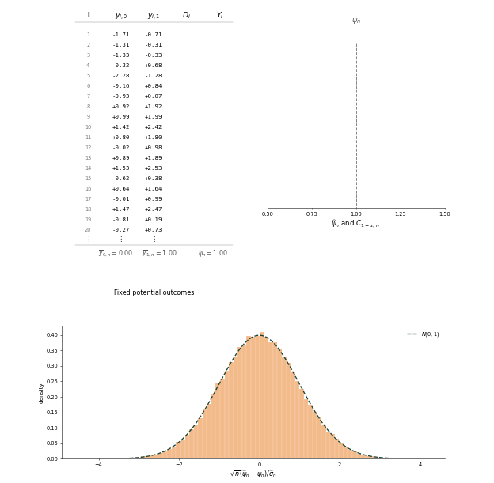
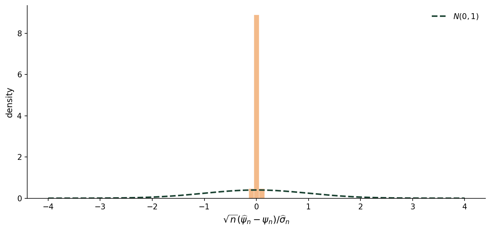
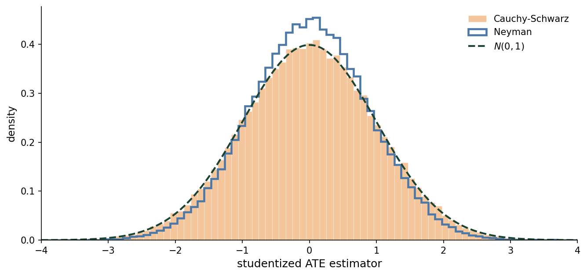

This note derives confidence intervals for linear combinations of treatment group means using data from a randomized experiment. We model the data using a fixed potential outcomes framework and show that the confidence intervals satisfy a uniform coverage property. We also illustrate the confidence intervals' finite-sample behavior using a Monte Carlo simulation.

# Model

We index experimental units by $i = 1, 2, \ldots$.
Each unit is assigned to one of two treatment groups: treatment or control.
Let $D_i$ denote an observed treatment indicator, with $D_i = 1$ if unit $i$ is assigned to treatment and $D_i = 0$ otherwise.
We make the following assumption about the treatment assignment mechanism:

::: {.assumption #asm-random}
**Assumption 1 (Bernoulli assignment)**

$D_1, D_2, \ldots$ are independent Bernoulli random variables with common treatment probability $p$, and there exists $\underline p>0$ such that $\underline p\leq p\leq1-\underline p$.
:::

Assumption 1 excludes stratified designs that exactly assign a predetermined fraction of units to each treatment group.
These designs are less common in online experiments, where treatment assignments are typically made sequentially as units enter the experiment.
Assumption 1 also requires the treatment assignment probability $p$ to be bounded away from zero and one.
In online experiments, randomization is typically performed by hashing unit identifiers into a finite number of buckets that are divided between the two treatment groups. In this case, Assumption 1 holds with $\underline p$ equal to the reciprocal of the total number of buckets.

In addition to $D_i$, we observe an outcome of interest $Y_i$ that we model using potential outcomes.
We treat the potential outcomes as fixed, so treatment assignment is the only source of randomness.
This framework abstracts from the population sampling process, which may vary across experiments or over time within an experiment.
We conduct inference only on functions of the observed units' potential outcomes; analysts must assess the extent to which a particular experiment's results generalize to other populations or contexts.

Let $y_{i,d}$ denote unit $i$'s potential outcome under treatment $d \in \{0, 1\}$.
The inference results developed here also apply when the potential outcomes vary with $n$, but we suppress this dependence in the notation for clarity.
We assume $Y_i$ is generated according to the following rule:

::: {.assumption #asm-sutva}
**Assumption 2 (Stable unit treatment value)**

The observed outcome $Y_i$ satisfies

$$Y_i = D_i y_{i, 1} + (1 - D_i) y_{i, 0}.$$ {#eq-observed-outcome}
:::

Assumption 2 requires unit $i$'s observed outcome to depend only on unit $i$'s treatment assignment and not on the treatment assignments of other units. This is a form of the [stable unit treatment value assumption (SUTVA)](https://en.wikipedia.org/wiki/Stable_unit_treatment_value_assumption) and can be restrictive in some settings. For example, if $i$ indexes user sessions, then Assumption 2 rules out treatment in one session changing the outcomes observed in subsequent sessions.
Such spillovers can often be handled by randomizing at a coarser level, but doing so lowers the number of units and usually reduces the experiment's statistical power.

For $d\in\{0,1\}$, define the potential outcome mean and centered potential outcome by
$$
\overline y_{d,n}
=
\frac{1}{n}\sum_{i=1}^n y_{i,d},
\qquad
u_{i,d,n}
=
y_{i,d}-\overline y_{d,n}.
$$

Collect the means and centered potential outcomes into the vectors
$$
\overline{\boldsymbol y}_n
=
\begin{pmatrix}
\overline y_{0,n} \\
\overline y_{1,n}
\end{pmatrix},
\qquad
\boldsymbol u_{i,n}
=
\begin{pmatrix}
u_{i,0,n} \\
u_{i,1,n}
\end{pmatrix},
$$
and define the covariance matrix

$$
\mathbf{S}_n = \begin{pmatrix}
s_{00,n}^2 & s_{01,n} \\
s_{01,n} & s_{11,n}^2
\end{pmatrix} =  \frac{1}{n}\sum_{i=1}^n \boldsymbol{u}_{i,n} \boldsymbol{u}_{i,n}'.
$$ {#eq-Sn-def}

Also collect the model primitives into the parameter vector

$$
\boldsymbol\theta =
\left(
p,\{y_{i,0}\}_{i=1}^\infty,\{y_{i,1}\}_{i=1}^\infty
\right)
$$

and let $\Theta \subseteq (\underline{p}, 1-\underline{p}) \times \mathbb{R}^\mathbb{N} \times \mathbb{R}^\mathbb{N}$ denote the set of parameters under consideration.
We impose the following regularity conditions on the potential outcome sequences in $\Theta$:

::: {.assumption #asm-nondegenerate}
**Assumption 3 (Regularity)**

[**(i)**]{.part-label} **(Non-degeneracy)** There exists an index $n_0$ for which
$s_{dd,n}^2>0$ for all $n\geq n_0$ and $d\in\{0,1\}$.

[**(ii)**]{.part-label} **(Maximum variance share)** For each $d\in\{0,1\}$,

$$
\lim_{n\to\infty}
\sup_{\boldsymbol\theta\in\Theta}
\max_{1\leq i\leq n}
\frac{|y_{i,d}-\overline y_{d,n}|}{\sqrt n\,s_{dd,n}}
=0.
$$
:::

Assumption 3(i), the non-degeneracy condition, ensures that the potential outcome variance in each treatment group is positive for all sufficiently large sample sizes.
Assumption 3(ii), the maximum variance-share condition, rules out dominant units by requiring each unit's share of total potential outcome variation to vanish as the sample grows.
In the [Appendix](#sec-stationary-ergodic-conditions), we show that both conditions hold with arbitrarily high probability when potential outcomes are generated by a stationary ergodic process with finite, positive variances.
We also develop a finite-sample diagnostic for assessing the maximum variance-share condition in the [regularity diagnostics note](../diagnostics/#variance-share-diagnostic).

For $\boldsymbol\theta\in\Theta$, let $\mathbb{P}_{\boldsymbol\theta}$ denote the probability measure governing the observed sample $\{(D_i, Y_i)\}_{i=1}^n$ under the random assignment mechanism in Assumption 1 and the observation equation in Assumption 2.
Let $\mathcal{P} = \{\mathbb{P}_{\boldsymbol\theta}: \boldsymbol\theta \in \Theta\}$ denote the set of possible probability measures under consideration.

# Inference

## Estimand

In this note, we are interested in performing inference on a linear combination of the potential outcome means. Define

$$\psi_n = \boldsymbol{a}_n' \overline{\boldsymbol{y}}_n$$

for a nonzero, nonrandom coefficient vector $\boldsymbol{a}_n = (a_{0,n}, a_{1,n})'$.
We allow the coefficients to vary with $n$ to accommodate subsequent applications (see the [sign-specific contrasts in the relative treatment effects note](../lift/#splitting-by-the-control-mean-sign) for an example).
Setting $\boldsymbol{a}_n = (1, 0)'$ or $\boldsymbol{a}_n = (0, 1)'$ yields the mean under control or treatment, respectively, while setting $\boldsymbol{a}_n = (-1, 1)'$ yields the average treatment effect (ATE).
We explore these special cases in more detail in the [common estimands section](#sec-common-estimands).

## Validity criterion

For $\alpha \in (0, 1)$, let

$$C_{1-\alpha,n} = C_{1-\alpha,n}(D_1, \ldots, D_n, Y_1, \ldots, Y_n)$$ {#eq-ci-form}

denote a confidence set for $\psi_n$ with nominal coverage level $1-\alpha$.
The sequence $\{C_{1-\alpha,n}\}_{n \geq 1}$ is **uniformly asymptotically valid** for $\{\psi_n\}_{n\geq 1}$ over $\Theta$ if

$$
\liminf_{n \to \infty}
\inf_{\boldsymbol\theta\in\Theta}
\mathbb{P}_{\boldsymbol\theta}\left(\psi_n \in C_{1-\alpha,n}\right)
\geq 1 - \alpha.
$$ {#eq-asymptotic-p}

If the sequence is not uniformly valid, there are parameter configurations at arbitrarily large sample sizes for which coverage falls below the nominal level by at least some fixed amount.
Such persistent undercoverage is problematic for experimentation platforms, which apply the same inference procedure across many different parameter configurations. We therefore seek procedures which ensure the worst-case coverage shortfall vanishes as the sample size grows.

## Estimator

We estimate $\psi_n$ by replacing the potential outcome means with their corresponding sample means.
Let $D_{i,1}=D_i$, $D_{i,0}=1-D_i$, $p_1=p$, and $p_0=1-p$.
For $d\in\{0,1\}$, define the share and number of units assigned to treatment group $d$ as
$$
\overline D_{d,n}
=
\frac{1}{n}\sum_{i=1}^nD_{i,d}, \qquad N_{d,n} = n\overline D_{d,n}.
$$

Define the sample means^[We restrict attention to samples in which both treatment groups are nonempty. Under Assumption 1, the probability that either treatment group is empty is $p^n+(1-p)^n\leq 2(1-\underline p)^n$, which converges to zero uniformly over $\Theta$.]
$$
\widehat y_{d,n}
=
\frac{1}{N_{d,n}}
\sum_{i=1}^nD_{i,d}Y_i,
\qquad
\widehat{\boldsymbol y}_n
=
\begin{pmatrix}
\widehat y_{0,n} \\
\widehat y_{1,n}
\end{pmatrix}
$$ {#eq-estimators}

and set

$$
\widehat{\psi}_n = \boldsymbol{a}_n'\widehat{\boldsymbol{y}}_n.
$$

## Normal approximation

To describe the sampling behavior of $\widehat\psi_n$, define

$$
\begin{gathered}
U_{d,n}
=
\frac{1}{n}\sum_{i=1}^n (D_i-p_1)u_{i,d,n},
\qquad d\in\{0,1\}, \\[2ex]
\boldsymbol{b}_n
=
\begin{pmatrix}
-\dfrac{a_{0,n}}{p_0} \\[2ex]
\dfrac{a_{1,n}}{p_1}
\end{pmatrix}, \qquad
X_{i,n} = \frac{D_i - p_1}{\sqrt{n}}
\boldsymbol{b}_n'\boldsymbol{u}_{i,n}.
\end{gathered}
$$

The scaled estimation error then admits the decomposition

$$
\sqrt{n}\left(\widehat{\psi}_n-\psi_n\right)
= \sum_{i=1}^n X_{i,n} + R_n,
$$ {#eq-exact-decomposition}

where

$$
R_n
= -\sqrt{n}\left(\overline D_{1,n}-p_1\right)
\left[
\frac{a_{0,n}}{\overline D_{0,n}p_0}U_{0,n}
+
\frac{a_{1,n}}{\overline D_{1,n}p_1}U_{1,n}
\right].
$$

Under Assumption 1, $\{X_{i,n}\}$ is a triangular array of row-wise independent, mean-zero random variables.
Let $\sigma_n^2$ denote the variance of the $n$th row sum:

$$
\begin{aligned}
\sigma_n^2
&=
\mathbb{V}_{\boldsymbol\theta}\left(\sum_{i=1}^n X_{i,n}\right)
\\
&=
\sum_{i=1}^n \mathbb{V}_{\boldsymbol\theta}(X_{i,n})
\\[1ex]
&=
p_0p_1\boldsymbol{b}_n'\mathbf{S}_n\boldsymbol{b}_n
\\[1ex]
&=
a_{0,n}^2\frac{1 - p_0}{p_0}s_{00,n}^2
+
a_{1,n}^2\frac{1 - p_1}{p_1}s_{11,n}^2
-2a_{0,n}a_{1,n}s_{01,n}.
\end{aligned}
$$ {#eq-sigma}

Because the covariance term $s_{01,n}$ is not identified, we cannot estimate $\sigma_n^2$ directly.
However, we can bound its absolute value using the within-treatment-group variances.
For $d\in\{0,1\}$, define the treatment-group-specific variance
$$
\sigma_{d,n}^2
=
\frac{1-p_d}{p_d}s_{dd,n}^2.
$$ {#eq-treatment-group-variance}

The Cauchy--Schwarz inequality then gives
$$
\begin{aligned}
|s_{01,n}|
&\leq
s_{00,n}s_{11,n} =\sigma_{0,n}\sigma_{1,n}.
\end{aligned}
$$ {#eq-covariance-bound}

We therefore define the conservative variance
$$
\widetilde{\sigma}_n^2
=
\left(
|a_{0,n}|\sigma_{0,n}
+
|a_{1,n}|\sigma_{1,n}
\right)^2.
$$ {#eq-sigma-tilde}
Equations (-@eq-sigma) and (-@eq-covariance-bound) imply
$$
\begin{aligned}
\sigma_n^2
&=
a_{0,n}^2\sigma_{0,n}^2
+
a_{1,n}^2\sigma_{1,n}^2
- 2a_{0,n}a_{1,n}s_{01,n} \\
&\leq
a_{0,n}^2\sigma_{0,n}^2
+
a_{1,n}^2\sigma_{1,n}^2
+ 2|a_{0,n}a_{1,n}|\sigma_{0,n}\sigma_{1,n} \\
&=\widetilde{\sigma}_n^2.
\end{aligned}
$$ {#eq-conservative-variance}

To estimate $\widetilde{\sigma}_n^2$, define the observed within-treatment-group variances

$$
\widehat{s}_{dd,n}^2
=
\frac{1}{N_{d,n}}
\sum_{i=1}^nD_{i,d}\left(Y_i-\widehat y_{d,n}\right)^2,
\qquad d\in\{0,1\},
$$ {#eq-S-hat}
and the treatment-group-specific variance estimator

$$
\widehat{\sigma}_{d,n}^2
=
\frac{1-\overline D_{d,n}}{\overline D_{d,n}}
\widehat{s}_{dd,n}^2,
\qquad d\in\{0,1\}.
$$ {#eq-treatment-group-variance-estimator}

Then set

$$
\widehat{\sigma}_n^2
=
\left(
|a_{0,n}|\widehat{\sigma}_{0,n}
+
|a_{1,n}|\widehat{\sigma}_{1,n}
\right)^2.
$$ {#eq-sigma-hat}

In the [Appendix](#sec-estimator-asymptotics), we show^[Assumption 3(i) gives an $n_0$ such that $s_{dd,n}^2>0$ for both $d\in\{0,1\}$ and all $n\geq n_0$. Since $0<p_d<1$, (-@eq-treatment-group-variance) then implies $\sigma_{d,n}>0$ for $n \geq n_0$. Because $\boldsymbol a_n\neq\boldsymbol 0$, (-@eq-sigma-tilde) gives $\widetilde{\sigma}_n^2>0$ for all $n\geq n_0$. Thus division by $\widetilde{\sigma}_n$ is well-defined for all sufficiently large $n$.]
$$
\frac{\widehat{\sigma}_n^2}{\widetilde{\sigma}_n^2} \stackrel{\mathcal{P}}{\to} 1.
$$ {#eq-variance-ratio-consistency}

Now define $\omega_n$ by
$$
\omega_n^2
=
\frac{\sigma_n^2}{\widetilde{\sigma}_n^2}
$$ {#eq-relative-variance}
and let $Z_n$ have distribution $N(0,\omega_n^2)$.
The [Appendix](#sec-scalar-normal-approximation) establishes the asymptotic equivalence^[We evaluate quantities normalized by $\widehat{\sigma}_n$ only on the event $\{\widehat{\sigma}_n>0\}$. For all sufficiently large $n$, $\widetilde{\sigma}_n^2>0$ for every $\boldsymbol\theta\in\Theta$ so that
$\{\widehat{\sigma}_n=0\}\subseteq\{|\widehat{\sigma}_n^2/\widetilde{\sigma}_n^2-1|\geq1\}$.
(-@eq-variance-ratio-consistency) then implies
$\lim_{n\to\infty}\sup_{\boldsymbol\theta\in\Theta}\mathbb P_{\boldsymbol\theta}(\widehat{\sigma}_n=0)=0$.]
$$
\frac{\sum_{i=1}^n X_{i,n}}{\widehat\sigma_n}
\stackrel{\mathcal{P}}{\approx}
Z_n.
$$ {#eq-scalar-normal-approximation}
The [Appendix](#sec-residual-appendix) also shows that the remainder is asymptotically negligible relative to $\widehat\sigma_n$:
$$
R_n
= o_{\mathcal{P}}(\widehat\sigma_n).
$$ {#eq-remainder-negligibility}

Equations (-@eq-exact-decomposition), (-@eq-scalar-normal-approximation), and (-@eq-remainder-negligibility), together with @prp-asymptotic-equivalence-perturbation from the uniform asymptotics note, imply

$$
\sqrt{n}\left(\frac{\widehat{\psi}_n-\psi_n}{\widehat{\sigma}_n}\right)
\stackrel{\mathcal{P}}{\approx}
Z_n.
$$ {#eq-feasible-normal-approximation}

## Confidence interval

Define the confidence interval

$$
C_{1-\alpha,n}
=
\left[
\widehat{\psi}_n - z_{1-\alpha/2}\sqrt{\frac{\widehat{\sigma}_n^2}{n}},
\widehat{\psi}_n + z_{1-\alpha/2}\sqrt{\frac{\widehat{\sigma}_n^2}{n}}
\right]
$$ {#eq-wald-ci}

where $z_{1-\alpha/2}$ is the $(1-\alpha/2)$ quantile of the standard normal distribution.
This interval covers $\psi_n$ if and only if

$$
\sqrt{n}\left|\frac{\widehat{\psi}_n-\psi_n}{\widehat{\sigma}_n}\right|\leq z_{1-\alpha/2}.
$$ {#eq-wald-ci-coverage-event}

We now show that $\{C_{1-\alpha,n}\}_{n \geq 1}$ is uniformly asymptotically valid. Suppose, toward a contradiction, that it is not. Then there exist an $\epsilon>0$ and sequences $n_k\to\infty$ and $\boldsymbol\theta_k\in\Theta$ such that
$$
\mathbb{P}_{\boldsymbol\theta_k}\left(\psi_{n_k} \in C_{1-\alpha,n_k}\right)
\leq 1-\alpha-\epsilon
$$ {#eq-contradictory-coverage-bound}
for every $k$.
Since $\omega_{n_k}^2\in[0,1]$, there is a further subsequence $n_{k_j}$ along which $\omega_{n_{k_j}}^2\to\omega^2$ for some $\omega^2\in[0,1]$.
If $\omega>0$, then $\omega_{n_{k_j}}>0$ for all sufficiently large $j$, and
$$
\begin{aligned}
\lim_{j\to\infty}
\left|
\mathbb{P}_{\boldsymbol\theta_{k_j}}(Z_{n_{k_j}}\leq t)
-\Phi(t/\omega)
\right|
&=
\lim_{j\to\infty}
\left|
\Phi(t/\omega_{n_{k_j}})
-\Phi(t/\omega)
\right| \\
&=0
\end{aligned}
$$
for every $t\in\mathbb R$, where $\Phi$ denotes the standard normal distribution function.
If $\omega=0$, then
$$
\lim_{j\to\infty}
\left|
\mathbb{P}_{\boldsymbol\theta_{k_j}}(Z_{n_{k_j}}\leq t)
-\mathbb 1\{t>0\}
\right|
=0
$$
for every $t\neq0$.
Part (i) of @prp-asymptotic-equivalence-cdf-limit and (-@eq-feasible-normal-approximation) therefore imply
$$
\lim_{j\to\infty}
\mathbb P_{\boldsymbol\theta_{k_j}}\left(
\sqrt{n_{k_j}}
\frac{\widehat\psi_{n_{k_j}}-\psi_{n_{k_j}}}
{\widehat\sigma_{n_{k_j}}}
\leq t
\right)
=
\begin{cases}
\Phi(t/\omega), & \omega>0, \\[1ex]
\mathbb 1\{t>0\}, & \omega=0,
\end{cases}
$$ {#eq-studentized-subsequence-cdf-convergence}
for every $t\in\mathbb R$ when $\omega>0$ and every $t\neq0$ when $\omega=0$.
Evaluating (-@eq-studentized-subsequence-cdf-convergence) at $-z_{1-\alpha/2}$ and $z_{1-\alpha/2}$ and writing $Z\sim N(0,1)$ gives
$$
\begin{aligned}
&\lim_{j\to\infty}
\mathbb{P}_{\boldsymbol\theta_{k_j}}\left(
\sqrt{n_{k_j}}
\left|
\frac{\widehat\psi_{n_{k_j}}-\psi_{n_{k_j}}}
{\widehat\sigma_{n_{k_j}}}
\right|
\leq z_{1-\alpha/2}
\right) \\[1ex]
&\qquad=
\mathbb{P}\left(|\omega Z|\leq z_{1-\alpha/2}\right)
\geq
\mathbb{P}\left(|Z|\leq z_{1-\alpha/2}\right)
=1-\alpha.
\end{aligned}
$$ {#eq-subsequence-coverage-limit}
Equations (-@eq-wald-ci-coverage-event) and (-@eq-subsequence-coverage-limit) imply
$$
\lim_{j\to\infty}
\mathbb{P}_{\boldsymbol\theta_{k_j}}\left(
\psi_{n_{k_j}}\in C_{1-\alpha,n_{k_j}}
\right)
\geq 1-\alpha.
$$
This contradicts (-@eq-contradictory-coverage-bound), which also holds along the subsequence $\{n_{k_j}\}$.

## Common estimands

In this section, we further examine the variance estimator in (-@eq-sigma-hat) for two common estimands.

### Single treatment group mean

When $\psi_n=\overline y_{d,n}$, we set $a_{d,n}=1$ and $a_{1-d,n}=0$ so that (-@eq-sigma-hat) gives $\widehat\sigma_n^2=\widehat\sigma_{d,n}^2$.
Using (-@eq-treatment-group-variance-estimator) and $N_{d,n}=n\overline D_{d,n}$, we obtain
$$
\frac{\widehat\sigma_n^2}{n}
=
\left(1-\frac{N_{d,n}}{n}\right)
\frac{\widehat s_{dd,n}^2}{N_{d,n}}.
$$
For comparison, the variance of the mean of a simple random sample of size $N_{d,n}$ drawn without replacement from the $n$ potential outcomes $\{y_{i,d}\}_{i=1}^n$ is given by
$$
\frac{n}{n-1}\left(1-\frac{N_{d,n}}{n}\right)
\frac{s_{dd,n}^2}{N_{d,n}}.
$$
Thus $\widehat\sigma_n^2/n$ has the usual sampling-without-replacement form, with the finite-population variance $\frac{n}{n-1}s_{dd,n}^2$ replaced by the observed within-treatment-group variance $\widehat s_{dd,n}^2$.
The $\left(1-\frac{N_{d,n}}{n}\right)$ correction represents the share of treatment group $d$'s potential outcomes that remain unobserved. If every unit were assigned to treatment group $d$, its mean would be observed exactly and the randomization variance would be zero.

### Average treatment effect

When $\psi_n=\overline y_{1,n}-\overline y_{0,n}$, we set $a_{0,n}=-1$ and $a_{1,n}=1$. Equation (-@eq-sigma-hat) then gives
$$
\widehat\sigma_n^2
=
\left(\widehat\sigma_{0,n}+\widehat\sigma_{1,n}\right)^2.
$$
Expanding the square and using (-@eq-treatment-group-variance-estimator) yields
$$
\begin{aligned}
\frac{\widehat\sigma_n^2}{n}
&=
\frac{\overline D_{1,n}}{n\overline D_{0,n}}\widehat s_{00,n}^2
+
\frac{\overline D_{0,n}}{n\overline D_{1,n}}\widehat s_{11,n}^2
+
\frac{2}{n}\widehat s_{00,n}\widehat s_{11,n} \\
&=
\left(\frac{1}{N_{0,n}}-\frac{1}{n}\right)\widehat s_{00,n}^2
+
\left(\frac{1}{N_{1,n}}-\frac{1}{n}\right)\widehat s_{11,n}^2
+
\frac{2}{n}\widehat s_{00,n}\widehat s_{11,n} \\
&=
\frac{\widehat s_{00,n}^2}{N_{0,n}}
+
\frac{\widehat s_{11,n}^2}{N_{1,n}}
-
\frac{1}{n}
\left(
\widehat s_{00,n}^2
+
\widehat s_{11,n}^2
-
2\widehat s_{00,n}\widehat s_{11,n}
\right) \\
&=
\frac{\widehat s_{00,n}^2}{N_{0,n}}
+
\frac{\widehat s_{11,n}^2}{N_{1,n}}
-
\frac{\left(\widehat s_{11,n}-\widehat s_{00,n}\right)^2}{n}.
\end{aligned}
$$ {#eq-ate-variance-estimator}

To compare with [Neyman's classical variance estimator](https://doi.org/10.1214/ss/1177012031), define the unit-level treatment effect and its variance by
$$
\tau_i=y_{i,1}-y_{i,0},
\qquad
\overline\tau_n=\frac{1}{n}\sum_{i=1}^n\tau_i,
\qquad
s_{\tau\tau,n}^2
=
\frac{1}{n}\sum_{i=1}^n(\tau_i-\overline\tau_n)^2.
$$
Conditional on $N_{1,n}$, the exact finite-sample variance of the difference in sample means is
$$
\frac{n}{n-1}
\left(
\frac{s_{00,n}^2}{N_{0,n}}
+
\frac{s_{11,n}^2}{N_{1,n}}
-
\frac{s_{\tau\tau,n}^2}{n}
\right).
$$ {#eq-ate-exact-conditional-variance}
Because $\tau_i$ is never observed, $s_{\tau\tau,n}^2$ is not identified. Replacing it by zero gives the conservative upper bound
$$
\frac{n}{n-1}
\left(
\frac{s_{00,n}^2}{N_{0,n}}
+
\frac{s_{11,n}^2}{N_{1,n}}
\right).
$$ {#eq-ate-neyman-upper-bound}
The conventional Neyman estimator replaces the finite-population variances in this bound with their within-group sample analogues.

A sharper bound follows from the Cauchy--Schwarz inequality. Since $\tau_i-\overline\tau_n=u_{i,1,n}-u_{i,0,n}$, (-@eq-covariance-bound) gives
$$
\begin{aligned}
s_{\tau\tau,n}^2
&=
\frac{1}{n}\sum_{i=1}^n
(u_{i,1,n}-u_{i,0,n})^2 \\
&=
s_{11,n}^2+s_{00,n}^2-2s_{01,n} \\
&\geq
s_{11,n}^2+s_{00,n}^2-2s_{11,n}s_{00,n} \\
&=
(s_{11,n}-s_{00,n})^2.
\end{aligned}
$$
Substituting this lower bound into (-@eq-ate-exact-conditional-variance) yields
$$
\frac{n}{n-1}
\left(
\frac{s_{00,n}^2}{N_{0,n}}
+
\frac{s_{11,n}^2}{N_{1,n}}
-
\frac{(s_{11,n}-s_{00,n})^2}{n}
\right).
$$
Plugging sample analogues into this sharper bound yields (-@eq-ate-variance-estimator).
The Cauchy--Schwarz bound is exact when the centered potential outcomes are perfectly positively correlated.
The two upper bounds coincide when $s_{00,n}=s_{11,n}$.

# Monte Carlo illustration

The first illustration animates repeated treatment assignments for a fixed population of $n=1{,}000$ units with $y_{i,1}=y_{i,0}+1$.
In each frame, the left panel shows the fixed potential outcomes and realized data for the first 20 units, while the top-right panel shows the ATE estimator and its $95\%$ confidence interval, colored green when it covers $\psi_n$ and red otherwise.
The bottom panel compares a histogram of the studentized estimator $\sqrt{n}(\widehat\psi_n-\psi_n)/\widehat\sigma_n$ across 50,000 assignment draws with the standard normal density.
Because the conservative bound in (-@eq-conservative-variance) equals the true variance in this case, the studentized estimator closely tracks the standard normal and empirical coverage is close to $95\%$.

{#fig-homogeneous-coverage}

The second illustration shows a histogram of the studentized estimator when $y_{i,1} = -y_{i,0} + 1$.
Here the two potential outcome sequences are negatively correlated, making the variance bound in (-@eq-conservative-variance) loose.
The studentized estimator is therefore under-dispersed relative to the standard normal, and the interval covers $\psi_n$ more often than the nominal level.

{#fig-heterogeneous-coverage}

The final illustration keeps the same fixed control potential outcomes and Bernoulli assignment draws but sets $y_{i,1}=3y_{i,0}$.
In this case, the Cauchy--Schwarz bound is exact but the Neyman bound in (-@eq-ate-neyman-upper-bound) is loose.
The figure compares histograms of the ATE estimator studentized by the two variance estimators.
The Cauchy--Schwarz-studentized histogram closely tracks the standard normal density, whereas the Neyman-studentized histogram is under-dispersed.

{#fig-ate-variance-bound-illustration}

# Appendix

## A mixture-model motivation for [Assumption 3](#asm-nondegenerate) {#sec-stationary-ergodic-conditions}

Let $\mathcal Q$ be a collection of probability laws on the path space $\mathbb R^{\mathbb N}\times\mathbb R^{\mathbb N}$.
Under each $Q\in\mathcal Q$, suppose the coordinate process $\{\boldsymbol Y_i\}_{i\geq1}$ is stationary and ergodic, where $\boldsymbol Y_i=(Y_{i,0},Y_{i,1})'$.
Let $\Pi$ be a probability distribution on $\mathcal Q$.
Generate a potential outcome path by first drawing $Q\sim\Pi$ and then drawing $\boldsymbol Y\sim Q$.
For each $d\in\{0,1\}$, define the conditional mean and variance

$$
\mu_d(Q)
=
\mathbb{E}_Q[Y_{1,d}],
\qquad
s_d^2(Q)
=
\mathbb{V}_Q(Y_{1,d}),
$$

and assume

$$
\mathbb{E}_Q[Y_{1,d}^2]<\infty,
\qquad
s_d^2(Q)>0
$$

for every $Q\in\mathcal Q$.
The marginal law of the potential outcome path is the mixture

$$
\mathbb P_{\boldsymbol Y}(A)
=
\int_{\mathcal Q}Q(A)\,\Pi(dQ).
$$

Define the empirical mean and variance

$$
\overline Y_{d,n}
=
\frac{1}{n}\sum_{i=1}^nY_{i,d},
\qquad
S_{dd,n}^2
=
\frac{1}{n}\sum_{i=1}^n
\left(Y_{i,d}-\overline Y_{d,n}\right)^2.
$$

Applying the ergodic theorem under $Q$ to $Y_{i,d}$ and $Y_{i,d}^2$ gives

$$
\begin{aligned}
\lim_{n\to\infty}\overline Y_{d,n}
&=\mu_d(Q), \\
\lim_{n\to\infty}S_{dd,n}^2
&=s_d^2(Q)
\end{aligned}
$$

$Q$-almost surely for every $Q\in\mathcal Q$ and $d\in\{0,1\}$.

We now show that no observation dominates the sample.
Fix $\delta>0$.
Under any $Q\in\mathcal Q$, stationarity and the union bound give, for every $m\in\mathbb N$,

$$
Q\left(
\max_{1\leq i\leq2^m}|Y_{i,d}|
>\delta 2^{m/2}
\right)
\leq
2^m Q\left(
Y_{1,d}^2>\delta^2 2^m
\right).
$$

The tail-integral formula and the second-moment assumption give

$$
\begin{aligned}
\sum_{m=1}^\infty
2^m Q\left(
Y_{1,d}^2>\delta^2 2^m
\right)
&\leq
\frac{2}{\delta^2}
\int_0^\infty
Q\left(Y_{1,d}^2>t\right)\,dt \\
&=
\frac{2}{\delta^2}
\mathbb E_Q\left[Y_{1,d}^2\right]
<\infty.
\end{aligned}
$$

The Borel--Cantelli lemma therefore gives

$$
\limsup_{m\to\infty}
\frac{1}{2^{m/2}}
\max_{1\leq i\leq2^m}|Y_{i,d}|
\leq\delta
$$

$Q$-almost surely.
Applying this result with $\delta=1/r$ for every $r\in \mathbb{N}$ and taking a countable intersection gives

$$
\lim_{m\to\infty}
\frac{1}{2^{m/2}}
\max_{1\leq i\leq2^m}|Y_{i,d}|
=0
$$

$Q$-almost surely for every $Q\in\mathcal Q$.
If $2^{m-1}<n\leq2^m$, then
$$
\frac{1}{\sqrt n}
\max_{1\leq i\leq n}|Y_{i,d}|
\leq
\sqrt2
\frac{1}{2^{m/2}}
\max_{1\leq i\leq2^m}|Y_{i,d}|,
$$
so the same convergence holds along the full sequence $n\to\infty$.
Since $\overline Y_{d,n}\to\mu_d(Q)$ $Q$-almost surely,
$$
\lim_{n\to\infty}
\frac{1}{\sqrt n}
\max_{1\leq i\leq n}
\left|Y_{i,d}-\overline Y_{d,n}\right|
=0
$$ {#eq-centered-maximum-convergence}
$Q$-almost surely for every $Q\in\mathcal Q$ and $d\in\{0,1\}$.
The convergence event in (-@eq-centered-maximum-convergence) is measurable and has $Q$-probability one for every $Q\in\mathcal Q$.
It therefore has probability one under the mixture law $\mathbb P_{\boldsymbol Y}$ for each $d\in\{0,1\}$.

We next show that, under the mixture law, each empirical variance converges almost surely to a strictly positive, measurable function of the potential outcome path.
Write a generic path as
$$
\boldsymbol y
=
\left(
\{y_{i,0}\}_{i=1}^\infty,
\{y_{i,1}\}_{i=1}^\infty
\right).
$$
For $d\in\{0,1\}$ and every path $\boldsymbol y$, define the extended-real function
$$
v_d(\boldsymbol y)
=
\limsup_{n\to\infty}
\frac{1}{n}\sum_{i=1}^n
\left(y_{i,d}-\overline y_{d,n}\right)^2.
$$
Each finite-sample empirical variance is measurable, so $v_d$ is measurable.
For every $Q\in\mathcal Q$, the ergodic theorem implies that the empirical variance converges $Q$-almost surely to $s_d^2(Q)>0$.
Whenever this convergence occurs, the limit equals the limsup $v_d(\boldsymbol Y)$.
Let $A_d$ be the path event on which the empirical variance converges to $v_d(\boldsymbol Y)>0$.
This event is measurable and satisfies $Q(A_d)=1$ for every $Q\in\mathcal Q$.
Therefore

$$
\mathbb P_{\boldsymbol Y}(A_d)
=
\int_{\mathcal Q}Q(A_d)\,\Pi(dQ)
=1,
$$

which proves
$$
\lim_{n\to\infty}
\frac{1}{n}\sum_{i=1}^n
\left(Y_{i,d}-\overline Y_{d,n}\right)^2
 =v_d(\boldsymbol Y)>0
$$ {#eq-mixture-pathwise-convergences}
$\mathbb P_{\boldsymbol Y}$-almost surely for each $d\in\{0,1\}$.

Now fix $\epsilon>0$ and let $\underline v(\boldsymbol y)=\min\{v_0(\boldsymbol y),v_1(\boldsymbol y)\}$.
Since $\underline v(\boldsymbol Y)>0$ $\mathbb P_{\boldsymbol Y}$-almost surely, continuity from below gives a constant $c>0$ such that

$$
\mathbb{P}_{\boldsymbol Y}\left(\underline v(\boldsymbol Y)\geq c\right)
>1-\frac{\epsilon}{2}.
$$ {#eq-positive-pathwise-variance-event}

Applying [Egorov's theorem](https://en.wikipedia.org/wiki/Egorov%27s_theorem) to the convergences in (-@eq-centered-maximum-convergence) and (-@eq-mixture-pathwise-convergences), simultaneously for $d=0,1$, gives a measurable set $E'$ with

$$
\mathbb P_{\boldsymbol Y}(E')>1-\frac{\epsilon}{2}
$$

on which the empirical-variance and centered-maximum convergences are uniform for both $d=0,1$.
Now define

$$
E
=
E'\cap
\left\{\boldsymbol y:\underline v(\boldsymbol y)\geq c\right\}.
$$

By (-@eq-positive-pathwise-variance-event) and the union bound,

$$
\mathbb P_{\boldsymbol Y}(E)
\geq
\mathbb P_{\boldsymbol Y}(E')
+
\mathbb P_{\boldsymbol Y}\left(\underline v(\boldsymbol Y)\geq c\right)
-1
>1-\epsilon.
$$

Since $E\subseteq E'$, for each $d\in\{0,1\}$,

$$
\begin{aligned}
\lim_{n\to\infty}
\sup_{\boldsymbol y\in E}
\left|
\frac{1}{n}\sum_{i=1}^n
\left(y_{i,d}-\overline y_{d,n}\right)^2
-v_d(\boldsymbol y)
\right|
&=0, \\
\lim_{n\to\infty}
\sup_{\boldsymbol y\in E}
\frac{1}{\sqrt n}
\max_{1\leq i\leq n}
\left|y_{i,d}-\overline y_{d,n}\right|
&=0.
\end{aligned}
$$ {#eq-uniform-pathwise-convergences}

Let $\Theta$ be the set of parameters whose treatment probability satisfies Assumption 1 and whose potential outcome path lies in $E$.
The first convergence in (-@eq-uniform-pathwise-convergences) implies that, for all sufficiently large $n$,

$$
\inf_{\boldsymbol\theta\in\Theta}s_{dd,n}^2
\geq
\frac{c}{2}>0
$$

for each $d\in\{0,1\}$.
Moreover,

$$
\begin{aligned}
\sup_{\boldsymbol\theta\in\Theta}
\max_{1\leq i\leq n}
\frac{|y_{i,d}-\overline y_{d,n}|}
{\sqrt n\,s_{dd,n}}
&\leq
\left(\frac{2}{c}\right)^{1/2}
\sup_{\boldsymbol y\in E}
\frac{1}{\sqrt n}
\max_{1\leq i\leq n}
\left|y_{i,d}-\overline y_{d,n}\right|.
\end{aligned}
$$

The second convergence in (-@eq-uniform-pathwise-convergences) therefore gives

$$
\lim_{n\to\infty}
\sup_{\boldsymbol\theta\in\Theta}
\max_{1\leq i\leq n}
\frac{|y_{i,d}-\overline y_{d,n}|}
{\sqrt n\,s_{dd,n}}
=0.
$$

Thus $\Theta$ satisfies Assumption 3.

## Estimator asymptotics {#sec-estimator-asymptotics}
### Notation and auxiliary lemma

Define

$$
\ell_{0,n}=\frac{|a_{0,n}|s_{00,n}}{p_0},
\qquad
\ell_{1,n}=\frac{|a_{1,n}|s_{11,n}}{p_1},
\qquad
\ell_n=\ell_{0,n}+\ell_{1,n}.
$$

We will use the following lemma:

::: {.lemma #lem-treatment-share-convergence}
For each $d\in\{0,1\}$,

$$
\overline D_{d,n}\stackrel{\mathcal{P}}{\to}p_d,
\qquad
\sqrt n(\overline D_{d,n}-p_d)=O_{\mathcal{P}}(1).
$$
:::

::: {.proof-block}
*Proof.* Under Assumption 1, $D_{1,d},\ldots,D_{n,d}$ are independent Bernoulli random variables with probability $p_d$. Hence

$$
\mathbb{E}_{\boldsymbol\theta}(\overline D_{d,n})=p_d,
\qquad
\mathbb{V}_{\boldsymbol\theta}(\overline D_{d,n})=\frac{p_dp_{1-d}}{n}.
$$

Since $p_dp_{1-d}\leq1/4$, @prp-uniform-moment-bounds(i) gives
$\overline D_{d,n}-p_d=o_{\mathcal P}(1)$, while
@prp-uniform-moment-bounds(ii) gives
$\sqrt n(\overline D_{d,n}-p_d)=O_{\mathcal P}(1)$. $\square$
:::

We will also use the following treatment-group-mean bound. Because
$\sum_{i=1}^n u_{i,d,n}=0$,

$$
\mathbb E_{\boldsymbol\theta}
\left[
\frac{
\sqrt n\,\overline D_{d,n}
\left(\widehat y_{d,n}-\overline y_{d,n}\right)
}{s_{dd,n}}
\right]^2
=
p_d(1-p_d)
\leq
\frac14.
$$

Hence @prp-uniform-moment-bounds(ii), the preceding lemma, and
@prp-continuous-mapping(i) give

$$
\sqrt n\,
\frac{\left|\widehat y_{d,n}-\overline y_{d,n}\right|}{s_{dd,n}}
=O_{\mathcal P}(1),
\qquad d\in\{0,1\}.
$$ {#eq-treatment-group-mean-stochastic-order}

### Derivation of (-@eq-variance-ratio-consistency) {#sec-variance-ratio-consistency}

We first show that, for $d\in\{0,1\}$,

$$
\frac{\widehat{s}_{dd,n}^2}{s_{dd,n}^2}
\stackrel{\mathcal{P}}{\to}1.
$$ {#eq-Shat-consistency}
Observe that

$$
\begin{aligned}
\widehat{s}_{dd,n}^2
&=
\frac{n^{-1}\sum_{i=1}^nD_{i,d}u_{i,d,n}^2}{\overline D_{d,n}}
- \left(\frac{n^{-1}\sum_{i=1}^nD_{i,d}u_{i,d,n}}{\overline D_{d,n}}\right)^2 \\
&= \frac{n^{-1}\sum_{i=1}^nD_{i,d}u_{i,d,n}^2 - p_d\,s_{dd,n}^2}{\overline D_{d,n}}
+ \frac{p_d\,s_{dd,n}^2}{\overline D_{d,n}}
- \left(\frac{n^{-1}\sum_{i=1}^nD_{i,d}u_{i,d,n}}{\overline D_{d,n}}\right)^2.
\end{aligned}
$$ {#eq-Shat-decomposition}

By Assumption 3(i), there exists an index $n_0$ for which $s_{dd,n}^2>0$ for all $n\geq n_0$, $d\in\{0,1\}$, and $\boldsymbol\theta\in\Theta$.
Together with Lemma 1, @prp-continuous-mapping, and @prp-joint-convergence, (-@eq-Shat-consistency) will follow from (-@eq-Shat-decomposition) if we can show
$$
\frac{n^{-1}\sum_{i=1}^nD_{i,d}u_{i,d,n}^2 - p_d s_{dd,n}^2}{s_{dd,n}^2}
\stackrel{\mathcal{P}}{\to} 0,
\qquad
\frac{n^{-1}\sum_{i=1}^nD_{i,d}u_{i,d,n}}{s_{dd,n}}
\stackrel{\mathcal{P}}{\to} 0.
$$ {#eq-Shat-remainder-bounds}

The first term in (-@eq-Shat-remainder-bounds) has mean zero and variance

$$
\frac{p_dp_{1-d}}{n^2 s_{dd,n}^4}\sum_{i=1}^n u_{i,d,n}^4
\leq
\frac{p_dp_{1-d}}{n^2 s_{dd,n}^4}
\max_{1 \leq i \leq n} u_{i,d,n}^2
\sum_{i=1}^n u_{i,d,n}^2.
$$

Since $\sum_{i=1}^n u_{i,d,n}^2=ns_{dd,n}^2$, we can write the right-hand side as

$$
\frac{p_dp_{1-d}}{n}
\left(\frac{\max_{1 \leq i \leq n} u_{i,d,n}^2}{s_{dd,n}^2}\right)
=
p_dp_{1-d}
\left(\frac{\max_{1 \leq i \leq n} |u_{i,d,n}|}{\sqrt{n} s_{dd,n}}\right)^2.
$$

Assumption 3(ii) and @prp-uniform-moment-bounds(i) therefore imply that the
first term in (-@eq-Shat-remainder-bounds) converges in $\mathcal P$ to zero.
The second term has mean zero and variance $p_dp_{1-d}/n\leq1/(4n)$, so
@prp-uniform-moment-bounds(i) gives the same conclusion for that term.
This proves (-@eq-Shat-consistency).

Since $\widehat{s}_{dd,n}$ and $s_{dd,n}$ are nonnegative, @prp-continuous-mapping also gives

$$
\frac{\widehat{s}_{dd,n}}{s_{dd,n}}
\stackrel{\mathcal{P}}{\to}1.
$$ {#eq-Shat-root-consistency}

Now by (-@eq-sigma-tilde) and (-@eq-sigma-hat), we have
$$
\frac{\widehat{\sigma}_n^2}{\widetilde{\sigma}_n^2}
=
\frac{\overline D_{1,n}\overline D_{0,n}}{p_1p_0}
\left[
\frac{
\frac{|a_{0,n}|s_{00,n}}{\overline D_{0,n}}\frac{\widehat{s}_{00,n}}{s_{00,n}}
+
\frac{|a_{1,n}|s_{11,n}}{\overline D_{1,n}}\frac{\widehat{s}_{11,n}}{s_{11,n}}
}{
\frac{|a_{0,n}|s_{00,n}}{p_0}
+
\frac{|a_{1,n}|s_{11,n}}{p_1}
}
\right]^2.
$$ {#eq-sigma-ratio-expansion}

The unbracketed term converges to one in $\mathcal{P}$ by Lemma 1 and @prp-continuous-mapping.
It therefore suffices to show that the bracketed ratio also converges to one.
For all $n \geq n_0$, $\ell_n>0$ and the ratios $\ell_{0,n}/\ell_n$ and $\ell_{1,n}/\ell_n$ are nonnegative and sum to one.
The difference between the bracketed ratio and one can therefore be bounded by
$$
\begin{aligned}
&\left|
\frac{\ell_{0,n}}{\ell_n}
\left(\frac{p_0}{\overline D_{0,n}}\frac{\widehat{s}_{00,n}}{s_{00,n}}\right)
+
\frac{\ell_{1,n}}{\ell_n}
\left(\frac{p_1}{\overline D_{1,n}}\frac{\widehat{s}_{11,n}}{s_{11,n}}\right)
-1
\right| \\
&\leq
\frac{\ell_{0,n}}{\ell_n}
\left|
\frac{p_0}{\overline D_{0,n}}\frac{\widehat{s}_{00,n}}{s_{00,n}}
-1
\right|
+
\frac{\ell_{1,n}}{\ell_n}
\left|
\frac{p_1}{\overline D_{1,n}}\frac{\widehat{s}_{11,n}}{s_{11,n}}
-1
\right|
\\
&\leq
\left|
\frac{p_0}{\overline D_{0,n}}\frac{\widehat{s}_{00,n}}{s_{00,n}}
-1
\right|
+
\left|
\frac{p_1}{\overline D_{1,n}}\frac{\widehat{s}_{11,n}}{s_{11,n}}
-1
\right|
\end{aligned}
$$
Thus, for every $\epsilon>0$,
$$
\begin{aligned}
&\sup_{\boldsymbol\theta\in\Theta}
\mathbb{P}_{\boldsymbol\theta}\left(
\left|
\frac{\ell_{0,n}}{\ell_n}
\left(\frac{p_0}{\overline D_{0,n}}\frac{\widehat{s}_{00,n}}{s_{00,n}}\right)
+
\frac{\ell_{1,n}}{\ell_n}
\left(\frac{p_1}{\overline D_{1,n}}\frac{\widehat{s}_{11,n}}{s_{11,n}}\right)
-1
\right|>
\epsilon
\right) \\
&\leq
\sup_{\boldsymbol\theta\in\Theta}
\mathbb{P}_{\boldsymbol\theta}\left(
\left|
\frac{p_0}{\overline D_{0,n}}\frac{\widehat{s}_{00,n}}{s_{00,n}}
-1
\right|>
\epsilon/2
\right) +
\sup_{\boldsymbol\theta\in\Theta}
\mathbb{P}_{\boldsymbol\theta}\left(
\left|
\frac{p_1}{\overline D_{1,n}}\frac{\widehat{s}_{11,n}}{s_{11,n}}
-1
\right|>
\epsilon/2
\right)
\end{aligned}
$$

The two probabilities on the right-hand side tend to zero by (-@eq-Shat-root-consistency), Lemma 1, @prp-continuous-mapping, and @prp-joint-convergence.
Therefore the bracketed ratio in (-@eq-sigma-ratio-expansion) converges to one in $\mathcal{P}$.
Combining this with the convergence of the unbracketed term proves (-@eq-variance-ratio-consistency) by @prp-continuous-mapping and @prp-joint-convergence.

## Derivation of (-@eq-scalar-normal-approximation) {#sec-scalar-normal-approximation}

The bound in (-@eq-conservative-variance) gives $0\leq\omega_n^2\leq1$.
Moreover, $|D_i-p_1|\leq1$ and the definition of $\widetilde{\sigma}_n$ imply
$$
\begin{aligned}
\frac{|X_{i,n}|}{\widetilde\sigma_n}
&\leq
\frac{1}{\sqrt{p_0p_1}}
\frac{
\dfrac{|a_{0,n}|s_{00,n}}{p_0}
\dfrac{|u_{i,0,n}|}{\sqrt n\,s_{00,n}}
+
\dfrac{|a_{1,n}|s_{11,n}}{p_1}
\dfrac{|u_{i,1,n}|}{\sqrt n\,s_{11,n}}
}{
\dfrac{|a_{0,n}|s_{00,n}}{p_0}
+
\dfrac{|a_{1,n}|s_{11,n}}{p_1}
} \\
&\leq
\frac{1}{\sqrt{\underline p(1-\underline p)}}
\max_{d\in\{0,1\}}
\frac{|u_{i,d,n}|}{\sqrt n\,s_{dd,n}}.
\end{aligned}
$$ {#eq-conservative-max-summand}
Define the uniform envelope
$$
\eta_n
=
\frac{1}{\sqrt{\underline p(1-\underline p)}}
\sup_{\boldsymbol\theta\in\Theta}
\max_{d\in\{0,1\}}
\max_{1\leq i\leq n}
\frac{|u_{i,d,n}|}{\sqrt n\,s_{dd,n}}.
$$
Then $|X_{i,n}|/\widetilde\sigma_n\leq\eta_n$ almost surely for every $i$ and $\boldsymbol\theta\in\Theta$, and Assumption 3(ii) gives
$$
\lim_{n\to\infty}
\eta_n=0.
$$ {#eq-conservative-max-summand-vanishing}

Now consider arbitrary sequences $n_k\to\infty$ and $\boldsymbol\theta_k\in\Theta$.
Since $\omega_{n_k}^2\in[0,1]$, there is a further subsequence $n_{k_j}$ along which $\omega_{n_{k_j}}^2\to\omega^2$ for some $\omega^2\in[0,1]$.
If $\omega>0$, then along this further subsequence,
$$
\begin{aligned}
\frac{1}{\omega_{n_{k_j}}^3}
\sum_{i=1}^{n_{k_j}}\mathbb{E}_{\boldsymbol\theta_{k_j}}
\left|
\frac{X_{i,n_{k_j}}}{\widetilde\sigma_{n_{k_j}}}
\right|^3
&\leq
\frac{\eta_{n_{k_j}}}{\omega_{n_{k_j}}^3}
\sum_{i=1}^{n_{k_j}}\mathbb{E}_{\boldsymbol\theta_{k_j}}
\left(
\frac{X_{i,n_{k_j}}}{\widetilde\sigma_{n_{k_j}}}
\right)^2 \\
&=
\frac{\eta_{n_{k_j}}}{\omega_{n_{k_j}}}.
\end{aligned}
$$
Since $\lim_{j\to\infty}\eta_{n_{k_j}}=0$ and $\lim_{j\to\infty}\omega_{n_{k_j}}=\omega>0$, it follows that
$$
\lim_{j\to\infty}
\frac{1}{\omega_{n_{k_j}}^3}
\sum_{i=1}^{n_{k_j}}\mathbb{E}_{\boldsymbol\theta_{k_j}}
\left|
\frac{X_{i,n_{k_j}}}{\widetilde\sigma_{n_{k_j}}}
\right|^3
=0.
$$ {#eq-lyapunov-condition}
The Lyapunov central limit theorem applied after normalization by $\sigma_{n_{k_j}}=\omega_{n_{k_j}}\widetilde\sigma_{n_{k_j}}$, followed by $\omega_{n_{k_j}}\to\omega$, therefore gives
$$
\frac{\sum_{i=1}^{n_{k_j}}X_{i,n_{k_j}}}{\widetilde\sigma_{n_{k_j}}}
\rightsquigarrow
N(0,\omega^2).
$$
If $\omega=0$, then
$$
\lim_{j\to\infty}
\mathbb{E}_{\boldsymbol\theta_{k_j}}
\left(
\frac{\sum_{i=1}^{n_{k_j}}X_{i,n_{k_j}}}{\widetilde\sigma_{n_{k_j}}}
\right)^2
=
\lim_{j\to\infty}\omega_{n_{k_j}}^2
=0,
$$
so Chebyshev's inequality gives $(\sum_{i=1}^{n_{k_j}}X_{i,n_{k_j}})/\widetilde\sigma_{n_{k_j}}\to0$ in probability.
In either case, $Z_{n_{k_j}}\rightsquigarrow\omega Z$ for $Z\sim N(0,1)$, and the normalized sum $(\sum_{i=1}^{n_{k_j}}X_{i,n_{k_j}})/\widetilde\sigma_{n_{k_j}}$ converges weakly to the same limit.
Part (ii) of @prp-asymptotic-equivalence-cdf-limit therefore gives
$$
\lim_{j\to\infty}
\sup_{g\in\mathcal G}
\left|
\mathbb{E}_{\boldsymbol\theta_{k_j}}\left[
g\left(\frac{\sum_{i=1}^{n_{k_j}}X_{i,n_{k_j}}}{\widetilde\sigma_{n_{k_j}}}\right)
\right]
-
\mathbb{E}_{\boldsymbol\theta_{k_j}}[g(Z_{n_{k_j}})]
\right|
=0
$$
along this further subsequence.
If the approximation
$$
\frac{\sum_{i=1}^nX_{i,n}}{\widetilde\sigma_n}
\stackrel{\mathcal{P}}{\approx}
Z_n
$$ {#eq-infeasible-scalar-normal-approximation}
failed, some sequences $n_k\to\infty$ and $\boldsymbol\theta_k\in\Theta$ would keep this distance bounded away from zero, contradicting the existence of the further subsequence just constructed.

By (-@eq-variance-ratio-consistency) and @prp-continuous-mapping(i),
$$
\frac{\widetilde\sigma_n}{\widehat\sigma_n}
\stackrel{\mathcal{P}}{\to}1.
$$
Since $\omega_n^2\leq1$, $Z_n=O_{\mathcal P}(1)$. Therefore
(-@eq-infeasible-scalar-normal-approximation) and
@prp-asymptotic-equivalence-slutsky give
(-@eq-scalar-normal-approximation).

## Derivation of (-@eq-remainder-negligibility) {#sec-residual-appendix}

To prove (-@eq-remainder-negligibility), first note that (-@eq-variance-ratio-consistency) and @prp-continuous-mapping give $\widetilde\sigma_n/\widehat\sigma_n\stackrel{\mathcal{P}}{\to}1$. By @prp-stochastic-order, it therefore suffices to prove $R_n/\widetilde{\sigma}_n \stackrel{\mathcal{P}}{\to} 0$.

Toward this end, observe that
$$
\begin{aligned}
\frac{|R_n|}{\widetilde{\sigma}_n}
&=
\frac{\left|\sqrt n(\overline D_{1,n}-p_1)\right|}{\sqrt{p_0p_1}\ell_n}
\left|
\frac{a_{0,n}}{\overline D_{0,n}p_0}U_{0,n}
+
\frac{a_{1,n}}{\overline D_{1,n}p_1}U_{1,n}
\right| \\[2ex]
&\leq
\frac{\left|\sqrt n(\overline D_{1,n}-p_1)\right|}{\sqrt{p_0p_1}}
\left[
\frac{\ell_{0,n}}{\ell_n}
\frac{1}{\overline D_{0,n}}
\left|\frac{U_{0,n}}{s_{00,n}}\right|
+
\frac{\ell_{1,n}}{\ell_n}
\frac{1}{\overline D_{1,n}}
\left|\frac{U_{1,n}}{s_{11,n}}\right|
\right].
\end{aligned}
$$

On the event $\left\{|\overline D_{1,n}-p_1|\leq\underline p/2\right\}$, $\overline D_{0,n}\geq\underline p/2$ and $\overline D_{1,n}\geq\underline p/2$, so
$$
\begin{aligned}
\frac{|R_n|}{\widetilde{\sigma}_n}
&\leq
c_{\underline p}\left|\sqrt n(\overline D_{1,n}-p_1)\right|
\left[
\frac{\ell_{0,n}}{\ell_n}
\left|\frac{U_{0,n}}{s_{00,n}}\right|
+
\frac{\ell_{1,n}}{\ell_n}
\left|\frac{U_{1,n}}{s_{11,n}}\right|
\right],
\end{aligned}
$$ {#eq-Rn-bound}

where

$$
c_{\underline p}
=
\frac{2}{\sqrt{\underline p(1-\underline p)}\,\underline p}.
$$

Therefore, for every $\epsilon>0$,
$$
\begin{aligned}
\sup_{\boldsymbol\theta\in\Theta}\mathbb{P}_{\boldsymbol\theta}\left(
\frac{|R_n|}{\widetilde{\sigma}_n} > \epsilon
\right)
&\leq
\sup_{\boldsymbol\theta\in\Theta}\mathbb{P}_{\boldsymbol\theta}\left(
c_{\underline p}\left|\sqrt n(\overline D_{1,n}-p_1)\right|
\left[
\frac{\ell_{0,n}}{\ell_n}
\left|\frac{U_{0,n}}{s_{00,n}}\right|
+
\frac{\ell_{1,n}}{\ell_n}
\left|\frac{U_{1,n}}{s_{11,n}}\right|
\right]
> \epsilon
\right) \\
&\quad+
\sup_{\boldsymbol\theta\in\Theta}\mathbb{P}_{\boldsymbol\theta}\left(|\overline D_{1,n}-p_1|>\underline p/2\right).
\end{aligned}
$$

The second term on the right-hand side converges to zero by Lemma 1.
For the first term, observe that for each $d \in \{0,1\}$,

$$
\mathbb{E}_{\boldsymbol\theta}\left[\frac{U_{d,n}}{s_{dd,n}}\right]=0,
\qquad
\mathbb{V}_{\boldsymbol\theta}\left(\frac{U_{d,n}}{s_{dd,n}}\right)
=
\frac{p_0p_1}{n}.
$$

Thus @prp-uniform-moment-bounds(i) gives
$U_{d,n}/s_{dd,n}=o_{\mathcal{P}}(1)$.
The weights $\ell_{0,n}/\ell_n$ and $\ell_{1,n}/\ell_n$ lie in $[0,1]$, so the bracketed term in (-@eq-Rn-bound) is also $o_{\mathcal{P}}(1)$.
By Lemma 1, $\sqrt n(\overline D_{1,n}-p_1)=O_{\mathcal{P}}(1)$.
Therefore, by @prp-stochastic-order, the product inside the first probability on the right-hand side is $o_{\mathcal{P}}(1)$.
Thus

$$
\frac{R_n}{\widetilde{\sigma}_n}=o_{\mathcal{P}}(1),
$$

Combining this result with $\widetilde\sigma_n/\widehat\sigma_n\stackrel{\mathcal{P}}{\to}1$ gives

$$
\frac{R_n}{\widehat\sigma_n}
=
\frac{R_n}{\widetilde\sigma_n}
\frac{\widetilde\sigma_n}{\widehat\sigma_n}
=
o_{\mathcal{P}}(1)
$$

by @prp-stochastic-order, proving (-@eq-remainder-negligibility).