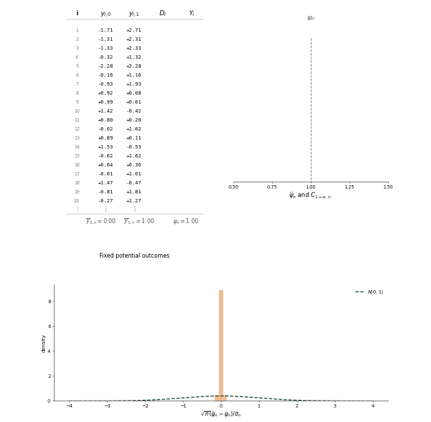

This note derives confidence intervals for linear combinations of treatment group means using data from a randomized experiment. We model the data using a fixed potential outcomes framework and show that the confidence intervals satisfy a uniform coverage property. We also illustrate the confidence intervals' finite-sample behavior using a Monte Carlo simulation.

# Model

We index experimental units by $i = 1, 2, \ldots$.
Each unit is assigned to either treatment or control.
Let $D_i$ denote an observed treatment indicator, with $D_i = 1$ if unit $i$ is assigned to treatment and $D_i = 0$ otherwise.
We make the following assumption about the treatment assignment mechanism:

::: {.assumption #asm-random}
**Assumption 1.** $D_1, D_2, \ldots$ are independent Bernoulli random variables with common treatment probability $p$, and there exists $\underline p>0$ such that $\underline p\leq p\leq1-\underline p$ for every $\theta\in\Theta$.
:::

Assumption 1 excludes stratified designs that exactly assign a predetermined fraction of units to each treatment group.
These designs are less common in online experiments, where treatment assignments are typically made sequentially as units enter the experiment.
Assumption 1 also requires the treatment assignment probability $p$ to be bounded away from zero and one.
In online experiments, randomization is typically performed by hashing unit identifiers into a finite number of buckets divided between treatment groups, so Assumption 1 holds with $\underline p$ equal to the reciprocal of the total number of buckets.

In addition to $D_i$, we observe an outcome of interest $Y_i$ that we model using potential outcomes.
We condition on the potential outcomes and define estimands for the units in the experiment, making no claims about generalizability to a broader population. Analysts must therefore assess whether a particular experiment’s results generalize to other populations or contexts.

Let $y_{i,d}$ denote unit $i$'s potential outcome under treatment $d \in \{0, 1\}$.
We assume $Y_i$ is generated according to the following rule:

::: {.assumption #asm-sutva}
**Assumption 2.** The observed outcome $Y_i$ satisfies

$$Y_i = D_i y_{i, 1} + (1 - D_i) y_{i, 0}.$$ {#eq-observed-outcome}
:::

Assumption 2 requires unit $i$'s observed outcome to depend only on unit $i$'s treatment assignment and not on the treatment assignments of other units. This is a form of the [stable unit treatment value assumption (SUTVA)](https://en.wikipedia.org/wiki/Stable_unit_treatment_value_assumption) and can be restrictive in some settings. For example, if $i$ indexes user sessions, then Assumption 2 rules out treatment in one session changing potential outcomes in subsequent sessions.
Such spillovers can often be handled by randomizing at a coarser level, but doing so lowers the number of experimental units and therefore usually reduces the experiment's statistical power.

For $d\in\{0,1\}$, define the potential outcome mean and centered potential outcome by
$$
\overline y_{d,n}
=
\frac{1}{n}\sum_{i=1}^n y_{i,d},
\qquad
u_{i,d,n}
=
y_{i,d}-\overline y_{d,n}.
$$

Collect the means and centered potential outcomes into the vectors
$$
\overline{\mathbf y}_n
=
\begin{pmatrix}
\overline y_{0,n} \\
\overline y_{1,n}
\end{pmatrix},
\qquad
\mathbf u_{i,n}
=
\begin{pmatrix}
u_{i,0,n} \\
u_{i,1,n}
\end{pmatrix},
$$
and define the covariance matrix

$$
\mathbf{S}_n = \frac{1}{n}\sum_{i=1}^n \mathbf{u}_{i, n} \mathbf{u}_{i, n}' = \begin{pmatrix}
s_{00,n}^2 & s_{01,n} \\
s_{01,n} & s_{11,n}^2
\end{pmatrix}.
$$ {#eq-Sn-def}

Also collect the model primitives into the parameter vector

$$
\theta =
\left(
p,\{y_{i,0}\}_{i=1}^\infty,\{y_{i,1}\}_{i=1}^\infty
\right)
$$

and let $\Theta \subseteq (0, 1) \times \mathbb{R}^\mathbb{N} \times \mathbb{R}^\mathbb{N}$ denote the set of parameters under consideration.
We impose the following regularity condition on $\Theta$:

::: {.assumption #asm-nondegenerate}
**Assumption 3.** There exists an index $N$ for which $s_{dd,n}^2>0$ for all $n\geq N$, $d\in\{0,1\}$, and $\theta\in\Theta$. In addition, for each $d\in\{0,1\}$,

$$
\lim_{n\to\infty}
\sup_{\theta\in\Theta}
\max_{1\leq i\leq n}
\frac{|y_{i,d}-\overline y_{d,n}|}{\sqrt n\,s_{dd,n}}
=0.
$$
:::

Assumption 3 rules out dominant units by requiring that, within each treatment arm, no single unit accounts for a non-negligible share of the total potential outcome variation as the sample grows.
In the [Appendix](#sec-stationary-ergodic-conditions), we show this assumption holds with arbitrarily high probability when potential outcomes are generated by a stationary ergodic process with finite, positive variances.

For $\theta\in\Theta$, let $\mathbb{P}_\theta$ denote the probability measure governing the observed sample $\{(D_i, Y_i)\}_{i=1}^n$ under the random assignment mechanism in Assumption 1 and the observation equation in Assumption 2.
We let $\mathcal{P} = \{\mathbb{P}_\theta: \theta \in \Theta\}$ denote the set of possible probability measures under consideration.

# Inference

## Uniform asymptotics

Throughout this note, asymptotic statements are made uniformly over the family of distributions $\mathcal{P}$ induced by the parameters in $\Theta$.
We use uniform asymptotics because experiment platforms must produce reliable results across a wide range of parameter configurations.

We first define notation for uniform convergence in probability.
We say $X_n \in \mathbb{R}^k$ converges in $\mathcal{P}$ to $X \in \mathbb{R}^k$, written as $X_n \stackrel{\mathcal{P}}{\to} X$, if for every $\epsilon > 0$,
$$
\lim_{n \to \infty} \sup_{\theta \in \Theta} \mathbb{P}_\theta(\|X_n - X\| > \epsilon) = 0.
$$
For a positive deterministic sequence $r_n$, we write $X_n=o_{\mathcal{P}}(r_n)$ if $X_n/r_n \stackrel{\mathcal{P}}{\to} 0$.
We write $X_n=O_{\mathcal{P}}(r_n)$ if, for every $\epsilon > 0$, there exist finite constants $M$ and $N$ such that
$$
\sup_{\theta\in\Theta}
\mathbb{P}_\theta\left(\|X_n\|>Mr_n\right)
<\epsilon
$$
for all $n\geq N$.
We will use the following stochastic-order relationships:

::: {#prp-stochastic-order}
Let $r_n$ and $s_n$ be positive deterministic sequences. The following relationships hold whenever the indicated operations are well-defined:

$$
\begin{aligned}
X_n=O_{\mathcal{P}}(r_n),\ Y_n=O_{\mathcal{P}}(s_n)
&\quad\Rightarrow\quad
X_n+Y_n=O_{\mathcal{P}}(r_n+s_n), \\[1ex]
X_n=O_{\mathcal{P}}(r_n),\ Y_n=O_{\mathcal{P}}(s_n)
&\quad\Rightarrow\quad
X_nY_n=O_{\mathcal{P}}(r_ns_n), \\[1ex]
X_n=o_{\mathcal{P}}(r_n),\ Y_n=O_{\mathcal{P}}(s_n)
&\quad\Rightarrow\quad
X_nY_n=o_{\mathcal{P}}(r_ns_n), \\[1ex]
X_n=O_{\mathcal{P}}(r_n),\ r_n\to 0
&\quad\Rightarrow\quad
X_n=o_{\mathcal{P}}(1).
\end{aligned}
$$
:::

The next proposition is a uniform analogue of the [continuous mapping theorem](https://en.wikipedia.org/wiki/Continuous_mapping_theorem):

::: {#prp-continuous-mapping}
Suppose $X_n\stackrel{\mathcal{P}}{\to}X$ and there is a compact set $K\subseteq\mathbb R^k$ such that $\mathbb{P}_\theta(X\in K)=1$ for every $\theta\in\Theta$.
If $g:\mathbb R^k\to\mathbb R^m$ is continuous on an open set containing $K$, then

$$
g(X_n)\stackrel{\mathcal{P}}{\to}g(X).
$$
:::

The next result records a useful joint-convergence rule:

::: {#prp-joint-convergence}
If $X_n\stackrel{\mathcal{P}}{\to}X$ and $Y_n\stackrel{\mathcal{P}}{\to}Y$, then

$$
(X_n,Y_n)\stackrel{\mathcal{P}}{\to}(X,Y).
$$
:::

Now define the class of functions
$$
\mathcal G
=
\left\{
g:\mathbb R^k\to\mathbb R:
|g(x)|\leq1,
|g(x)-g(y)|\leq\|x-y\|
\text{ for all }x,y\in\mathbb R^k
\right\}.
$$
We say $X_n$ is asymptotically equivalent in $\mathcal{P}$ to $Z_n$,
written $X_n\stackrel{\mathcal{P}}{\approx}Z_n$, if
$$
\lim_{n\to\infty}
\sup_{\theta\in\Theta}
\sup_{g\in\mathcal G}
\left|
\mathbb{E}_\theta[g(X_n)]
-
\mathbb{E}_\theta[g(Z_n)]
\right|
=0.
$$

The next proposition shows that asymptotic equivalence is preserved under uniformly negligible perturbations:

::: {#prp-asymptotic-equivalence-perturbation}
If $X_n\stackrel{\mathcal{P}}{\approx}Z_n$ and $Y_n-X_n=o_{\mathcal{P}}(1)$, then
$$
Y_n\stackrel{\mathcal{P}}{\approx}Z_n.
$$
:::

The next proposition connects asymptotic equivalence and convergence to a fixed distribution:

::: {#prp-asymptotic-equivalence-cdf-limit}
For any sequences $n_k\to\infty$ and $\theta_k\in\Theta$ and any fixed distribution function $F$, the following statements hold:

(i) If $X_n\stackrel{\mathcal{P}}{\approx}Z_n$ and
$$\lim_{k\to\infty}
\left|
\mathbb{P}_{\theta_k}(Z_{n_k}\leq\mathbf t)-F(\mathbf t)
\right|
=0
\quad\text{for every continuity point $\mathbf t$ of $F$},
$$
then
$$
\lim_{k\to\infty}
\left|
\mathbb{P}_{\theta_k}(X_{n_k}\leq\mathbf t)-F(\mathbf t)
\right|
=0
\quad\text{for every continuity point $\mathbf t$ of $F$}.
$$

(ii) If
$$
\begin{aligned}
\lim_{k \to \infty}
\left|
\mathbb{P}_{\theta_k}(X_{n_k}\leq\mathbf t)-F(\mathbf t)
\right|
&=0, \\
\lim_{k \to \infty}
\left|
\mathbb{P}_{\theta_k}(Z_{n_k}\leq\mathbf t)-F(\mathbf t)
\right|
&=0
\end{aligned}
$$
for every continuity point $\mathbf t$ of $F$, then
$$
\lim_{k\to\infty}
\sup_{g\in\mathcal G}
\left|
\mathbb{E}_{\theta_k}[g(X_{n_k})]
-
\mathbb{E}_{\theta_k}[g(Z_{n_k})]
\right|
=0.
$$
:::

If $Z_n$ has the same distribution function $F$ for every $n$ and $\theta$, Proposition 5 implies that $X_n\stackrel{\mathcal{P}}{\approx}Z_n$ if and only if, for every continuity point $\mathbf t\in\mathbb R^k$ of $F$,
$$
\lim_{n\to\infty}
\sup_{\theta\in\Theta}
\left|
\mathbb{P}_\theta(X_n\leq\mathbf t)-F(\mathbf t)
\right|
=0.
$$
Thus for a fixed target distribution, asymptotic equivalence is equivalent to uniform weak convergence to that distribution.

Proofs of these propositions can be found in the [Appendix](#sec-proposition-proofs).

## Target

In this note, we are interested in performing inference on a linear combination of the potential outcome means. Define

$$\psi_n = \mathbf{a}_n' \overline{\mathbf{y}}_n$$

for a nonzero, nonrandom coefficient vector $\mathbf{a}_n = (a_{0,n}, a_{1,n})'$.
Setting $\mathbf{a}_n = (1, 0)'$ or $\mathbf{a}_n = (0, 1)'$ yields the control or treatment group mean, respectively, while setting $\mathbf{a}_n = (-1, 1)'$ yields the average treatment effect (ATE).
Although these coefficient vectors are fixed, we allow the coefficients to vary with $n$ to accommodate other applications (see the [sign-specific contrasts in the relative treatment effects note](../lift/#splitting-by-the-control-mean-sign) for an example).

For $\alpha \in (0, 1)$, let

$$C_{1-\alpha,n} = C_{1-\alpha,n}(D_1, \ldots, D_n, Y_1, \ldots, Y_n)$$ {#eq-ci-form}

denote a confidence set for $\psi_n$ with nominal coverage level $1-\alpha$.
The sequence $\{C_{1-\alpha,n}\}_{n \geq 1}$ is **asymptotically valid** for $\{\psi_n\}_{n\geq 1}$ over $\Theta$ if

$$
\liminf_{n \to \infty}
\inf_{\theta\in\Theta}
\mathbb{P}_\theta\left(\psi_n \in C_{1-\alpha,n}\right)
\geq 1 - \alpha.
$$ {#eq-asymptotic-p}

Asymptotic validity permits finite-sample undercoverage, but requires the worst-case coverage shortfall to converge to zero.

## Normal approximation

We estimate $\psi_n$ by replacing the potential outcome means with the control and treatment group sample means.
Let $D_{i,1}=D_i$ and $D_{i,0}=1-D_i$.
For $d\in\{0,1\}$, define
$$
\overline D_{d,n}
=
\frac{1}{n}\sum_{i=1}^nD_{i,d}.
$$
We restrict the formulas below to samples in which both treatment groups are nonempty and define the resulting quantities arbitrarily otherwise.
This convention is asymptotically inconsequential, since
$$
\lim_{n\to\infty}
\sup_{\theta\in\Theta}
\mathbb{P}_\theta\left(
\overline D_{0,n}=0
	\text{ or }
\overline D_{1,n}=0
\right)
\leq
\lim_{n\to\infty}2(1-\underline p)^n
=0.
$$

Define the sample means
$$
\widehat y_{d,n}
=
\frac{1}{n\overline D_{d,n}}
\sum_{i=1}^nD_{i,d}Y_i,
\qquad
\widehat{\mathbf y}_n
=
\begin{pmatrix}
\widehat y_{0,n} \\
\widehat y_{1,n}
\end{pmatrix}
$$ {#eq-estimators}

and set

$$
\widehat{\psi}_n = \mathbf{a}_n'\widehat{\mathbf{y}}_n.
$$

To describe the sampling behavior of $\widehat\psi_n$, we first define

$$
\mathbf{b}_n
=
\begin{pmatrix}
-\dfrac{a_{0,n}}{1-p} \\[2ex]
\dfrac{a_{1,n}}{p}
\end{pmatrix}
$$

and

$$
X_{i,n} = \frac{D_i - p}{\sqrt{n}}
\mathbf{b}_n'\mathbf{u}_{i,n}.
$$

Under Assumption 1, $\{X_{i,n}\}$ is a triangular array of row-wise independent, mean-zero random variables.
The variance of the row-wise sum is

$$
\sigma_n^2 = \sum_{i=1}^n \mathbb{V}(X_{i,n}) = p(1-p)\mathbf{b}_n'\mathbf{S}_n\mathbf{b}_n.
$$ {#eq-sigma}

Because the covariance terms in $\mathbf{S}_n$ are not identified, we cannot estimate $\sigma_n^2$ directly.
Instead, we define
$$
\widetilde{\sigma}_n^2 = p(1-p)
\left(
\frac{|a_{0,n}|s_{00,n}}{1-p}
+
\frac{|a_{1,n}|s_{11,n}}{p}
\right)^2.
$$ {#eq-sigma-tilde}
By the Cauchy--Schwarz inequality,
$$
\begin{aligned}
\sigma_n^2
&=
a_{0,n}^2\frac{p}{1-p}s_{00,n}^2
+
a_{1,n}^2\frac{1-p}{p}s_{11,n}^2
- 2a_{0,n}a_{1,n}s_{01,n} \\
&\leq
a_{0,n}^2\frac{p}{1-p}s_{00,n}^2
+
a_{1,n}^2\frac{1-p}{p}s_{11,n}^2
+ 2|a_{0,n}a_{1,n}|s_{00,n}s_{11,n} \\
&= \widetilde{\sigma}_n^2.
\end{aligned}
$$ {#eq-conservative-variance}

Since $\widetilde{\sigma}_n^2$ does not contain the unidentified covariance term, we can estimate it using the observed within-group variances. Define

$$
\widehat{s}_{dd,n}^2
=
\frac{1}{n\overline D_{d,n}}
\sum_{i=1}^nD_{i,d}\left(Y_i-\widehat y_{d,n}\right)^2,
\qquad d\in\{0,1\},
$$ {#eq-S-hat}
and set

$$
\widehat{\sigma}_n^2
=
\overline D_{1,n}\overline D_{0,n}
\left(
\frac{|a_{0,n}|\widehat{s}_{00,n}}{\overline D_{0,n}}
+
\frac{|a_{1,n}|\widehat{s}_{11,n}}{\overline D_{1,n}}
\right)^2.
$$ {#eq-sigma-hat}
Since $\mathbf{a}_n\neq\mathbf{0}$ and $0<p<1$, Assumption 3 implies that $\widetilde{\sigma}_n^2>0$ for every $\theta\in\Theta$ and all sufficiently large $n$.
Therefore, for all sufficiently large $n$,
$$
\left\{\widehat\sigma_n=0\right\}
\subseteq
\left\{
\left|
\frac{\widehat\sigma_n^2}{\widetilde\sigma_n^2}-1
\right|
\geq1
\right\}
$$ {#eq-zero-standard-error-event}
In the [Appendix](#sec-estimator-asymptotics), we show
$$
\frac{\widehat{\sigma}_n^2}{\widetilde{\sigma}_n^2} \stackrel{\mathcal{P}}{\to} 1.
$$ {#eq-variance-ratio-consistency}
Together with (-@eq-zero-standard-error-event), this implies
$$
\lim_{n\to\infty}
\sup_{\theta\in\Theta}
\mathbb{P}_\theta(\widehat\sigma_n=0)
=0.
$$
We therefore define ratios with denominator $\widehat\sigma_n$ arbitrarily when $\widehat\sigma_n=0$.
The [Appendix](#sec-residual-appendix) establishes the asymptotic linearization

$$
\sqrt{n}\left(\frac{\widehat{\psi}_n-\psi_n}{\widehat{\sigma}_n}\right)
= \frac{\sum_{i=1}^n X_{i,n}}{\widehat{\sigma}_n} + o_{\mathcal{P}}(1).
$$ {#eq-means-asymptotic-linearization}

For all sufficiently large $n$, define $\omega_n$ as
$$
\omega_n^2
=
\frac{\sigma_n^2}{\widetilde{\sigma}_n^2}
$$ {#eq-relative-variance}
and let $Z_n$ have distribution $N(0,\omega_n^2)$.
In the [Appendix](#sec-scalar-normal-approximation), we use the Lyapunov central limit theorem and Proposition 5 to show
$$
\frac{\sum_{i=1}^n X_{i,n}}{\widehat\sigma_n}
\stackrel{\mathcal{P}}{\approx}
Z_n.
$$ {#eq-scalar-normal-approximation}
Proposition 4 therefore implies

$$
\sqrt{n}\left(\frac{\widehat{\psi}_n-\psi_n}{\widehat{\sigma}_n}\right)
\stackrel{\mathcal{P}}{\approx}
Z_n.
$$ {#eq-feasible-normal-approximation}

## Confidence interval

We now form the confidence interval

$$
C_{1-\alpha,n}
=
\left[
\widehat{\psi}_n - z_{1-\alpha/2}\sqrt{\frac{\widehat{\sigma}_n^2}{n}},
\widehat{\psi}_n + z_{1-\alpha/2}\sqrt{\frac{\widehat{\sigma}_n^2}{n}}
\right]
$$ {#eq-wald-ci}

where $z_{1-\alpha/2}$ is the $(1-\alpha/2)$ quantile of the standard normal distribution.
On samples for which $\widehat\sigma_n>0$, this interval covers $\psi_n$ if and only if

$$
\sqrt{n}\left|\frac{\widehat{\psi}_n-\psi_n}{\widehat{\sigma}_n}\right|\leq z_{1-\alpha/2}.
$$

Let $\Phi$ denote the standard normal distribution function and consider arbitrary sequences $n_k\to\infty$ and $\theta_k\in\Theta$.
Since $\omega_{n_k}^2\in[0,1]$, there is a further subsequence $n_{k_j}$ along which $\omega_{n_{k_j}}^2\to\omega^2$ for some $\omega^2\in[0,1]$.
If $\omega>0$, then $\omega_{n_{k_j}}>0$ for all sufficiently large $j$, and
$$
\begin{aligned}
\lim_{j\to\infty}
\left|
\mathbb{P}_{\theta_{k_j}}(Z_{n_{k_j}}\leq t)
-\Phi(t/\omega)
\right|
&=
\lim_{j\to\infty}
\left|
\Phi(t/\omega_{n_{k_j}})
-\Phi(t/\omega)
\right| \\
&=0
\end{aligned}
$$
for every $t\in\mathbb R$.
If $\omega=0$, then
$$
\lim_{j\to\infty}
\left|
\mathbb{P}_{\theta_{k_j}}(Z_{n_{k_j}}\leq t)
-\mathbf 1\{t>0\}
\right|
=0
$$
for every $t\neq0$.
Part (i) of Proposition 5 and (-@eq-feasible-normal-approximation) therefore imply
$$
\lim_{j\to\infty}
\mathbb P_{\theta_{k_j}}\left(
\sqrt{n_{k_j}}
\frac{\widehat\psi_{n_{k_j}}-\psi_{n_{k_j}}}
{\widehat\sigma_{n_{k_j}}}
\leq t
\right)
=
\begin{cases}
\Phi(t/\omega), & \omega>0, \\[1ex]
\mathbf 1\{t>0\}, & \omega=0,
\end{cases}
$$ {#eq-studentized-subsequence-cdf-convergence}
for every $t\in\mathbb R$ when $\omega>0$ and every $t\neq0$ when $\omega=0$.
Evaluating (-@eq-studentized-subsequence-cdf-convergence) at $-z_{1-\alpha/2}$ and $z_{1-\alpha/2}$ and writing $Z\sim N(0,1)$ gives
$$
\begin{aligned}
&\lim_{j\to\infty}
\mathbb{P}_{\theta_{k_j}}\left(
\sqrt{n_{k_j}}
\left|
\frac{\widehat\psi_{n_{k_j}}-\psi_{n_{k_j}}}
{\widehat\sigma_{n_{k_j}}}
\right|
\leq z_{1-\alpha/2}
\right) \\[1ex]
&\qquad=
\mathbb{P}\left(|\omega Z|\leq z_{1-\alpha/2}\right)
\geq
\mathbb{P}\left(|Z|\leq z_{1-\alpha/2}\right)
=1-\alpha.
\end{aligned}
$$ {#eq-subsequence-coverage-limit}
Now if

$$
\liminf_{n\to\infty}
\inf_{\theta\in\Theta}
\mathbb{P}_\theta\left(\psi_n \in C_{1-\alpha,n}\right)
< 1-\alpha,
$$

there would be an $\epsilon>0$ and sequences $n_k\to\infty$ and $\theta_k\in\Theta$ along which

$$
\limsup_{k\to\infty}\mathbb{P}_{\theta_k}\left(\psi_{n_k} \in C_{1-\alpha,n_k}\right)
< 1-\alpha-\epsilon.
$$
But then no further subsequence could satisfy (-@eq-subsequence-coverage-limit).
Hence

$$
\liminf_{n\to\infty}
\inf_{\theta\in\Theta}
\mathbb{P}_\theta\left(\psi_n \in C_{1-\alpha,n}\right)
\geq 1-\alpha.
$$ {#eq-asymptotic-conservative}

# Illustration

The animations below illustrate the sampling behavior of the confidence interval in (-@eq-wald-ci).
The left panel in each animation displays a fixed set of potential outcomes for the first 20 observations of a sample of $n = 1{,}000$ units.
In each frame, a new treatment assignment is drawn and the corresponding observed outcomes are shown.
The potential outcomes do not change; all variation in the confidence intervals comes from the randomized assignment draws.
The top-right panel displays the resulting estimator for the average treatment effect $\psi_n = \overline y_{1,n} - \overline y_{0,n}$ and its corresponding $95\%$ confidence interval, colored green when the interval contains $\psi_n$ and red otherwise.
The bottom panel shows the sampling distribution of the studentized estimator $\sqrt{n}(\widehat{\psi}_n-\psi_n)/\widehat{\sigma}_n$ across 50,000 assignment draws, together with the standard normal density.

In the first animation, $y_{i,1} = y_{i,0} + 1$ for every $i$.
In this case, the conservative bound in (-@eq-conservative-variance) coincides with the true variance. The studentized estimator closely tracks the standard normal and the empirical coverage is close to the nominal $95\%$ level.

{#fig-homogeneous-coverage}

The second animation uses $y_{i,1} = -y_{i,0} + 1$.
Here the two potential outcome sequences are negatively correlated, making the conservative variance bound in (-@eq-conservative-variance) loose.
The studentized estimator is therefore under-dispersed relative to the standard normal, and the interval covers $\psi_n$ more often than the nominal level.

{#fig-heterogeneous-coverage}

# Appendix

## A mixture-model motivation for [Assumption 3](#asm-nondegenerate) {#sec-stationary-ergodic-conditions}

Let $\mathcal Q$ be a collection of probability laws on the path space $\mathbb R^{\mathbb N}\times\mathbb R^{\mathbb N}$.
Under each $Q\in\mathcal Q$, suppose the coordinate process $\{\mathbf{Y}_i\}_{i\geq1}$ is stationary and ergodic, where $\mathbf{Y}_i=(Y_{i,0},Y_{i,1})'$.
Let $\Pi$ be a probability distribution on $\mathcal Q$.
Generate a potential outcome path by first drawing $Q\sim\Pi$ and then drawing $\mathbf Y\sim Q$.
For each $d\in\{0,1\}$, define the conditional mean and variance

$$
\mu_d(Q)
=
\mathbb{E}_Q[Y_{1,d}],
\qquad
V_d(Q)
=
\mathbb{V}_Q(Y_{1,d}),
$$

and assume

$$
\mathbb{E}_Q[Y_{1,d}^2]<\infty,
\qquad
V_d(Q)>0
$$

for every $Q\in\mathcal Q$.
The marginal law of the potential outcome path is the mixture

$$
\mathbb P_{\mathbf Y}(A)
=
\int_{\mathcal Q}Q(A)\,\Pi(dQ).
$$

Define the empirical mean and variance

$$
\overline Y_{d,n}
=
\frac{1}{n}\sum_{i=1}^nY_{i,d},
\qquad
S_{dd,n}^2
=
\frac{1}{n}\sum_{i=1}^n
\left(Y_{i,d}-\overline Y_{d,n}\right)^2.
$$

Applying the ergodic theorem under $Q$ to $Y_{i,d}$ and $Y_{i,d}^2$ gives

$$
\begin{aligned}
\lim_{n\to\infty}\overline Y_{d,n}
&=\mu_d(Q), \\
\lim_{n\to\infty}S_{dd,n}^2
&=V_d(Q)
\end{aligned}
$$

$Q$-almost surely for every $Q\in\mathcal Q$ and $d\in\{0,1\}$.

We now show that no observation dominates the sample.
Fix $\delta>0$.
Under any $Q\in\mathcal Q$, stationarity and the union bound give, for every $m\in\mathbb N$,

$$
Q\left(
\max_{1\leq i\leq2^m}|Y_{i,d}|
>\delta 2^{m/2}
\right)
\leq
2^m Q\left(
Y_{1,d}^2>\delta^2 2^m
\right).
$$

The tail-integral formula and the second-moment assumption give

$$
\begin{aligned}
\sum_{m=1}^\infty
2^m Q\left(
Y_{1,d}^2>\delta^2 2^m
\right)
&\leq
\frac{2}{\delta^2}
\int_0^\infty
Q\left(Y_{1,d}^2>t\right)\,dt \\
&=
\frac{2}{\delta^2}
\mathbb E_Q\left[Y_{1,d}^2\right]
<\infty.
\end{aligned}
$$

The Borel--Cantelli lemma therefore gives

$$
\limsup_{m\to\infty}
\frac{1}{2^{m/2}}
\max_{1\leq i\leq2^m}|Y_{i,d}|
\leq\delta
$$

$Q$-almost surely.
Applying this result with $\delta=1/r$ for every $r\in \mathbb{N}$ and taking a countable intersection gives

$$
\lim_{m\to\infty}
\frac{1}{2^{m/2}}
\max_{1\leq i\leq2^m}|Y_{i,d}|
=0
$$

$Q$-almost surely for every $Q\in\mathcal Q$.
If $2^{m-1}<n\leq2^m$, then
$$
\frac{1}{\sqrt n}
\max_{1\leq i\leq n}|Y_{i,d}|
\leq
\sqrt2
\frac{1}{2^{m/2}}
\max_{1\leq i\leq2^m}|Y_{i,d}|,
$$
so the same convergence holds along the full sequence $n\to\infty$.
Since $\overline Y_{d,n}\to\mu_d(Q)$ $Q$-almost surely,
$$
\lim_{n\to\infty}
\frac{1}{\sqrt n}
\max_{1\leq i\leq n}
\left|Y_{i,d}-\overline Y_{d,n}\right|
=0
$$ {#eq-centered-maximum-convergence}
$Q$-almost surely for every $Q\in\mathcal Q$ and $d\in\{0,1\}$.
The convergence event in (-@eq-centered-maximum-convergence) is measurable and has $Q$-probability one for every $Q\in\mathcal Q$.
It therefore has probability one under the mixture law $\mathbb P_{\mathbf Y}$ for each $d\in\{0,1\}$.

We next show that, under the mixture law, each empirical variance converges almost surely to a strictly positive, measurable function of the potential outcome path.
Write a generic path as
$$
\mathbf y
=
\left(
\{y_{i,0}\}_{i=1}^\infty,
\{y_{i,1}\}_{i=1}^\infty
\right).
$$
For $d\in\{0,1\}$ and every path $\mathbf y$, define the extended-real function
$$
v_d(\mathbf y)
=
\limsup_{n\to\infty}
\frac{1}{n}\sum_{i=1}^n
\left(y_{i,d}-\overline y_{d,n}\right)^2.
$$
Each finite-sample empirical variance is measurable, so $v_d$ is measurable.
For every $Q\in\mathcal Q$, the ergodic theorem implies that the empirical variance converges $Q$-almost surely to $V_d(Q)>0$.
Whenever this convergence occurs, the limit equals the limsup $v_d(\mathbf Y)$.
Let $A_d$ be the path event on which the empirical variance converges to $v_d(\mathbf Y)>0$.
This event is measurable and satisfies $Q(A_d)=1$ for every $Q\in\mathcal Q$.
Therefore

$$
\mathbb P_{\mathbf Y}(A_d)
=
\int_{\mathcal Q}Q(A_d)\,\Pi(dQ)
=1,
$$

which proves
$$
\lim_{n\to\infty}
\frac{1}{n}\sum_{i=1}^n
\left(Y_{i,d}-\overline Y_{d,n}\right)^2
 =v_d(\mathbf Y)>0
$$ {#eq-mixture-pathwise-convergences}
$\mathbb P_{\mathbf Y}$-almost surely for each $d\in\{0,1\}$.

Now fix $\epsilon>0$ and let $\underline v(\mathbf y)=\min\{v_0(\mathbf y),v_1(\mathbf y)\}$.
Since $\underline v(\mathbf{Y})>0$ $\mathbb P_{\mathbf Y}$-almost surely, continuity from below gives a constant $c>0$ such that

$$
\mathbb{P}_{\mathbf{Y}}\left(\underline v(\mathbf{Y})\geq c\right)
>1-\frac{\epsilon}{2}.
$$ {#eq-positive-pathwise-variance-event}

Applying [Egorov's theorem](https://en.wikipedia.org/wiki/Egorov%27s_theorem) to the convergences in (-@eq-centered-maximum-convergence) and (-@eq-mixture-pathwise-convergences), simultaneously for $d=0,1$, gives a measurable set $E'$ with

$$
\mathbb P_{\mathbf Y}(E')>1-\frac{\epsilon}{2}
$$

on which the empirical-variance and centered-maximum convergences are uniform for both $d=0,1$.
Now define

$$
E
=
E'\cap
\left\{\mathbf y:\underline v(\mathbf y)\geq c\right\}.
$$

By (-@eq-positive-pathwise-variance-event) and the union bound,

$$
\mathbb P_{\mathbf Y}(E)
\geq
\mathbb P_{\mathbf Y}(E')
+
\mathbb P_{\mathbf Y}\left(\underline v(\mathbf Y)\geq c\right)
-1
>1-\epsilon.
$$

Since $E\subseteq E'$, for each $d\in\{0,1\}$,

$$
\begin{aligned}
\lim_{n\to\infty}
\sup_{\mathbf y\in E}
\left|
\frac{1}{n}\sum_{i=1}^n
\left(y_{i,d}-\overline y_{d,n}\right)^2
-v_d(\mathbf y)
\right|
&=0, \\
\lim_{n\to\infty}
\sup_{\mathbf y\in E}
\frac{1}{\sqrt n}
\max_{1\leq i\leq n}
\left|y_{i,d}-\overline y_{d,n}\right|
&=0.
\end{aligned}
$$ {#eq-uniform-pathwise-convergences}

Let $\Theta$ be the set of parameters whose treatment probability satisfies Assumption 1 and whose potential outcome path lies in $E$.
The first convergence in (-@eq-uniform-pathwise-convergences) implies that, for all sufficiently large $n$,

$$
\inf_{\theta\in\Theta}s_{dd,n}^2
\geq
\frac{c}{2}>0
$$

for each $d\in\{0,1\}$.
Moreover,

$$
\begin{aligned}
\sup_{\theta\in\Theta}
\max_{1\leq i\leq n}
\frac{|y_{i,d}-\overline y_{d,n}|}
{\sqrt n\,s_{dd,n}}
&\leq
\left(\frac{2}{c}\right)^{1/2}
\sup_{\mathbf y\in E}
\frac{1}{\sqrt n}
\max_{1\leq i\leq n}
\left|y_{i,d}-\overline y_{d,n}\right|.
\end{aligned}
$$

The second convergence in (-@eq-uniform-pathwise-convergences) therefore gives

$$
\lim_{n\to\infty}
\sup_{\theta\in\Theta}
\max_{1\leq i\leq n}
\frac{|y_{i,d}-\overline y_{d,n}|}
{\sqrt n\,s_{dd,n}}
=0.
$$

Thus $\Theta$ satisfies Assumption 3.

## Proofs of the asymptotic propositions {#sec-proposition-proofs}

### [Proposition 1](#prp-stochastic-order)

For $M>0$, write $A_n^M=\{\|X_n\|>Mr_n\}$ and $B_n^M=\{\|Y_n\|>Ms_n\}$.

**Sum.**
Fix $\epsilon>0$.
By the two stochastic-order assumptions, we can choose finite constants $M_X$ and $M_Y$ and an index $N$ so that

$$
\sup_{\theta\in\Theta}\mathbb{P}_\theta\left(A_n^{M_X}\right)<\epsilon/2,
\qquad
\sup_{\theta\in\Theta}\mathbb{P}_\theta\left(B_n^{M_Y}\right)<\epsilon/2
$$

for all $n\geq N$.
Taking $M=\max\{M_X,M_Y\}$, the same bounds hold with $M$ in place of $M_X$ and $M_Y$.
On $\left(A_n^{M}\right)^c\cap\left(B_n^{M}\right)^c$ we have $\|X_n+Y_n\|\leq\|X_n\|+\|Y_n\|\leq M(r_n+s_n)$, so

$$
\sup_{\theta\in\Theta}\mathbb{P}_\theta\bigl(\|X_n+Y_n\|>M(r_n+s_n)\bigr)
\leq
\sup_{\theta\in\Theta}\mathbb{P}_\theta\left(A_n^{M}\right)
+
\sup_{\theta\in\Theta}\mathbb{P}_\theta\left(B_n^{M}\right)
<\epsilon
$$

for $n\geq N$.
Hence $X_n+Y_n=O_{\mathcal{P}}(r_n+s_n)$.

**Product.**
With the same $M$ and $N$, on $\left(A_n^{M}\right)^c\cap\left(B_n^{M}\right)^c$ we have $\|X_nY_n\|\leq\|X_n\|\,\|Y_n\|\leq M^2 r_ns_n$, so $\sup_{\theta\in\Theta}\mathbb{P}_\theta(\|X_nY_n\|>M^2 r_ns_n)<\epsilon$ for $n\geq N$.
Hence $X_nY_n=O_{\mathcal{P}}(r_ns_n)$.

**Product with a vanishing factor.**
Suppose $X_n=o_{\mathcal{P}}(r_n)$, and fix $\epsilon>0$ and $\delta>0$.
Since $Y_n=O_{\mathcal{P}}(s_n)$, we can choose $M$ and $N$ such that

$$
\sup_{\theta\in\Theta}
\mathbb{P}_\theta\left(B_n^{M}\right)<\delta
$$

for all $n\geq N$.
On $\left(B_n^{M}\right)^c$, the event $\|X_nY_n\|>\epsilon r_ns_n$ implies $\|X_n\|>(\epsilon/M)r_n$, so

$$
\mathbb{P}_\theta(\|X_nY_n\|>\epsilon r_ns_n)
\leq
\mathbb{P}_\theta\bigl(\|X_n\|>(\epsilon/M)r_n\bigr)
+\mathbb{P}_\theta\left(B_n^{M}\right).
$$

Taking the supremum over $\theta$ and the limit superior gives

$$
\begin{aligned}
&\limsup_{n\to\infty}
\sup_{\theta\in\Theta}
\mathbb{P}_\theta(\|X_nY_n\|>\epsilon r_ns_n) \\
&\qquad\leq
\limsup_{n\to\infty}
\sup_{\theta\in\Theta}
\mathbb{P}_\theta\bigl(\|X_n\|>(\epsilon/M)r_n\bigr)
+
\limsup_{n\to\infty}
\sup_{\theta\in\Theta}
\mathbb{P}_\theta\left(B_n^{M}\right)
\leq \delta.
\end{aligned}
$$

Taking $\delta\downarrow0$, we can conclude $X_nY_n=o_{\mathcal{P}}(r_ns_n)$.

**Vanishing rate.**
Suppose $X_n=O_{\mathcal{P}}(r_n)$ with $r_n\to 0$, and fix $\delta>0$ and $\epsilon>0$.
Choose $M$ and $N_0$ with $\sup_{\theta\in\Theta}\mathbb{P}_\theta\left(A_n^{M}\right)<\epsilon$ for $n\geq N_0$.
Since $r_n\to 0$, there is $N_1$ with $Mr_n<\delta$ for $n\geq N_1$.
Therefore $\{\|X_n\|>\delta\}\subseteq A_n^{M}$ and $\sup_{\theta\in\Theta}\mathbb{P}_\theta(\|X_n\|>\delta)<\epsilon$ for $n\geq\max(N_0,N_1)$.
Since $\epsilon>0$ was arbitrary, $X_n=o_{\mathcal{P}}(1)$.

### [Proposition 2](#prp-continuous-mapping)

Fix $\epsilon>0$.
By compactness of $K$ and continuity of $g$ on a neighborhood of $K$, there exists $\delta>0$ such that

$$
z\in\mathbb R^k,\ x\in K,\ \|z-x\|<\delta
\quad\Rightarrow\quad
\|g(z)-g(x)\|<\epsilon.
$$

Since $X\in K$ almost surely under every $\mathbb{P}_\theta$,

$$
\left\{
\|g(X_n)-g(X)\|>\epsilon
\right\}
\cap
\{X\in K\}
\subseteq
\left\{
\|X_n-X\|>\delta/2
\right\}.
$$

The right-hand side tends to zero because $X_n\stackrel{\mathcal{P}}{\to}X$.
Since $\epsilon>0$ was arbitrary, $g(X_n)\stackrel{\mathcal{P}}{\to}g(X)$.

### [Proposition 3](#prp-joint-convergence)

Suppose $X_n\stackrel{\mathcal{P}}{\to}X$ and $Y_n\stackrel{\mathcal{P}}{\to}Y$.
For every $\epsilon>0$,

$$
\left\{
\|(X_n,Y_n)-(X,Y)\|>\epsilon
\right\}
\subseteq
\left\{
\|X_n-X\|>\epsilon/2
\right\}
\cup
\left\{
\|Y_n-Y\|>\epsilon/2
\right\}.
$$

Taking probabilities, taking the supremum over $\theta\in\Theta$, and using the two marginal convergences proves

$$
(X_n,Y_n)\stackrel{\mathcal{P}}{\to}(X,Y).
$$

### [Proposition 4](#prp-asymptotic-equivalence-perturbation)

By the triangle inequality, we have
$$
\begin{aligned}
&\sup_{\theta\in\Theta}
\sup_{g\in\mathcal G}
\left|
\mathbb{E}_\theta[g(Y_n)]-\mathbb{E}_\theta[g(Z_n)]
\right| \\
&\qquad\leq
\sup_{\theta\in\Theta}
\sup_{g\in\mathcal G}
\left|
\mathbb{E}_\theta[g(Y_n)]-\mathbb{E}_\theta[g(X_n)]
\right| \\
&\qquad\quad+
\sup_{\theta\in\Theta}
\sup_{g\in\mathcal G}
\left|
\mathbb{E}_\theta[g(X_n)]-\mathbb{E}_\theta[g(Z_n)]
\right|.
\end{aligned}
$$
The second term tends to zero because $X_n\stackrel{\mathcal{P}}{\approx}Z_n$.
To see that the first term also tends to zero, pick $g\in\mathcal G$ and $\delta>0$.
Then
$$
\begin{aligned}
\left|
\mathbb{E}_\theta[g(Y_n)]-\mathbb{E}_\theta[g(X_n)]
\right|
&\leq
\mathbb{E}_\theta\left|g(Y_n)-g(X_n)\right| \\
&\leq
\mathbb{E}_\theta\min\{2,\|Y_n-X_n\|\} \\
&\leq
\delta
+
2\mathbb{P}_\theta(\|Y_n-X_n\|>\delta).
\end{aligned}
$$
Taking the supremum over $g\in\mathcal G$ and $\theta\in\Theta$, then the limit superior as $n\to\infty$, gives an upper bound of $\delta$ because $Y_n-X_n=o_{\mathcal{P}}(1)$.
Letting $\delta\downarrow0$ shows
$$
\lim_{n\to\infty}
\sup_{\theta\in\Theta}
\sup_{g\in\mathcal G}
\left|
\mathbb{E}_\theta[g(Y_n)]-\mathbb{E}_\theta[g(X_n)]
\right|
=0.
$$

### [Proposition 5](#prp-asymptotic-equivalence-cdf-limit)

(i) The premise says that, under $\mathbb{P}_{\theta_k}$, $Z_{n_k}$ converges weakly to the fixed distribution with distribution function $F$.
By the bounded-Lipschitz characterization of weak convergence, this implies
$$
\lim_{k\to\infty}
\sup_{g\in\mathcal G}
\left|
\mathbb{E}_{\theta_k}[g(Z_{n_k})]
-
\int_{\mathbb R^k}g(\mathbf z)\,dF(\mathbf z)
\right|
=0.
$$
Moreover, for every $k$, the triangle inequality gives
$$
\begin{aligned}
&\sup_{g\in\mathcal G}
\left|
\mathbb{E}_{\theta_k}[g(X_{n_k})]
-
\int_{\mathbb R^k}g(\mathbf z)\,dF(\mathbf z)
\right| \\
&\qquad\leq
\sup_{g\in\mathcal G}
\left|
\mathbb{E}_{\theta_k}[g(X_{n_k})]
-
\mathbb{E}_{\theta_k}[g(Z_{n_k})]
\right|
\\
&\qquad\quad+
\sup_{g\in\mathcal G}
\left|
\mathbb{E}_{\theta_k}[g(Z_{n_k})]
-
\int_{\mathbb R^k}g(\mathbf z)\,dF(\mathbf z)
\right|.
\end{aligned}
$$
The first term on the right tends to zero because $X_n\stackrel{\mathcal{P}}{\approx}Z_n$, and the second tends to zero by the preceding display.
Therefore
$$
\lim_{k\to\infty}
\sup_{g\in\mathcal G}
\left|
\mathbb{E}_{\theta_k}[g(X_{n_k})]
-
\int_{\mathbb R^k}g(\mathbf z)\,dF(\mathbf z)
\right|
=0.
$$
Thus $X_{n_k}$ converges weakly to $F$ under $\mathbb{P}_{\theta_k}$.
The claimed convergence of distribution functions at every continuity point of $F$ follows from the portmanteau theorem.

(ii) The two premises imply that, under $\mathbb{P}_{\theta_k}$, both $X_{n_k}$ and $Z_{n_k}$ converge weakly to the fixed distribution with distribution function $F$.
The bounded-Lipschitz characterization of weak convergence therefore gives
$$
\begin{aligned}
\lim_{k\to\infty}
\sup_{g\in\mathcal G}
\left|
\mathbb{E}_{\theta_k}[g(X_{n_k})]
-
\int_{\mathbb R^k}g(\mathbf z)\,dF(\mathbf z)
\right|&=0, \\
\lim_{k\to\infty}
\sup_{g\in\mathcal G}
\left|
\mathbb{E}_{\theta_k}[g(Z_{n_k})]
-
\int_{\mathbb R^k}g(\mathbf z)\,dF(\mathbf z)
\right|&=0.
\end{aligned}
$$
By the triangle inequality,
$$
\begin{aligned}
&\sup_{g\in\mathcal G}
\left|
\mathbb{E}_{\theta_k}[g(X_{n_k})]
-
\mathbb{E}_{\theta_k}[g(Z_{n_k})]
\right| \\
&\qquad\leq
\sup_{g\in\mathcal G}
\left|
\mathbb{E}_{\theta_k}[g(X_{n_k})]
-
\int_{\mathbb R^k}g(\mathbf z)\,dF(\mathbf z)
\right| \\
&\qquad\quad+
\sup_{g\in\mathcal G}
\left|
\mathbb{E}_{\theta_k}[g(Z_{n_k})]
-
\int_{\mathbb R^k}g(\mathbf z)\,dF(\mathbf z)
\right|.
\end{aligned}
$$
Both terms on the right tend to zero, so
$$
\lim_{k\to\infty}
\sup_{g\in\mathcal G}
\left|
\mathbb{E}_{\theta_k}[g(X_{n_k})]
-
\mathbb{E}_{\theta_k}[g(Z_{n_k})]
\right|
=0.
$$

## Estimator asymptotics {#sec-estimator-asymptotics}

### Notation and auxiliary lemma

Let $p_1=p$ and $p_0=1-p$.

Also define

$$
\ell_{0,n}=\frac{|a_{0,n}|s_{00,n}}{1-p},
\qquad
\ell_{1,n}=\frac{|a_{1,n}|s_{11,n}}{p},
\qquad
L_n=\ell_{0,n}+\ell_{1,n}.
$$

We will use the following lemma:

::: {.lemma #lem-treatment-share-convergence}
For each $d\in\{0,1\}$,

$$
\overline D_{d,n}\stackrel{\mathcal{P}}{\to}p_d,
\qquad
\sqrt n(\overline D_{d,n}-p_d)=O_{\mathcal{P}}(1).
$$
:::

::: {.proof-block}
*Proof.* Under Assumption 1, $D_{1,d},\ldots,D_{n,d}$ are independent Bernoulli random variables with probability $p_d$. Hence

$$
\mathbb{E}_\theta(\overline D_{d,n})=p_d,
\qquad
\mathbb{V}_\theta(\overline D_{d,n})=\frac{p_d(1-p_d)}{n}.
$$

For every $\epsilon>0$, Chebyshev's inequality gives

$$
\begin{aligned}
\sup_{\theta\in\Theta}
\mathbb{P}_\theta\left(
\left|\overline D_{d,n}-p_d\right|>\epsilon
\right)
&\leq
\frac{1}{\epsilon^2}
\sup_{\theta\in\Theta}
\frac{p_d(1-p_d)}{n} \\
&\leq
\frac{1}{4\epsilon^2 n} \\[2ex]
&\to 0.
\end{aligned}
$$

Thus $\overline D_{d,n}\stackrel{\mathcal{P}}{\to}p_d$.
Also, for every $M>0$,

$$
\begin{aligned}
\sup_{\theta\in\Theta}
\mathbb{P}_\theta\left(
\left|\sqrt n(\overline D_{d,n}-p_d)\right|>M
\right)
&\leq
\frac{1}{M^2}
\sup_{\theta\in\Theta}p_d(1-p_d) \\
&\leq
\frac{1}{4M^2}.
\end{aligned}
$$

Therefore $\sqrt n(\overline D_{d,n}-p_d)=O_{\mathcal{P}}(1)$. $\square$
:::

### Derivation of (-@eq-variance-ratio-consistency) {#sec-variance-ratio-consistency}

We first show that, for $d\in\{0,1\}$,

$$
\frac{\widehat{s}_{dd,n}^2}{s_{dd,n}^2}
\stackrel{\mathcal{P}}{\to}1.
$$ {#eq-Shat-consistency}
Observe that

$$
\begin{aligned}
\widehat{s}_{dd,n}^2
&=
\frac{n^{-1}\sum_{i=1}^nD_{i,d}u_{i,d,n}^2}{\overline D_{d,n}}
- \left(\frac{n^{-1}\sum_{i=1}^nD_{i,d}u_{i,d,n}}{\overline D_{d,n}}\right)^2 \\
&= \frac{n^{-1}\sum_{i=1}^nD_{i,d}u_{i,d,n}^2 - p_d\,s_{dd,n}^2}{\overline D_{d,n}}
+ \frac{p_d\,s_{dd,n}^2}{\overline D_{d,n}}
- \left(\frac{n^{-1}\sum_{i=1}^nD_{i,d}u_{i,d,n}}{\overline D_{d,n}}\right)^2.
\end{aligned}
$$ {#eq-Shat-decomposition}

By Assumption 3, there exists an index $N$ for which $s_{dd,n}^2>0$ for all $n\geq N$, $d\in\{0,1\}$, and $\theta\in\Theta$.
Together with Lemma 1 and Propositions 2 and 3, (-@eq-Shat-consistency) will follow from (-@eq-Shat-decomposition) if we can show
$$
\frac{n^{-1}\sum_{i=1}^nD_{i,d}u_{i,d,n}^2 - p_d s_{dd,n}^2}{s_{dd,n}^2}
\stackrel{\mathcal{P}}{\to} 0,
\qquad
\frac{n^{-1}\sum_{i=1}^nD_{i,d}u_{i,d,n}}{s_{dd,n}}
\stackrel{\mathcal{P}}{\to} 0.
$$ {#eq-Shat-remainder-bounds}

The first term in (-@eq-Shat-remainder-bounds) has mean zero and variance

$$
\frac{p_d(1-p_d)}{n^2 s_{dd,n}^4}\sum_{i=1}^n u_{i,d,n}^4
\leq
\frac{p_d(1-p_d)}{n^2 s_{dd,n}^4}
\max_{1 \leq i \leq n} u_{i,d,n}^2
\sum_{i=1}^n u_{i,d,n}^2.
$$

Since $\sum_{i=1}^n u_{i,d,n}^2=ns_{dd,n}^2$, we can write the right-hand side as

$$
\frac{p_d(1-p_d)}{n}
\left(\frac{\max_{1 \leq i \leq n} u_{i,d,n}^2}{s_{dd,n}^2}\right)
=
p_d(1-p_d)
\left(\frac{\max_{1 \leq i \leq n} |u_{i,d,n}|}{\sqrt{n} s_{dd,n}}\right)^2.
$$

Since $p_d(1-p_d)\leq 1/4$, for every $\epsilon>0$,

$$
\begin{aligned}
\sup_{\theta\in\Theta}
\mathbb{P}_\theta\left(
\left|
\frac{n^{-1}\sum_{i=1}^nD_{i,d}u_{i,d,n}^2 - p_d s_{dd,n}^2}{s_{dd,n}^2}
\right|>
\epsilon
\right)
&\leq
\frac{1}{4\epsilon^2}
\sup_{\theta\in\Theta}
\left(\frac{\max_{1 \leq i \leq n} |u_{i,d,n}|}{\sqrt{n} s_{dd,n}}\right)^2
\end{aligned}
$$
by Chebyshev's inequality.
Therefore the first term converges in $\mathcal{P}$ to zero by Assumption 3.
Since the second term in (-@eq-Shat-remainder-bounds) has mean zero and variance $p_d(1-p_d)/n$,
it also converges in $\mathcal{P}$ to zero by Chebyshev's inequality.
This proves (-@eq-Shat-consistency).

Since $\widehat{s}_{dd,n}$ and $s_{dd,n}$ are nonnegative, Proposition 2 also gives

$$
\frac{\widehat{s}_{dd,n}}{s_{dd,n}}
\stackrel{\mathcal{P}}{\to}1.
$$ {#eq-Shat-root-consistency}

Now by (-@eq-sigma-tilde) and (-@eq-sigma-hat), we have
$$
\frac{\widehat{\sigma}_n^2}{\widetilde{\sigma}_n^2}
=
\frac{\overline D_{1,n}\overline D_{0,n}}{p(1-p)}
\left[
\frac{
\frac{|a_{0,n}|s_{00,n}}{\overline D_{0,n}}\frac{\widehat{s}_{00,n}}{s_{00,n}}
+
\frac{|a_{1,n}|s_{11,n}}{\overline D_{1,n}}\frac{\widehat{s}_{11,n}}{s_{11,n}}
}{
\frac{|a_{0,n}|s_{00,n}}{1-p}
+
\frac{|a_{1,n}|s_{11,n}}{p}
}
\right]^2.
$$ {#eq-sigma-ratio-expansion}

The unbracketed term converges to one in $\mathcal{P}$ by Lemma 1 and Proposition 2.
It therefore suffices to show that the bracketed ratio also converges to one.
For all $n \geq N$, $L_n>0$ and the ratios $\ell_{0,n}/L_n$ and $\ell_{1,n}/L_n$ are nonnegative and sum to one.
The difference between the bracketed ratio and one can therefore be bounded by
$$
\begin{aligned}
&\left|
\frac{\ell_{0,n}}{L_n}
\left(\frac{1-p}{\overline D_{0,n}}\frac{\widehat{s}_{00,n}}{s_{00,n}}\right)
+
\frac{\ell_{1,n}}{L_n}
\left(\frac{p}{\overline D_{1,n}}\frac{\widehat{s}_{11,n}}{s_{11,n}}\right)
-1
\right| \\
&\leq
\frac{\ell_{0,n}}{L_n}
\left|
\frac{1-p}{\overline D_{0,n}}\frac{\widehat{s}_{00,n}}{s_{00,n}}
-1
\right|
+
\frac{\ell_{1,n}}{L_n}
\left|
\frac{p}{\overline D_{1,n}}\frac{\widehat{s}_{11,n}}{s_{11,n}}
-1
\right|
\\
&\leq
\left|
\frac{1-p}{\overline D_{0,n}}\frac{\widehat{s}_{00,n}}{s_{00,n}}
-1
\right|
+
\left|
\frac{p}{\overline D_{1,n}}\frac{\widehat{s}_{11,n}}{s_{11,n}}
-1
\right|
\end{aligned}
$$
Thus, for every $\epsilon>0$,
$$
\begin{aligned}
&\sup_{\theta\in\Theta}
\mathbb{P}_\theta\left(
\left|
\frac{\ell_{0,n}}{L_n}
\left(\frac{1-p}{\overline D_{0,n}}\frac{\widehat{s}_{00,n}}{s_{00,n}}\right)
+
\frac{\ell_{1,n}}{L_n}
\left(\frac{p}{\overline D_{1,n}}\frac{\widehat{s}_{11,n}}{s_{11,n}}\right)
-1
\right|>
\epsilon
\right) \\
&\leq
\sup_{\theta\in\Theta}
\mathbb{P}_\theta\left(
\left|
\frac{1-p}{\overline D_{0,n}}\frac{\widehat{s}_{00,n}}{s_{00,n}}
-1
\right|>
\epsilon/2
\right) +
\sup_{\theta\in\Theta}
\mathbb{P}_\theta\left(
\left|
\frac{p}{\overline D_{1,n}}\frac{\widehat{s}_{11,n}}{s_{11,n}}
-1
\right|>
\epsilon/2
\right)
\end{aligned}
$$

The two probabilities on the right-hand side tend to zero by (-@eq-Shat-root-consistency), Lemma 1, and Propositions 2 and 3.
Therefore the bracketed ratio in (-@eq-sigma-ratio-expansion) converges to one in $\mathcal{P}$.
Combining this with the convergence of the unbracketed term proves (-@eq-variance-ratio-consistency) by Propositions 2 and 3.

### Derivation of (-@eq-means-asymptotic-linearization) {#sec-residual-appendix}

Define
$$
U_{d,n}
=
\frac{1}{n}\sum_{i=1}^n (D_i-p)(y_{i,d}-\overline y_{d,n}),
\qquad d\in\{0,1\}.
$$

Using $\sum_{i=1}^n (y_{i,d} - \overline y_{d,n}) = 0$, we can write

$$
\begin{aligned}
\widehat y_{0,n} - \overline y_{0,n}
&= -\frac{1}{n\overline D_{0,n}}\sum_{i=1}^n (D_i - p)(y_{i,0} - \overline y_{0,n})\\[2ex]
&= -\dfrac{U_{0,n}}{\overline D_{0,n}}, \\[2ex]
\widehat y_{1,n} - \overline y_{1,n}
&= \frac{1}{n\overline D_{1,n}}\sum_{i=1}^n (D_i - p)(y_{i,1} - \overline y_{1,n}) \\[2ex]
&= \dfrac{U_{1,n}}{\overline D_{1,n}}
\end{aligned}
$$

We therefore have

$$
\begin{aligned}
\sqrt{n}\left(\widehat{\psi}_n-\psi_n\right)
&= \sqrt{n}\left(a_{0,n}\left(\widehat y_{0,n}-\overline y_{0,n}\right) + a_{1,n}\left(\widehat y_{1,n}-\overline y_{1,n}\right)\right) \\[2ex]
&= \sqrt{n}\left(-\frac{a_{0,n} U_{0,n}}{\overline D_{0,n}} + \frac{a_{1,n} U_{1,n}}{\overline D_{1,n}}\right) \\[2ex]
&= \sqrt{n}\left(-\frac{a_{0,n} U_{0,n}}{1-p} + \frac{a_{1,n} U_{1,n}}{p}\right)
+ \sqrt{n}\left(\frac{a_{0,n} U_{0,n}}{1-p} - \frac{a_{0,n} U_{0,n}}{\overline D_{0,n}} + \frac{a_{1,n} U_{1,n}}{\overline D_{1,n}} - \frac{a_{1,n} U_{1,n}}{p}\right) \\[2ex]
&= \sum_{i=1}^n X_{i,n} + R_n,
\end{aligned}
$$ {#eq-exact-decomposition}

where

$$
\begin{aligned}
\sum_{i = 1}^n X_{i,n}
&=
\sqrt{n}\left(-\frac{a_{0,n} U_{0,n}}{1-p} + \frac{a_{1,n} U_{1,n}}{p}\right), \\[2ex]
R_n
&= -\sqrt{n}\left(\overline D_{1,n}-p\right)
\left[
\frac{a_{0,n}}{\overline D_{0,n}(1-p)}U_{0,n}
+
\frac{a_{1,n}}{\overline D_{1,n}p}U_{1,n}
\right].
\end{aligned}
$$

Dividing (-@eq-exact-decomposition) by $\widehat{\sigma}_n$ gives

$$
\begin{aligned}
\sqrt{n}\left(\frac{\widehat{\psi}_n-\psi_n}{\widehat{\sigma}_n}\right)
&=
\frac{\sum_{i=1}^n X_{i,n}}{\widehat{\sigma}_n}
+\frac{R_n}{\widetilde{\sigma}_n}
\frac{\widetilde{\sigma}_n}{\widehat{\sigma}_n}.
\end{aligned}
$$ {#eq-standardized-decomposition}

Since (-@eq-variance-ratio-consistency) and Proposition 2 give $\widetilde\sigma_n/\widehat\sigma_n\stackrel{\mathcal{P}}{\to}1$, Proposition 1 shows that it suffices to prove $R_n/\widetilde{\sigma}_n \stackrel{\mathcal{P}}{\to} 0$.

Toward this end, observe that
$$
\begin{aligned}
\frac{|R_n|}{\widetilde{\sigma}_n}
&=
\frac{\left|\sqrt n(\overline D_{1,n}-p)\right|}{\sqrt{p(1-p)}L_n}
\left|
\frac{a_{0,n}}{\overline D_{0,n}(1-p)}U_{0,n}
+
\frac{a_{1,n}}{\overline D_{1,n}p}U_{1,n}
\right| \\[2ex]
&\leq
\frac{\left|\sqrt n(\overline D_{1,n}-p)\right|}{\sqrt{p(1-p)}}
\left[
\frac{\ell_{0,n}}{L_n}
\frac{1}{\overline D_{0,n}}
\left|\frac{U_{0,n}}{s_{00,n}}\right|
+
\frac{\ell_{1,n}}{L_n}
\frac{1}{\overline D_{1,n}}
\left|\frac{U_{1,n}}{s_{11,n}}\right|
\right].
\end{aligned}
$$

On the event $\left\{|\overline D_{1,n}-p|\leq\underline p/2\right\}$, $\overline D_{0,n}\geq\underline p/2$ and $\overline D_{1,n}\geq\underline p/2$, so
$$
\begin{aligned}
\frac{|R_n|}{\widetilde{\sigma}_n}
&\leq
C_{\underline p}\left|\sqrt n(\overline D_{1,n}-p)\right|
\left[
\frac{\ell_{0,n}}{L_n}
\left|\frac{U_{0,n}}{s_{00,n}}\right|
+
\frac{\ell_{1,n}}{L_n}
\left|\frac{U_{1,n}}{s_{11,n}}\right|
\right],
\end{aligned}
$$ {#eq-Rn-bound}

where

$$
C_{\underline p}
=
\frac{2}{\sqrt{\underline p(1-\underline p)}\,\underline p}.
$$

Therefore, for every $\epsilon>0$,
$$
\begin{aligned}
\sup_{\theta\in\Theta}\mathbb{P}_\theta\left(
\frac{|R_n|}{\widetilde{\sigma}_n} > \epsilon
\right)
&\leq
\sup_{\theta\in\Theta}\mathbb{P}_\theta\left(
C_{\underline p}\left|\sqrt n(\overline D_{1,n}-p)\right|
\left[
\frac{\ell_{0,n}}{L_n}
\left|\frac{U_{0,n}}{s_{00,n}}\right|
+
\frac{\ell_{1,n}}{L_n}
\left|\frac{U_{1,n}}{s_{11,n}}\right|
\right]
> \epsilon
\right) \\
&\quad+
\sup_{\theta\in\Theta}\mathbb{P}_\theta\left(|\overline D_{1,n}-p|>\underline p/2\right).
\end{aligned}
$$

The second term on the right-hand side converges to zero by Lemma 1.
For the first term, observe that for each $d \in \{0,1\}$,

$$
\mathbb{E}_\theta\left[\frac{U_{d,n}}{s_{dd,n}}\right]=0,
\qquad
\mathbb{V}_\theta\left(\frac{U_{d,n}}{s_{dd,n}}\right)
=
\frac{p(1-p)}{n}.
$$

Thus $U_{d,n}/s_{dd,n}=o_{\mathcal{P}}(1)$ by Chebyshev's inequality.
The weights $\ell_{0,n}/L_n$ and $\ell_{1,n}/L_n$ lie in $[0,1]$, so the bracketed term in (-@eq-Rn-bound) is also $o_{\mathcal{P}}(1)$.
By Lemma 1, $\sqrt n(\overline D_{1,n}-p)=O_{\mathcal{P}}(1)$.
Therefore, by Proposition 1, the product inside the first probability on the right-hand side is $o_{\mathcal{P}}(1)$.
Thus

$$
\frac{R_n}{\widetilde{\sigma}_n}=o_{\mathcal{P}}(1),
$$

which by (-@eq-standardized-decomposition) proves (-@eq-means-asymptotic-linearization).

## Derivation of (-@eq-scalar-normal-approximation) {#sec-scalar-normal-approximation}

The bound in (-@eq-conservative-variance) gives $0\leq\omega_n^2\leq1$.
Moreover, $|D_i-p|\leq1$ and the definition of $\widetilde{\sigma}_n$ imply
$$
\begin{aligned}
\frac{|X_{i,n}|}{\widetilde\sigma_n}
&\leq
\frac{1}{\sqrt{p(1-p)}}
\frac{
\dfrac{|a_{0,n}|s_{00,n}}{1-p}
\dfrac{|u_{i,0,n}|}{\sqrt n\,s_{00,n}}
+
\dfrac{|a_{1,n}|s_{11,n}}{p}
\dfrac{|u_{i,1,n}|}{\sqrt n\,s_{11,n}}
}{
\dfrac{|a_{0,n}|s_{00,n}}{1-p}
+
\dfrac{|a_{1,n}|s_{11,n}}{p}
} \\
&\leq
\frac{1}{\sqrt{\underline p(1-\underline p)}}
\max_{d\in\{0,1\}}
\frac{|u_{i,d,n}|}{\sqrt n\,s_{dd,n}}.
\end{aligned}
$$ {#eq-conservative-max-summand}
Define the uniform envelope
$$
\eta_n
=
\frac{1}{\sqrt{\underline p(1-\underline p)}}
\sup_{\theta\in\Theta}
\max_{d\in\{0,1\}}
\max_{1\leq i\leq n}
\frac{|u_{i,d,n}|}{\sqrt n\,s_{dd,n}}.
$$
Then $|X_{i,n}|/\widetilde\sigma_n\leq\eta_n$ almost surely for every $i$ and $\theta\in\Theta$, and Assumption 3 gives
$$
\lim_{n\to\infty}
\eta_n=0.
$$ {#eq-conservative-max-summand-vanishing}

Now consider arbitrary sequences $n_k\to\infty$ and $\theta_k\in\Theta$.
Since $\omega_{n_k}^2\in[0,1]$, there is a further subsequence $n_{k_j}$ along which $\omega_{n_{k_j}}^2\to\omega^2$ for some $\omega^2\in[0,1]$.
If $\omega>0$, then along this further subsequence,
$$
\begin{aligned}
\frac{1}{\omega_{n_{k_j}}^3}
\sum_{i=1}^{n_{k_j}}\mathbb{E}_{\theta_{k_j}}
\left|
\frac{X_{i,n_{k_j}}}{\widetilde\sigma_{n_{k_j}}}
\right|^3
&\leq
\frac{\eta_{n_{k_j}}}{\omega_{n_{k_j}}^3}
\sum_{i=1}^{n_{k_j}}\mathbb{E}_{\theta_{k_j}}
\left(
\frac{X_{i,n_{k_j}}}{\widetilde\sigma_{n_{k_j}}}
\right)^2 \\
&=
\frac{\eta_{n_{k_j}}}{\omega_{n_{k_j}}}.
\end{aligned}
$$
Since $\lim_{j\to\infty}\eta_{n_{k_j}}=0$ and $\lim_{j\to\infty}\omega_{n_{k_j}}=\omega>0$, it follows that
$$
\lim_{j\to\infty}
\frac{1}{\omega_{n_{k_j}}^3}
\sum_{i=1}^{n_{k_j}}\mathbb{E}_{\theta_{k_j}}
\left|
\frac{X_{i,n_{k_j}}}{\widetilde\sigma_{n_{k_j}}}
\right|^3
=0.
$$ {#eq-lyapunov-condition}
The Lyapunov central limit theorem applied after normalization by $\sigma_{n_{k_j}}=\omega_{n_{k_j}}\widetilde\sigma_{n_{k_j}}$, followed by $\omega_{n_{k_j}}\to\omega$, therefore gives
$$
\frac{\sum_{i=1}^{n_{k_j}}X_{i,n_{k_j}}}{\widetilde\sigma_{n_{k_j}}}
\rightsquigarrow
N(0,\omega^2).
$$
If $\omega=0$, then
$$
\lim_{j\to\infty}
\mathbb{E}_{\theta_{k_j}}
\left(
\frac{\sum_{i=1}^{n_{k_j}}X_{i,n_{k_j}}}{\widetilde\sigma_{n_{k_j}}}
\right)^2
=
\lim_{j\to\infty}\omega_{n_{k_j}}^2
=0,
$$
so Chebyshev's inequality gives $(\sum_{i=1}^{n_{k_j}}X_{i,n_{k_j}})/\widetilde\sigma_{n_{k_j}}\to0$ in probability.
In either case, $Z_{n_{k_j}}\rightsquigarrow\omega Z$ for $Z\sim N(0,1)$, and the normalized sum $(\sum_{i=1}^{n_{k_j}}X_{i,n_{k_j}})/\widetilde\sigma_{n_{k_j}}$ converges weakly to the same limit.
Part (ii) of Proposition 5 therefore gives
$$
\lim_{j\to\infty}
\sup_{g\in\mathcal G}
\left|
\mathbb{E}_{\theta_{k_j}}\left[
g\left(\frac{\sum_{i=1}^{n_{k_j}}X_{i,n_{k_j}}}{\widetilde\sigma_{n_{k_j}}}\right)
\right]
-
\mathbb{E}_{\theta_{k_j}}[g(Z_{n_{k_j}})]
\right|
=0
$$
along this further subsequence.
If the approximation
$$
\frac{\sum_{i=1}^nX_{i,n}}{\widetilde\sigma_n}
\stackrel{\mathcal{P}}{\approx}
Z_n
$$ {#eq-infeasible-scalar-normal-approximation}
failed, some sequences $n_k\to\infty$ and $\theta_k\in\Theta$ would keep this distance bounded away from zero, contradicting the existence of the further subsequence just constructed.

Furthermore,
$$
\mathbb{E}_\theta
\left(
\frac{\sum_{i=1}^nX_{i,n}}{\widetilde\sigma_n}
\right)^2
=\omega_n^2\leq1,
$$
so $(\sum_{i=1}^nX_{i,n})/\widetilde\sigma_n=O_{\mathcal{P}}(1)$ by Chebyshev's inequality.
By (-@eq-variance-ratio-consistency) and Proposition 2,
$$
\frac{\widetilde\sigma_n}{\widehat\sigma_n}
\stackrel{\mathcal{P}}{\to}1.
$$
Therefore Proposition 1 gives
$$
\frac{\sum_{i=1}^nX_{i,n}}{\widehat\sigma_n}
-
\frac{\sum_{i=1}^nX_{i,n}}{\widetilde\sigma_n}
=o_{\mathcal{P}}(1).
$$ {#eq-studentization-perturbation}
Equations (-@eq-infeasible-scalar-normal-approximation) and (-@eq-studentization-perturbation), together with Proposition 4, give (-@eq-scalar-normal-approximation).